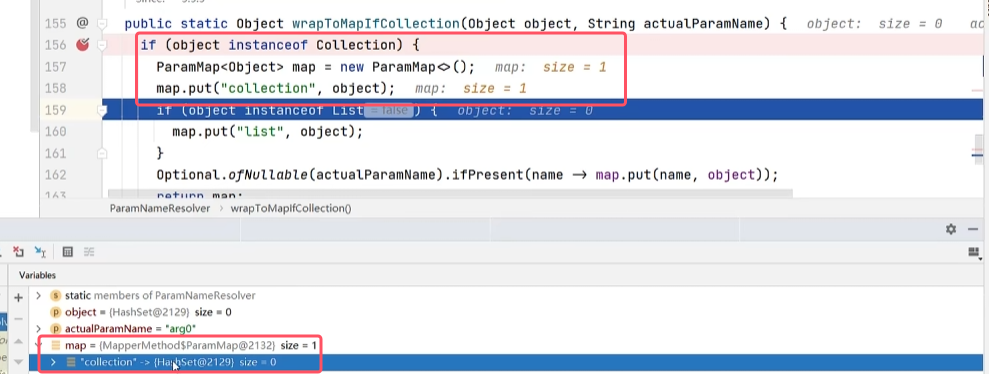

* mybatis提供图中所示的类来封装不同的参数，具体会使用看源码的形式来讲解
* **对于多个参数，mybatis底层会将这些参数封装成map集合，值就是传进来的这些参数值，键的值会有两个不同的值，具体如下图所示（两个参数的情况）。对于该map，sql语句在获取参数的时候参数占位符上写的是map的键值，这样才能获取参数值**。所以按照默认情况下，就可以这样获取参数
* **`@param`注解来标注一下每个参数都是传递给哪个参数占位符，注解中的内容与sql中的参数占位符需要保持一致**
	
	
	

* 对于单个参数可以有下面几种类型，具体介绍见源码分析

先给出了上面的结论，接下来进行源码分析，运行下面sql语句的对应测试方法

###### 多个参数源码

测试方法代码如下图所示  

* 首先当运行测试方法后，会进入到参数封装类`ParamNameResolver`的`getNamedParams()`，说明该方法就是进行参数封装的关键方法
* 从改图中可以看到传进来的args参数就是我们传进去的三个参数值，并且是从0开始到args2

* 首先判断参数个数是否为0，之后判断参数个数是否为1，如果不为1，那么就创建一个Map，之后遍历names这个集合，然后向param这个集合中put。具体如下图所示。

* 在经过图中红框的put之后，我们通过观察图片可以发现，首先将我们设置的参数占位符status作为键，参数值1作为值加入了这个param的集合
	

* 之后经过下图红框的两个代码后，有将param1和参数值1put到了集合中

	

* 再经过一个循环后，我们可以发现又将我们设置的参数只能又添加了一对，分别如下图所示，也符合预期

	

* 再经过一个循环后也hi是如此

	

总结如下图所示

###### 单个参数源码
首先对Collection这种封装形式进行源码分析

* 首先进行测试方法，同样进入该方法，，由于参数是1，会进入下面的语句块，我们可以从图中看到，由于我们传递的参数是一个HashSet，所以这里value也是一个HashSet。
* 之后会进入到`wrapToMapIfCollection()`方法这中来，见名知意，该方法如果是集合的话就转换成map

* 接下来进入到该方法时首先判断如果传进来的是集合，那么就新建一个map，将传进来的集合作为值put到新建的map里。

* 接着如果传进来的是list，那么还会put一个键为list值为该集合的元素，进map。
* 第二个红框又做向map中put了name，也就是arg0，值为传进来的集合。之后返回map
* 所以对于单个参数使用collection，那么至少会有上图所示的两个键对应的集合类型，如果是list的话，里面会有三个。

对于其他类型，之前的方法都一样，就是进入到`wrapToMapIfCollection()`根据单个参数的类型不同进行不同的处理，所以我们只说该方法中的处理逻辑，其他的都与collection相同。

* 如果单个参数是数组类型，那么会放一个键位array值为该数组的元素进入map，并且最后一行代码同样put了name，也就是arg0，值为传进来的数组。之后返回map

### 参数传递总结

