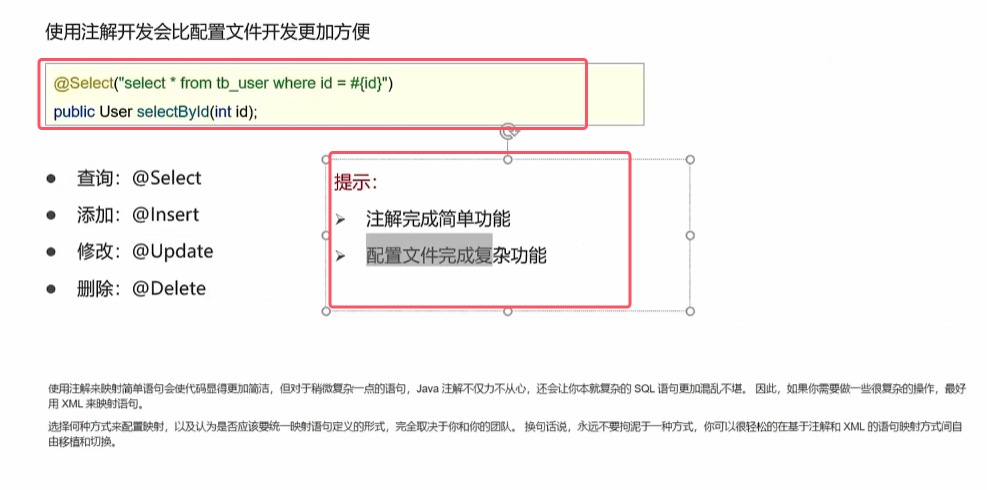

* 如果**使用了注解就不需要像mapper代理开发那样去写sql的xml映射文件了**，会更加方便。
* **直接将sql语句使用注解写再mapper接口中，声明在方法的上方即可**，具体如图

注意：**使用注解来映射简单语句会使代码显得更加简洁，但对于稍微复杂一点的语句，Java 注解不仅力不从心，还会让你本就复杂的 SQL 语句更加混乱不堪。 因此，如果你需要做一些很复杂的操作，最好用 XML 来映射语句**

