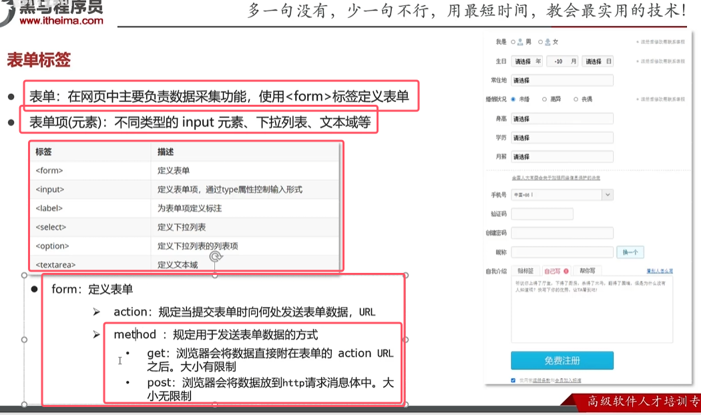

* 表单标签属性
	 1.action：指定表单数据提交的位置url  
		* 如果是#代表将数据提交到当前网页  
		* 表单项数据要想被提交，则必须指表单项的name属性  
	2. method:指定表单提交的方式  
		* get：为默认值，请求的参数会拼接到url后面,url长度有限制为4kb  
		* post：请求参数会在http请求协议的的请求体中没请求参数长度无限制
* 表单项标签
	1. \<input>：页表项：通过type属性控制输入格式  
		* text是默认值，定义单行的输入字段  
		* password是定义密码字段  
		* radio适用于定义单选框（男女）  
		* checkbox定义复选框（爱好）、  
		* file定义文件上传的(上传简历)  
		* hidden定义隐藏的输入字段(selectbyid,的时候id用户不知道，所以就隐藏在表单里面一起提交)
		* submit：提交按钮，将表单数据提交给服务器  ，通过value属性设置按钮的文本显示内容
		* reset：重置按钮，会消除表单中的所有数据  
		* button：自定义可点击按钮
	2. \<input>标签的使用细节：
		1. value属性可以设置按钮的文本内容
		2. 要想达到点击文本内容选中输入框的状态：
			* 首先使用\<label>将我文本内容包括起来  
			* 让文本内容和文本框产生关联——为文本框定义一个唯一标识，即id属性，然后让label的for标签来指向该id
		3. 想要让单选框起到只能单选的目的，需要让两个单选框的name属性值相同  
		4. 对于单选框和复选框的数据要提交，需要加value属性，这样会将value属性的值提交到服务端去
		5. name属性用于指定提交数据的键值对中的键，所以都要定义name属性
	3. \<select>是下拉表单项：比如选择城市。  
		* 使用option标签来定义每个下拉的表单项  
		* 同样提交需要指定上下拉表单的name属性和表单项的value属性。  
		* 如果没设置option表单项中的val属性，会默认提交option标签中的内容  
	4. \<textarea>是一个文本域，比如自己的个性描述  
		* 可以使用col和row属性来设置文本框有几行几列 


```html
<form action="#" method="post">  
  
<!-- 定义提交的隐藏字段-->  
<input type="hidden" name="id" value="123">  
  
<label for="username">用户名：</label>  
<input type="text" name="username" id="username"><br>  
  
<label for="passowrd">密码：</label>  
<input type="password" name="password" id="passowrd"><br>  
  
性别：  
<input type="radio" name="gender" value="man" id="male">  
<label for="male">男</label>  
  
<input type="radio" name="gender" value="woman" id="female">  
<label for="female">女</label>  
<br>  
  
爱好：  
<input type="checkbox" id="football" value="1" name="hobby">  
<label for="football">足球</label>  
<input type="checkbox" id="movies" value="2" name="hobby">  
<label for="movies">电影</label>  
<input type="checkbox" id="travel" value="3" name="hobby">  
<label for="travel">旅游</label>  
<input type="checkbox" id="tangping" value="4" name="hobby">  
<label for="tangping">躺平</label>  
<br>  
  
头像：  
<input type="file" name="picture">  
<br>  
<br>  
  
城市：<select name="city">  
<option value="bejiing">北京</option>  
<option value="shanghai">上海</option>  
<option>广州</option>  
<option>深圳</option>  
</select>  
<br>  
  
<textarea name="description" rows="10" cols="20"></textarea>  
  
<br>  
<br>  
<input type="submit" value="免费注册" >  
<input type="reset">  
<input type="button" value="一个按钮">  
  
</form>  
  
</body>  
</html>
```