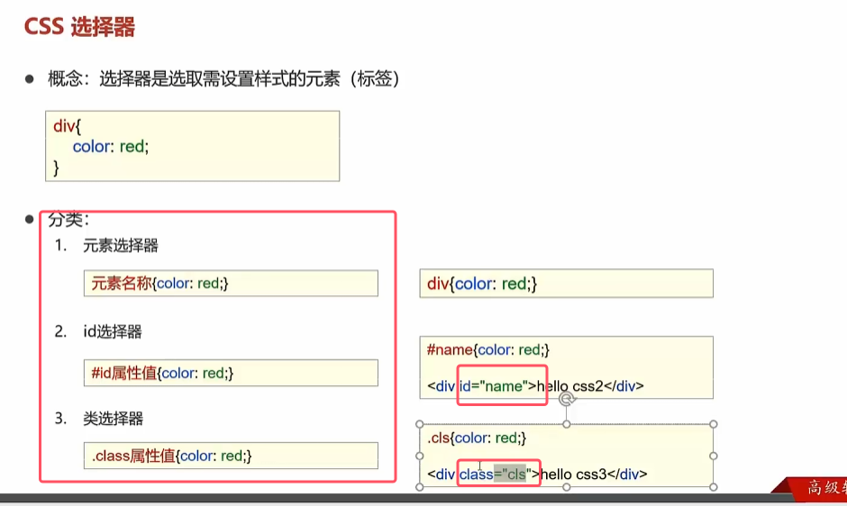

*  如果存在多个选择器选择统一个代码时，谁的选择题范围小谁就生效

```html
<head>  
<meta charset="UTF-8">  
<title>Title</title>  
<!--元素选择器-->  
<style>  
div{  
color: blue;  
}  
</style>  
  
<!--id选择器-->  
<style>  
#name{  
color: red;  
}  
</style>  
  
<!--类选择器-->  
<style>  
.cls{  
color: gray;  
}  
</style>  
  
</head>  
<body>  
  
<div>hello</div>  
<div id="name">hello</div>  
<div class="cls">hello</div>  
  
  
<span class="cls">hello</span>  
  
  
  
</body>
```

属性到时候直接查看文档或者上网查即可