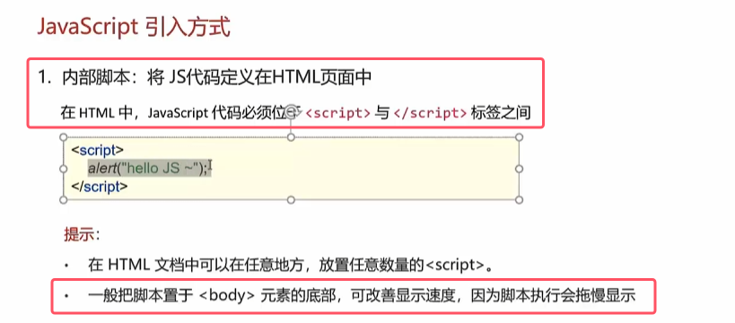
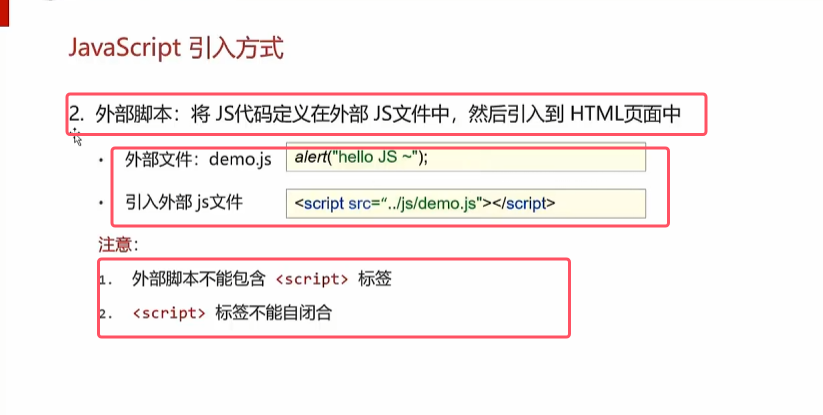

* 内部脚本放到什么位置都可以，比如head或者时body标签里面
* **推荐放到body标签里面的最后，因为希望先加载html代码，再加载javaScript的代码，这样显示速度较快**

* **外部脚本的引入是在body中进行引入，而不是放在head种，css代码的外部引入是放在body标签中**
* 自闭和的意思是必须又两个标签同时出现，第二个标签用于闭合，不能一个标签来引入，同时有用于闭合