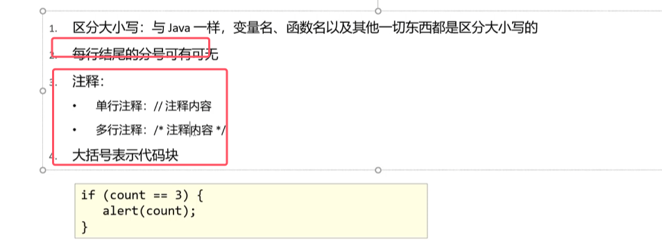
* 每行末尾封号可有可无，推荐写上
* 其他与java相同

###### 1. 输出语句

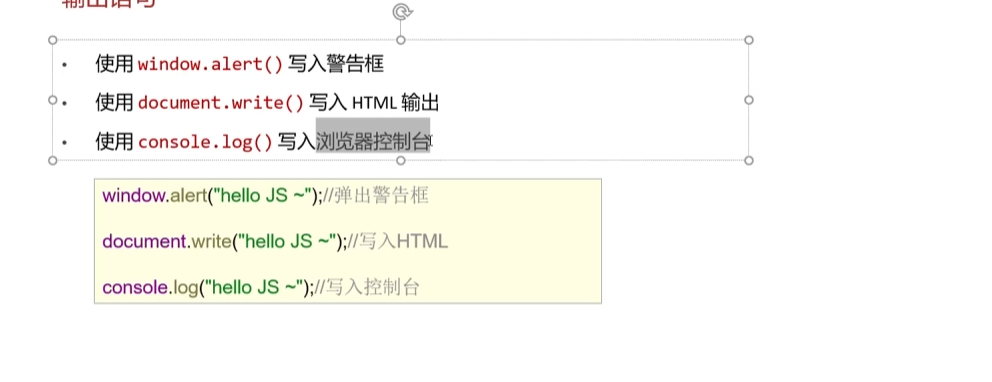
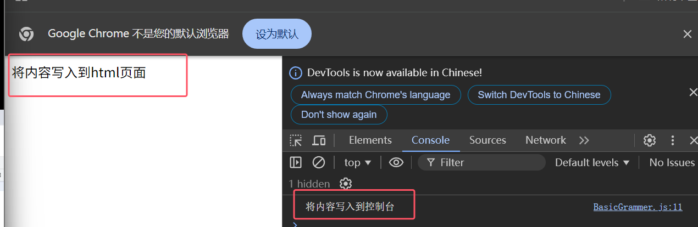
* **window.alert()，其中window可以省略，直接写alert()，表示弹出一个警告框，并将内容写入警告框**

###### 2. 变量和数据类型

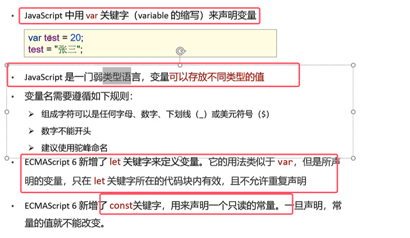
* JavaScript是弱类型语言
* 变量名命名规则与Java相同
* **使用var定义的变量相当于全局变量，而使用let定义的变量相当于临时变量，只在对应代码块生效**
* **使用var定义的变量可以重复定义，而使用let定义的变量不允许重复定义**。java不允许重复声明
* 有些错误idea中不会报错，而是在浏览器的控制台中查看报错

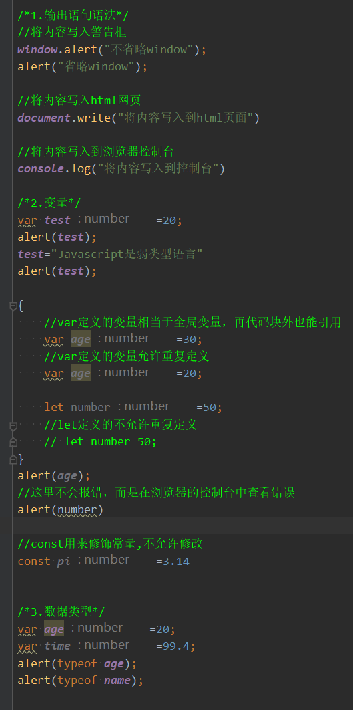

###### 3. 数据类型

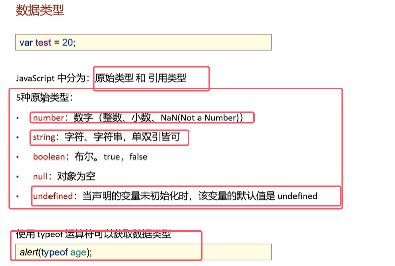
* 引用数据类型就是对象
* typeof null打印出来是object，因为是对象的默认占位符

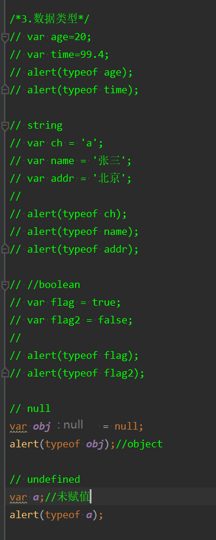

###### 4. 运算符

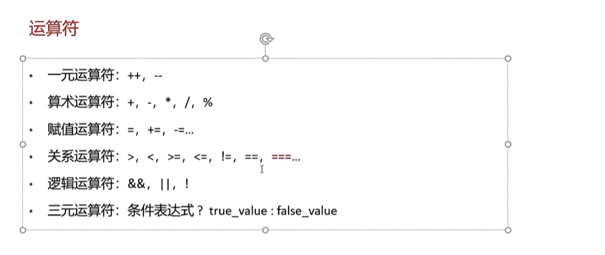
* 只有全等于`===`java没有，其他用法都与java相同
* **对于JavaScript中的关系运算符（除了\=\==），在比较前都首先会进行类型转换，转换同一类型，之后再进行比较值是否一样**
* **而对于\=\==，则不会去进行类型转换，如果类型不同，则直接返回false；类型一样再去比较值**

对于类型转换的详解

1. 其他类型转为number
	1. String转number：按照字面值转为数字。如果字面值不是数字，则转换为NaN。转的方法具体如下
		1. 在之前写+，不是字符串拼接，而是正号的意思。js发现+的时候，  知道后面需要一个数字，如果不是数字则直接转换成数字  
		2. 使用parseInt()（推荐）
	2. boolean转number：true转为1，false转为0
2. 其他类型转成boolean如下图所示

	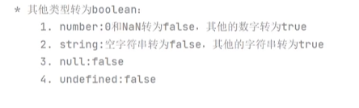
	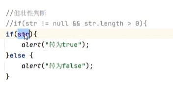
	* 用处：简化健壮性代码

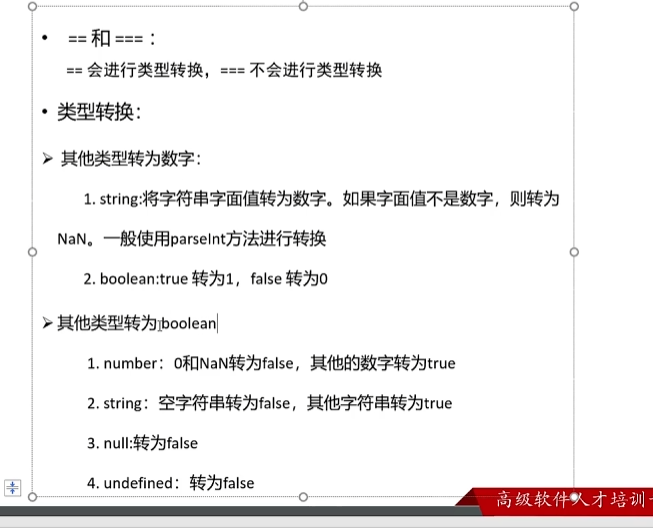
###### 5.控制语句

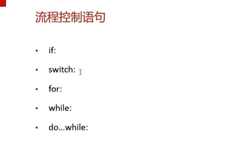
* 所有的控制语句都与java中的一样

###### 6.函数

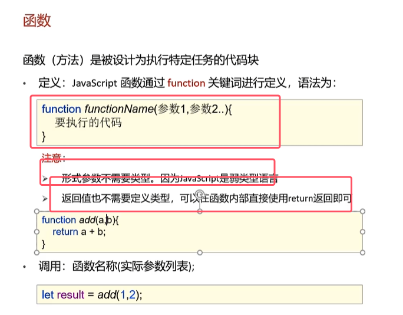
* 意义与java中的方法是一样的，但是定义方式有区别
* 形参类型和返回值类型不写，JS是弱类型语言
* **自定义函数有两种书写方式，具体如图**
* 并且函数调用可以传任意个参数，比如只定义一个参数，但是传两个参数，只是只是函数不去接收罢了

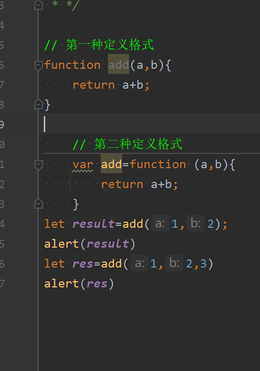
