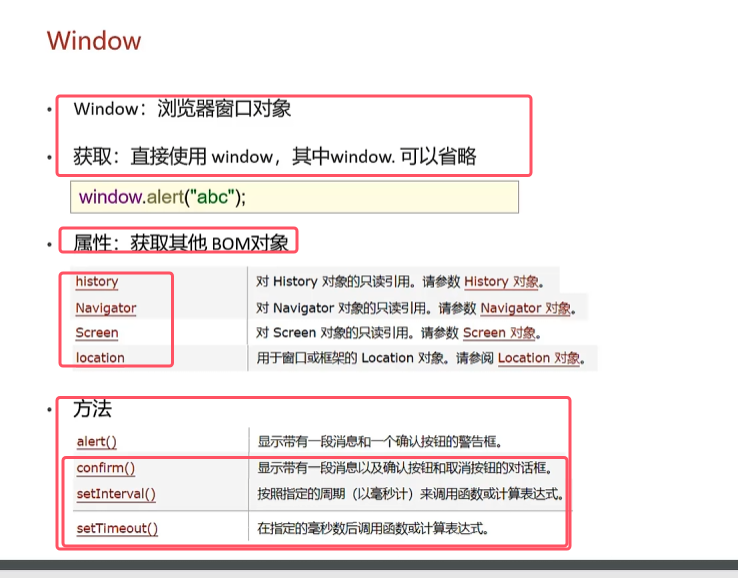
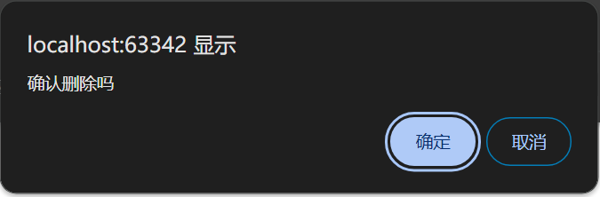
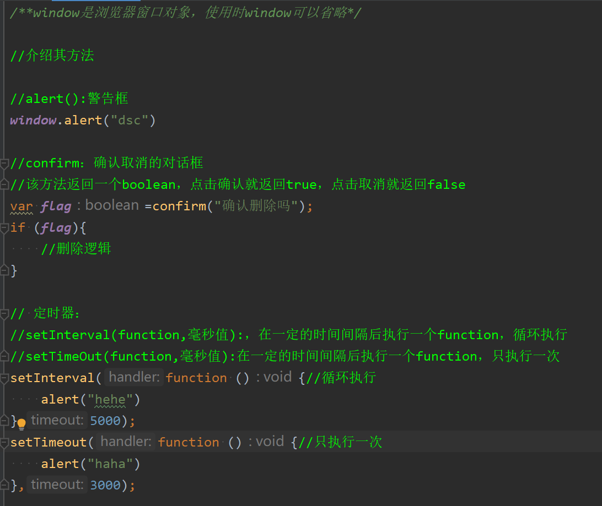
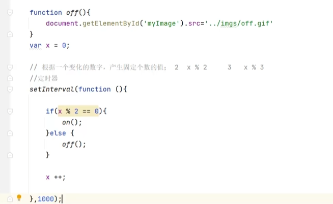
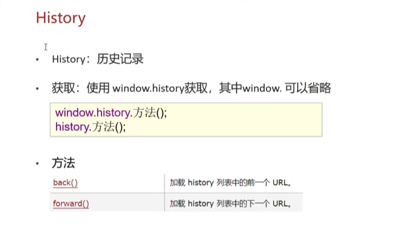
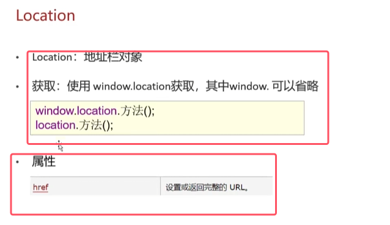
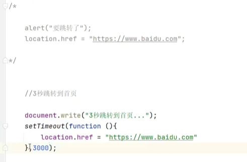

只讲解用的多的Window、History、Location对象

### 1.Window对象

* cconfirm()返回一个boolean，点击确认就返回true，点击取消就返回false。对于confirm()的对话框如下图所示

	

* 每一秒显示图片轮回的代码如下图所示（小案例）

### 2.History对象

### 3.Location对象

* 使用href属性来设设置要跳转的url的应用场景居多