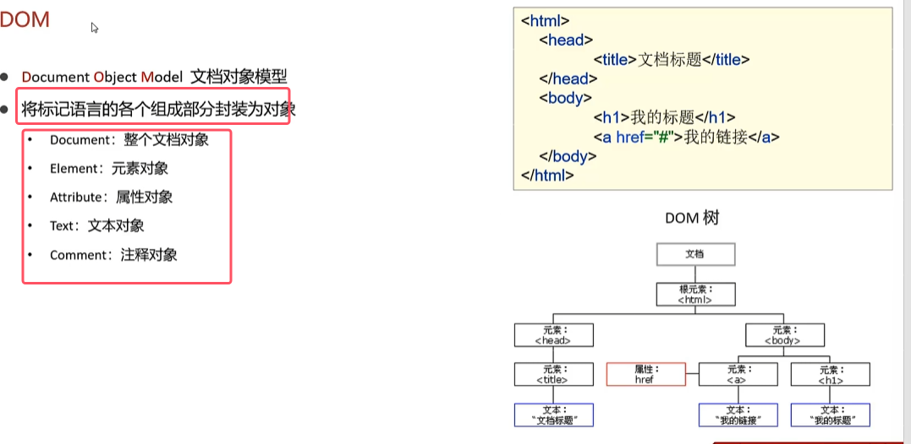
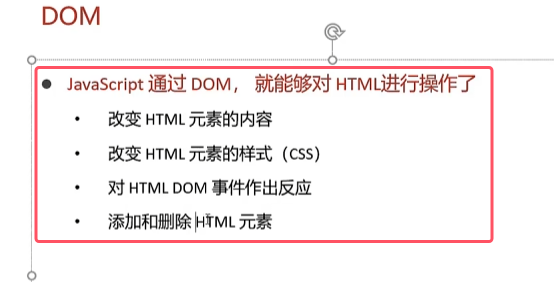
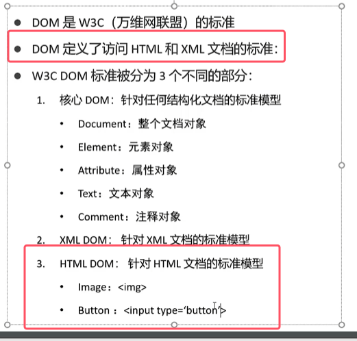
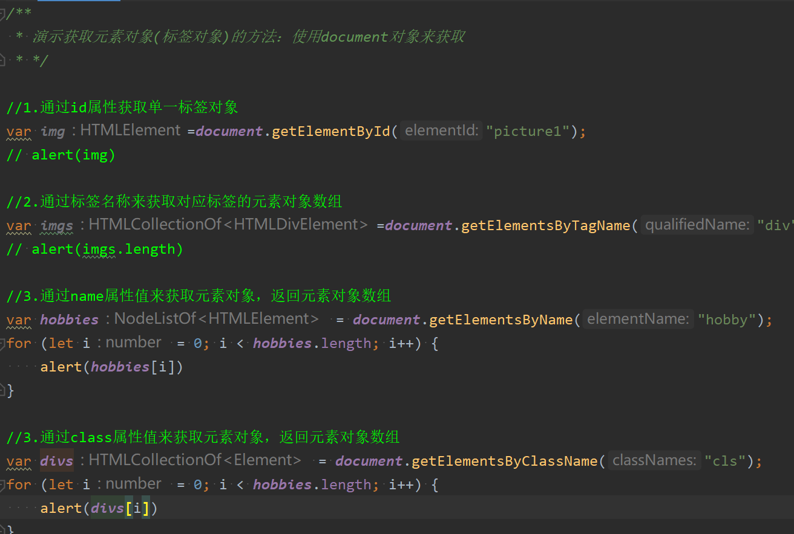
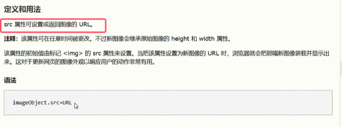
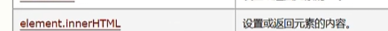
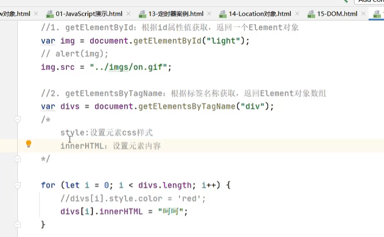
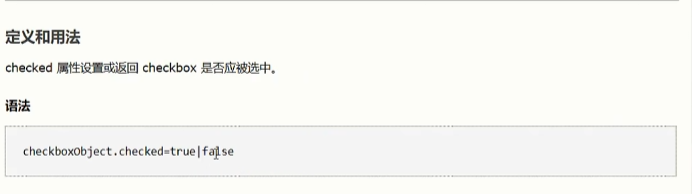
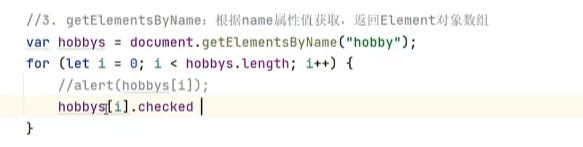

* 文档对象就是html的整个文档，而元素对象就是每个标签对象。
* 属性就对应的每个标签的属性，文本对象就是每个标签包含的文本
* **将html文档中的各个组成部分封装成dom对象，并且在浏览器解析html的时候，会形成一颗dom树**

### 1.获取Element对象

**注：document对象在JS中可以直接被使用，无需创建**

### 2.常见的html 元素对象操作的使用

最主要的是查看文档去查询顺序以及方法。

使用实例具体如下图所示：

