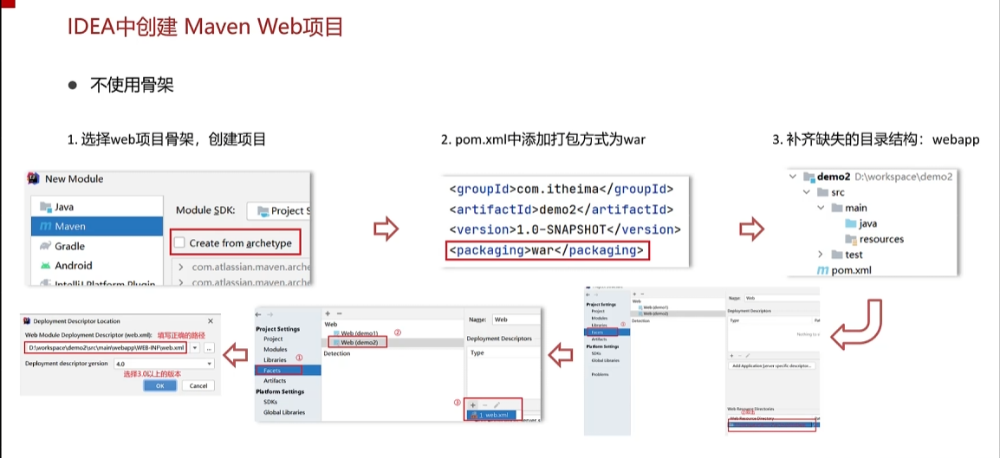

### 1.简介和基本使用

#### 基本使用

* bin目录下的.bat文件是windows下的可执行而文件，.sh是linux下的可执行文件
* webapps目录下放的就是tomcat服务器下的一些项目，把web项目扔到该目录下就完成了项目的部署
* 启动tomcat只需要启动startup.dat即可

#### 配置Tomcat

#### idea中的web项目

* web项目的pom.xml中打包方式是war而不是jar

#### idea中使用Tomcat

有两种方式，其中第二种更为方便。这两种方式就可以无需手动复制 WAR 文件到 `webapps` 目录后在启动Tomcat

* 该种方式配置完以后，相当于当前项目以及有了一个内置的Tomcat
* 该插件有一个小问题：当前插件只支持到tomcat7的版本，并不支持更高版本。但是在项目的开发测试阶段版本7已经够用。

