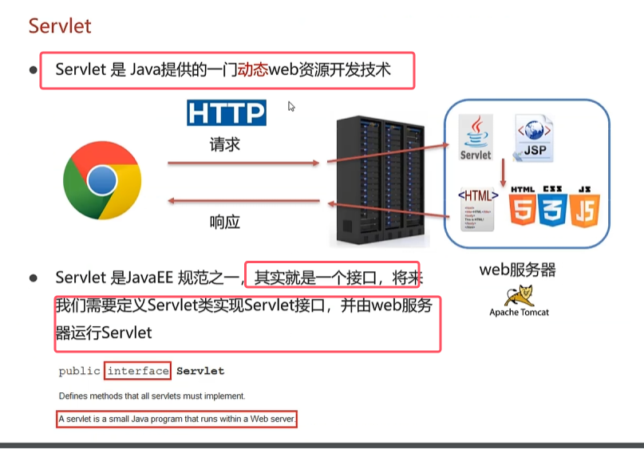
* Servlet 是 Java 平台上的一种**服务器端程序**，主要用于处理客户端（如浏览器）的请求并生成动态响应
* 动态web资源：根据不同用户访问同一资源所携带的参数不同，展现不同的效果

### 1.快速入门
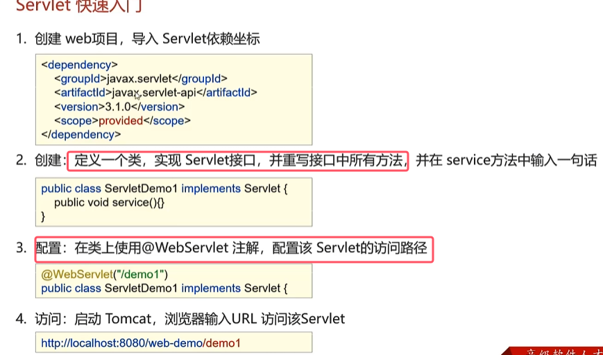
* 导入的坐标的作用范围一定会要是provided，因为运行时tomcat会自动带servlet的jar包。
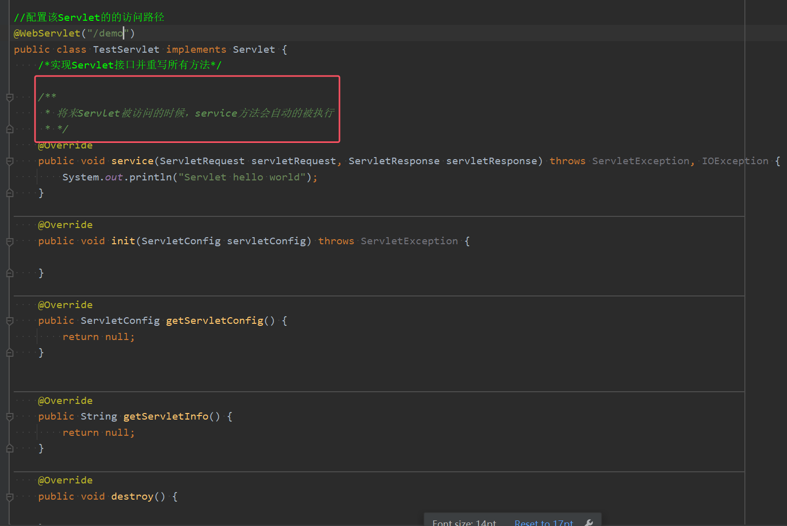
* **将来Servlet被访问的时候，service方法会自动的被执行**
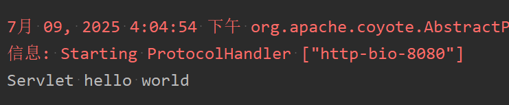

### 2.Servlet的执行流程
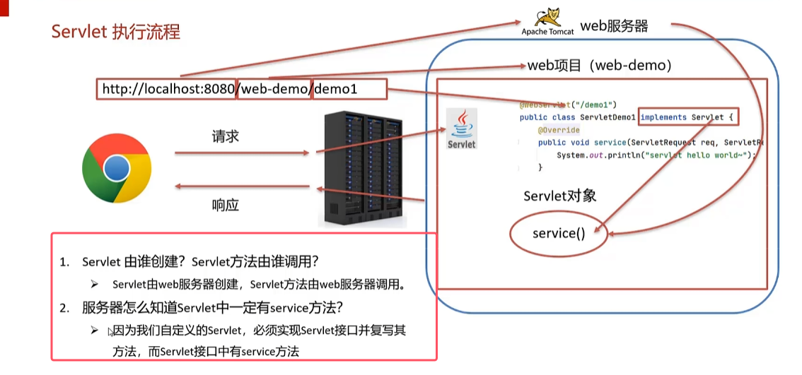
* 在服务端程序启动的过程中，实现了Servlet接口的服务端程序也没有new一个对象也没有显式的调用service()。
* **Servlet对象是Web服务器Tomcat创建并调用service()的**
* **service()方法一被调用，就能给客户端浏览器发出对用的相应信息**

### 3.Servlet的生命周期
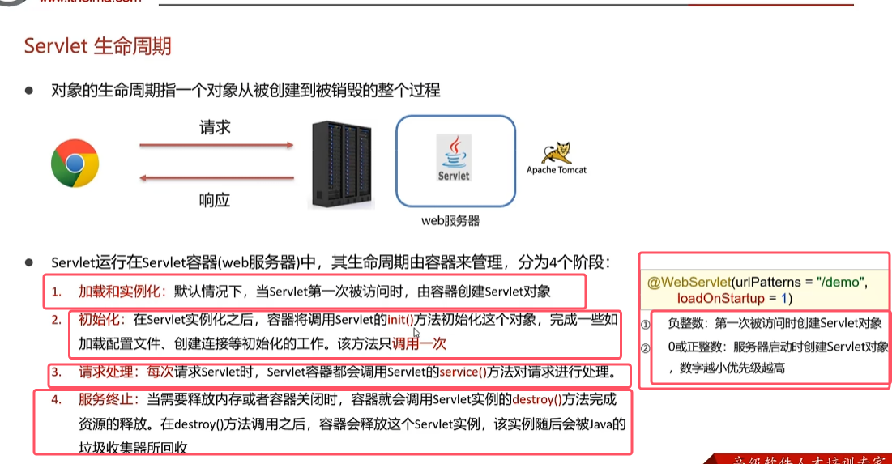
* loadOnStartUp的默认值就为-1，也就是默认一次被访问时才创建Servlet对象。
* servlet可以被调用多次，而destroy()和init()会被调用多次

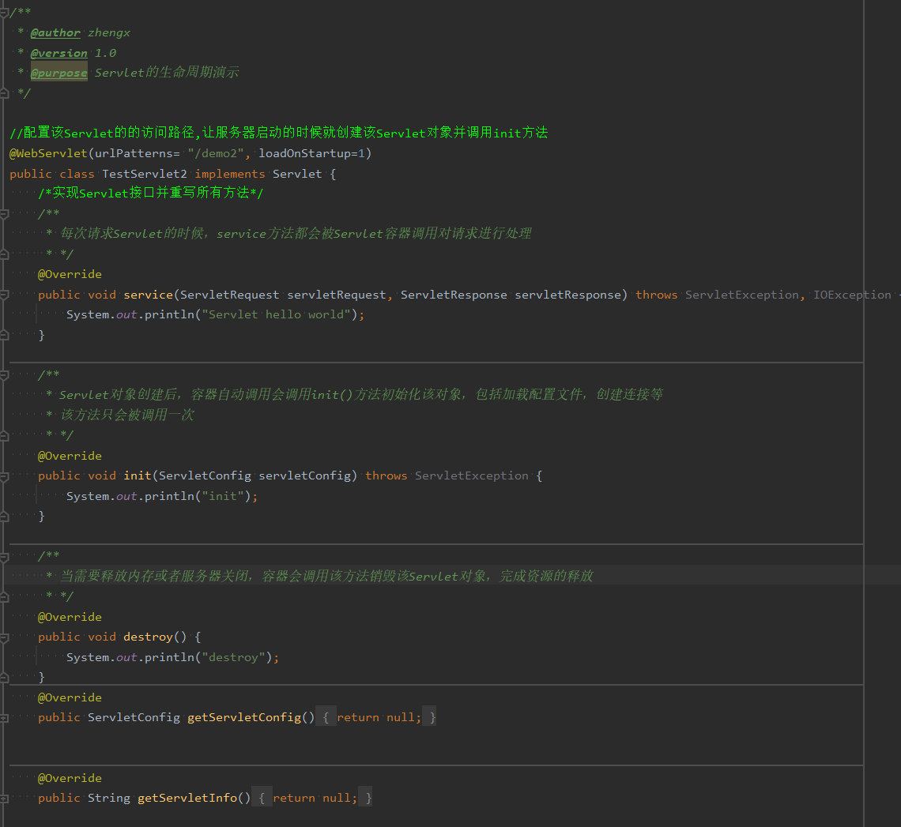

### 4.Servlet方法介绍

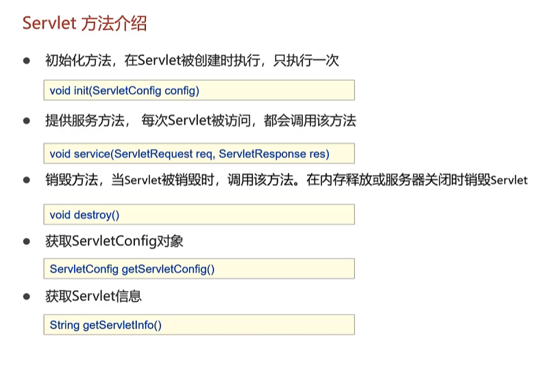
* **前三个方法上一节讲过**，后面两个方法不是很常用

**正常service()方法的处理逻辑**

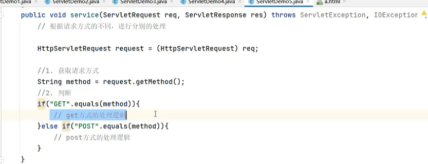

### 5.Servlet体系结构

背景：实现Servlet接口的类必须重写五个方法，但是实际上用得到的只有3个，严格来说只有service()方法在访问时会被用到，但是其他4个方法我们还需要复写一遍，这样麻烦

所以需要servlet体系结构，来简化我们的开发

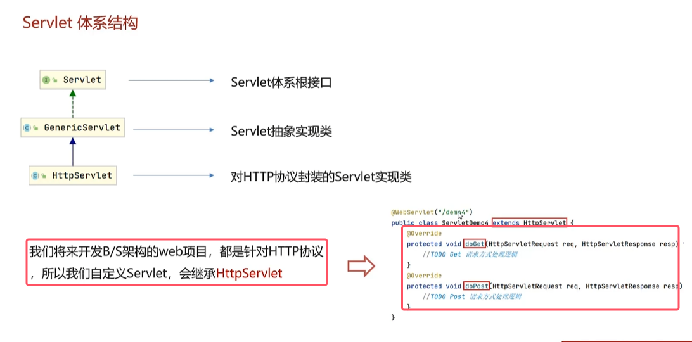
* **继承httpSocket与继承Servlet的效果一样，并且继承HttpServlet的代码更加简洁**
* **当使用get方法访问该Servlet，容器就会调用doGet方法()；当使用post方法去访问该Servlet，就会调用doPost方法**
*  通过url直接访问资源是get方式的请求资源，而post请求方式需要用表单来请求该Servlet的资源
* 表单的action属性指定表单数据提交的位置url ，编写的是项目的路径下的该servlet的路径

	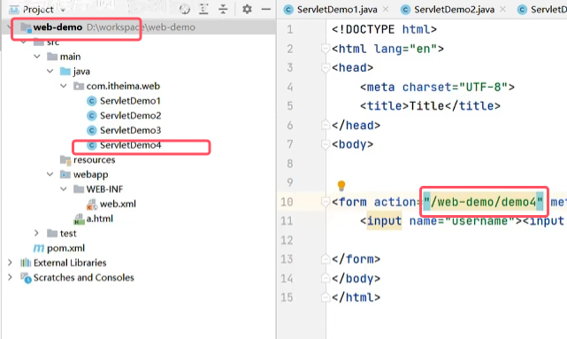

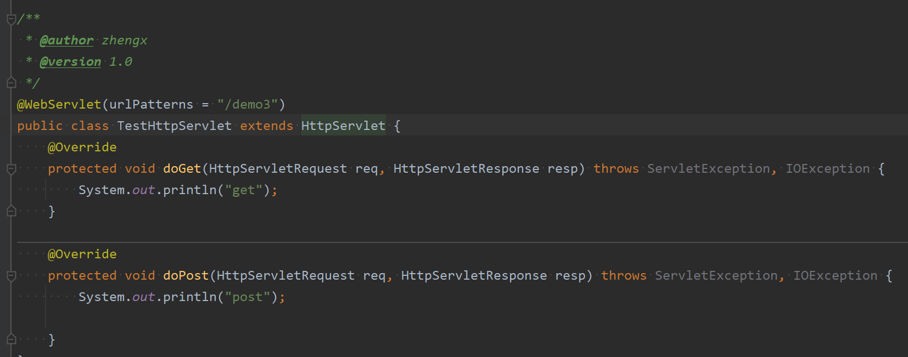

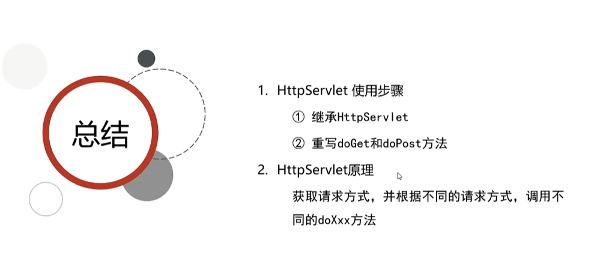

### 6.Servlet urlPattern配置

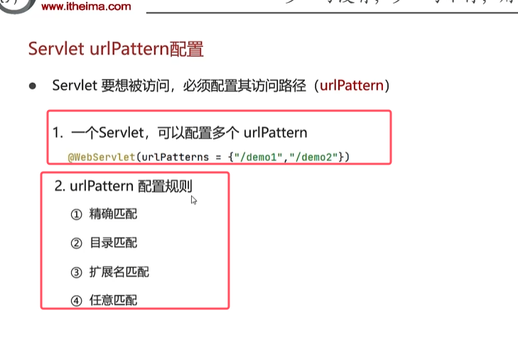
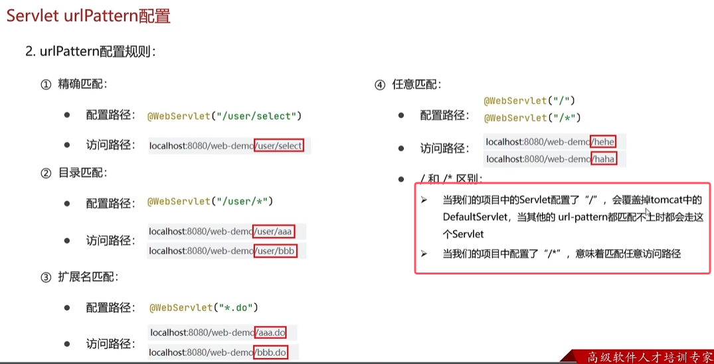
1. 精确匹配：配置路径和访问路径完全一样。
2. 目录匹配：配置路径带有通配符的，访问路径在通配符的位置写啥都行。
3. 扩展名匹配：访问路径只要与设定的配置路径的通配符相同即可。**注意扩展名匹配不能以/开头**。
4. 任意匹配：输入任何url都会跳转，优先级最低，最好是用第二种任意匹配，第一种会把dfefaultServlet覆盖掉，其用于配置静态资源的

**匹配的优先级1最大4最小**

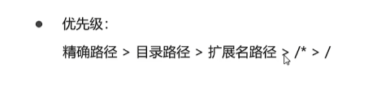

### XML配置方式编写Servlet

知道折磨个东西就行，已经过时。

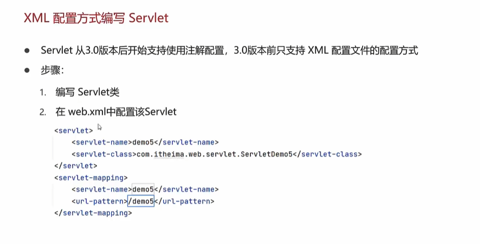

