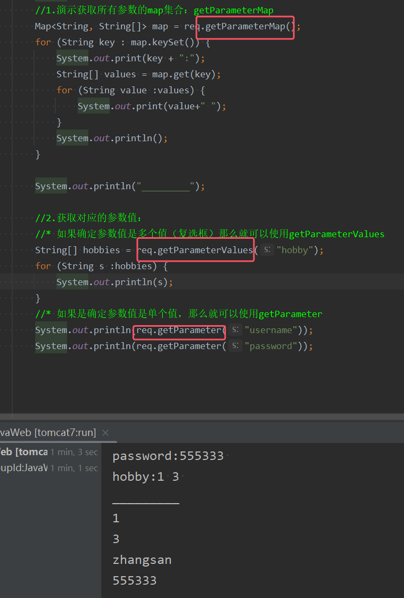

### 一、总体介绍

### 二、Request

#### 1.Request继承体系

* ServletRequest和HttpServletRequest都是接口
* 请求消息的数据被tomcat所解析，被tomcat封装成一个request对象。并且创建Request对象传递到service()中

#### 2.Request获取请求数据

##### ①获取请求数据

* **将来表单一提交，就会将提交到action对应的url里面去，相当于使用method方式去请求action对应的url，之后对应的Servlet执行相应的逻辑**。

	
	* 该流不需要手动关闭，因为一次请求结束的时候，req对象被销毁时会自动关闭流

##### ②通用方式获取请求参数
对于同样的问题，dopost()doGet()方法使用完全相同的处理逻辑，只是再读取请求参数上有所不同。如果使用同样方式获取参数，那么就可以两个方法的代码完全相同，这样只写一份即可，简化开发

为了演示通用方式获得请求参数，写下面前端代码（同种是例子，method再从下面代码的实际操作中会有改变，下面会说明）

* get方法的代码实现如上图所示

在上面的基础上，当请求方法换为post时，并且将代码换位下面的所示

* 参数并没有出现在url后面

##### ③请求参数中文乱码处理
当请求的参数值输入中文时，打印到控制台会产生乱码的情况。

* 打印username的参数值，如果输入汉字，会出现乱码

注：同样方式获取请求参数的方法，他底层还是会调用GET和POST方法各自的请求参数的方法获得参数后再装进Map。所以解决乱码问题归根到底还是得通过了解两种请求方法各自请求参数的所调用的方法的原理，来进行解决

###### 解决post参数值中文乱码问题

* 调用`req.setCharacterEncoding();`来设置字符输入流的编码格式，因为post的读取参数的方式是`getHeader()`，默认为ISO-8859-1

	

###### 解决get参数值中文乱码问题

GET方式获取参数的方式是`req.getQueryString()`。其乱码原因如下图所示

1. 乱码原因：由于GET方法的请求参数是附加在url中的，而url中不允许有中文的。所以浏览器会对中文的字符串进行url编码，具体编码的格式是UTF-8。而tomcat接收到该请求后，会对请求参数进行url解码。tomcat的默认url解码格式是ISO-8859-1，所以就产生了乱码。
2. 但是`getParamter()`内部代码写死了就是使用ISO-8859-1的形式解码，所以无法直接调用接口去设置解码的格式
3. 所以我们需要了解URL编码的具体做法，这样才能去解决中文乱码问题

* 在URL编码使用的UTF-8编码格式，一个汉字是占到三个字节
* UTF-8的编码格式如上图所示
* 并且需要注意：将来url中的汉字参数转成utf-8编码格式的字符串是由浏览器去做的。

	

对于URL进行编码解码的具体操作，java提供了一个工具类`java.net.URLEncoder`，专门用于对字符串进行编码和译码。具体操作如下图所示。

知道了上面的知识之后，我们可以发现，tomcat进行url解码之后的乱码参数和原来的汉字参数的字节是一样，也就是底层的二进制数据是一样的

所以**我们可以通过将乱码的数据转换成二进制数据，之后再把二进制数据转换成汉字参数即可**。这就是解决中文乱码问题的思路

* 这是一个解决思路的实例，接下来是时机GET方法中解决乱码问题的场景

==解决方案==

1. 由于我们通过`getParameter()`获得的参数是已经由tomcat编码过的数据，那么我们只要按照IOS-8859-1的编码格式去获取他的二进制数据即可，也就是使用`getBytes()`去获取他的字节数组
2. 那么获得底层的二进制数据之后，我们只需要让他再根据根据UTF-8进行编码就可以获得原来的数据。也就是调用newString去使其返回指定编码格式的字符串。

注意：**这种编码格式再Get和Post两种方式下都可以用，只是Post还有更简单的方式**

总结

* tomcat8之后将乱码问题已经解决，只是maven插件只支持到7，所以才会有如此问题。

#### 3.Request请求转发

* 应用场景：一个请求需要由资源A和资源B共同处理，那么资源A处理完后，需要转发给资源B进行处理，此时就需要资源转发(forward)
* 请求转发是一种在 服务器内部进行资源跳转的方式

**将来可能会有部分数据由资源A处理一部分，资源B处理一部分，所以我们需要A处理完还需B处理的数据发送给B，这样才能由B来继续处理。资源见共享的数据我们使用会封装到Request对象中进行传递*

* 浏览器地址栏路径在请求转发中不会发生变化，如上面所示。
* 转发的资源间共享资源的示例如下图所示

	
	

### 三、Response

#### 1.设置响应数据的方法

* 访问该动态资源后的结果如上图所示

#### 2.Response完成重定向

* **资源B的访问路径是要加项目名称的，也就是虚拟目录名称**

###### 简化方式来完成重定向

* 该方法的底层就是调用了普通方式的两行代码

请求转发与重定向的区别 

#### 3.Response响应字符数据

* 响应字符数据包括：**文本和html网页(也就是一切代码)**

1. 如果响应的是纯文本数据，那么什么都不需要设置，直接调用方法即可（默认为纯文本）

2. 如果需要响应其他类型数据，那么需要告诉浏览器响应的内容是什么，这样才能浏览器才知道如何解析——content_type头部行

使用细节：

1. 获得的输出流不需要手动关闭，将来tomcat再销毁resp对象的时候会自动关闭输出流
2. 响应体如果有中文，浏览器解析后会乱码的。与`getReader()`同理，因为`getWriter()`默认的编码方式是ISO-8859-1，所以需要设置流的编码格式。做法：使用`resp.setContentType()`直接设置内容类型的字符编码格式，这样`getWriter()`就会根据content-type中约定的字符集去发送响应体

	
	
	
	

#### 4.Response响应字节数据

* 响应字节数据包括：**图片视频音频等**

* 获取的输入流需要手动关闭
* 流的拷贝代码很熟的话就可以不用写，直接使用commons-io的jar包工具类去做，字符流和字节流的拷贝都可以用，具体如下

	
	
	

总结

### 四、路径问题

注：从浏览器发出的请求中的路径理解为浏览器使用，所以也需要加虚拟目录

### 五、案例——用户登录
#### 用户登录模块

sql配置文件和mapper接口  

servlet核心逻辑  

查询结果    

### 用户注册模块

sql配置文件和mapper接口  

servlet源代码  

查询结果  

* **如果sql语句没写每个列的名称，那么values里面是必须把每个列包括ID的值写入的。  由于我们已经设置id自增，所以这里写一个null，数据库插入时遇到null也会自动增长**

##### 创建sqlSessionFactory的代码优化

* 工厂类只创建一次即可，工厂创建浪费资源，因为创建一个工厂类就会创建一个连接池。当有多个事务时只需要从一个连接池中获取连接对象即可
* **重复代码提高复用性：创建工具类。工厂只创建一次——静态代码块**。抽取出来的工具类如下图所示

* 两个类就可以直接使用该工具类去获得工厂类，并且使用同一个连接池，提高了代码的复用性。