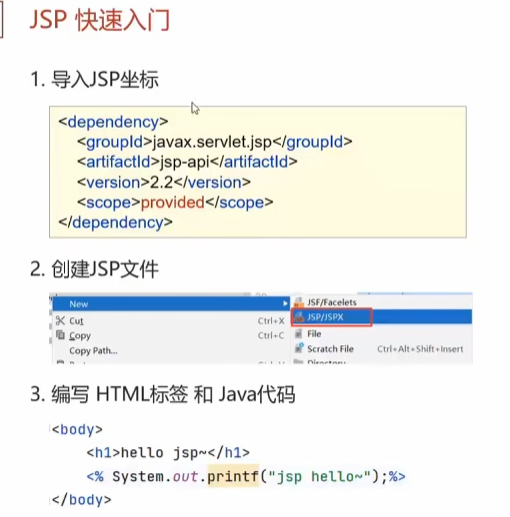

1现在的主流开发方式是servlet+html+ajax。servlet+jsp已经过时，下面的内容了解即可
### 一、JSP概述

* 比servlet更加方便。如果需要一个比较丰富的代码，那么使用servlet的代码如下。需要满屏的写入和拼接字符串

	

* 而使用jsp后，就可以直接将java代码和html代码携带一块

	

### 二、JSP快速入门

* 和servlet同理，导入的坐标的scope为provided，因为运行时tomcat已经自带了该jar包

### 三、JSP原理

* 位于服务器端的JSP文件，在被访问时，tomcat会自动将其转换为一个servlet，之后再编译为一个字节码文件。所以**JSP在本质上就是一个Servlet，其转换是tomcat自动完成**。因为他是网页，所以可以写html，本质上又是一个servlet，所以可以写java代码

* jsp转换的servlet的java文件中也有service对应的service方法，每次一访问该jsp，就会访问该方法

### 四、JSP脚本

* 第一种脚本作为service方法中的方法体。
* 第二种脚本作为resp的输出流的参数.
* 第三种作为jsp转为servlet的整个类的成员

第一种脚本  

第二种脚本  

第三种脚本  

###### 应用实例

结果  

截断的字节码文件长这样（下图代码是在service()里），所以它可以完成for循环遍历的作用

* 很容易可以感觉到这么写代码可读性和可维护性特别差，所以下面来讲缺点。

上面jsp脚本的缺点

* Servlet来处理数据，通过**请求转发的方式**交给JSP来进行数据的展示

###  五、EL表达式

* EL用于适用于获取数据的，他的主要目的是简化JSP中的Java代码，即写到响应体中的java代码

servlet代码

jsp代码

演示结果

### 六、JSTL标签

JSTL的使用：

主要介绍两个jstl标签：if和for-each。这两个标签就是用于替换if else和for循环的。使用示例如下图所示

###### if标签

* 本人设置的prefix是c，所以标签就为c:if。
* test属性中写逻辑表达式，if标签中是要输出的内容。
* c:if表中中没有else标签，实现else的逻辑就是写两个c:if，让其中的逻辑判断相反即可

###### forEach标签

* varStatus是用于展示数据的序号值连续的，因为数据库可能会删除某些数据，由于主键自增导致序号不连续，未来展现出连续的数据就用status。其有两个属性：index从0开始，count从1开始

	
* fori循环和for-each循环时一样的。可以做分页控制条

使用示例：

* 注意brand中的属性底层会调用pojo类的get方法，所以变量名一定要遵守驼峰命名，不然没法匹配上对应的方法。

