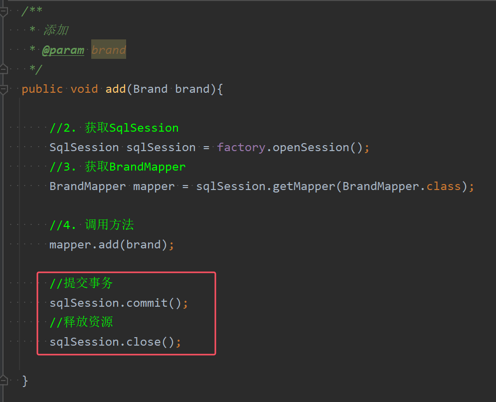
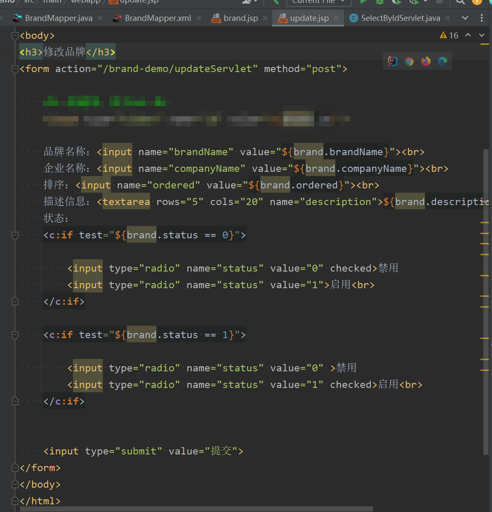
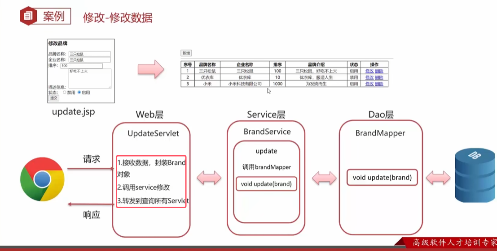

* MVC模式中，Servlet是控制器；JavaBean（查询数据库业务也是）是模型；JSP做数据的展示，也就是视图。

MVC模式是宏观的开发概念，三层架构则是我们实际开发的实施架构

* **表现层是web或者controller，业务逻辑层是service，数据访问层的DAO或者是mapper**

二者的区别

### 案例——MVC模式运用

MVC模式的maven项目结构如下图所示

###### 查询所有

* **一般当业务逻辑变多以后，有些变量有多个方法或者是业务逻辑中会用到，所以可以把他们拿到成员变量的位置，这样就不用重复创建或者是获取了**，比如下面的`BrandService`和`factory`

DAO层代码  

* 由于实体类的属性和表中的列名字不同，还需要再sql配置文件中加上resultmap做映射

业务逻辑层代码  

表现web层代码  

###### 添加数据

* **注意在添加完页面后，不能直接跳转到view视图层，也就是jsp文件中去。因为如果直接跳转到jsp文件中的话，该文件中要取得数据还没有被处理，所以没有办法显示数据**。所以要先跳转的对应的查询所有的servlet去处理数据，servlet自己会跳转到对应的jsp文件中

DAO层  

业务逻辑service层  

表现web层  

* 首先需要单机新增按钮跳转到新增品牌的页面中，所以需要进行事件监听使其能够跳转到能够新增品牌的页面addBrand.jsp  

###### 修改品牌

在点击修改按钮去修改某一个品牌的属性时，首先都会回显该品牌原来的数据到编辑商品品牌的页面。所以**需要做回显数据**。如下图所示

所以修改品牌需要分两步：先做回显数据的操作，再做修改的操作。

1. 回显数据：前端在点击修改按钮后会将id携带到后端，后端根据id进行查询并回显数据

	

	DAO层  
	
	
	业务逻辑service层代码  
	

	web表现层代码  
	
	* 首先brand.jsp中点修改超链接后，浏览器会去请求超链接的页面，并且需要将id提交到对应的servlet中，id通过遍历的brand去取出  
	
	servlet代码  
	
	
	 显示数据的update.jsp的代码  
	
	

2. 修改数据：按动提交按钮后，所有数据会提交到servlet。只需按照下图做即可

	

	DAO层  
	

	业务逻辑service层  
	

	web表现层代码  
	
	* 需要添加隐藏的id提交到servlet去。不然后端无法查询  
	servlet代码  
	