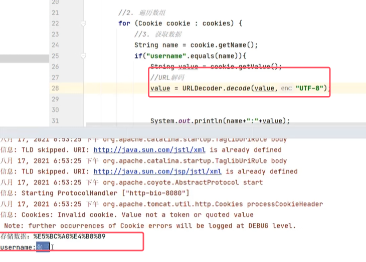

## 一、综述

* 会话跟踪技术的必要性

	
* 实现方式

	

## 二、Cookie
### 1.Cookie的基本使用

* Java后端工程师是关注于服务端开发的，所以只需要设计到发送cookie和获取cookie的业务逻辑
* 对于发送cookie，在真正做响应的时候，tomcat会自动从resp对象中把cookie的数据取出来，之后再响应到浏览器去。

发送cookie的使用示例  

* 浏览器在访问服务器资源的时候，他会把当前域名下的所有cookie都携带过去，所以只能一次性获得所有cookie。而不是只获得其中的某一个

获取cookie的使用实例  

### 2.Cookie原理

### 3.Cookie的使用细节

* **cookie默认情况下存储在浏览器内存，浏览器关闭内存就会释放**
* * **默认情况下不能存储中文，如果直接存储是会报错。**
* **想要存储中文内容，就需要进行url编码（之前讲过[06Request和Response](06Request和Response.md)）。当获取cookie时对其进行解码即可**
* **在移动端app无法使用cookie，只能在web网页中使用cookie**

###### 设置cookie存活时间

将浏览器关闭后，再去访问获取cookie的servlet可以得到如下的结果。说明没有被默认情况下销毁，而是持久化到了磁盘

###### cookie存储中文

将来获取cookie2时得到的cookie字段如下图所示。即是编码后的数据。那么我们getCookies()之后就可以获得对应内容进行解码就行

## 三、Session

### 1.基本使用

* 服务端存储的session数据可以是任意类型，详情看`Attribute`的接口

使用示例：先请求session1，再请求demo2  

### 2.session原理

* 具体的体现看基本使用中的使用实例

### 3.session使用细节

* **由于session的钝化和活化，服务器在重启之后，session中的数据仍然存在。**
* 在maven项目中配置sesison的过期时间是在web.xml中去设置

	钝化后的文件如下图所示 。在服务器启动后，会通过活化再session文件中的内容加载到内存中的去，并删除session文件。 
	
	
	

## 四、总结

* 补充一个知识点：**后端在使用getAttribute()、getCookies()和getParamter()等方法时，如果没有对应信息，JavaServlet中处理是那么都是返回null。**
* **而对于JSP页面来说，直接通过 EL 表达式（如 `${requestScope.testAttribute}` ）显示该属性值，当属性值为 `null` 时，页面上不会显示任何内容**

什么时候时使用cookie和session，什么时候使用请求转发：**当是两个独立请求时，就必须使用cookie和session去保存信息后进行信息传递；而请求转发是两个资源去处理同一个请求**。
 

## 五、登录注册案例

### 1.登录功能

##### 用户登录
首先处理用户登录，之后再做记住用户的功能

* 需要根据查询是否有结果而跳转到不同的页面

DAO层  

service业务逻辑层  

web表现层  

* 登陆成功，**使用重定向而不是使用请求转发。因为从登陆到查询所有的两个需求没有资源需要共享**
* **在登陆成功以后还需要做一个“用户名，欢迎你”的动态响应。而重定向是请求两次数据，数据在资源之间不会共享。所以要使用会话跟踪技术。又因为用户名是敏感数据，所以使用session安全性高。**

* 登录成功，则**brand.jsp中使用el表达式来获取session域中的数据**，实现动态响应

* 登录失败则需要跳回到登陆页面login.jsp并显示登录失败的信息。

##### 记住用户
由于seesion的存储有效期时间较短，无法长期存储。并且需要两次请求间共享数据。所以只能使用cookie。

业务逻辑  

* **如何获取是否勾选了记住用户·：通过获取复选框的对应的value值和选中的value值进行比较看是否相同**

	
* * 页面如何获取cookie：**EL表达式可以来做**

所以可以改造loginServlet如下图所示  

* **代码细节：如果一个字符串通过equal方法去判断，那么最好把字符串写前面，这样可任意有效防止空指针异常**。比如`remember.equals("1")`应该写为`"1".equals(remember)`。因为remember可能没有被选，值为null

	

login.jsp改造后如下图所示  

### 2.注册功能

##### 用户注册

DAO层   

service业务逻辑层  

web表现层    

* 对应的servlet代码如下图所示    

* 用户名和密码方面的注册功能如上图所示 
##### 验证码功能

* **验证码图片是使用Java代码生成的图片，在该案例中是使用了一个专门生成证码的工具类CheckCodeUtil,其中`outputVerifyImage()`用于输出验证码图片**。运行此方法会直接在输出流的位置输出一个图片  
	
* 还需要实现点击换一下就能更换一次图片

###### web表现层

1. 实现展示验证码并且可以更换验证码的功能

	
	* 图片的src属性也可以是一个servlet，只要该servlet结果返回一个图片的数据就行。
	* 当请求该页面时，浏览器会在发送一个请求，请求该验证码图片。
	
	生成验证码的servlet   
	

	更换验证码功能：添加一个单击事件，使点击过后让img的src属性重新请求一次  
	
	* 由于js代码中并没有改写src属性的值，所以浏览器看到其并没有发生改变，所以就不会向服务器发送请求，而是会直接使用第一次请求缓存的结果，也就是直接使用第一缓存的图片，所以单机超链接后并不会更换验证码。
	* 需要在后面加一个永远不能一样的数据（比如时间戳），这样导致每次单机后src属性都会被设置成不同的值，这样浏览器就不会使用缓存，而是向服务器去进行请求

2. 实现校验验证码功能

	
	
   CheckCodeService代码如下图所示  
	
	* 由于生成和显示验证码与验证验证码是两个独立的请求，所以不能使用请求转发，而是使用session（cookie不安全）。  
	

	registerServlet代码如下图所示  
	
 * `equalsIgnoreCase()`为忽略大小写比较字符串内容
 * `!checkCodeGen.equalsIgnoreCase(checkCode)`要把生成的验证码写前面，因为用户生成的可能为null。