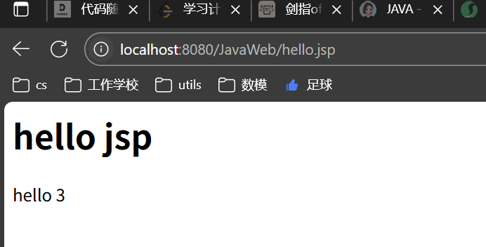
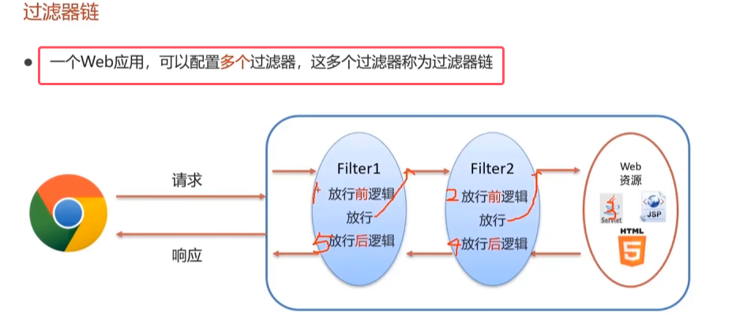

## 一、 Filter

* 通用操作：统一编码处理，权限控制：如在访问主页的任何一个资源都需要先检查用户是否登录，登陆了才可以访问。此时就可以过滤器中去判定用户是否登录。**如果登录则放行去请求资源；如果没有登录则直接响应对应的信息**

### 1.快速入门

* 当做完通用的操作后，需要“放行”。**拦截器在拦截请求做完增强型处理后需要放走该请求，让其去请求资源。**
* Servlet接口是javax.servlet下的接口，其中放行的chain是doFilter()的接口
* **当拦截路径被响应时，就会执行对应的`doFilter()`方法**

### 2.执行流程

* 过**滤器放行后并不会执行后面的逻辑，而是直接访问资源。在资源访问完成后再回到Filter去执行放行后逻辑**
* **当请求经过过滤器时，Req对象是有数据的。所以放行前逻辑一般都是对Req对象进行处理，比如处理编码格式**
* **而放行后逻辑一般是对Resp对象进行处理**

* 在tomcat运行后访问hello.jsp。其代码如下图所示

执行结果  

### 3.使用细节
##### ①Filter拦截路径配置
此处与Servlet的url访问路径配置规则相同，如果下面图解看不懂可以见[04Servlet](04Servlet.md)

* 注意：**配置的路径是拦截资源的路径（动态资源和静态资源全部包括），而不是访问过滤器的路径**

	

##### ②过滤器链

* 过滤器执行顺序如图中所示
* 过滤器链的执行顺序的具体解释如下图所示

	

### 4.案例

* 注：该案例是延续上一节的案例，登录之后会将用户名存入session里面，所以可以根据判断session中有无用户名来判断是否登录

代码如下图所示：

当执行结果为未登录时，访问登陆页面却只能加载html文件

* **由于doFilter中的req对象类型是ServletRequest，所以需要先强转为其子类HttpServletRequest才能获取sesssion**
* **由于上图中我们的选的是所有访问资源路径都会被拦截，所以未登录时会访问登陆页面。而登陆页面里面也有一些资源需要去请求服务端，比如图片、css文件等。这些资源的访问也需要用户登录后才能访问。所以这些资源也会被拦截下来不能获取。**
* 所以做登陆验证时跟登陆相关的资源需要放行，不然有没有登录。比如登陆注册模块

所以正确的做法如下图所示

* 如何判断注册的资源与登陆注册相关：写一个字符串数组，将相关资源路径装进去。
* **当访问的资源与登陆注册相关应该无条件放行，而后面验证登录的代码不需要执行（如果执行的话就是放行后逻辑），所以直接return**。

## 二、Listener
Listener用的并不多，只需要知道下面的知识就行。

* **对ServletContext的监听其实就是对application域的监听，也就是整个web应用**
* 对于监听器名称：将来会用到的只有ServletContext对象进行的监听的ServletContextListener。
* **ServletContext对象就代表整个web应用，当ServletContext对象一被创建，就证明web应用被加载成功了。那么在此时就可以通过监听器做一些初始化的动作**

接下来只演示ServletContextListener的使用。

  
* 将来服务器一启动，该web项目被自动创建，创建好后，该监听器会被自动执行，即调用contextInitialized()，另一个方法同理