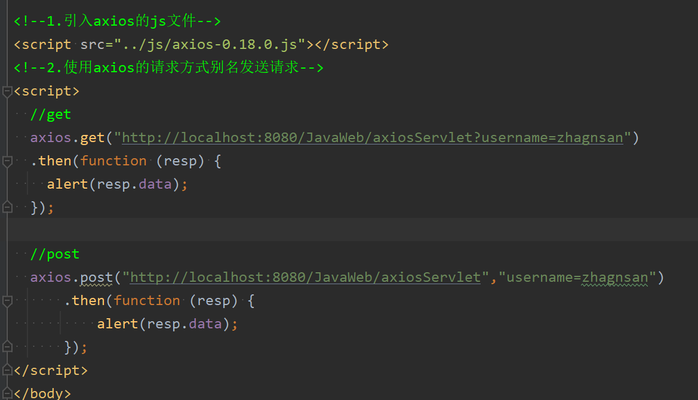
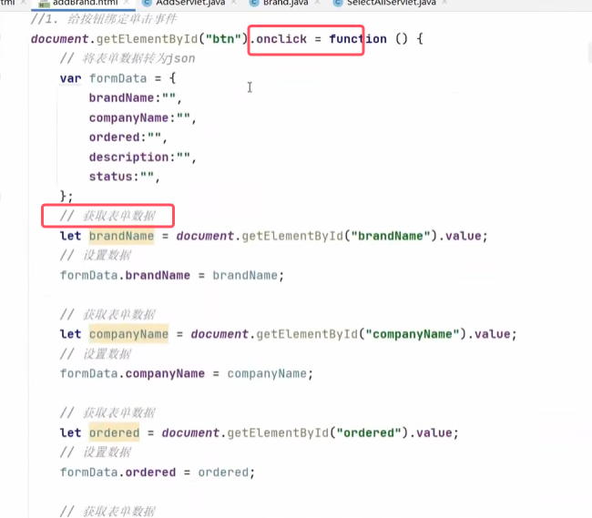

### 1.概述

* 现在的主流开发方式是servlet+html+ajax，servlet+jsp已经过时
* ajax的好处还有一个是局部更新，如图中的第二条

异步和同步的区别：

### 2.快速入门

* 代码不用去记，到时候复制即可，将来都是使用框架，不使用原生代码
* 发送请求代码的要点，最后一个boolean类型默认为异步  
	
* 响应数据的要点  
	

执行结果

* 上面的ajax代码不用记，知道改哪里就行

###### 案例——局部更新

* 假设查询出来用户名存在  

### 3.Axios异步框架

* `.then()`方法用于设置一个回调函数，如果将来响应收到的话，就会自动执行function，用于处理响应数据。其中.data属性就是真正返回的结果
* get方法的请求参数实在url的后面，post的请求参数是在用一个data的属性来封装。

以get为例子的使用示例如下图所示   

##### Axios请求方式别名

* 这种方式使得axios的使用更加方便

### 4.JSON

##### JSON基本语法

* 大括号中的键必须是字符串类型，值可以是多种数据类型
  

##### JSON数据和Java对象转换

### 5.案例（Axios+JSON）

##### 查询所有  

DAO层

Service层  

web层  

* **对象中的内容肯定是有中文，所以需要设置contenttype，并且由于相应的是JSON数据，所以响应的内容类型为`text/json`。**

* **List集合转换为JSON数据时时转换为JSON的i字符串数组**
* **JSON获取数据直接使用`变量名. `即可获取数据**。因为相应的是JSON字符串数组，所以获取每一个字符传然后获取数据即可。具体里面战线的内容就是拼字符串即可

 
##### 新增品牌

service层和DAO层的代码与之前的案例相同，此处就不再赘述

web层代码  

* 图中的前端使用的按钮是一个普通按钮，不是提交按钮。因为正常提交表单时同步请求，我们这里是要使用ajax，去提交异步请求
* 在提交表单时可以给按钮绑定一个时间发送ajax请求，请求中并携带相应的json数据提交到一个servlet中
*  **将来提交数据以后，表单中的所有数据都已经填入，所以可以直接通过value属性来进行获取*
* 状态由于是单选框，所以没有办法通过id来获取，因为是两个标签。所以实现逻辑为：把所有标签都获取出来，检测哪个被选中了，就将相应的value设置到对应的json对象中去

* **`req.getParameter()`接受不了JSON数据，我们需要获取请求体，由于请求体是JSON字符串，那么就可以直接使用工具类去转成对象**
* 注：将来提交到后台的JSON字符串无论是多长，它实际上都是一行
