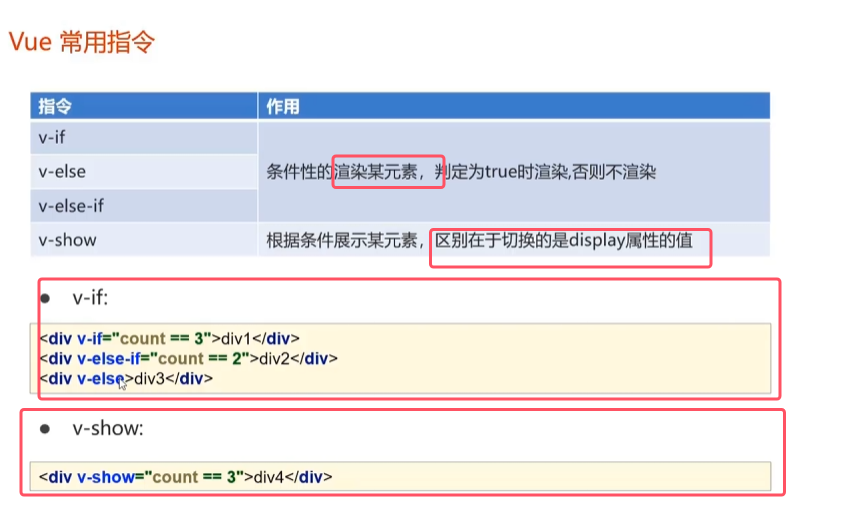
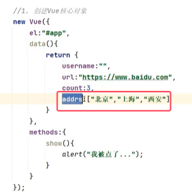

## 一、概述

* MVC模式只能实现模型到视图的单向展示，而不是绑定。
* **双向绑定：模型的数据一旦产生变化，视图可以自动的跟着产生变化，反方向也同理。**
* Vue是通过ViewModel的一个对象，来实现视图和模型的双向绑定

## 二、快速入门

* `new Vue()`中传入的是一个js对象。el指的是element，用于选择使用vue控制的区域范围，填入得到是一个选择器。
* data()用于返回模型数据。将来视图中用于绑定模型的属性v-model的值与data()中的一致
* **取数据使用的是差值表达式（el表达式），也就是`{{}}`**

	  
* data的属性值指定的是一个function，将来可以在function中return一个js对象(模型数据)。由于function中没有任何方法体，所以直接简写为return一个字符串。
* **视图中文本框的v-model属性用于绑定一个vue核心对象。将来文本框的输入的数据一旦发生变化，即视图发生变化，模型的值也会发生改变，el表达式取出来的模型的数据也会发生改变**

## 三、Vue常用指令

应用实例  

* v-bind:href绑定属性可以直接简写为:href。
* 将来input输入框由于使用了v-model绑定了一个vue核心对象，只要输入框中的输入的url一发生变化，上面两个超链接跳转的url也会发生变化

* v-on绑定事件对应的方法，要写在vue核心对象中的method方法里面
* 将来一点击该按钮，就会调用show()

* count初始化为3；
* 通过文本框来改变count的值，如果count的值是3，那么只显示div1。如果改变count的值为4，那么就显示div2；else，就显示div3。与java中的if-else的逻辑一样

* v-show与其他区别为，是改变display属性的值，如果show的判断表达式为假，则不显示

for-each循环

fori循环

* 最终vue的源代码和渲染过后的代码如上图所示
### 四、Vue的生命周期
 
 * 8个生命周期的方法只需要知道mounted一个即可
	
* 将来在Vue核心对象中定义mounted()方法，在Vue初始化成功，HTML页面渲染完成后，自动执行mounted()方法
* **将来是要真正使用mounted()方法的场景：发送异步请求，加载列表数据**

### 五、案例

* 使用Vue框架来简化上一期ajax中的dom操作

##### 查询所有

* 使用id选择器来选一个div块，将显示的内容用一个div包裹

vue核心对象代码  

* **异步请求返回的数据直接接收的话是一个局部变量，如果想要在v-for中使用它，就需要赋值给模型数据**。而如果直接赋值的话，只是赋值给了这个窗口，而没有赋值给模型数据，所以需要在axios外围获取一下模型数据。
* **then外面可以直接使用this，代表当前的vue核心对象，then里面必须使用_this**

为了不用在前端代码中进行判断禁用还是启用，我们可以直接在pojo类直接设置一个方法来返回数据  

##### 新增品牌

* 给提交按钮绑定事件