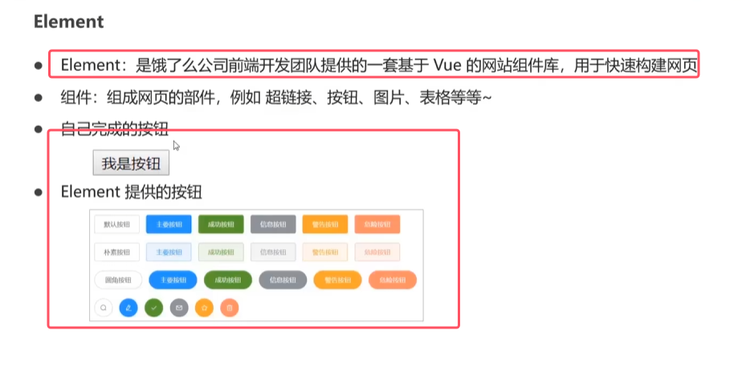
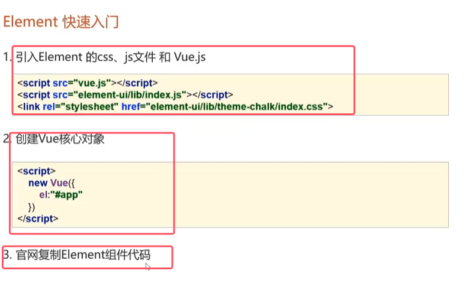
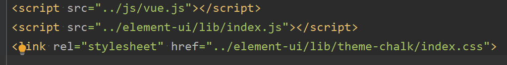
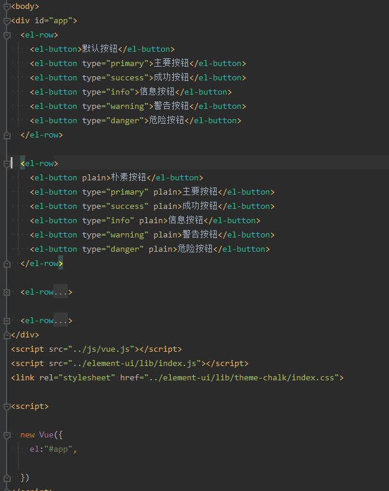
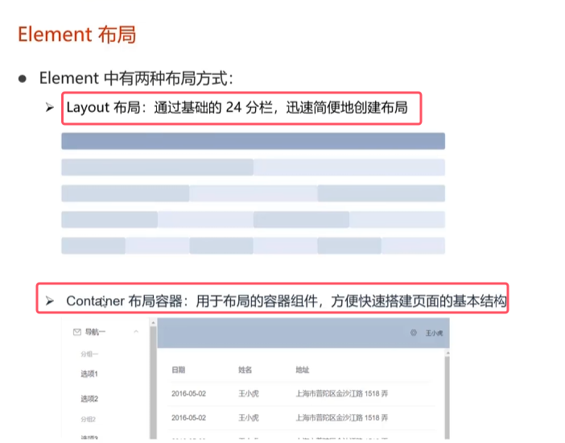
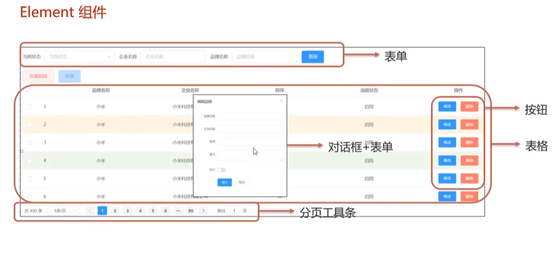

实际上就是一套组件库，样式齐全，代替css样式，可以用于快速构建网页。

官网：[https://element.eleme.cn/](https://element.eleme.cn/)

### 1.快速入门

* 引入的文件的目录如下图所示，两个实在element-ui下的文件，一个是vue.js，因为element是基于vue的。
	

**注意：代码不需要看懂，去官网复制即可**

### 2.Element布局

* layout是通过行的形式来进行布局，每行有24个格子；Container容器布局是带有左侧导航栏的布局
* 剩下的去官网学习即可

### 3.Element常用组件
  

去官网找对应的代码加入即可。

