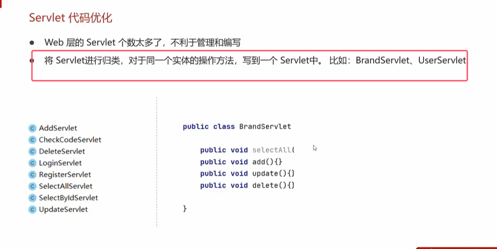
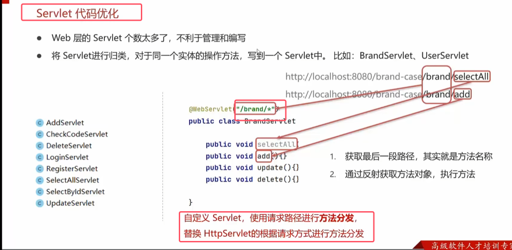
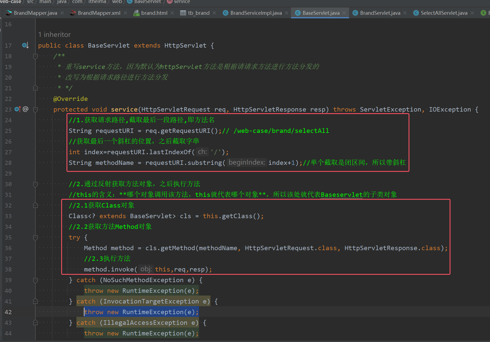
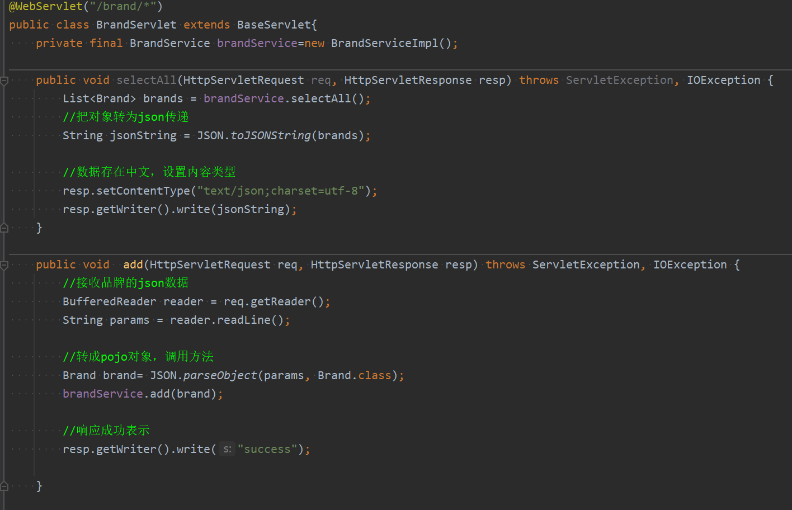

* 使用通配符来进行管理和编写

* 重写service方法，并且使得最后一段路径的名字就是对应方法的名字。其子类都会执行该service方法，完成根据路请求路径进行方法分发

其对应Brand实体对应的Servlet方法如下图所示  

* 不管原本是doGet()还是doPost()，其实都执行的是同一套代码。所以此处不必再像httpservlet那样再去根据请求方法再去分割。
* 所以直接将原本写的代码复制过来即可
