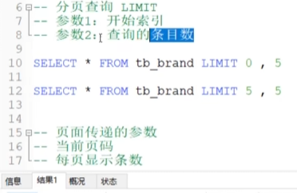
* **页面传递过来的参数是当前页的页码，和每页显示的条数。而不会直接显示开始索引和查询的条目数**
* **开始索引=（当前页码-1）/*每页显示条数**
* **查询条目数=每页显示条数**

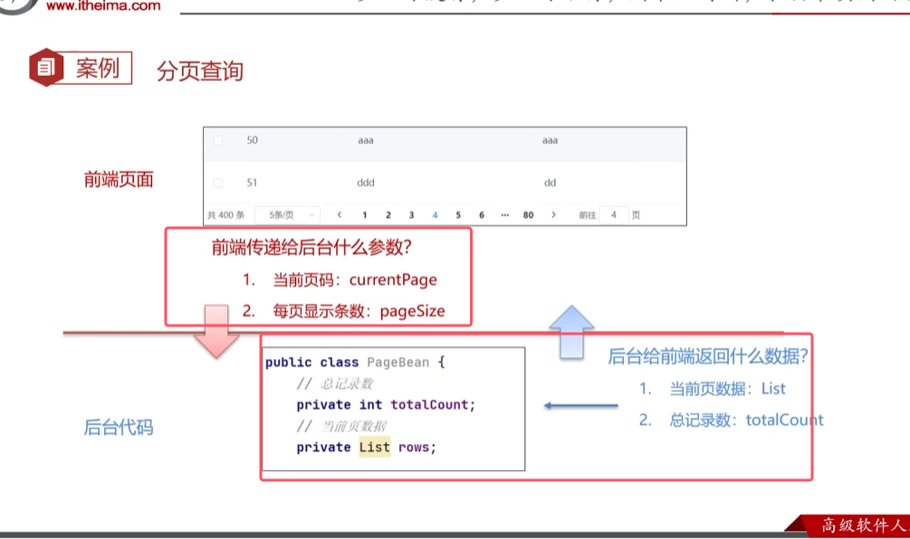

pageBean的代码如下图所示   
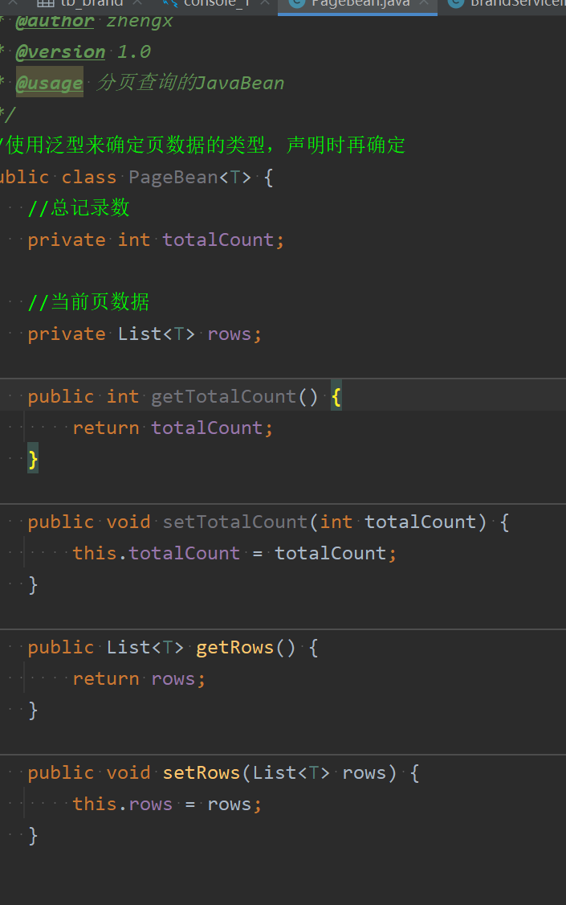

分页查询思路  

前端  
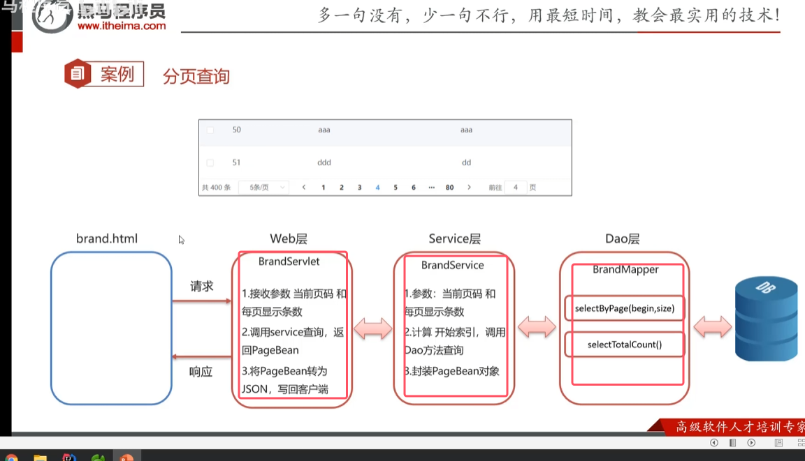

DAO层  
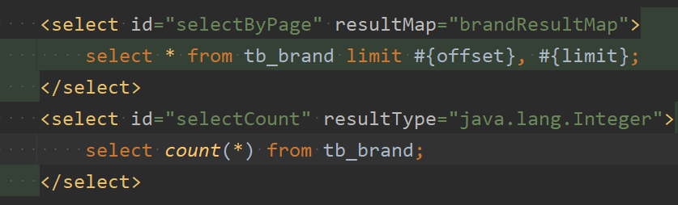
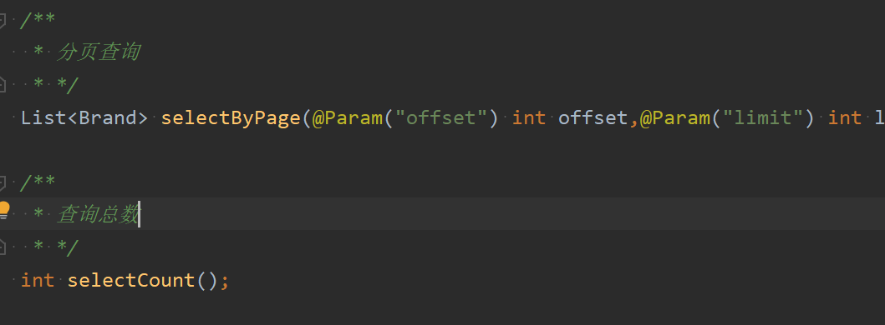

service层  
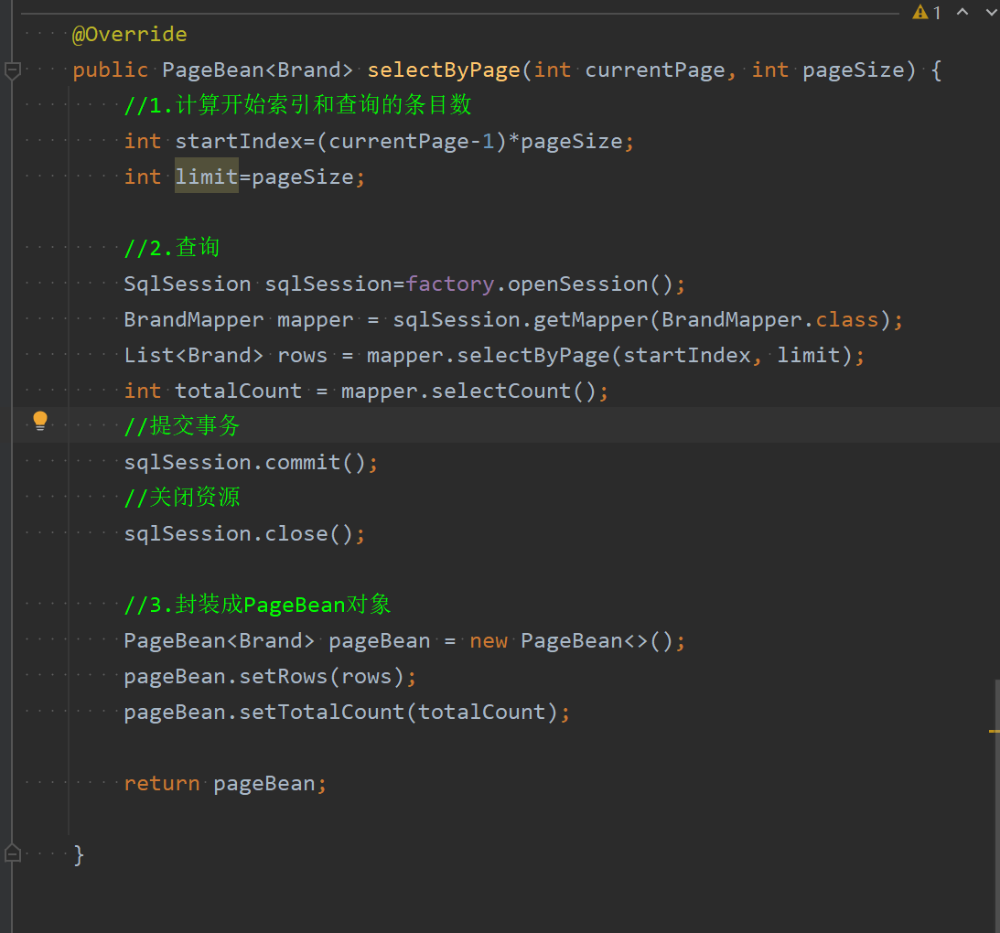

web层  
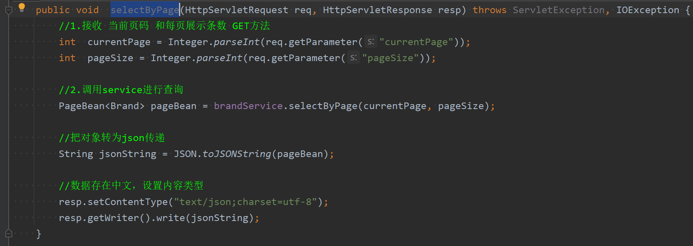

前端代码  
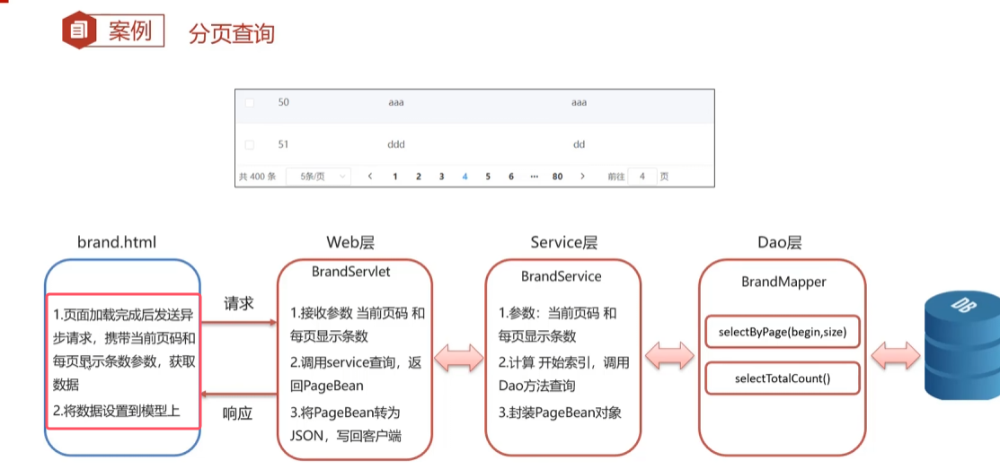    

细节：  
1. 页面加载完成发送异步请求，此时需要替换原本的selectAll()内容为查询分页查询的ajax异步请求。并且由于需要使用get方法去传入当前页和每页的大小，所以需要定义两个模型数据。用于向后端传递动态参数  
	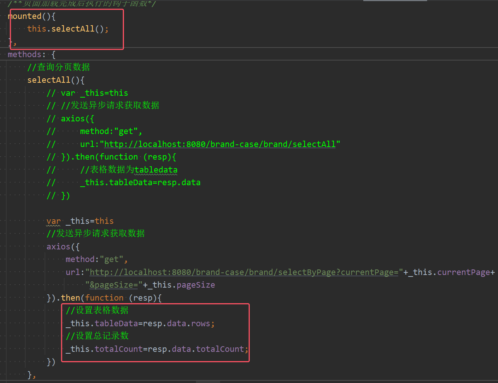
	* 后端查询完返回的是一个PageBean对象，所以需要分别设置对应的表格数据和记录总数

2. element-ui已经封装好了一个分页工具条，所以要将其中的内容设置为模型的动态数据

	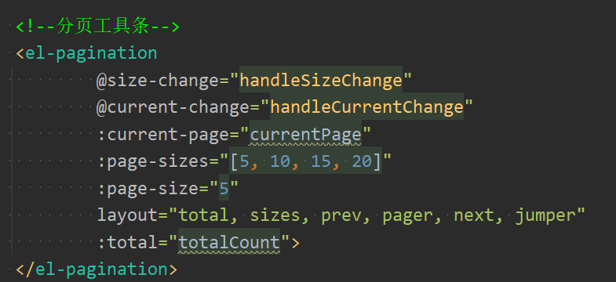

3. 该分页工具条最终，有两个事件。一个是页大小发生了变化；一个是页跳转发生了变化，对应于两个函数。
4. 两个事件方法中，element-ui封装的是直接传递对应的大小值，所以可以直接设置模型数据对应的大小值。之后再起重新查询分页数据即可

	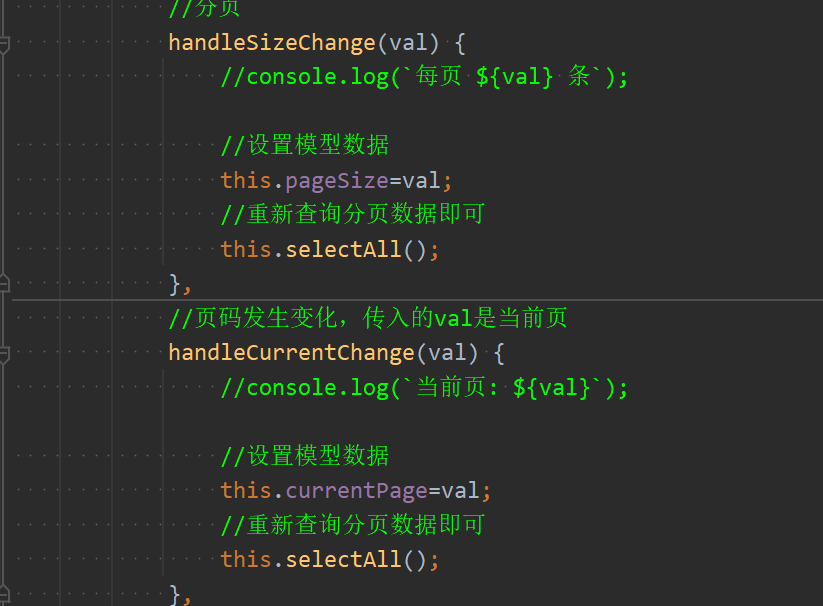