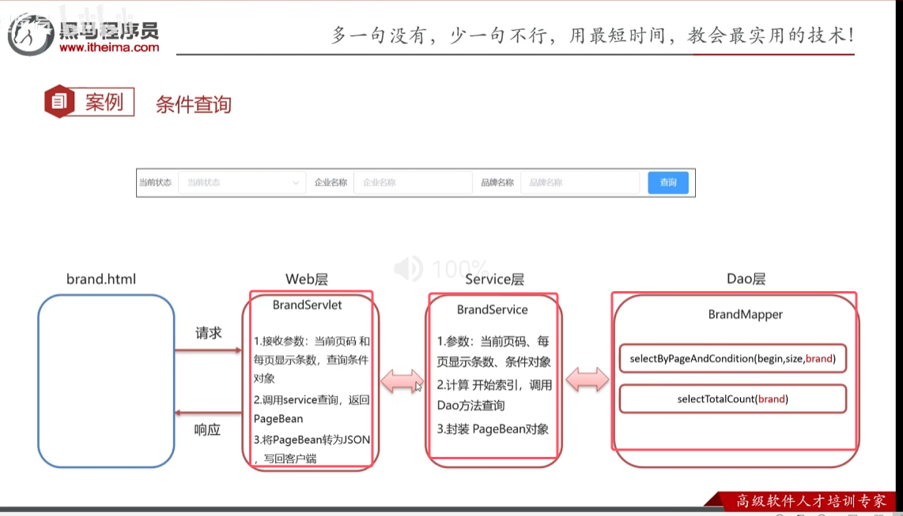
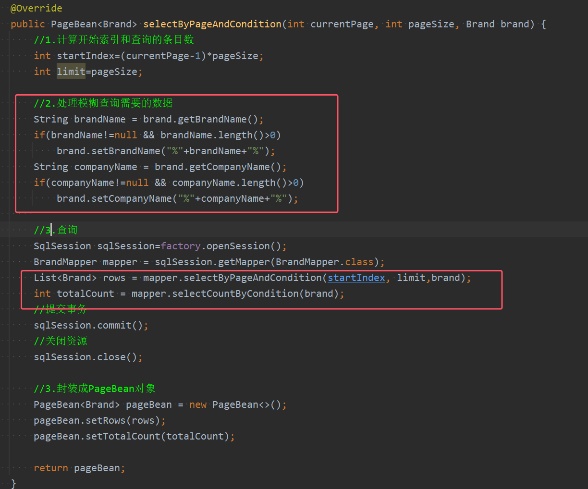

DAO层  

* 多参数底层会封装成map，@param底层会修改对应的map个键值为设置的内容。所以想要获取对应brand的属性，需要使用`brand.属性名`来获取。
* 而单个参数不需要使用`brand.属性名`来获取，直接使用即可

service层  

web层  

* 可能需要传递至多5个参数，参数过多所以使用post方法进行查询条件的参数传递，对于分页的查询，继续使用get的传递方式

前端代码  

* 继续将selectAll进行改写，post方法中的data其实就是brand的模型数据，如果只是普通的分页查询的话，该data相当于为null

* 查询表单绑定模型数据，并完成事件方法

效果图  

