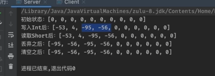
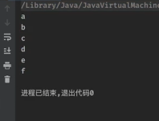
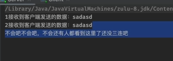
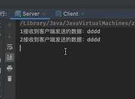
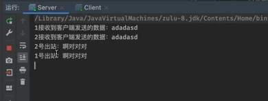
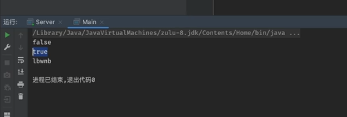

前面我们学习了Java为我们提供的NIO框架，提供使用NIO提供的三大组件，我们就可以编写更加高性能的客户端/服务端网络程序了，甚至还可以自行规定一种通信协议进行通信。

## 一、NIO框架存在的问题

但是之前我们在使用NIO框架的时候，还是发现了一些问题，我们先来盘点一下。

### 1.客户端关闭导致服务端空轮询

在选择器于多路复用通信中的代码中，你可能发现了这样一个问题：


**当我们的客户端主动与服务端断开连接时，会导致READ事件一直被触发，也就是说`selector.select()`会直接通过，并且是可读的状态，但是我们发现实际上读到是数据是一个空的**（上面的图中在空轮询两次后抛出异常了，也有可能是无限的循环下去）所以这里我们得稍微处理一下：

```java
} else if(key.isReadable()) {
    SocketChannel channel = (SocketChannel) key.channel();
    ByteBuffer buffer = ByteBuffer.allocate(128);
    //这里我们需要判断一下，如果read操作得到的结果是-1，那么说明服务端已经断开连接了
    if(channel.read(buffer) < 0) {
        System.out.println("客户端已经断开连接了："+channel.getRemoteAddress());
        channel.close();   //直接关闭此通道
        continue;   //继续进行选择
    }
    buffer.flip();
    System.out.println("接收到客户端数据："+new String(buffer.array(), 0, buffer.remaining()));
    channel.write(ByteBuffer.wrap("已收到！".getBytes()));
}
```

这样，我们就可以在客户端主动断开时关闭连接了：


当然，除了这种情况可能会导致空轮询之外，实际上还有一种可能，这种情况是NIO框架本身的BUG：

```java
while (true) {
    int count = selector.select();  //由于底层epoll机制的问题，导致select方法可能会一直返回0，造成无限循环空转的情况。
    System.out.println("监听到 "+count+" 个事件");
    Set<SelectionKey> selectionKeys = selector.selectedKeys();
    Iterator<SelectionKey> iterator = selectionKeys.iterator();
```

详细请看JDK官方BUG反馈：

1. [JDK-6670302 : (se) NIO selector wakes up with 0 selected keys infinitely](https://link.jianshu.com/?t=http%3A%2F%2Fbugs.java.com%2Fbugdatabase%2Fview_bug.do%3Fbug_id%3D6670302)
2. [JDK-6403933 : (se) Selector doesn't block on Selector.select(timeout) (lnx)](https://link.jianshu.com/?t=http%3A%2F%2Fbugs.java.com%2Fbugdatabase%2Fview_bug.do%3Fbug_id%3D6403933)

本质原因也是因为客户端的主动断开导致：

>This is an issue with poll (and epoll) on Linux. If a file descriptor for a connected socket is polled with a request event mask of 0, and if the connection is abruptly terminated (RST) then the poll wakes up with the POLLHUP (and maybe POLLERR) bit set in the returned event set. The implication of this behaviour is that Selector will wakeup and as the interest set for the SocketChannel is 0 it means there aren't any selected events and the select method returns 0.

这个问题本质是与操作系统有关的，所以JDK一直都认为是操作系统的问题，不应该由自己来处理，所以这个问题在当时的好几个JDK版本都是存在的，这是一个很严重的空转问题，无限制地进行空转操作会导致CPU资源被疯狂消耗。

不过，这个问题，却被Netty框架巧妙解决了，我们后面再说。

### 2.粘包/拆包问题

除了上面的问题之外，我们接着来看下一个问题。

我们在`计算机网络`这门课程中学习过，**操作系统通过TCP协议发送数据的时候，也会先将数据存放在缓冲区中，而至于什么时候真正地发出这些数据，是由TCP协议来决定的，这是我们无法控制的事情**。


也就是说，比如现在我们要发送两个数据包（P1/P2），理想情况下，这两个包应该是依次到达服务端，并由服务端正确读取两次数据出来，但是由于上面的机制，可能会出现下面的情况：

1. 可能P1和P2被合在一起发送给了服务端（粘包现象）
2. 可能P1和P2的前半部分合在一起发送给了服务端（拆包现象）
3. 可能P1的前半部分就被单独作为一个部分发给了服务端，后面的和P2一起发给服务端（也是拆包现象）


当然，对于这种问题，也有一些比较常见的解决方案：

1. **消息定长**，发送方和接收方规定固定大小的消息长度，例如每**个数据包大小固定为200字节，如果不够，空位补空格，只有接收了200个字节之后，作为一个完整的数据包进行处理**。
2. **在每个包的末尾使用固定的分隔符**，比如每个数据包末尾都是`\r\n`，这样就一定需要读取到这样的分隔符才能将前面所有的数据作为一个完整的数据包进行处理。
3. **将消息分为头部和本体，在头部中保存有当前整个数据包的长度，只有在读到足够长度之后才算是读到了一个完整的数据包**。

这里我们就来演示一下第一种解决方案：

```java
public static void main(String[] args) {
    try (ServerSocketChannel serverChannel = ServerSocketChannel.open();
         Selector selector = Selector.open()){
        serverChannel.bind(new InetSocketAddress(8080));
        serverChannel.configureBlocking(false);
        serverChannel.register(selector, SelectionKey.OP_ACCEPT);

        //一个数据包要求必须塞满30个字节
        ByteBuffer buffer = ByteBuffer.allocate(30);

        while (true) {
            int count = selector.select();
            Set<SelectionKey> selectionKeys = selector.selectedKeys();
            Iterator<SelectionKey> iterator = selectionKeys.iterator();
            while (iterator.hasNext()) {
                ...
                    if(buffer.remaining() == 0) {
                        buffer.flip();
                        System.out.println("接收到客户端数据："+new String(buffer.array(), 0, buffer.remaining()));
                        buffer.clear();
                    }
                    channel.write(ByteBuffer.wrap(("已收到 "+size+" 字节的数据！").getBytes()));
                }
               	...
```

现在，当我们的客户端发送消息时，如果没有达到30个字节，那么会暂时存储起来，等有30个之后再一次性得到，当然如果数据量超过了30，那么最多也只会读取30个字节，其他的放在下一批：


这样就可以在一定程度上解决粘包/拆包问题了。

***

## 二、走进Netty框架

前面我们盘点了一下NIO存在的一些问题，而在Netty框架中，这些问题都被巧妙的解决了。

**Netty是由JBOSS提供的一个开源的java网络编程框架，主要是对java的nio包进行了再次封装。Netty比java原生的nio包提供了更加强大、稳定的功能和易于使用的api**。 netty的作者是Trustin Lee，这是一个韩国人，他还开发了另外一个著名的网络编程框架，mina。二者在很多方面都十分相似，它们的线程模型也是基本一致 。不过netty社区的活跃程度要mina高得多。

Netty实际上应用场景非常多，比如我们的Minecraft游戏服务器：


Java版本的Minecraft服务器就是使用Netty框架作为网络通信的基础，正是得益于Netty框架的高性能，我们才能愉快地和其他的小伙伴一起在服务器里面炸服。


当然除了游戏服务器之外，**我们微服务之间的远程调用也可以使用Netty来完成，比如Dubbo的RPC框架，包括最新的SpringWebFlux框架，也抛弃了内嵌Tomcat而使用Netty作为通信框架**。既然Netty这么强大，那么现在我们就开始Netty的学习吧！

导包先：

```xml
<dependencies>
    <dependency>
        <groupId>io.netty</groupId>
        <artifactId>netty-all</artifactId>
        <version>4.1.76.Final</version>
    </dependency>
</dependencies>
```

### 1.ByteBuf介绍

**Netty并没有使用NIO中提供的ByteBuffer来进行数据装载，而是自行定义了一个ByteBuf类。**

那么这个类相比NIO中的ByteBuffer有什么不同之处呢？

* **写操作完成后无需进行`flip()`翻转（因为有一个读指针和一个写指针）。**
* 具有比ByteBuffer更快的响应速度。
* **动态扩容。**

###### 内部结构
首先我们来看看它的内部结构：

```java
public abstract class AbstractByteBuf extends ByteBuf {
    ...
    int readerIndex;   //index被分为了读和写，是两个指针在同时工作
    int writerIndex;
    private int markedReaderIndex;    //mark操作也分两种
    private int markedWriterIndex;
    private int maxCapacity;    //最大容量，没错，这玩意能动态扩容
```

可以看到，**读操作和写操作分别由两个指针在进行维护，每写入一次，`writerIndex`向后移动一位，每读取一次，也是`readerIndex`向后移动一位**，当然`readerIndex`不能大于`writerIndex`，这样就不会像NIO中的ByteBuffer那样还需要进行翻转了。


其中`readerIndex`和`writerIndex`之间的部分就是是可读的内容，而`writerIndex`之后到`capacity`都是可写的部分。

###### 使用方法
我们来实际使用一下看看：

```java
public static void main(String[] args) {
    //创建一个初始容量为10的ByteBuf缓冲区，这里的Unpooled是用于快速生成ByteBuf的工具类
    //至于为啥叫Unpooled是池化的意思，ByteBuf有池化和非池化两种，区别在于对内存的复用，我们之后再讨论
    ByteBuf buf = Unpooled.buffer(10);//分配空间的单位是字节
    System.out.println("初始状态："+Arrays.toString(buf.array()));
    buf.writeInt(-888888888);   //写入一个Int数据
    System.out.println("写入Int后："+Arrays.toString(buf.array()));
    buf.readShort();   //无需翻转，直接读取一个short数据出来
    System.out.println("读取Short后："+Arrays.toString(buf.array()));
    buf.discardReadBytes();   //丢弃操作，会将当前的可读部分内容复制到最前面，并且读写指针向前移动复制的距离
    System.out.println("丢弃之后："+Arrays.toString(buf.array()));
    buf.clear();    //清空操作，清空之后读写指针都归零，但是数据还在
    System.out.println("清空之后："+Arrays.toString(buf.array()));
}
```

* **创建ByteBuf需要使用Unpooled工具类来创建**

通过结合断点调试，我们可以观察读写指针的移动情况，更加清楚的认识一下ByteBuf的底层操作。

我们再来看看划分操作是不是和之前一样的：

```java
public static void main(String[] args) {
  	//我们也可以将一个byte[]直接包装进缓冲区（和NIO是一样的）不过写指针的值一开始就跑到最后去了，但是这玩意不是只读的，可以修改
    ByteBuf buf = Unpooled.wrappedBuffer("abcdefg".getBytes());
  	//除了包装，也可以复制数据，copiedBuffer()会完完整整将数据拷贝到一个新的缓冲区中，而不是直接包装
    buf.readByte();   //读取一个字节
    ByteBuf slice = buf.slice();   //现在读指针位于1，然后进行划分

    System.out.println(slice.arrayOffset());   //得到划分出来的ByteBuf的偏移地址
    System.out.println(Arrays.toString(slice.array()));
}
```


可以看到，划分也是根据当前读取的位置来进行的。

###### 扩容机制
**我们继续来看看它的另一个特性，动态扩容**，比如我们申请一个容量为10的缓冲区：

```java
public static void main(String[] args) {
    ByteBuf buf = Unpooled.buffer(10);    //容量只有10字节
    System.out.println(buf.capacity());
  	//直接写一个字符串
    buf.writeCharSequence("卢本伟牛逼！", StandardCharsets.UTF_8);   //很明显这么多字已经超过10字节了
    System.out.println(buf.capacity());
}
```

通过结果我们发现，在**写入一个超出当前容量的数据时，会进行动态扩容，第一次扩容那个会直接扩容到64，之后每次触发扩容都会x2**，当然如果我们不希望它扩容，可以指定最大容量：

```java
public static void main(String[] args) {
    //在生成时指定maxCapacity也为10，构造器第二个参数
    ByteBuf buf = Unpooled.buffer(10, 10);
    System.out.println(buf.capacity());
    buf.writeCharSequence("卢本伟牛逼！", StandardCharsets.UTF_8);
    System.out.println(buf.capacity());
}
```

可以看到现在无法再动态扩容了：


###### 缓冲区三种实现模式


**我们接着来看一下缓冲区的三种实现模式：堆缓冲区模式、直接缓冲区模式、复合缓冲区模式。**(NIO只有前两种)

**堆缓冲区（数组实现）和直接缓冲区（堆外内存实现**）不用多说，前面我们在NIO中已经了解过了，我们要创建一个直接缓冲区也很简单，直接调用：

```java
public static void main(String[] args) {
    ByteBuf buf = Unpooled.directBuffer(10);//申请直接缓冲区
    System.out.println(Arrays.toString(buf.array()));
}
```

同样的不能直接拿到数组，因为底层压根不是数组实现的：


我们来看看复合模式，**复合模式可以任意地拼凑组合其他缓冲区**，比如我们可以：


这样，**如果我们想要对两个缓冲区组合的内容进行操作，我们就不用再单独创建一个新的缓冲区了，而是直接将其进行拼接操作，相当于是作为多个缓冲区组合的视图**。

```java
//创建一个复合缓冲区（若干个缓冲区的视图）
CompositeByteBuf buf = Unpooled.compositeBuffer();
buf.addComponent(Unpooled.copiedBuffer("abc".getBytes()));//拼接缓冲区
buf.addComponent(Unpooled.copiedBuffer("def".getBytes()));

for (int i = 0; i < buf.capacity(); i++) {
    System.out.println((char) buf.getByte(i));
}
```


可以看到我们也可以正常操作组合后的缓冲区。

###### 池化缓冲区和非池化缓冲区的区别

最后我们来看看，池化缓冲区和非池化缓冲区的区别。

我们研究一下Unpooled工具类中具体是如何创建buffer的：
```java
public final class Unpooled {
    private static final ByteBufAllocator ALLOC;  //实际上内部是有一个ByteBufAllocator对象的
    public static final ByteOrder BIG_ENDIAN;
    public static final ByteOrder LITTLE_ENDIAN;
    public static final ByteBuf EMPTY_BUFFER;

    public static ByteBuf buffer() {
        return ALLOC.heapBuffer();   //缓冲区的创建操作实际上是依靠ByteBufAllocator来进行的
    }
  
  	...
      
    static {   //ALLOC在静态代码块中进行指定，实际上真正的实现类是UnpooledByteBufAllocator
        ALLOC = UnpooledByteBufAllocator.DEFAULT;
        BIG_ENDIAN = ByteOrder.BIG_ENDIAN;
        LITTLE_ENDIAN = ByteOrder.LITTLE_ENDIAN;
        EMPTY_BUFFER = ALLOC.buffer(0, 0);   //空缓冲区容量和最大容量都是0

        assert EMPTY_BUFFER instanceof EmptyByteBuf : "EMPTY_BUFFER must be an EmptyByteBuf.";

    }
}
```

那么我们来看看，这个ByteBufAllocator又是个啥，顾名思义，其实就是负责分配缓冲区的。

它有两个具体实现类 **：`UnpooledByteBufAllocator`和`PooledByteBufAllocator`，一个是非池化缓冲区生成器，还有一个是池化缓冲区生成器**，那么池化和非池化有啥区别呢？

实际上池化缓冲区利用了池化思想，将缓冲区通过设置内存池来进行内存块复用，这样就不用频繁地进行内存的申请，尤其是在使用堆外内存的时候，避免多次重复通过底层`malloc()`函数系统调用申请内存造成的性能损失。Netty的内存管理机制主要是借鉴Jemalloc内存分配策略，感兴趣的小伙伴可以深入了解一下。

所以，由于是复用内存空间，我们来看个例子：

```java
public static void main(String[] args) {
    ByteBufAllocator allocator = PooledByteBufAllocator.DEFAULT;
    ByteBuf buf = allocator.directBuffer(10);   //申请一个容量为10的直接缓冲区
    buf.writeChar('T');    //随便操作操作
    System.out.println(buf.readChar());
    buf.release();    //释放此缓冲区

    ByteBuf buf2 = allocator.directBuffer(10);   //重新再申请一个同样大小的直接缓冲区
    System.out.println(buf2 == buf);//true
}
```

可以看到，在我们使用完一个缓冲区之后，我们将其进行资源释放，当我们再次申请一个同样大小的缓冲区时，会直接得到之前已经申请好的缓冲区，所以，PooledByteBufAllocator实际上是将ByteBuf实例放入池中在进行复用。

### 2.零拷贝简介

**注意：** 此小节作为选学内容，需要掌握`操作系统`和`计算机组成原理`才能学习。

**零拷贝是一种I/O操作优化技术，可以快速高效地将数据从文件系统移动到网络接口，而不需要将其从内核空间复制到用户空间**，首先第一个问题，什么是内核空间，什么又是用户空间呢？

其实早期操作系统是不区分内核空间和用户空间的，但是应用程序能访问任意内存空间，程序很容易不稳定，常常把系统搞崩溃，比如清除操作系统的内存数据。实际上让应用程序随便访问内存真的太危险了，于是就按照CPU 指令的重要程度对指令进行了分级，指令分为四个级别：Ring0 ~ Ring3，Linux 下只使用了 Ring0 和 Ring3 两个运行级别，进程运行在 Ring3 级别时运行在用户态，指令只访问用户空间，而运行在 Ring0 级别时被称为运行在内核态，可以访问任意内存空间。


**比如我们Java中创建一个新的线程，实际上最终是要交给操作系统来为我们进行分配的**，而需要操作系统帮助我们完成任务则需要进行系统调用，是内核在进行处理，不是我们自己的程序在处理，这时就相当于我们的程序处于了内核态，而当操作系统底层分配完成，最后到我们Java代码中返回得到线程对象时，又继续由我们的程序进行操作，所以从内核态转换回了用户态。

**而我们的文件操作也是这样，我们实际上也是需要让操作系统帮助我们从磁盘上读取文件数据或是向网络发送数据**，比如使用传统IO的情况下，我们要从磁盘上读取文件然后发送到网络上，就会经历以下流程：


可以看到整个过程中是经历了2次CPU拷贝+2次DMA拷贝，一共四次拷贝，虽然逻辑比较清晰，但是数据老是这样来回进行复制，是不是太浪费时间了点？所以我们就需要寻找一种更好的方式，来实现零拷贝。

实现零拷贝我们这里演示三种方案：

1. 使用虚拟内存

   现在的操作系统基本都是支持虚拟内存的，我们可以让内核空间和用户空间的虚拟地址指向同一个物理地址，这样就相当于是直接共用了这一块区域，也就谈不上拷贝操作了：

   

2. 使用mmap/write内存映射

   实际上这种方式就是将内核空间中的缓存直接映射到用户空间缓存，比如我们之前在学习NIO中使用的MappedByteBuffer，就是直接作为映射存在，当我们需要将数据发送到Socket缓冲区时，直接在内核空间中进行操作就行了：

   

   不过这样还是会出现用户态和内核态的切换，我们得再优化优化。

3. 使用sendfile方式

   在Linux2.1开始，引入了sendfile方式来简化操作，我们可以直接告诉内核要把哪个文件数据拷贝拷贝到Socket上，直接在内核空间中一步到位：

   

   比如我们之前在NIO中使用的`transferTo()`方法，就是利用了这种机制来实现零拷贝的。

### 3.Netty工作模型

前面我们了解了Netty为我们提供的更高级的缓冲区类，我们接着来看看Netty是如何工作的，上一章我们介绍了Reactor模式，**而Netty正是以主从Reactor多线程模型为基础，构建出了一套高效的工作模型**。

大致工作模型图如下：


可以看到，和我们之前介绍的主从Reactor多线程模型非常类似：


所有的客户端需要连接到主Reactor完成Accept操作后，其他的操作由从Reactor去完成，这里也是差不多的思想，但是它进行了一些改进，我们来看一下它的设计：

* **Netty 抽象出两组线程池BossGroup和WorkerGroup，BossGroup专门负责接受客户端的连接, WorkerGroup专门负责读写，就像我们前面说的主从Reactor一样**。
* **无论是BossGroup还是WorkerGroup，都是使用EventLoop（事件循环**，很多系统都采用了事件循环机制，比如前端框架Node.js，事件循环顾名思义，就是一个循环，不断地进行事件通知）来进行事件监听的，**整个Netty也是使用事件驱动来运作的，比如当客户端已经准备好读写、连接建立时，都会进行事件通知**，说白了就像我们之前写NIO多路复用那样，只不过这里换成**EventLoop了而已，它已经帮助我们封装好了一些常用操作，而且我们可以自己添加一些额外的任务，如果有多个EventLoop，会存放在EventLoopGroup中，EventLoopGroup就是BossGroup和WorkerGroup的具体实现**。
* **在BossGroup之后，会正常将SocketChannel绑定到WorkerGroup中的其中一个EventLoop上，进行后续的读写操作监听**。

前面我们大致了解了一下Netty的工作模型，接着我们来尝试创建一个Netty服务器：

```java
public static void main(String[] args) {
    //这里我们使用NioEventLoopGroup实现类即可，创建BossGroup和WorkerGroup
    //当然还有EpollEventLoopGroup，但是仅支持Linux，这是Netty基于Linux底层Epoll单独编写的一套本地实现，没有使用NIO那套
    EventLoopGroup bossGroup = new NioEventLoopGroup(), workerGroup = new NioEventLoopGroup();

    //创建服务端启动引导类
    ServerBootstrap bootstrap = new ServerBootstrap();
    //可链式，就很棒
    bootstrap
            .group(bossGroup, workerGroup)   //指定事件循环组
            .channel(NioServerSocketChannel.class)   //指定为NIO的ServerSocketChannel
            .childHandler(new ChannelInitializer<SocketChannel>() {   //注意，这里的SocketChannel不是我们NIO里面的，是Netty的。这里的childHandler其实就是工作线程
                @Override
                protected void initChannel(SocketChannel channel) {
                    //获取流水线，当我们需要处理客户端的数据时，实际上是像流水线一样在处理，这个流水线上可以有很多Handler。每个工作线程handler处理一部分
                    channel.pipeline().addLast(new ChannelInboundHandlerAdapter(){   //添加一个Handler，这里使用ChannelInboundHandlerAdapter ，inbound入站的意思
	                    //当客户端发送给我们数据的时候，底层会自动调用channelRead()
                        @Override
                        public void channelRead(ChannelHandlerContext ctx, Object msg) {  //ctx是上下文，msg是收到的消息，默认以ByteBuf形式（也可以是其他形式，后面再说）
                            ByteBuf buf = (ByteBuf) msg;   //类型转换一下
                            System.out.println(Thread.currentThread().getName()+" >> 接收到客户端发送的数据："+buf.toString(StandardCharsets.UTF_8));
                            //通过上下文可以直接发送数据回去，注意要writeAndFlush才能让客户端立即收到
                            ctx.writeAndFlush(Unpooled.wrappedBuffer("已收到！".getBytes()));
                        }
                    });
                }
            });
    //最后绑定端口，就自动启动启动
    bootstrap.bind(8080);
}
```

可以看到上面写了很多东西，但是你一定会懵逼，这些新来的东西，都是什么跟什么啊，怎么一个也没看明白？没关系，我们可以暂时先将代码写在这里，具体的各个部分，还请听后面细细道来。

我们接着编写一个客户端，客户端可以直接使用我们之前的：

```java
public static void main(String[] args) {
    //创建一个新的SocketChannel，一会通过通道进行通信
    try (SocketChannel channel = SocketChannel.open(new InetSocketAddress("localhost", 8080));
         Scanner scanner = new Scanner(System.in)){
        System.out.println("已连接到服务端！");
        while (true) {   //咱给它套个无限循环，这样就能一直发消息了
            System.out.println("请输入要发送给服务端的内容：");
            String text = scanner.nextLine();
            if(text.isEmpty()) continue;
            //直接向通道中写入数据，真舒服
            channel.write(ByteBuffer.wrap(text.getBytes()));
            System.out.println("已发送！");
            ByteBuffer buffer = ByteBuffer.allocate(128);
            channel.read(buffer);   //直接从通道中读取数据
            buffer.flip();
            System.out.println("收到服务器返回："+new String(buffer.array(), 0, buffer.remaining()));
        }
    } catch (IOException e) {
        throw new RuntimeException(e);
    }
}
```

通过通道正常收发数据即可，这样我们就成功搭建好了一个Netty服务器。

### 4.Channel详解

在学习NIO时，我们就已经接触到Channel了，我们可以通过通道来进行数据的传输，并且通道支持双向传输。

**在Netty中，也有对应的Channel类型：没有直接集成NIO中的Channel，而是使用的自己的**
```java
public interface Channel extends AttributeMap, ChannelOutboundInvoker, Comparable<Channel> {
    ChannelId id();   //通道ID
    EventLoop eventLoop();   //获取此通道所属的EventLoop，因为一个Channel在它的生命周期内只能注册到一个EventLoop中
    Channel parent();   //Channel是具有层级关系的，这里是返回父Channel
    ChannelConfig config();
    boolean isOpen();   //通道当前的相关状态
    boolean isRegistered();
    boolean isActive();
    ChannelMetadata metadata();   //通道相关信息
    SocketAddress localAddress(); 
    SocketAddress remoteAddress();
    ChannelFuture closeFuture();  //关闭通道，但是会用到ChannelFuture，后面说
    boolean isWritable();
    long bytesBeforeUnwritable();
    long bytesBeforeWritable();
    Unsafe unsafe();
    ChannelPipeline pipeline();   //流水线，之后也会说
    ByteBufAllocator alloc();   //可以直接从Channel拿到ByteBufAllocator的实例，来分配ByteBuf
    Channel read();
    Channel flush();   //刷新，基操
}
```

可以看到，Netty中的Channel相比NIO功能就多得多了。**Netty中的Channel主要特点如下：**

* **所有的IO操作都是异步的，并不是在当前线程同步运行，方法调用之后就直接返回了，那怎么获取操作的结果呢**？**还记得我们在前面JUC篇教程中学习的Future吗，没错，这里的ChannelFuture也是干这事的。**

我们可以来看一下Channel接口的父接口ChannelOutboundInvoker接口，这里面定义了大量的I/O操作：

```java
public interface ChannelOutboundInvoker {   //通道出站调用（包含大量的网络出站操作，比如写）
    ChannelFuture bind(SocketAddress var1);  //Socket绑定、连接、断开、关闭等操作
    ChannelFuture connect(SocketAddress var1);
    ChannelFuture connect(SocketAddress var1, SocketAddress var2);
    ChannelFuture disconnect();
    ChannelFuture close();
    ChannelFuture deregister();
    ChannelFuture bind(SocketAddress var1, ChannelPromise var2);    //下面这一系列还有附带ChannelPromise的，ChannelPromise我们后面再说，其实就是ChannelFuture的增强版
    ChannelFuture connect(SocketAddress var1, ChannelPromise var2);
    ChannelFuture connect(SocketAddress var1, SocketAddress var2, ChannelPromise var3);
    ChannelFuture disconnect(ChannelPromise var1);
    ChannelFuture close(ChannelPromise var1);
    ChannelFuture deregister(ChannelPromise var1);
    ChannelOutboundInvoker read();
  
    ChannelFuture write(Object var1);    //可以看到这些常见的写操作，都是返回的ChannelFuture，而不是直接给结果
    ChannelFuture write(Object var1, ChannelPromise var2);
    ChannelOutboundInvoker flush();
    ChannelFuture writeAndFlush(Object var1, ChannelPromise var2);
    ChannelFuture writeAndFlush(Object var1);
  
    ChannelPromise newPromise();   //其他的暂时不提
    ChannelProgressivePromise newProgressivePromise();
    ChannelFuture newSucceededFuture();
    ChannelFuture newFailedFuture(Throwable var1);
    ChannelPromise voidPromise();
}
```

当然它还实现了**AttributeMap接口，其实有点类似于Session那种感觉，我们可以添加一些属性之类的**：

```java
public interface AttributeMap {
    <T> Attribute<T> attr(AttributeKey<T> var1);

    <T> boolean hasAttr(AttributeKey<T> var1);
}
```

我们了解了Netty底层的Channel之后，我们接着来看**ChannelHandler(即工作线程)**，既然现在有了通道，那么怎么进行操作呢？**我们可以将需要处理的事情放在ChannelHandler中，ChannelHandler充当了所有入站和出站数据的应用程序逻辑的容器，实际上就是我们之前Reactor模式中的Handler，全靠它来处理读写操作**。

**不过这里不仅仅是一个简单的ChannelHandler在进行处理，而是一整套流水线，我们之后会介绍ChannelPipeline**。

**比如我们上面就是使用了ChannelInboundHandlerAdapter抽象类，它是ChannelInboundHandler接口的实现，用于处理入站数据，可以看到我们实际上就是通过重写对应的方法来进行处理，这些方法会在合适的时间被调用**：

```java
channel.pipeline().addLast(new ChannelInboundHandlerAdapter(){
    @Override
    public void channelRead(ChannelHandlerContext ctx, Object msg) {  
      	//ctx是上下文，msg是收到的消息，以ByteBuf形式
        ByteBuf buf = (ByteBuf) msg;   //类型转换一下
        System.out.println(Thread.currentThread().getName()+" >> 接收到客户端发送的数据："+buf.toString(StandardCharsets.UTF_8));
        //通过上下文可以直接发送数据回去，注意要writeAndFlush才能让客户端立即收到
        ctx.writeAndFlush(Unpooled.wrappedBuffer("已收到！".getBytes()));
    }
});
```

我们先从顶层接口开始看起：

```java
public interface ChannelHandler {
  	//当ChannelHandler被添加到流水线中时调用
    void handlerAdded(ChannelHandlerContext var1) throws Exception;
		//当ChannelHandler从流水线中移除时调用
    void handlerRemoved(ChannelHandlerContext var1) throws Exception;

    /** @deprecated 已过时那咱就不管了 */
    @Deprecated
    void exceptionCaught(ChannelHandlerContext var1, Throwable var2) throws Exception;

    @Inherited
    @Documented
    @Target({ElementType.TYPE})
    @Retention(RetentionPolicy.RUNTIME)
    public @interface Sharable {
    }
}
```

顶层接口的定义比较简单，**就只有一些流水线相关的回调方法**，我们接着来看下一级：

```java
//ChannelInboundHandler用于处理入站相关事件
public interface ChannelInboundHandler extends ChannelHandler {
  	//当Channel已经注册到自己的EventLoop上时调用，前面我们说了，一个Channel只会注册到一个EventLoop上，注册到EventLoop后，这样才会在发生对应事件时被通知。
    void channelRegistered(ChannelHandlerContext var1) throws Exception;
		//从EventLoop上取消注册时
    void channelUnregistered(ChannelHandlerContext var1) throws Exception;
		//当Channel已经处于活跃状态时被调用，此时Channel已经连接/绑定，并且已经就绪
    void channelActive(ChannelHandlerContext var1) throws Exception;
		//跟上面相反，不再活跃了，并且不在连接它的远程节点
    void channelInactive(ChannelHandlerContext var1) throws Exception;
		//**关键方法：当从Channel读取数据时被调用，可以看到数据被自动包装成了一个Object（默认是ByteBuf）
    void channelRead(ChannelHandlerContext var1, Object var2) throws Exception;
		//上一个读取操作完成后调用
    void channelReadComplete(ChannelHandlerContext var1) throws Exception;
		//暂时不介绍
    void userEventTriggered(ChannelHandlerContext var1, Object var2) throws Exception;
		//当Channel的可写状态发生改变时被调用
    void channelWritabilityChanged(ChannelHandlerContext var1) throws Exception;
		//出现异常时被调用
    void exceptionCaught(ChannelHandlerContext var1, Throwable var2) throws Exception;
}
```

**而我们上面用到的ChannelInboundHandlerAdapter实际上就是对这些方法实现的抽象类，相比直接用接口，我们可以只重写我们需要的方法，没有重写的方法会默认向流水线下一个ChannelHandler发送**。

我们来测试一下吧：

注：**这些方法在ChannelInboundHandlerAdapter默认情况下有实现，不过代码的作用是交给流水线下一个Handler来处理**
```java
public class TestChannelHandler extends ChannelInboundHandlerAdapter {

    public void channelRegistered(ChannelHandlerContext ctx) throws Exception {
        System.out.println("channelRegistered");
    }

    public void channelUnregistered(ChannelHandlerContext ctx) throws Exception {
        System.out.println("channelUnregistered");
    }

    public void channelActive(ChannelHandlerContext ctx) throws Exception {
        System.out.println("channelActive");
    }

    public void channelInactive(ChannelHandlerContext ctx) throws Exception {
        System.out.println("channelInactive");
    }

    public void channelRead(ChannelHandlerContext ctx, Object msg) throws Exception {
        ByteBuf buf = (ByteBuf) msg;
        System.out.println(Thread.currentThread().getName()+" >> 接收到客户端发送的数据："+buf.toString(StandardCharsets.UTF_8));
        //这次我们就直接使用ctx.alloc()来生成缓冲区
        ByteBuf back = ctx.alloc().buffer();
        back.writeCharSequence("已收到！", StandardCharsets.UTF_8);
        ctx.writeAndFlush(back);
        System.out.println("channelRead");
    }

    public void channelReadComplete(ChannelHandlerContext ctx) throws Exception {
        System.out.println("channelReadComplete");
    }

    public void userEventTriggered(ChannelHandlerContext ctx, Object evt) throws Exception {
        System.out.println("userEventTriggered");
    }

    public void channelWritabilityChanged(ChannelHandlerContext ctx) throws Exception {
        System.out.println("channelWritabilityChanged");
    }

    public void exceptionCaught(ChannelHandlerContext ctx, Throwable cause) throws Exception {
        System.out.println("exceptionCaught"+cause);
    }
}
```

```java
public static void main(String[] args) {
    EventLoopGroup bossGroup = new NioEventLoopGroup(), workerGroup = new NioEventLoopGroup();
    ServerBootstrap bootstrap = new ServerBootstrap();
    bootstrap
            .group(bossGroup, workerGroup)
            .channel(NioServerSocketChannel.class)
      			//ChannelInitializer是一个特殊的ChannelHandler，它本身不处理任何出站/入站事件，它的目的仅仅是完成Channel的初始化
            .childHandler(new ChannelInitializer<SocketChannel>() {
                @Override
                protected void initChannel(SocketChannel channel) {
                    //将我们自定义的ChannelHandler添加到流水线
                    channel.pipeline().addLast(new TestChannelHandler());//添加我们自己写的测试handler
                }
            });
    bootstrap.bind(8080);
}
```

现在我们启动服务器，让客户端来连接并发送一下数据试试看：


**可以看到ChannelInboundHandler的整个生命周期，首先是Channel注册成功，然后才会变成可用状态，接着就差不多可以等待客户端来数据了，当客户端主动断开连接时，会再次触发一次`channelReadComplete`，然后不可用，最后取消注册**。

我们来测试一下出现异常的情况呢？

```java
public void channelRead(ChannelHandlerContext ctx, Object msg) throws Exception {
    ByteBuf buf = (ByteBuf) msg;
    System.out.println(Thread.currentThread().getName()+" >> 接收到客户端发送的数据："+buf.toString(StandardCharsets.UTF_8));
    ByteBuf back = ctx.alloc().buffer();
    back.writeCharSequence("已收到！", StandardCharsets.UTF_8);
    ctx.writeAndFlush(back);
    System.out.println("channelRead");
    throw new RuntimeException("我是自定义异常1");  //弄点异常上去
}

public void channelReadComplete(ChannelHandlerContext ctx) throws Exception {
    System.out.println("channelReadComplete");
    throw new RuntimeException("我是自定义异常2");   //弄点异常上去
}

...

public void exceptionCaught(ChannelHandlerContext ctx, Throwable cause) throws Exception {
    System.out.println("exceptionCaught"+cause);
}
```


可以看到发生异常时，会接着调用`exceptionCaught`方法：


与ChannelInboundHandler对应的还有ChannelOutboundHandler用于处理出站相关的操作，这里就不进行演示了。

#### 4.2Channel Pipeline
我们接着来看看ChannelPipeline，**每一个Channel都对应一个ChannelPipeline（在Channel初始化时就被创建了）**


**Channel在监听到事件之后，其会通过Handler进行一定的处理，就会通过流水线上的handler一次进行处理。整个流水线是通过双线链表进行维护的**

**它就像是一条流水线一样，整条流水线上可能会有很多个Handler（包括入站和出站），整条流水线上的两端还有两个默认的处理器（创建后自动拥有相当于头节点和尾节点，用于一些预置操作和后续操作，比如释放资源等），我们只需要关心如何安排这些自定义的Handler即可**，比如我们现在希望创建两个入站ChannelHandler，一个用于接收请求并处理，还有一个用于处理当前接收请求过程中出现的异常：

```java
.childHandler(new ChannelInitializer<SocketChannel>() {   //注意，这里的SocketChannel不是我们NIO里面的，是Netty的
    @Override
    protected void initChannel(SocketChannel channel) {
        channel.pipeline()   //直接获取pipeline，然后添加两个Handler，注意顺序。入站是从前往后。出站是从尾部倒着到头部
		        //一个用于接收请求并处理
                .addLast(new ChannelInboundHandlerAdapter(){   
                    @Override
                    public void channelRead(ChannelHandlerContext ctx, Object msg) throws Exception {
                        ByteBuf buf = (ByteBuf) msg;
                        System.out.println("接收到客户端发送的数据："+buf.toString(StandardCharsets.UTF_8));
                        throw new RuntimeException("我是异常");
                    }
                })
                //用于处理当前接收请求过程中出现的异常
                .addLast(new ChannelInboundHandlerAdapter(){   
                    @Override
                    public void exceptionCaught(ChannelHandlerContext ctx, Throwable cause) throws Exception {
                        System.out.println("我是异常处理："+cause);
                    }
                });
    }
});
```

那么它是如何运作的呢？**实际上如果我们不在ChannelInboundHandlerAdapter中重写对应的方法，它会默认传播到流水线的下一个ChannelInboundHandlerAdapter进行处理**，比如：

```java
public void exceptionCaught(ChannelHandlerContext ctx, Throwable cause) throws Exception {
    ctx.fireExceptionCaught(cause);   //通过ChannelHandlerContext来向下传递，ChannelHandlerContext是在Handler添加进Pipeline中时就被自动创建的
}
```

比如我们现在需要将一个消息在两个Handler中进行处理：

```java
@Override
protected void initChannel(SocketChannel channel) {
    channel.pipeline()   //直接获取pipeline，然后添加两个Handler
            .addLast(new ChannelInboundHandlerAdapter(){
                @Override
                public void channelRead(ChannelHandlerContext ctx, Object msg) throws Exception {
                    ByteBuf buf = (ByteBuf) msg;
                    System.out.println("1接收到客户端发送的数据："+buf.toString(StandardCharsets.UTF_8));
                    ctx.fireChannelRead(msg);   //通过ChannelHandlerContext传递给2第二个继续进行处理 
                }
            })
            .addLast(new ChannelInboundHandlerAdapter(){
                @Override
                public void channelRead(ChannelHandlerContext ctx, Object msg) throws Exception {
                    ByteBuf buf = (ByteBuf) msg;
                    System.out.println("2接收到客户端发送的数据："+buf.toString(StandardCharsets.UTF_8));
                }
            });
}
```

我们接着来看看出站相关操作，我们可以使用ChannelOutboundHandlerAdapter来完成：

* **注意出站操作应该在入站操作的前面，当我们使用ChannelHandlerContext的write方法时，是从流水线的当前位置倒着往前找下一个ChannelOutboundHandlerAdapter**
* **如果我们使用的是Channel的write方法，那么会从整个流水线的最后开始倒着往前找ChannelOutboundHandlerAdapter**
* **数据在达到流水线HandlerPipeLine时，只会走入站的Handler的。只有当执行写操作比如writeAndFlush()，才会去进入出站处理器。具体是从当前代码的位置倒着往前找有没有在该入站处理器之前定义出站处理器。如果想要从整个流水线的后面开始找ChannelOutboundHandlerAdapter的话，就需要使用ctx.channel().writeAndFlush()**
```java
@Override
protected void initChannel(SocketChannel channel) {
    channel.pipeline()
            .addLast(new ChannelOutboundHandlerAdapter(){   
              //注意出栈站操作应该在入站操作的前面，当我们使用ChannelHandlerContext的write方法时，是从流水线的当前位置倒着往前找下一个ChannelOutboundHandlerAdapter，而我们之前使用的ChannelInboundHandlerAdapter是从前往后找下一个，如果我们使用的是Channel的write方法，那么会从整个流水线的最后开始倒着往前找ChannelOutboundHandlerAdapter，一定要注意顺序。
                @Override
                public void write(ChannelHandlerContext ctx, Object msg, ChannelPromise promise) throws Exception {  //当执行write操作时，会
                    System.out.println(msg);   //write的是啥，这里就是是啥
                  	//**我们将其转换为ByteBuf，这样才能发送回客户端**
                    ctx.writeAndFlush(Unpooled.wrappedBuffer(msg.toString().getBytes()));
                }
            })
            .addLast(new ChannelInboundHandlerAdapter(){
                @Override
                public void channelRead(ChannelHandlerContext ctx, Object msg) throws Exception {
                    ByteBuf buf = (ByteBuf) msg;
                    System.out.println("1接收到客户端发送的数据："+buf.toString(StandardCharsets.UTF_8));
                    ctx.fireChannelRead(msg);
                }
            })
            .addLast(new ChannelInboundHandlerAdapter(){
                @Override
                public void channelRead(ChannelHandlerContext ctx, Object msg) throws Exception {
                    ByteBuf buf = (ByteBuf) msg;
                    System.out.println("2接收到客户端发送的数据："+buf.toString(StandardCharsets.UTF_8));
                    ctx.writeAndFlush("不会吧不会吧，不会还有人都看到这里了还没三连吧");   //这里可以write任何对象
                  	//ctx.channel().writeAndFlush("啊对对对"); 或是通过Channel进行write也可以
                }
            });
}
```
如果将出站处理器代码放在入站处理器前面，执行ctx.writeAndFlush()，执行结果如图所示：  


如果将出站处理器代码放在入站处理器后面，执行ctx.writeAndFlush()，执行结果如图所示：  即不会执行出战处理器的回调方法write  


如果将出站处理器代码放在入站处理器后面，执行ctx.channel().writeAndFlush()，执行结果如图所示     


现在我们来试试看，搞两个出站的Handler，验证一下是不是倒着查找出站处理器的样子：

```java
@Override
protected void initChannel(SocketChannel channel) {
    channel.pipeline()   //直接获取pipeline，然后添加两个Handler
            .addLast(new ChannelInboundHandlerAdapter(){
                @Override
                public void channelRead(ChannelHandlerContext ctx, Object msg) throws Exception {
                    ByteBuf buf = (ByteBuf) msg;
                    System.out.println("1接收到客户端发送的数据："+buf.toString(StandardCharsets.UTF_8));
                    ctx.fireChannelRead(msg);
                }
            })
            .addLast(new ChannelInboundHandlerAdapter(){
                @Override
                public void channelRead(ChannelHandlerContext ctx, Object msg) throws Exception {
                    ByteBuf buf = (ByteBuf) msg;
                    System.out.println("2接收到客户端发送的数据："+buf.toString(StandardCharsets.UTF_8));
                    ctx.channel().writeAndFlush("伞兵一号卢本伟");  //这里我们使用channel的write
                }
            })
            .addLast(new ChannelOutboundHandlerAdapter(){
                @Override
                public void write(ChannelHandlerContext ctx, Object msg, ChannelPromise promise) throws Exception {
                    System.out.println("1号出站："+msg);
                }
            })
            .addLast(new ChannelOutboundHandlerAdapter(){
                @Override
                public void write(ChannelHandlerContext ctx, Object msg, ChannelPromise promise) throws Exception {
                    System.out.println("2号出站："+msg);
                    ctx.write(msg);  //继续write给其他的出站Handler，不然到这里就断了
                }
            });
}
```



所以，出站操作在流水线上是反着来的，整个流水线操作大概流程如下:


有关Channel及其处理相关操作，就先讲到这里。

### 5.EventLoop和任务调度

前面我们讲解了Channel，那么在EventLoop中具体是如何进行调度的呢？实际上我们之前在编写NIO的时候，就是一个**while循环在源源不断地等待新的事件，而EventLoop也正是这种思想，它本质就是一个事件等待/处理线程**。


**我们上面使用的就是EventLoopGroup，包含很多个EventLoop（每个EventLoop相当于一个selector），我们每创建一个连接，就需要绑定到一个EventLoop上，之后EventLoop就会开始监听这个连接**（只要连接不关闭，一直都是这个EventLoop负责此Channel），而一个EventLoop可以同时监听很多个Channel，实际上就是我们之前学习的Selector罢了。

当然，EventLoop并不只是用于网络操作的，**我们前面所说的EventLoop其实都是NioEventLoop，它是专用于网络通信的，除了网络通信之外，我们也可以使用普通的EventLoop来处理一些其他的事件。**

比如我们现在编写的服务端，虽然结构上和主从Reactor多线程模型差不多，但是我们发现，Handler似乎是和读写操作在一起进行的，而我们之前所说的模型中，Handler是在读写之外的单独线程中进行的：

```java
public static void main(String[] args) {
    EventLoopGroup bossGroup = new NioEventLoopGroup(), workerGroup = new NioEventLoopGroup(1);  //指定线程数先限制一下
    ServerBootstrap bootstrap = new ServerBootstrap();
    bootstrap
            .group(bossGroup, workerGroup)   //指定事件循环组
            .channel(NioServerSocketChannel.class)   //指定为NIO的ServerSocketChannel
            .childHandler(new ChannelInitializer<SocketChannel>() {   //注意，这里的SocketChannel不是我们NIO里面的，是Netty的
                @Override
                protected void initChannel(SocketChannel channel) {
                    channel.pipeline()
                            .addLast(new ChannelInboundHandlerAdapter(){
                                @Override
                                public void channelRead(ChannelHandlerContext ctx, Object msg) throws Exception {
                                    ByteBuf buf = (ByteBuf) msg;
                                    System.out.println("接收到客户端发送的数据："+buf.toString(StandardCharsets.UTF_8));
                                    Thread.sleep(10000);   //这里我们直接卡10秒假装在处理任务
                                    ctx.writeAndFlush(Unpooled.wrappedBuffer("已收到！".getBytes()));
                                }
                            });
                }
            });
    bootstrap.bind(8080);
}
```

可以看到，**如果在这里卡住了，那么就没办法处理EventLoop绑定的其他Channel了，所以我们这里就创建一个普通的EventLoop来专门处理读写之外的任务**：

```java
public static void main(String[] args) {
    EventLoopGroup bossGroup = new NioEventLoopGroup(), workerGroup = new NioEventLoopGroup(1);  //线程数先限制一下
    EventLoopGroup handlerGroup = new DefaultEventLoopGroup();  //使用DefaultEventLoop来处理其他任务
    ServerBootstrap bootstrap = new ServerBootstrap();
    bootstrap
            .group(bossGroup, workerGroup)
            .channel(NioServerSocketChannel.class)
            .childHandler(new ChannelInitializer<SocketChannel>() {
                @Override
                protected void initChannel(SocketChannel channel) {
                    channel.pipeline()
                            .addLast(new ChannelInboundHandlerAdapter(){
                                @Override
                                public void channelRead(ChannelHandlerContext ctx, Object msg) throws Exception {
                                    ByteBuf buf = (ByteBuf) msg;
                                  	System.out.println("接收到客户端发送的数据："+buf.toString(StandardCharsets.UTF_8));
                                  	//处理数据的过程，
                                    handlerGroup.submit(() -> {   
                                //由于继承自ScheduledExecutorService，也就是说是要给线程池。我们直接提交任务就行了，是不是感觉贼方便
                                        try {
                                            Thread.sleep(10000);
                                        } catch (InterruptedException e) {
                                            throw new RuntimeException(e);
                                        }
                                        ctx.writeAndFlush(Unpooled.wrappedBuffer("已收到！".getBytes()));
                                    });
                                }
                            });
                }
            });
    bootstrap.bind(8080);
}
```

当然我们也可以写成一条handlerpipeLine流水线：

```java
public static void main(String[] args) {
    EventLoopGroup bossGroup = new NioEventLoopGroup(), workerGroup = new NioEventLoopGroup(1);  //线程数先限制一下
    EventLoopGroup handlerGroup = new DefaultEventLoopGroup();  //使用DefaultEventLoop来处理其他任务
    ServerBootstrap bootstrap = new ServerBootstrap();
    bootstrap
            .group(bossGroup, workerGroup)
            .channel(NioServerSocketChannel.class)
            .childHandler(new ChannelInitializer<SocketChannel>() {
                @Override
                protected void initChannel(SocketChannel channel) {
                    channel.pipeline()
                            .addLast(new ChannelInboundHandlerAdapter(){
                                @Override
                                public void channelRead(ChannelHandlerContext ctx, Object msg) throws Exception {
                                    ByteBuf buf = (ByteBuf) msg;
                                    System.out.println("接收到客户端发送的数据："+buf.toString(StandardCharsets.UTF_8));
                                    //交给下一个入站处理器来处理
                                    ctx.fireChannelRead(msg);
                                }
                            }).addLast(handlerGroup, new ChannelInboundHandlerAdapter(){  //在添加时，可以直接指定使用哪个EventLoopGroup
                                @Override
                                public void channelRead(ChannelHandlerContext ctx, Object msg) throws Exception {
                                    try {
                                        Thread.sleep(10000);
                                    } catch (InterruptedException e) {
                                        throw new RuntimeException(e);
                                    }
                                    ctx.writeAndFlush(Unpooled.wrappedBuffer("已收到！".getBytes()));
                                }
                            });
                }
            });
    bootstrap.bind(8080);
}
```

这样，我们就进一步地将EventLoop利用起来了。

按照前面服务端的方式，我们来把Netty版本的客户端也给写了：

```java
public static void main(String[] args) {
    Bootstrap bootstrap = new Bootstrap();   //客户端也是使用Bootstrap来启动
    bootstrap
            .group(new NioEventLoopGroup())   //客户端就没那么麻烦了，直接一个EventLoop就行，用于处理发回来的数据
            .channel(NioSocketChannel.class)   //客户端肯定就是使用SocketChannel了
            .handler(new ChannelInitializer<SocketChannel>() {   //这里的数据处理方式和服务端是一样的
                @Override
                protected void initChannel(SocketChannel channel) throws Exception {
                    channel.pipeline().addLast(new ChannelInboundHandlerAdapter(){   
                        @Override
                        public void channelRead(ChannelHandlerContext ctx, Object msg) throws Exception {
                            ByteBuf buf = (ByteBuf) msg;
                            System.out.println(">> 接收到服务端发回的数据："+buf.toString(StandardCharsets.UTF_8));
                        }
                    });
                }
            });
            //这里获得的channel就是启动的这个客户端的channel对象
    Channel channel = bootstrap.connect("localhost", 8080).channel();  //建立连接后拿到对应的Channel对象
  	//注意上面连接操作是异步的，调用之后会继续往下走，下面我们就正式编写客户端的数据发送代码了
    try(Scanner scanner = new Scanner(System.in)){    //还是和之前一样，扫了就发
        while (true) {
            System.out.println("<< 请输入要发送给服务端的内容：");
            String text = scanner.nextLine();
            if(text.isEmpty()) continue;
            channel.writeAndFlush(Unpooled.wrappedBuffer(text.getBytes()));  //通过Channel对象发送数据
        }
    }
}
```

我们来测试一下吧：


### 6.Future和Promise

我们接着来看ChannelFuture，**前面我们提到，Netty中Channel的相关操作都是异步进行的，并不是在当前线程同步执行，我们不能立即得到执行结果，如果需要得到结果，那么我们就必须要利用到Future。**

我们先来看看ChannelFutuer接口怎么定义的：

```java
public interface ChannelFuture extends Future<Void> {
    Channel channel();    //我们可以直接获取此任务的Channel
    ChannelFuture addListener(GenericFutureListener<? extends Future<? super Void>> var1);  //当任务完成时，会直接执行GenericFutureListener的任务，注意执行的位置也是在EventLoop中
    ChannelFuture addListeners(GenericFutureListener<? extends Future<? super Void>>... var1);
    ChannelFuture removeListener(GenericFutureListener<? extends Future<? super Void>> var1);
    ChannelFuture removeListeners(GenericFutureListener<? extends Future<? super Void>>... var1);
    ChannelFuture sync() throws InterruptedException;   //在当前线程同步等待异步任务完成，任务失败会抛出异常
    ChannelFuture syncUninterruptibly();   //同上，但是无法响应中断
    ChannelFuture await() throws InterruptedException;  //同上，但是任务中断不会抛出异常，需要手动判断
    ChannelFuture awaitUninterruptibly();    //不用我说了吧？
    boolean isVoid();   //返回类型是否为void
}
```

此接口是继承自Netty中的Future接口的（不是JDK的那个）：

```java
public interface Future<V> extends java.util.concurrent.Future<V> {   //再往上才是JDK的Future
    boolean isSuccess();    //用于判断任务是否执行成功的
    boolean isCancellable();
    Throwable cause();    //获取导致任务失败的异常
    
  	...
    
    V getNow();  //立即获取结果，如果还未产生结果，得到null，不过ChannelFuture定义V为Void，就算完成了获取也是null
    boolean cancel(boolean var1);    //取消任务
}
```

**Channel的很多操作都是异步完成的，直接返回一个ChannelFuture，比如Channel的write操作，返回的就是一个ChannelFuture对象**：

```java
.addLast(new ChannelInboundHandlerAdapter(){
    @Override
    public void channelRead(ChannelHandlerContext ctx, Object msg) throws Exception {
        ByteBuf buf = (ByteBuf) msg;
        System.out.println("接收到客户端发送的数据："+buf.toString(StandardCharsets.UTF_8));
        //channel的写操作
        ChannelFuture future = ctx.writeAndFlush(Unpooled.wrappedBuffer("已收到！".getBytes()));
        System.out.println("任务完成状态："+future.isDone());   //通过ChannelFuture来获取相关信息
    }
});
```

包括我们的服务端启动也是返回的ChannelFuture：

```java
...
								}
            });
    ChannelFuture future = bootstrap.bind(8080);
    System.out.println("服务端启动状态："+future.isDone());
    System.out.println("我是服务端启动完成之后要做的事情！");
}
```


可以看到，服务端的启动就比较慢了，所以在一开始直接获取状态会返回`false`，但是这个时候**我们又需要等到服务端启动完成之后做一些事情**，这个时候该怎么办呢？现在我们就有两种方案了：

```java
                }
            });
    ChannelFuture future = bootstrap.bind(8080);
    future.sync();   //让当前线程同步等待任务完成
    System.out.println("服务端启动状态："+future.isDone());
    System.out.println("我是服务端启动完成之后要做的事情！");
}
```

**第一种方案是直接让当前线程同步等待异步任务完成，我们可以使用`sync()`方法，这样当前线程会一直阻塞直到任务结束。第二种方案是添加一个监听器，等待任务完成时通知**：

```java
                }
            });
    ChannelFuture future = bootstrap.bind(8080);
		//直接添加监听器，当任务完成时自动执行，但是注意执行也是异步的，不是在当前线程
    future.addListener(f -> System.out.println("我是服务端启动完成之后要做的事情！"));
}
```

包括客户端的关闭，也是异步进行的：

```java
try(Scanner scanner = new Scanner(System.in)){
    while (true) {
        System.out.println("<< 请输入要发送给服务端的内容：");
        String text = scanner.nextLine();
        if(text.isEmpty()) continue;
        if(text.equals("exit")) {   //输入exit就退出
            ChannelFuture future = channel.close();
            future.sync();    //等待Channel完全关闭
            break;
        }
        channel.writeAndFlush(Unpooled.wrappedBuffer(text.getBytes()));
    }
} catch (InterruptedException e) {
    throw new RuntimeException(e);
} finally {
    group.shutdownGracefully();   //优雅退出EventLoop，其实就是把还没发送的数据之类的事情做完，当然也可以shutdownNow立即关闭
}
```

我们接着来看看**Promise接口，它支持手动设定成功和失败的结果**：

```java
//此接口也是继承自Netty中的Future接口
public interface Promise<V> extends Future<V> {
    Promise<V> setSuccess(V var1);    //手动设定成功
    boolean trySuccess(V var1);
    Promise<V> setFailure(Throwable var1);  //手动设定失败
    boolean tryFailure(Throwable var1);
    boolean setUncancellable();
		//这些就和之前的Future是一样的了
    Promise<V> addListener(GenericFutureListener<? extends Future<? super V>> var1);
    Promise<V> addListeners(GenericFutureListener<? extends Future<? super V>>... var1);
    Promise<V> removeListener(GenericFutureListener<? extends Future<? super V>> var1);
    Promise<V> removeListeners(GenericFutureListener<? extends Future<? super V>>... var1);
    Promise<V> await() throws InterruptedException;
    Promise<V> awaitUninterruptibly();
    Promise<V> sync() throws InterruptedException;
    Promise<V> syncUninterruptibly();
}
```

比如我们来测试一下：

```java
public static void main(String[] args) throws ExecutionException, InterruptedException {
    Promise<String> promise = new DefaultPromise<>(new DefaultEventLoop());
    System.out.println(promise.isSuccess());    //在一开始肯定不是成功的
    promise.setSuccess("lbwnb");    //设定成功
    System.out.println(promise.isSuccess());   //再次获取，可以发现确实成功了
    System.out.println(promise.get());    //获取结果，就是我们刚刚给进去的
}
```


可以看到我们可以手动指定成功状态，**包括ChannelOutboundInvoker中的一些基本操作，都是支持ChannelPromise的：**

```java
.addLast(new ChannelInboundHandlerAdapter(){
    @Override
    public void channelRead(ChannelHandlerContext ctx, Object msg) throws Exception {
        ByteBuf buf = (ByteBuf) msg;
        String text = buf.toString(StandardCharsets.UTF_8);
        System.out.println("接收到客户端发送的数据："+text);
        ChannelPromise promise = new DefaultChannelPromise(channel);
        System.out.println(promise.isSuccess());
        ctx.writeAndFlush(Unpooled.wrappedBuffer("已收到！".getBytes()), promise);
        promise.sync();  //同步等待一下
        System.out.println(promise.isSuccess());
    }
});
```

最后结果就是我们想要的了，当然我们也可以像Future那样添加监听器，当成功时自动通知：

```java
public static void main(String[] args) throws ExecutionException, InterruptedException {
    Promise<String> promise = new DefaultPromise<>(new DefaultEventLoop()); 
    promise.addListener(f -> System.out.println(promise.get()));   //注意是在上面的DefaultEventLoop执行的
    System.out.println(promise.isSuccess());
    promise.setSuccess("lbwnb");
    System.out.println(promise.isSuccess());
}
```

有关Future和Promise就暂时讲解到这里。

### 7.编码器和解码器

前面我们已经了解了Netty的大部分基础内容，我们接着来看看**Netty内置的一些编码器和解码器。**

在前面的学习中，我们的数据发送和接收都是需要以ByteBuf形式传输，但是这样是不是有点太不方便了，咱们能不能参考一下JavaWeb那种搞个Filter，在我们开始处理数据之前，过过滤一次，并在过滤的途中将数据转换成我们想要的类型，也可以将发出的数据进行转换，这就要用到编码解码器了。

我们先来看看最简的，**字符串，如果我们要直接在客户端或是服务端处理字符串，可以直接添加一个字符串解码器到我们的流水线中**：

```java
@Override
protected void initChannel(SocketChannel channel) {
    channel.pipeline()
            //解码器本质上也算是一种ChannelInboundHandlerAdapter，用于处理入站请求
            .addLast(new StringDecoder())   //当客户端发送来的数据只是简单的字符串转换的ByteBuf时，我们直接使用内置的StringDecoder即可转换
            .addLast(new ChannelInboundHandlerAdapter(){
                @Override
                public void channelRead(ChannelHandlerContext ctx, Object msg) throws Exception {
                    //经过StringDecoder转换后，msg直接就是一个字符串，所以打印就行了
                    System.out.println(msg);
                }
            });
}
```

可以看到，使用起来还是非常方便的，我们只需要将其添加到流水线即可，实际上器本质就是一个ChannelInboundHandlerAdapter：


**我们看到它是继承自MessageToMessageDecoder，用于将传入的Message转换为另一种类型，我们也可以自行编写一个实现：**

```java
/**
 * 我们也来搞一个自定义的
 */
public class TestDecoder extends MessageToMessageDecoder<ByteBuf> {
    @Override
    protected void decode(ChannelHandlerContext channelHandlerContext, ByteBuf buf, List<Object> list) throws Exception {
        System.out.println("数据已收到，正在进行解码...");
        String text = buf.toString(StandardCharsets.UTF_8);  //直接转换为UTF8字符串
        list.add(text);   //解码后需要将解析后的数据丢进List中，如果丢进去多个数据，相当于数据被分成了多个，后面的Handler就需要每个都处理一次
    }
}
```

运行，可以看到：


当然如果我们在List里面丢很多个数据的话：

```java
public class TestDecoder extends MessageToMessageDecoder<ByteBuf> {
    @Override
    protected void decode(ChannelHandlerContext channelHandlerContext, ByteBuf buf, List<Object> list) throws Exception {
        System.out.println("数据已收到，正在进行解码...");
        String text = buf.toString(StandardCharsets.UTF_8);  //直接转换为UTF8字符串
        list.add(text);
        list.add(text+"2");
        list.add(text+'3');   //一条消息被解码成三条消息
    }
}
```


可以看到，**后面的Handler会依次对三条数据都进行处理，当然，除了MessageToMessageDecoder之外，还有其他类型的解码器，比如ByteToMessageDecoder等**，这里就不一一介绍了，**Netty内置了很多的解码器实现来方便我们开发，比如HTTP（下一节介绍），SMTP、MQTT等，以及我们常用的Redis、Memcached、JSON等数据包**。

当然，有了解码器处理发来的数据，那发出去的数据肯定也是需要被处理的，所以编码器就出现了：

```java
channel.pipeline()
        //解码器本质上也算是一种ChannelInboundHandlerAdapter，用于处理入站请求
        .addLast(new StringDecoder())
        .addLast(new ChannelInboundHandlerAdapter(){
            @Override
            public void channelRead(ChannelHandlerContext ctx, Object msg) throws Exception {
                System.out.println("收到客户端的数据："+msg);
                ctx.channel().writeAndFlush("可以，不跟你多BB");  //直接发字符串回去
            }
        })
        .addLast(new StringEncoder());  //使用内置的StringEncoder可以直接将出站的字符串数据编码成ByteBuf
```

**和上面的StringDecoder一样，StringEncoder本质上就是一个ChannelOutboundHandlerAdapter：**


是不是感觉前面学习的Handler和Pipeline突然就变得有用了，直接一条线把数据处理安排得明明白白啊。

现在我们把客户端也改成使用编码、解码器的样子：

```java
public static void main(String[] args) {
    Bootstrap bootstrap = new Bootstrap();
    bootstrap
            .group(new NioEventLoopGroup())
            .channel(NioSocketChannel.class)
            .handler(new ChannelInitializer<SocketChannel>() {
                @Override
                protected void initChannel(SocketChannel channel) throws Exception {
                    channel.pipeline()
                            .addLast(new StringDecoder())  //解码器安排
                            .addLast(new ChannelInboundHandlerAdapter(){
                                @Override
                                public void channelRead(ChannelHandlerContext ctx, Object msg) throws Exception {
                                    System.out.println(">> 接收到客户端发送的数据：" + msg);  //直接接收字符串
                                }
                            })
                            .addLast(new StringEncoder());  //编码器安排
                }
            });
    Channel channel = bootstrap.connect("localhost", 8080).channel();
    try(Scanner scanner = new Scanner(System.in)){
        while (true) {
            System.out.println("<< 请输入要发送给服务端的内容：");
            String text = scanner.nextLine();
            if(text.isEmpty()) continue;
            channel.writeAndFlush(text);  //直接发送字符串就行
        }
    }
}
```

这样我们的代码量又蹭蹭的减少了很多：


当然，**除了编码器和解码器之外，还有编解码器**。？？缝合怪？？


**可以看到它是既继承了ChannelInboundHandlerAdapter也实现了ChannelOutboundHandler接口，又能处理出站也能处理入站请求，实际上就是将之前的给组合到一起了**，比如我们也可以实现一个缝合在一起的StringCodec类：

```java
//需要指定两个泛型，第一个是入站的消息类型，还有一个是出站的消息类型，出站是String类型，我们要转成ByteBuf
public class StringCodec extends MessageToMessageCodec<ByteBuf, String> {
  
    @Override
    protected void encode(ChannelHandlerContext channelHandlerContext, String buf, List<Object> list) throws Exception {
        System.out.println("正在处理出站数据...");
        list.add(Unpooled.wrappedBuffer(buf.getBytes()));   //同样的，添加的数量就是出站的消息数量
    }

    @Override
    protected void decode(ChannelHandlerContext channelHandlerContext, ByteBuf buf, List<Object> list) throws Exception {
        System.out.println("正在处理入站数据...");
        list.add(buf.toString(StandardCharsets.UTF_8));  //和之前一样，直接一行解决
    }
}
```

**可以看到实际上就是需要我们同时去实现编码和解码方法，继承MessageToMessageCodec类即可。**

当然，**如果整条流水线上有很多个解码器或是编码器，那么也可以多次进行编码或是解码**，比如：

```java
public class StringToStringEncoder extends MessageToMessageEncoder<String> {

    @Override
    protected void encode(ChannelHandlerContext channelHandlerContext, String s, List<Object> list) throws Exception {
        System.out.println("我是预处理编码器，就要皮这一下。");
        list.add("[已处理] "+s);
    }
}
```

```java
channel.pipeline()
        //解码器本质上也算是一种ChannelInboundHandlerAdapter，用于处理入站请求
        .addLast(new StringDecoder())
        .addLast(new ChannelInboundHandlerAdapter(){
            @Override
            public void channelRead(ChannelHandlerContext ctx, Object msg) throws Exception {
                System.out.println("收到客户端的数据："+msg);
                ctx.channel().writeAndFlush("可以，不跟你多BB");  //直接发字符串回去
            }
        })
        .addLast(new StringEncoder())    //最后再转成ByteBuf
        .addLast(new StringToStringEncoder());  //先从我们自定义的开始
```

可以看到，数据在流水线上一层一层处理最后再回到的客户端：


**我们在一开始提到的粘包/拆包问题，也可以使用一个解码器解决。超过指定长的的底层会分批加入到list当中，之后handler会依次进行处理**：

```java
channel.pipeline()
        .addLast(new FixedLengthFrameDecoder(10))  
        //第一种解决方案，使用定长数据包，每个数据包都要是指定长度
  			...
```

```java
channel.pipeline()
        .addLast(new DelimiterBasedFrameDecoder(1024, Unpooled.wrappedBuffer("!".getBytes())))
        //第二种，就是指定一个特定的分隔符，比如我们这里以感叹号为分隔符
  			//在收到分隔符之前的所有数据，都作为同一个数据包的内容
```

```java
channel.pipeline()
        .addLast(new LengthFieldBasedFrameDecoder(1024, 0, 4))
        //第三种方案，就是在头部添加长度信息，来确定当前发送的数据包具体长度是多少
        //offset是从哪里开始，length是长度信息占多少字节，这里是从0开始读4个字节表示数据包长度
        .addLast(new StringDecoder())
```

```java
channel.pipeline()
        .addLast(new StringDecoder())
        .addLast(new ChannelInboundHandlerAdapter(){
            @Override
            public void channelRead(ChannelHandlerContext ctx, Object msg) throws Exception {
                System.out.println(">> 接收到客户端发送的数据：" + msg);
            }
        })
        .addLast(new LengthFieldPrepender(4))   //客户端在发送时也需要将长度拼到前面去
        .addLast(new StringEncoder());
```

有关编码器和解码器的内容就先介绍到这里。

### 8.实现HTTP协议通信

前面我们介绍了Netty为我们提供的编码器和解码器，这里我们就来**使用一下支持HTTP协议的编码器和解码器。**

```java
channel.pipeline()
        .addLast(new HttpRequestDecoder())   //Http请求解码器
        .addLast(new ChannelInboundHandlerAdapter(){
            @Override
            public void channelRead(ChannelHandlerContext ctx, Object msg) throws Exception {
                System.out.println("收到客户端的数据："+msg.getClass());  //看看是个啥类型
              	//收到浏览器请求后，我们需要给一个响应回去
                FullHttpResponse response = new DefaultFullHttpResponse(HttpVersion.HTTP_1_1, HttpResponseStatus.OK);  //HTTP版本为1.1，状态码就OK（200）即可
              	//直接向响应内容（响应体）中写入数据
                response.content().writeCharSequence("Hello World!", StandardCharsets.UTF_8);
                ctx.channel().writeAndFlush(response);   //发送响应
                ctx.channel().close();   //HTTP请求是一次性的，所以记得关闭
            }
        })
        .addLast(new HttpResponseEncoder());   //响应记得也要编码后发送哦
```

现在我们用浏览器访问一下我们的服务器吧：


可以看到浏览器成功接收到服务器响应，然后控制台打印了以下类型：


可以看到一次请求是一个DefaultHttpRequest+LastHttpContent$1，这里有**两组是因为浏览器请求了一个地址之后紧接着请求了我们网站的favicon图标。**

这样把数据分开处理肯定是不行的，要是直接整合成一个多好，安排：

```java
channel.pipeline()
        .addLast(new HttpRequestDecoder())   //Http请求解码器
        .addLast(new HttpObjectAggregator(Integer.MAX_VALUE))  //搞一个聚合器，将内容聚合为一个FullHttpRequest，参数是最大内容长度
        .addLast(new ChannelInboundHandlerAdapter(){
            @Override
            public void channelRead(ChannelHandlerContext ctx, Object msg) throws Exception {
                FullHttpRequest request = (FullHttpRequest) msg;
                System.out.println("浏览器请求路径："+request.uri());  //直接获取请求相关信息
                FullHttpResponse response = new DefaultFullHttpResponse(HttpVersion.HTTP_1_1, HttpResponseStatus.OK);
                response.content().writeCharSequence("Hello World!", StandardCharsets.UTF_8);
                ctx.channel().writeAndFlush(response);
                ctx.channel().close();
            }
        })
        .addLast(new HttpResponseEncoder());
```

再次访问，我们发现可以正常读取请求路径了：


我们来试试看搞个静态页面代理玩玩，拿出我们的陈年老模板：


全部放进Resource文件夹，一会根据浏览器的请求路径，我们就可以返回对应的页面了，**先安排一个解析器，用于解析路径然后将静态页面的内容返回：**

```java
public class PageResolver {
		//直接单例模式
    private static final PageResolver INSTANCE = new PageResolver();
    private PageResolver(){}
    public static PageResolver getInstance(){
        return INSTANCE;
    }

  	//请求路径给进来，接着我们需要将页面拿到，然后转换成响应数据包发回去
    public FullHttpResponse resolveResource(String path){
        if(path.startsWith("/"))  {  //判断一下是不是正常的路径请求
            path = path.equals("/") ? "index.html" : path.substring(1);    //如果是直接请求根路径，那就默认返回index页面，否则就该返回什么路径的文件就返回什么
            try(InputStream stream = this.getClass().getClassLoader().getResourceAsStream(path)) {
                if(stream != null) {   //拿到文件输入流之后，才可以返回页面
                    byte[] bytes = new byte[stream.available()];
                    stream.read(bytes);
                    return this.packet(HttpResponseStatus.OK, bytes);  //数据先读出来，然后交给下面的方法打包
                }
            } catch (IOException e){
                e.printStackTrace();
            }
        }
      	//其他情况一律返回404
        return this.packet(HttpResponseStatus.NOT_FOUND, "404 Not Found!".getBytes());
    }

  	//包装成FullHttpResponse，把状态码和数据写进去
    private FullHttpResponse packet(HttpResponseStatus status, byte[] data){
        FullHttpResponse response = new DefaultFullHttpResponse(HttpVersion.HTTP_1_1, status);
        response.content().writeBytes(data);
        return response;
    }
}
```

现在我们的静态资源解析就写好了，接着：

```java
channel.pipeline()
        .addLast(new HttpRequestDecoder())   //Http请求解码器
        .addLast(new HttpObjectAggregator(Integer.MAX_VALUE))  //搞一个聚合器，将内容聚合为一个FullHttpRequest，参数是最大内容长度
        .addLast(new ChannelInboundHandlerAdapter(){
            @Override
            public void channelRead(ChannelHandlerContext ctx, Object msg) throws Exception {
                FullHttpRequest request = (FullHttpRequest) msg;
              	//请求进来了直接走解析
                PageResolver resolver = PageResolver.getInstance();
                ctx.channel().writeAndFlush(resolver.resolveResource(request.uri()));
                ctx.channel().close();
            }
        })
        .addLast(new HttpResponseEncoder());
```

现在我们启动服务器来试试看吧：


可以看到页面可以正常展示了，是不是有Tomcat哪味了。

### 其他内置Handler介绍

Netty也为我们内置了一些其他比较好用的Handler，比如我们要打印日志：

```java
channel.pipeline()
        .addLast(new HttpRequestDecoder())
        .addLast(new HttpObjectAggregator(Integer.MAX_VALUE))
        .addLast(new LoggingHandler(LogLevel.INFO))   //添加一个日志Handler，在请求到来时会自动打印相关日志
        ...
```

日志级别我们选择INFO，现在我们用浏览器访问一下：


可以看到每次请求的内容和详细信息都会在日志中出现，包括详细的数据包解析过程，请求头信息都是完整地打印在控制台上的。

我们也可以使用Handler对IP地址进行过滤，比如我们不希望某些IP地址连接我们的服务器：

```java
channel.pipeline()
        .addLast(new HttpRequestDecoder())
        .addLast(new HttpObjectAggregator(Integer.MAX_VALUE))
        .addLast(new RuleBasedIpFilter(new IpFilterRule() {
            @Override
            public boolean matches(InetSocketAddress inetSocketAddress) {
                return !inetSocketAddress.getHostName().equals("127.0.0.1");  
              	//进行匹配，返回false表示匹配失败
              	//如果匹配失败，那么会根据下面的类型决定该干什么，比如我们这里判断是不是本地访问的，如果是那就拒绝
            }

            @Override
            public IpFilterRuleType ruleType() {
                return IpFilterRuleType.REJECT;   //类型，REJECT表示拒绝连接，ACCEPT表示允许连接
            }
        }))
```

现在我们浏览器访问一下看看：


我们也可以对那些长期处于空闲的进行处理：

```java
channel.pipeline()
        .addLast(new StringDecoder())
        .addLast(new IdleStateHandler(10, 10, 0))  //IdleStateHandler能够侦测连接空闲状态
        //第一个参数表示连接多少秒没有读操作时触发事件，第二个是写操作，第三个是读写操作都算，0表示禁用
        //事件需要在ChannelInboundHandlerAdapter中进行监听处理
        .addLast(new ChannelInboundHandlerAdapter(){
            @Override
            public void channelRead(ChannelHandlerContext ctx, Object msg) throws Exception {
                System.out.println("收到客户端数据："+msg);
                ctx.channel().writeAndFlush("已收到！");
            }

            @Override
            public void userEventTriggered(ChannelHandlerContext ctx, Object evt) throws Exception {
                //没想到吧，这个方法原来是在这个时候用的
                if(evt instanceof IdleStateEvent) {
                    IdleStateEvent event = (IdleStateEvent) evt;
                    if(event.state() == IdleState.WRITER_IDLE) {
                        System.out.println("好久都没写了，看视频的你真的有认真在跟着敲吗");
                    } else if(event.state() == IdleState.READER_IDLE) {
                        System.out.println("已经很久很久没有读事件发生了，好寂寞");
                    }
                }
            }
        })
        .addLast(new StringEncoder());
```

可以看到，当我们超过一段时间不发送数据时，就会这样：


通过这种机制，我们就可以直接关掉那些占着茅坑不拉屎的连接。

### 启动流程源码解读

前面我们完成了对Netty基本功能的讲解，我们最后就来看一下，Netty到底是如何启动以及进行数据处理的。

首先我们知道，整个服务端是在bind之后启动的，那么我们就从这里开始下手，不多BB直接上源码：

```java
public ChannelFuture bind(int inetPort) {
    return this.bind(new InetSocketAddress(inetPort));   //转换成InetSocketAddress对象
}
```

进来之后发现是调用的其他绑定方法，继续：

```java
public ChannelFuture bind(SocketAddress localAddress) {
    this.validate();   //再次验证一下，看看EventLoopGroup和Channel指定了没
    return this.doBind((SocketAddress)ObjectUtil.checkNotNull(localAddress, "localAddress"));
}
```

我们继续往下看：

```java
private ChannelFuture doBind(final SocketAddress localAddress) {
    final ChannelFuture regFuture = this.initAndRegister();   //上来第一句初始化然后注册
    ...
}
```

我们看看是怎么注册的：

```java
final ChannelFuture initAndRegister() {
    Channel channel = null;

    try {
        channel = this.channelFactory.newChannel();    //通过channelFactory创建新的Channel，实际上就是我们在一开始设定的NioServerSocketChannel
        this.init(channel);    //接着对创建好的NioServerSocketChannel进行初始化
    ...

    ChannelFuture regFuture = this.config().group().register(channel); //将通道注册到bossGroup中的一个EventLoop中
    ...
    return regFuture;
}
```

我们来看看是如何对创建好的ServerSocketChannel进行初始化的：

```java
void init(Channel channel) {
    setChannelOptions(channel, this.newOptionsArray(), logger);
    setAttributes(channel, this.newAttributesArray());
    ChannelPipeline p = channel.pipeline();
    ...
    //在流水线上添加一个Handler，在Handler初始化的时候向EventLoop中提交一个任务，将ServerBootstrapAcceptor添加到流水线上
    //这样我们的ServerSocketChannel在客户端连接时就能Accept了
    p.addLast(new ChannelHandler[]{new ChannelInitializer<Channel>() {
        public void initChannel(final Channel ch) {
            final ChannelPipeline pipeline = ch.pipeline();
            ChannelHandler handler = ServerBootstrap.this.config.handler();
            if (handler != null) {
                pipeline.addLast(new ChannelHandler[]{handler});
            }

            ch.eventLoop().execute(new Runnable() {
                public void run() {
                  	//这里提交一个任务，将ServerBootstrapAcceptor添加到ServerSocketChannel的pipeline中
                    pipeline.addLast(new ChannelHandler[]{new ServerBootstrapAcceptor(ch, currentChildGroup, currentChildHandler, currentChildOptions, currentChildAttrs)});
                }
            });
        }
    }});
}
```

我们来看一下，ServerBootstrapAcceptor怎么处理的，直接看到它的`channelRead`方法：

```java
//当底层NIO的ServerSocketChannel的Selector有OP_ACCEPT事件到达时，NioEventLoop会接收客户端连接，创建SocketChannel，并触发channelRead回调
public void channelRead(ChannelHandlerContext ctx, Object msg) {
  	//此时msg就是Accept连接创建之后的Channel对象
    final Channel child = (Channel)msg;
  	//这里直接将我们之前编写的childHandler添加到新创建的客户端连接的流水线中（是不是感觉突然就通了）
    child.pipeline().addLast(new ChannelHandler[]{this.childHandler});
    AbstractBootstrap.setChannelOptions(child, this.childOptions, ServerBootstrap.logger);
    AbstractBootstrap.setAttributes(child, this.childAttrs);

    try {
      	//直接向workGroup中的一个EventLoop注册新创建好的客户端连接Channel，等待读写事件
        this.childGroup.register(child).addListener(new ChannelFutureListener() {
          	//异步操作完成后，如果没有注册成功，就强制关闭这个Channel
            public void operationComplete(ChannelFuture future) throws Exception {
                if (!future.isSuccess()) {
                    ServerBootstrap.ServerBootstrapAcceptor.forceClose(child, future.cause());
                	...
```

所以，实际上就是我们之前讲解的主从Reactor多线程模型，只要前面理解了，这里其实很好推断。

初始化完成之后，我们来看看注册，在之前NIO阶段我们也是需要将Channel注册到对应的Selector才可以开始选择：

```java
public ChannelFuture register(Channel channel) {
    return this.register((ChannelPromise)(new DefaultChannelPromise(channel, this)));  //转换成ChannelPromise继续
}

public ChannelFuture register(ChannelPromise promise) {
    ObjectUtil.checkNotNull(promise, "promise");
    promise.channel().unsafe().register(this, promise);   //调用Channel的Unsafe接口实现进行注册
    return promise;
}
```

继续向下：

```java
public final void register(EventLoop eventLoop, final ChannelPromise promise) {
    ...
        AbstractChannel.this.eventLoop = eventLoop;
        if (eventLoop.inEventLoop()) {
            this.register0(promise);    //这里是继续调用register0方法在进行注册
        }
  	...
    }
}
```

继续：

```java
private void register0(ChannelPromise promise) {
    try {
        ...

        boolean firstRegistration = this.neverRegistered;
        AbstractChannel.this.doRegister();    //这里开始执行AbstractNioChannel中的doRegister方法进行注册
      	AbstractChannel.this.registered = true;
        AbstractChannel.this.pipeline.invokeHandlerAddedIfNeeded();
        this.safeSetSuccess(promise);
      	if (AbstractChannel.this.isActive()) {
            if (firstRegistration) {
                AbstractChannel.this.pipeline.fireChannelActive();   //这里是关键
            } else if (AbstractChannel.this.config().isAutoRead()) {
                this.beginRead();
            }
        }
        ...
}
```

来到最后一级：

```java
protected void doRegister() throws Exception {
    boolean selected = false;

    while(true) {
        try {
          	//可以看到在这里终于是真正的进行了注册，javaChannel()得到NIO的Channel对象，然后调用register方法
          	//这里就和我们之前NIO一样了，将Channel注册到Selector中，可以看到Selector也是EventLoop中的
          	//但是注意，这里的ops参数是0，也就是不监听任何事件
            this.selectionKey = this.javaChannel().register(this.eventLoop().unwrappedSelector(), 0, this);
            return;
        ...
    }
}
```

我们回到上一级，在doRegister完成之后，会拿到selectionKey，但是注意这时还没有监听任何事件，我们接着看到下面的fireChannelActive方法：

```java
public final ChannelPipeline fireChannelActive() {
    AbstractChannelHandlerContext.invokeChannelActive(this.head);   //传的是流水线上的默认头结点
    return this;
}
```

```java
static void invokeChannelActive(final AbstractChannelHandlerContext next) {
    EventExecutor executor = next.executor();
    if (executor.inEventLoop()) {
        next.invokeChannelActive();   //继续向下
    } else {
        executor.execute(new Runnable() {
            public void run() {
                next.invokeChannelActive();
            }
        });
    }
}
```

```java
private void invokeChannelActive() {
    if (this.invokeHandler()) {
        try {
            ((ChannelInboundHandler)this.handler()).channelActive(this);   //依然是调用的头结点的channelActive方法进行处理
        } catch (Throwable var2) {
            this.invokeExceptionCaught(var2);
        }
    } else {
        this.fireChannelActive();
    }
}
```

```java
public void channelActive(ChannelHandlerContext ctx) {   //这里是头结点的
    ctx.fireChannelActive();    
    this.readIfIsAutoRead();   //继续向下
}
```

```java
private void readIfIsAutoRead() {
    if (DefaultChannelPipeline.this.channel.config().isAutoRead()) {
        DefaultChannelPipeline.this.channel.read();    //继续不断向下
    }
}
```

```java
public void read(ChannelHandlerContext ctx) {
    this.unsafe.beginRead();   //最后这里会调用beginRead方法
}
```

```java
public final void beginRead() {
    this.assertEventLoop();

    try {
        AbstractChannel.this.doBeginRead();    //这里就是调用AbstractNioChannel的doBeginRead方法了
    } catch (final Exception var2) {
        this.invokeLater(new Runnable() {
            public void run() {
                AbstractChannel.this.pipeline.fireExceptionCaught(var2);
            }
        });
        this.close(this.voidPromise());
    }

}
```

```java
protected void doBeginRead() throws Exception {
    SelectionKey selectionKey = this.selectionKey;    //先拿到之前注册好的selectionKey
    if (selectionKey.isValid()) {
        this.readPending = true;
        int interestOps = selectionKey.interestOps();   //把监听的操作取出来
        if ((interestOps & this.readInterestOp) == 0) {    //如果没有监听任何操作
            selectionKey.interestOps(interestOps | this.readInterestOp);   //那就把readInterestOp事件进行监听，这里的readInterestOp实际上就是OP_ACCEPT
        }
    }
}
```

这样，Channel在初始化完成之后也完成了底层的注册，已经可以开始等待事件了。

我们现在回到之前的`doBind`方法的注册位置，现在注册完成之后，基本上整个主从Reactor结构就已经出来了，我们来看看还要做些什么：

```java
private ChannelFuture doBind(final SocketAddress localAddress) {
    final ChannelFuture regFuture = this.initAndRegister();  //目前初始化和注册都已经成功了
    final Channel channel = regFuture.channel();    //由于是异步操作，我们通过ChannelFuture拿到对应的ServerSocketChannel对象
    if (regFuture.cause() != null) {
        return regFuture;
    } else if (regFuture.isDone()) {   //如果说初始化已经完成了
        ChannelPromise promise = channel.newPromise();
        doBind0(regFuture, channel, localAddress, promise);   //直接开始进行进一步的绑定
        return promise;
    } else {
      	//如果还没搞完，那就创Promis继续等待任务完成
        final PendingRegistrationPromise promise = new PendingRegistrationPromise(channel);
        regFuture.addListener(new ChannelFutureListener() {
            public void operationComplete(ChannelFuture future) throws Exception {
                Throwable cause = future.cause();
                if (cause != null) {
                    promise.setFailure(cause);
                } else {
                    promise.registered();
                    AbstractBootstrap.doBind0(regFuture, channel, localAddress, promise);
                }

            }
        });
        return promise;
    }
}
```

可以看到最后都会走到`doBind0`方法：

```java
private static void doBind0(final ChannelFuture regFuture, final Channel channel, final SocketAddress localAddress, final ChannelPromise promise) {
  	//最后会向Channel已经注册到的EventLoop中提交一个新的任务
    channel.eventLoop().execute(new Runnable() {
        public void run() {
            if (regFuture.isSuccess()) {
              	//这里才是真正调用Channel底层进行绑定操作
                channel.bind(localAddress, promise).addListener(ChannelFutureListener.CLOSE_ON_FAILURE);
            } else {
                promise.setFailure(regFuture.cause());
            }
        }
    });
}
```

至此，服务端的启动流程结束。我们前面还提到了NIO的空轮询问题，这里我们来看看Netty是如何解决的，我们直接定位到NioEventLoop中：

```java
//由于代码太多，这里省略大部分代码
while(true) {
    boolean var34;
    try {
        	...
                        try {
                            if (!this.hasTasks()) {
                                strategy = this.select(curDeadlineNanos);   //首先会在这里进行Selector.select()操作，跟NIO是一样的
                            }
           ...

            ++selectCnt;    //每次唤醒都会让selectCnt自增
            this.cancelledKeys = 0;
            
          	...

            if (!ranTasks && strategy <= 0) {
                if (this.unexpectedSelectorWakeup(selectCnt)) {   //这里会进行判断是否出现空轮询BUG
           	...
```

我们来看看是怎么进行判断的：

```java
private boolean unexpectedSelectorWakeup(int selectCnt) {
    if (Thread.interrupted()) {
        if (logger.isDebugEnabled()) {
            logger.debug("Selector.select() returned prematurely because Thread.currentThread().interrupt() was called. Use NioEventLoop.shutdownGracefully() to shutdown the NioEventLoop.");
        }

        return true;
    //如果selectCnt大于等于SELECTOR_AUTO_REBUILD_THRESHOLD（默认为512）那么会直接重建Selector
    } else if (SELECTOR_AUTO_REBUILD_THRESHOLD > 0 && selectCnt >= SELECTOR_AUTO_REBUILD_THRESHOLD) {
        logger.warn("Selector.select() returned prematurely {} times in a row; rebuilding Selector {}.", selectCnt, this.selector);
        this.rebuildSelector();   //当前的Selector出现BUG了，得重建一个Selector
        return true;
    } else {
        return false;
    }
}
```

实际上，当每次空轮询发生时会有专门的计数器+1，如果空轮询的次数超过了512次，就认为其触发了空轮询bug，触发bug后，Netty直接重建一个Selector，将原来的Channel重新注册到新的 Selector上，将旧的 Selector关掉，这样就防止了无限循环。


