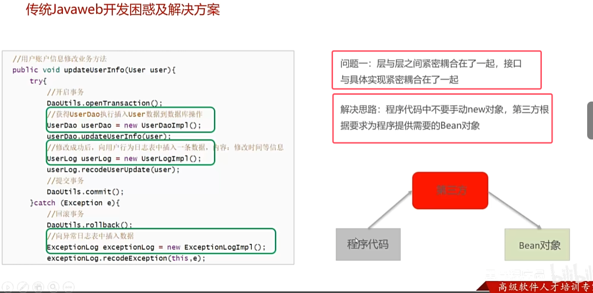
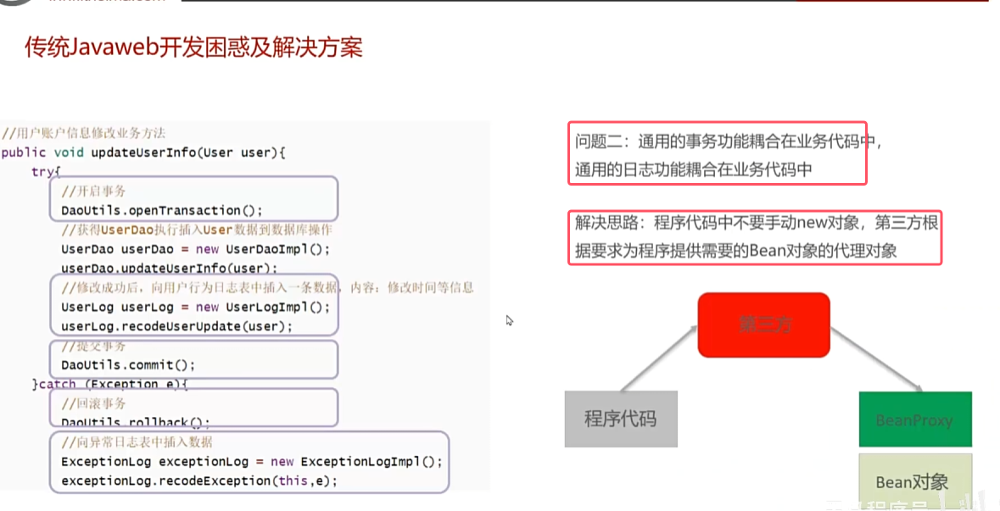
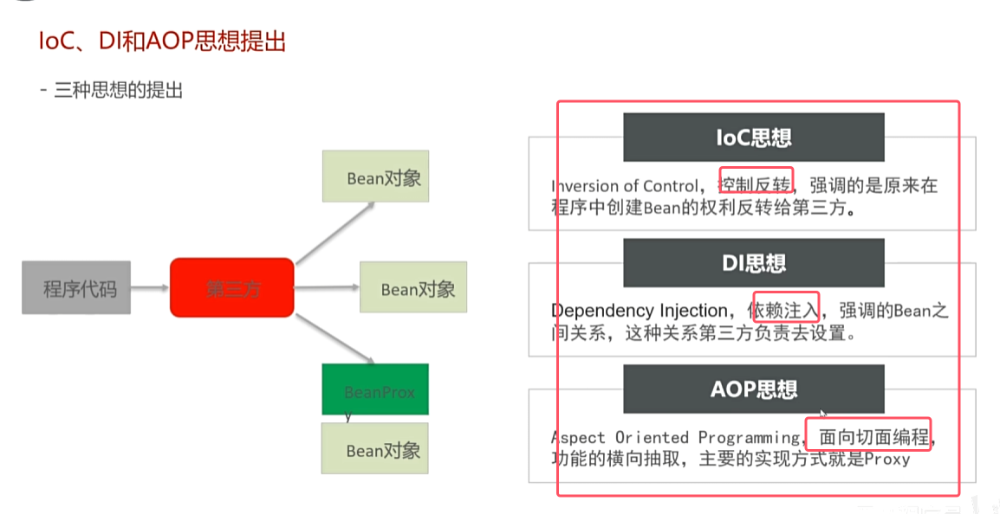
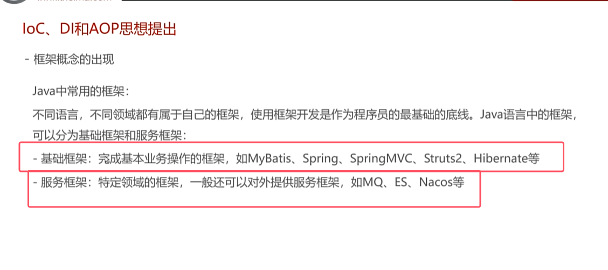

## 一、传统开发困惑及解决方案

## 二、三种思想的提出和框架的概念

* IOC控制反转思想 ：**创建对象的权利和维护对象之间关系的权利都交给第三方，也就是Spring框架**
* 依赖注入DI：是IOC控制反转的具体实现。**依赖指的是A对象和B对象的关系，而注入是一种手段，可以让A对象和B对象产生关系**
* **依赖注入包括两种方式，分别是set注入（底层执行set方法给属性赋值）和构造方法（底层执行构造方法给属性赋值）注入**
* AOP了解即可，后面会细讲
* **每一个被Spring容器所管理的Java对象都叫做Bean**

