### 1.程序书写
1. 首先引入mavevn坐标  
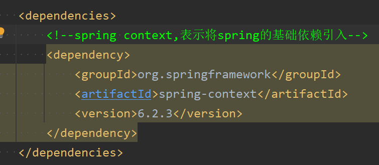

2. 创建实体类，并在xml配置文件中使用Bean标签来配置需要管理的对象  
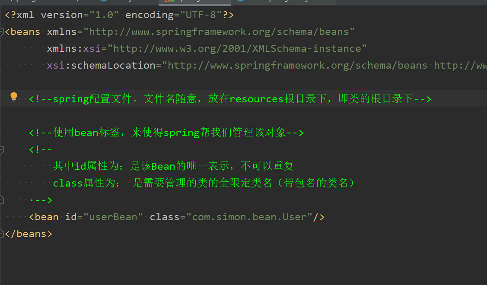
* bean标签中的有属性id和class：
	* **其中id属性为：是该Bean的唯一表示，不可以重复**  
	* **class属性为： 是需要管理的类的全限定类名（带包名的类名）**

2. 编写程序测试如下图所示，如图所示创建出来了对象。  
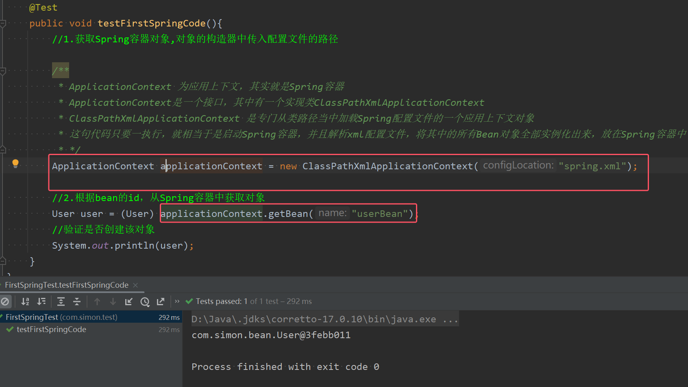
* **ApplicationContext 为应用上下文，其实就是Spring容器** 
* ApplicationContext是一个接口，其中有一个实现类ClassPathXmlApplicationContext  
* ClassPathXmlApplicationContext 是专门从类路径当中加载Spring配置文件的一个应用上下文对象  
* **第一句代码只要一执行，就相当于是启动Spring容器，并且解析xml配置文件，将其中的所有Bean对象全部实例化出来，放在Spring容器中**。而不是在getBean()时才创建。
* **通过`applicationContext.getBean(id)`根据配置文件张设置的id来获取Bean对象**

### 2.底层原理

1. **底层创建对象的原理——反射机制**  
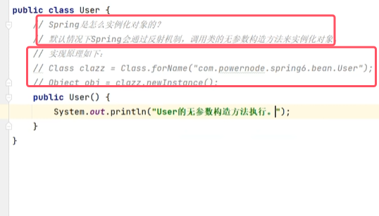
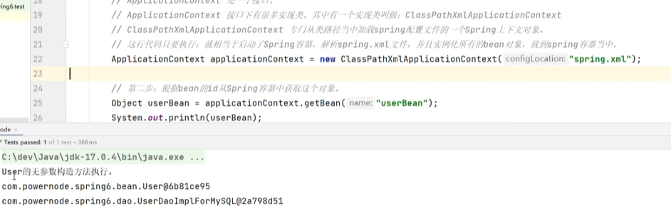
* **如果该类没有无参构造器或者无参构造器被覆盖，那么在创建Bean对象到容器中时执行就会报错。** 除非使用构造注入。

2. **Spring容器使用什么数据结构存放实例化好的Bean的？**  
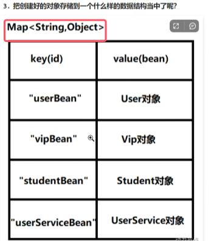
* **底层会将Bean对象存入一个map里面，key为配置文件中的id，value为创建的Bean对象**
* 使用getBean(id)相当于使用map的get(key)方法

3. **spring配置文件可以有多个，并且名字随意取**  
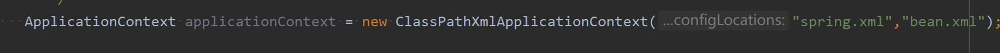
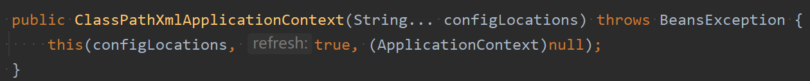
* 原因就是`ClassPathXmlApplicationContext`的构造方法可以接收可变长参数，也就是可以接收一个或多个配置文件，并对其中的bean对象进行实例化并存放在spring容器中

4. **配置文件中配置的类除了自定义的，也可以是JDK中的类，只要是有无参构造器的**  
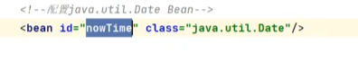
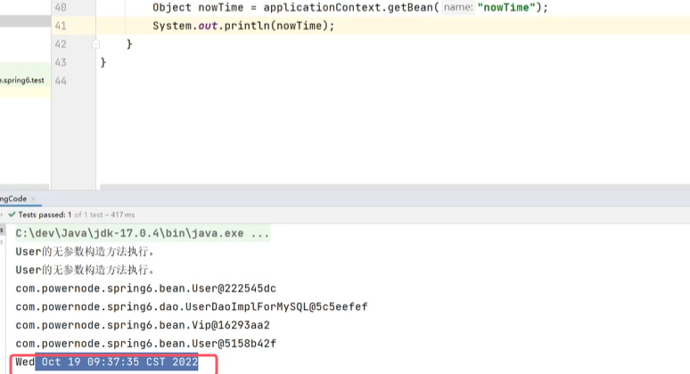

5. **如果getBean(id)方法的id不存在，那么会直接报错，而不是返回null**
6. **getBean(id)方法返回的是一个Object类的对象，使用原本类的方法需要向下转型，比较麻烦。如果不希望向下转型的话，可以使用以下代码**  
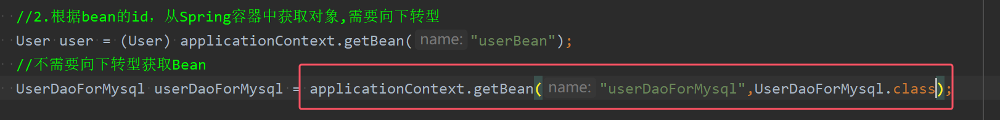
* 该方法通过第二个参数，来指定返回的数据类型

7. 如果配置文件不再类路径中，而是在磁盘某处，就不能使用`ClassPathXmlApplicationContext`，而是使用`FileSystemXmlApplicationContext`进行配置文件的解析。（很少用）
	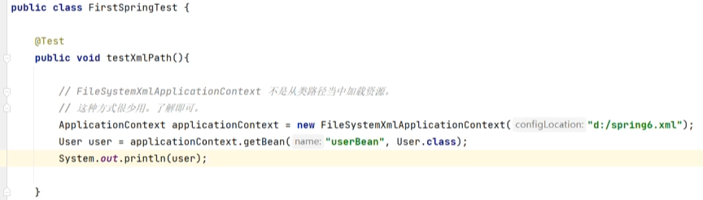

8. ApplicationContext接口的父接口为**BeanFactory，翻译为bean工厂，就是能够生产Bean对象的一个工厂对象**。  
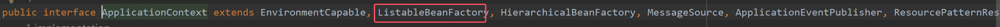
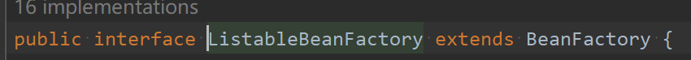
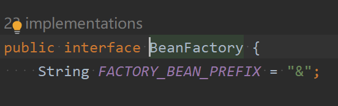
* **BeanFactory是IOC容器的顶级接口，spring的IOC容器底层实际上使用了工厂模式。也就是说Spring底层的IOC实现是通过：xml解析+工厂模式+反射机制**

	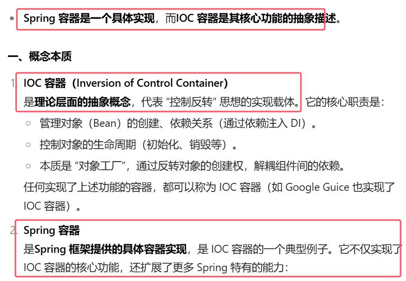

注：spring中的路径问题  
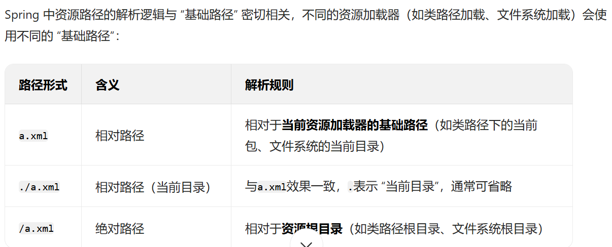
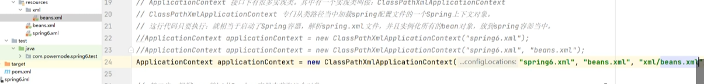
* 一般情况下都写绝对路径，即从类路径目录开始的路径，resource是根目录。
