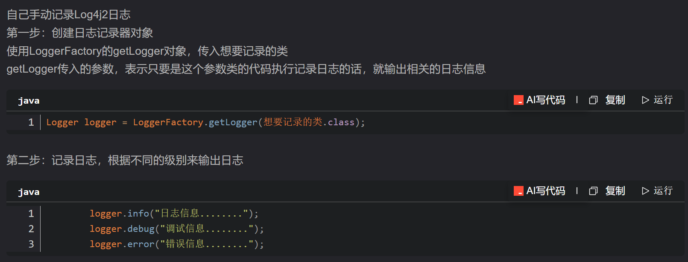

Spring底层用的日志框架就是Log4j2日志框架

[启用细节点击连接](https://blog.csdn.net/weixin_45832694/article/details/127621655?ops_request_misc=%257B%2522request%255Fid%2522%253A%2522514ccda2cb245b31f6e7c947bbaa2da9%2522%252C%2522scm%2522%253A%252220140713.130102334.pc%255Fall.%2522%257D&request_id=514ccda2cb245b31f6e7c947bbaa2da9&biz_id=0&utm_medium=distribute.pc_search_result.none-task-blog-2~all~first_rank_ecpm_v1~rank_v31_ecpm-1-127621655-null-null.142^v102^pc_search_result_base4&utm_term=spring%E5%90%AF%E7%94%A8log4%E5%B0%86&spm=1018.2226.3001.4187)

自己手动记录Log4j2日志的方法  

