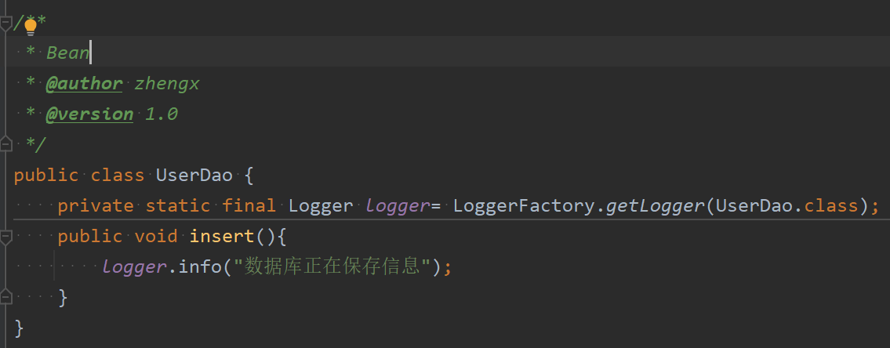

**set注入是基于set方法实现的，底层会通过反射机制调用对应的set方法然后给属性赋值，让两个对象之间产生关系。这种方式要求类中必须提供对应属性的set方法**

1. **set()方法如何被spring调用并给service层中的DAO对象进行赋值:**
	* **让Spring进行set注入，调用对应的set方法，需要配置property标签（意思是属性)**
	* ==**name属性用于指定调用的set方法。其写法为：set方法的方法名去掉‘set’后，剩下的单词首字母变小写之后的内容**，而不是该类的属性名==
    * ==**ref翻译为引用，即reference。该属性用于指定传入set方法的参数。也就是要注入的bean对象的id**==
* set()方法可以不按照javaBean规范起名，也可以实现set注入，但至少得是以set开头。**但是正常情况下使用都会符合该规范。**

测试程序如下图所示  

* 只获取了userService的对象，里面的属性userDao通过set注入完成了赋值。

