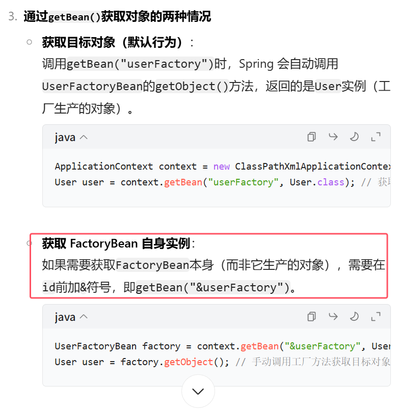
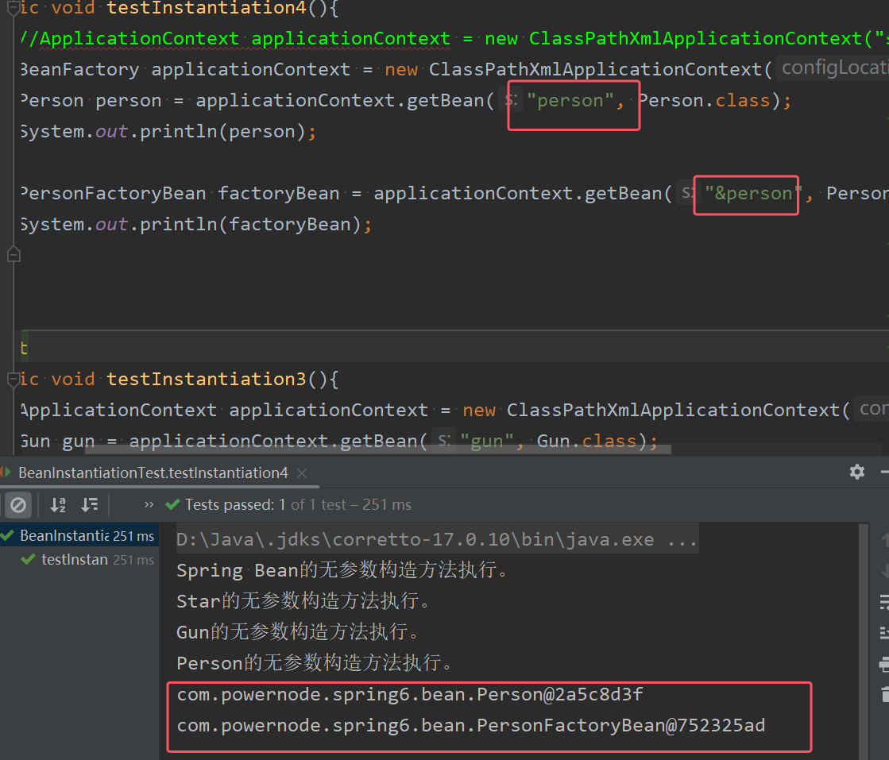

Spring为Bean提供了多种实例化方式，通常包括4种方式。（也就是说在Spring中为Bean对象的创建准备了多种方案，**目的是：更加灵活**）

1. **通过构造方法实例化(在spring配置文件中直接配置类全路径，默认调用Bean的无参构造方法)**
2. **通过简单工厂模式实例化**(**使用class属性指定工厂类的全限定类名，factory-method 属性指定的是工厂类当中获取Bean的静态方法**)
3. **通过factory-bean实例化**(**也就是通过工厂方法模式及进行实例化。不用写class属性，通过 factory-bean属性 + factory-method属性来共同完成。告诉Spring框架，调用哪个对象的哪个方法来获取Bean**)
4. **通过FactoryBean接口实例化**（**第三种方式的简化。实现FactoryBean接口之后，factory-bean会自动指向实现FactoryBean接口的类，factory-method会自动指向getObject()方法。写的时候不需要指定这两个属性，直接在class属性中填写该工厂Bean的全限定类名即可。实际上该Bean的id是指向一个实体类而不是工厂类）

* **说到底这四种都还是根据构造方法实例化的。不同的是，后面三种可以在创建普通Bean前后进行加工处理**


## 7.1 通过构造方法实例化
```xml
<?xml version="1.0" encoding="UTF-8"?>
<beans xmlns="http://www.springframework.org/schema/beans"
       xmlns:xsi="http://www.w3.org/2001/XMLSchema-instance"
       xsi:schemaLocation="http://www.springframework.org/schema/beans http://www.springframework.org/schema/beans/spring-beans.xsd">
	<!--Spring提供的实例化方式，第一种：在spring配置文件中直接配置类全路径，Spring会自动调用该类的无参数构造方法来实例化Bean-->
    <bean id="userBean" class="com.powernode.spring6.bean.User"/>

</beans>
```
* **我们之前一直使用的就是这种方式。在spring配置文件中直接配置类全路径，spring会调用Bean的无参数构造方法**。

## 7.2 通过简单工厂模式实例化
第一步：定义一个Bean
```java
package com.powernode.spring6.bean;

/**
 * @author 动力节点
 * @version 1.0
 * @className Vip
 * @since 1.0
 **/
public class Vip {
}

```
第二步：编写简单工厂模式当中的工厂类
```java
package com.powernode.spring6.bean;

/**
 * @author 动力节点
 * @version 1.0
 * @className VipFactory
 * @since 1.0
 **/
public class VipFactory {
	// 工厂类中有一个静态方法。  
	// 简单工厂模式又叫做：静态工厂方法模式。
    public static Vip get(){
	    // 这个Star对象最终实际上创建的时候还是我们负责new的对象
        return new Vip();
    }
}

```
第三步：在Spring配置文件中指定创建该Bean的方法（使用factory-method属性指定）
```xml
<bean id="vipBean" class="com.powernode.spring6.bean.VipFactory" factory-method="get"/>
```
第四步：编写测试程序
```java
@Test
public void testSimpleFactory(){
    ApplicationContext applicationContext = new ClassPathXmlApplicationContext("spring.xml");
    Vip vip = applicationContext.getBean("vipBean", Vip.class);
    System.out.println(vip);
}
```
执行结果：  


总结：需要在Spring配置文件中告诉Spring框架，调用哪个类的哪个方法获取Bean。**使用class属性指定工厂类的全限定类名，factory-method 属性指定的是工厂类当中的静态方法。也就是告诉Spring框架，调用这个方法可以获取Bean**

## 7.3 通过factory-bean实例化
这种方式本质上是：通过工厂方法模式进行实例化。

第一步：设置一个具体产品角色
```java
package com.powernode.spring6.bean;

/**工厂方法模式当中的：具体产品角色。
 * @author 动力节点
 * @version 1.0
 * @className Order
 * @since 1.0
 **/
public class Order {
}

```
第二步：定义具体工厂类，工厂类中定义实例方法
```java
package com.powernode.spring6.bean;

/**工厂方法模式当中的：具体工厂角色。
 * @author 动力节点
 * @version 1.0
 * @className OrderFactory
 * @since 1.0
 **/
public class OrderFactory {
    public Order get(){
        return new Order();
    }
}

```
第三步：在Spring配置文件中指定factory-bean以及factory-method
```xml
<bean id="orderFactory" class="com.powernode.spring6.bean.OrderFactory"/>
<bean id="orderBean" factory-bean="orderFactory" factory-method="get"/>
```
第四步：编写测试程序
```java
@Test
public void testSelfFactoryBean(){
    ApplicationContext applicationContext = new ClassPathXmlApplicationContext("spring.xml");
    Order orderBean = applicationContext.getBean("orderBean", Order.class);
    System.out.println(orderBean);
}
```
执行结果：  


总结：  
1. 通过factory-bean实例化，也就是通过工厂方法模式。通过 factory-bean属性 + factory-method属性来共同完。告诉Spring框架，调用哪个对象的哪个方法来获取Bean
2. **其中factory-bean属性指定具体工厂类Bean对象的id，factory-method属性指定该工厂类种获取该Bean的方法名**
## 7.4 通过FactoryBean接口实例化
以上的第三种方式中，factory-bean是我们自定义的，factory-method也是我们自己定义的。  
**在Spring中，当你编写的类直接实现FactoryBean接口之后，factory-bean不需要指定了，factory-method也不需要指定了。factory-bean会自动指向实现FactoryBean接口的类，factory-method会自动指向getObject()方法。**

第一步：定义一个Bean
```java
package com.powernode.spring6.bean;

/**
 * @author 动力节点
 * @version 1.0
 * @className Person
 * @since 1.0
 **/
public class Person {
}

```
第二步：编写一个类实现FactoryBean接口
```java
package com.powernode.spring6.bean;

import org.springframework.beans.factory.FactoryBean;

/**
 * @author 动力节点
 * @version 1.0
 * @className PersonFactoryBean
 * @since 1.0
 **/
public class PersonFactoryBean implements FactoryBean<Person> {

    @Override
    public Person getObject() throws Exception {
        return new Person();
    }

    @Override
    public Class<?> getObjectType() {
	    //不用管这个方法
        return null;
    }

    @Override
    public boolean isSingleton() {
	    //这个方法在接口中有默认实现。默认返回true
        // true表示单例
        // false表示原型
        return true;
    }
}

```
第三步：在Spring配置文件中配置FactoryBean
```xml
<bean id="personBean" class="com.powernode.spring6.bean.PersonFactoryBean"/>
```
测试程序：
```java
@Test
public void testFactoryBean(){
    ApplicationContext applicationContext = new ClassPathXmlApplicationContext("spring.xml");
    Person personBean = applicationContext.getBean("personBean", Person.class);
    System.out.println(personBean);

    Person personBean2 = applicationContext.getBean("personBean", Person.class);
    System.out.println(personBean2);
}
```
执行结果：     


* 第三种方式中的OrderFactory实际上就是一个factoryBean
* **FactoryBean在Spring中是一个接口,也是一个Bean。只不过这个Bean比较特殊。,做工厂Bean。“工厂Bean”是一种特殊的Bean。所有的“工厂Bean”都是用来协助Spring框架来创建其他Bean对象的，通过工厂Bean这个特殊的Bean可以获取一个普通的Bean。


注：要是想获取factoryBean本身，可以采用以下形式


