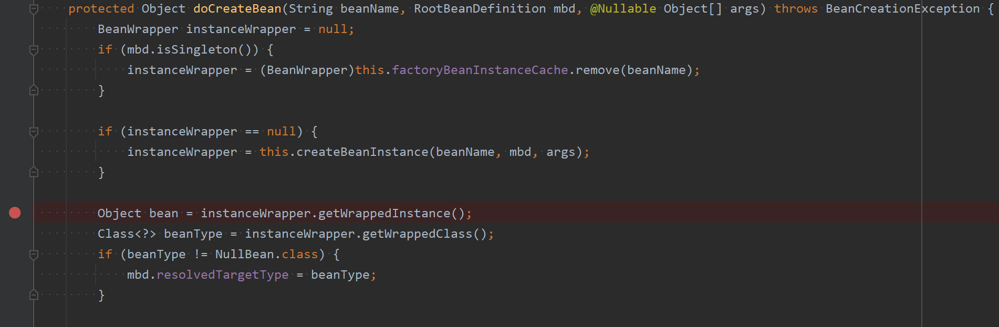
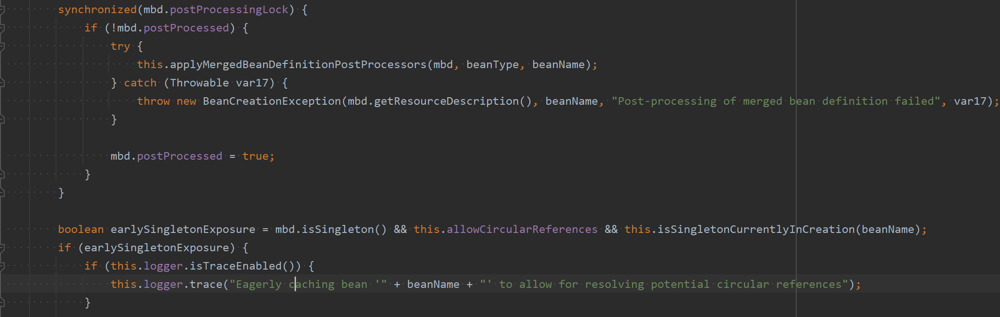
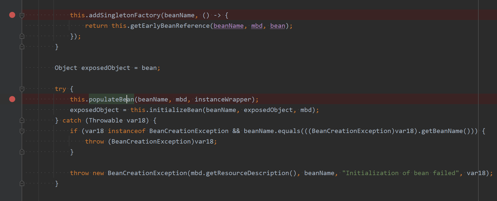
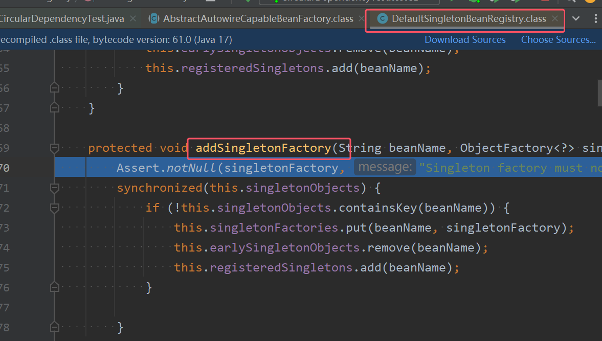

## 一、什么是Bean的循环依赖
A**对象中有B属性。B对象中有A属性。这就是循环依赖**。我依赖你，你也依赖我。

比如：丈夫类Husband，妻子类Wife。Husband中有Wife的引用。Wife中有Husband的引用。   

```java
package com.powernode.spring6.bean;

/**
 * @author 动力节点
 * @version 1.0
 * @className Husband
 * @since 1.0
 **/
public class Husband {
    private String name;
    private Wife wife;
}

```
```java
package com.powernode.spring6.bean;

/**
 * @author 动力节点
 * @version 1.0
 * @className Wife
 * @since 1.0
 **/
public class Wife {
    private String name;
    private Husband husband;
}

```

## 二、 singleton下的set注入产生的循环依赖
我们来编写程序，测试一下在singleton+setter的模式下产生的循环依赖，Spring是否能够解决？
```java
package com.powernode.spring6.bean;

/**
 * @author 动力节点
 * @version 1.0
 * @className Husband
 * @since 1.0
 **/
public class Husband {
    private String name;
    private Wife wife;

    public void setName(String name) {
        this.name = name;
    }

    public String getName() {
        return name;
    }

    public void setWife(Wife wife) {
        this.wife = wife;
    }

    // toString()方法重写时需要注意：不能直接输出wife，输出wife.getName()。要不然会出现递归导致的栈内存溢出错误。
    @Override
    public String toString() {
        return "Husband{" +
                "name='" + name + '\'' +
                ", wife=" + wife.getName() +
                '}';
    }
}
```

```java
package com.powernode.spring6.bean;

/**
 * @author 动力节点
 * @version 1.0
 * @className Wife
 * @since 1.0
 **/
public class Wife {
    private String name;
    private Husband husband;

    public void setName(String name) {
        this.name = name;
    }

    public String getName() {
        return name;
    }

    public void setHusband(Husband husband) {
        this.husband = husband;
    }

    // toString()方法重写时需要注意：不能直接输出husband，输出husband.getName()。要不然会出现递归导致的栈内存溢出错误。
    @Override
    public String toString() {
        return "Wife{" +
                "name='" + name + '\'' +
                ", husband=" + husband.getName() +
                '}';
    }
}
```

```xml
<?xml version="1.0" encoding="UTF-8"?>
<beans xmlns="http://www.springframework.org/schema/beans"
       xmlns:xsi="http://www.w3.org/2001/XMLSchema-instance"
       xsi:schemaLocation="http://www.springframework.org/schema/beans http://www.springframework.org/schema/beans/spring-beans.xsd">
	<!--singleton + setter模式注入-->
    <bean id="husbandBean" class="com.powernode.spring6.bean.Husband" scope="singleton">
        <property name="name" value="张三"/>
        <property name="wife" ref="wifeBean"/>
    </bean>
    <bean id="wifeBean" class="com.powernode.spring6.bean.Wife" scope="singleton">
        <property name="name" value="小花"/>
        <property name="husband" ref="husbandBean"/>
    </bean>
</beans>
```

```java
package com.powernode.spring6.test;

import com.powernode.spring6.bean.Husband;
import com.powernode.spring6.bean.Wife;
import org.junit.Test;
import org.springframework.context.ApplicationContext;
import org.springframework.context.support.ClassPathXmlApplicationContext;

/**
 * @author 动力节点
 * @version 1.0
 * @className CircularDependencyTest
 * @since 1.0
 **/
public class CircularDependencyTest {

    @Test
    public void testSingletonAndSet(){
        ApplicationContext applicationContext = new ClassPathXmlApplicationContext("spring.xml");
        Husband husbandBean = applicationContext.getBean("husbandBean", Husband.class);
        Wife wifeBean = applicationContext.getBean("wifeBean", Wife.class);
        System.out.println(husbandBean);
        System.out.println(wifeBean);
    }
}

```
执行结果：  

**通过测试得知：在singleton + set注入的情况下，循环依赖是没有问题的。Spring可以解决这个问题。**

在singleton + setter模式下，为什么循环依赖不会出现问题，Spring是如何应对的？   
* **主要的原因是：在这种模式下Spring对Bean的管理主要分为清晰的两个阶段**：  
	1. 在**Spring容器加载的时候，实例化Bean，只要其中任意一个Bean实例化之后，马上进行 “曝光”【不等属性赋值就曝光】**  
	2. **Bean“曝光”之后，再进行属性的赋值(调用set方法)**。
* **曝光的意思是当Bean 完成实例化（内存分配、构造器执行）但尚未完成属性注入和初始化时，就将其提前暴露到缓存中。这样，当其他 Bean 依赖它时，可以直接从缓存中获取这个 “半成品” Bean，而无需等待它完全初始化**
* **总结来说核心解决方案是：实例化对象和对象的属性赋值分为两个阶段来完成的**。  
* **注意：只有在scope是singleton的情况下，Bean才会采取提前“曝光”的措施**。

## 三、prototype下的set注入产生的循环依赖
我们再来测试一下：prototype+set注入的方式下，循环依赖会不会出现问题？
```xml
<?xml version="1.0" encoding="UTF-8"?>
<beans xmlns="http://www.springframework.org/schema/beans"
       xmlns:xsi="http://www.w3.org/2001/XMLSchema-instance"
       xsi:schemaLocation="http://www.springframework.org/schema/beans http://www.springframework.org/schema/beans/spring-beans.xsd">

    <bean id="husbandBean" class="com.powernode.spring6.bean.Husband" scope="prototype">
        <property name="name" value="张三"/>
        <property name="wife" ref="wifeBean"/>
    </bean>
    <bean id="wifeBean" class="com.powernode.spring6.bean.Wife" scope="prototype">
        <property name="name" value="小花"/>
        <property name="husband" ref="husbandBean"/>
    </bean>
</beans>
```
执行测试程序：发生了异常，异常信息如下：  
Caused by: org.springframework.beans.factory.**BeanCurrentlyInCreationException**: Error creating bean with name 'husbandBean': Requested bean is currently in creation: Is there an unresolvable circular reference?
	
翻译为：**BeanCurrentlyInCreationException 当前的Bean正在处于创建中异常**。创建名为“husbandBean”的bean时出错：请求的bean当前正在创建中：是否存在无法解析的循环引用？

通过测试得知，当循环依赖的**所有Bean**的scope="prototype"的时候，产生的循环依赖，Spring是无法解决的，会出现**BeanCurrentlyInCreationException**异常。  
大家可以测试一下，以上两个Bean，如果其中一个是singleton，另一个是prototype，是没有问题的。

为什么两个Bean都是prototype时会出错呢？如图所示的原因


* **注意：当两个bean的scope都是prototype的时候，才会出现异常。如果其中任意一个是singleton的，就不会出现异常。**

## 四、singleton下的构造注入产生的循环依赖
我们再来测试一下singleton + 构造注入的方式下，spring是否能够解决这种循环依赖。
```java
package com.powernode.spring6.bean2;

/**
 * @author 动力节点
 * @version 1.0
 * @className Husband
 * @since 1.0
 **/
public class Husband {
    private String name;
    private Wife wife;

    public Husband(String name, Wife wife) {
        this.name = name;
        this.wife = wife;
    }

    // -----------------------分割线--------------------------------
    public String getName() {
        return name;
    }

    @Override
    public String toString() {
        return "Husband{" +
                "name='" + name + '\'' +
                ", wife=" + wife +
                '}';
    }
}

```

```java
package com.powernode.spring6.bean2;

/**
 * @author 动力节点
 * @version 1.0
 * @className Wife
 * @since 1.0
 **/
public class Wife {
    private String name;
    private Husband husband;

    public Wife(String name, Husband husband) {
        this.name = name;
        this.husband = husband;
    }

    // -------------------------分割线--------------------------------
    public String getName() {
        return name;
    }

    @Override
    public String toString() {
        return "Wife{" +
                "name='" + name + '\'' +
                ", husband=" + husband +
                '}';
    }
}
```

```xml
<?xml version="1.0" encoding="UTF-8"?>
<beans xmlns="http://www.springframework.org/schema/beans"
       xmlns:xsi="http://www.w3.org/2001/XMLSchema-instance"
       xsi:schemaLocation="http://www.springframework.org/schema/beans http://www.springframework.org/schema/beans/spring-beans.xsd">

    <bean id="hBean" class="com.powernode.spring6.bean2.Husband" scope="singleton">
        <constructor-arg name="name" value="张三"/>
        <constructor-arg name="wife" ref="wBean"/>
    </bean>

    <bean id="wBean" class="com.powernode.spring6.bean2.Wife" scope="singleton">
        <constructor-arg name="name" value="小花"/>
        <constructor-arg name="husband" ref="hBean"/>
    </bean>
</beans>
```

```java
@Test
public void testSingletonAndConstructor(){
    ApplicationContext applicationContext = new ClassPathXmlApplicationContext("spring2.xml");
    Husband hBean = applicationContext.getBean("hBean", Husband.class);
    Wife wBean = applicationContext.getBean("wBean", Wife.class);
    System.out.println(hBean);
    System.out.println(wBean);
}
```
执行结果：发生了异常，信息如下：
Caused by: org.springframework.beans.factory.**BeanCurrentlyInCreationException**: Error creating bean with name 'hBean': Requested bean is currently in creation: Is there an unresolvable circular reference?

总结：
* **基于构造注入的方式下产生的循环依赖也是无法解决的，所以编写代码时一定要注意。**
* **主要原因是因为通过构造方法注入导致的：因为构造方法注入会导致实例化对象的过程和对象属性赋值的过程没有分离开，必须在一起完成导致的。**


## 9.5 Spring解决循环依赖的机理
Spring为什么可以解决set + singleton模式下循环依赖？
* **根本的原因在于：这种方式可以做到将“实例化Bean”和“给Bean属性赋值”这两个动作分开去完成。实例化Bean的时候：调用无参数构造方法来完成。此时可以先不给属性赋值，可以提前将该Bean对象“曝光”给外界。给Bean属性赋值的时候：才调用setter方法来完成。**

两个步骤是完全可以分离开去完成的，并且这两步不要求在同一个时间点上完成 。

也就是说，**Bean都是单例的，我们可以先把所有的单例Bean实例化出来，放到一个集合当中（我们可以称之为缓存），所有的单例Bean全部实例化完成之后，以后我们再慢慢的调用setter方法给属性赋值。这样就解决了循环依赖的问题。**

那么在Spring框架底层源码级别上是如何实现的呢？整个Bean生命周期的管理，可以参考Spring的源码：AbstractAutowireCapableBeanFactory类的doCreateBean()方法。 




* 如图所示三个断点分别为创建Bean、曝光bean和给Bean属性赋值。

进入到第二个断点即曝光Bean的代码如下图所示  


该类中有几个属性如下图所示    

在以上类中包含三个重要的属性：
* **Cache of singleton objects: bean name to bean instance。意思为存储的是完整的单例Bean对象，也就是说这个缓存中的Bean对象的属性都已经赋值了。是一个完整的Bean对象。key存储bean名称(Bean的id)，value存储Bean对象【一级缓存——singletonObjects】**
* **Cache of early singleton objects: bean name to bean instance. 意思为存储的是早期的单例Bean对象。这个缓存中的单例Bean对象的属性没有赋值。只是一个早期的实例对象。key存储bean名称(Bean的id)，value存储早期的Bean对象【二级缓存——earlySingletonObjects】**
 * **Cache of singleton factories: bean name to ObjectFactory. 意思为存储的是单例工厂对象。这个里面存储了大量的“工厂对象”，每一个单例Bean对象都会对应一个单例工厂对象。这个集合中存储的是，创建该单例对象时对应的那个单例工厂对象单例工厂缓存，即key存储bean名称(Bean的id)，value存储该Bean对应的ObjectFactory对象【三级缓存——singletonFactories】**

这三个缓存其实本质上是三个Map集合。

我们再来回到刚刚进入的方法**addSingletonFactory()，这个方法的作用是：将创建Bean对象的ObjectFactory对象提前曝光，即将单例工厂对象插入到三级缓存singletonFactories中**。    


再分析下面的源码：


* 从源码中可以看到，spring会先从一级缓存中获取Bean，如果获取不到，则从二级缓存中获取Bean，如果二级缓存还是获取不到，则从三级缓存中获取之前曝光的ObjectFactory对象，通过ObjectFactory对象获取Bean实例，这样就解决了循环依赖的问题。

**总结：**  
**Spring只能解决setter方法注入的单例bean之间的循环依赖。ClassA依赖ClassB，ClassB又依赖ClassA，形成依赖闭环。Spring在创建ClassA对象后，不需要等给属性赋值，直接将其曝光到bean缓存当中。在解析ClassA的属性时，又发现依赖于ClassB，再次去获取ClassB，当解析ClassB的属性时，又发现需要ClassA的属性，但此时的ClassA已经被提前曝光加入了正在创建的bean的缓存中，则无需创建新的的ClassA的实例，直接从缓存中获取即可。从而解决循环依赖问题。**