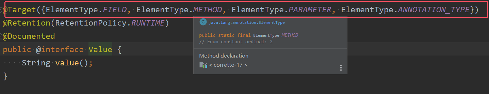

## 一、负责注入的注解
@Component @Controller @Service @Repository 这四个注解是用来声明Bean的，声明后这些Bean将被实例化。接下来我们看一下，如何给Bean的属性赋值。**给Bean属性赋值**需要用到这些注解：

- **@Value：注入简单类型**
- **@Autowired：注入非简单类型，单独使用@Autowired注解，默认根据类型装配**
- **@Qualifier：想要根据名字进行装配，将该注解配合与@Qualifier一起使用**
- **@Resource：默认根据名称装配byName，通过name属性来指定Bean的名称。未指定name时，使用属性名作为name。通过name找不到的话会自动启动通过类型byType装配。**
### 1.@Value
@Value注解的源代码如下图所示  


当属性的类型是简单类型时，可以使用@Value注解进行注入。
```java
package com.powernode.spring6.bean4;

import org.springframework.beans.factory.annotation.Value;
import org.springframework.stereotype.Component;

@Component
public class User {
    @Value(value = "zhangsan")
    private String name;
    @Value("20")
    private int age;

    @Override
    public String toString() {
        return "User{" +
                "name='" + name + '\'' +
                ", age=" + age +
                '}';
    }
}

```
开启包扫描：
```xml
<?xml version="1.0" encoding="UTF-8"?>
<beans xmlns="http://www.springframework.org/schema/beans"
       xmlns:xsi="http://www.w3.org/2001/XMLSchema-instance"
       xmlns:context="http://www.springframework.org/schema/context"
       xsi:schemaLocation="http://www.springframework.org/schema/beans http://www.springframework.org/schema/beans/spring-beans.xsd
                           http://www.springframework.org/schema/context http://www.springframework.org/schema/context/spring-context.xsd">
    <context:component-scan base-package="com.powernode.spring6.bean4"/>
</beans>
```
```java
@Test
public void testValue(){
    ApplicationContext applicationContext = new ClassPathXmlApplicationContext("spring-injection.xml");
    Object user = applicationContext.getBean("user");
    System.out.println(user);
}
```
执行结果：  


通过以上代码可以发现，我们并没有给属性提供setter方法，但仍然可以完成属性赋值。

如果提供setter方法，并且在setter方法上添加@Value注解，可以完成注入吗？尝试一下：
```java
package com.powernode.spring6.bean4;

import org.springframework.beans.factory.annotation.Value;
import org.springframework.stereotype.Component;

@Component
public class User {
    
    private String name;

    private int age;

    @Value("李四")
    public void setName(String name) {
        this.name = name;
    }

    @Value("30")
    public void setAge(int age) {
        this.age = age;
    }

    @Override
    public String toString() {
        return "User{" +
                "name='" + name + '\'' +
                ", age=" + age +
                '}';
    }
}

```
执行结果：  


通过测试可以得知，@Value注解可以直接使用在属性上，也可以使用在setter方法上。都是可以的。都可以完成属性的赋值。
**为了简化代码，以后我们一般不提供setter方法，直接在属性上使用@Value注解完成属性赋值**。
出于好奇，我们再来测试一下，是否能够通过构造方法完成注入：
```java
package com.powernode.spring6.bean4;

import org.springframework.beans.factory.annotation.Value;
import org.springframework.stereotype.Component;

@Component
public class User {

    private String name;

    private int age;

    public User(@Value("隔壁老王") String name, @Value("33") int age) {
        this.name = name;
        this.age = age;
    }

    @Override
    public String toString() {
        return "User{" +
                "name='" + name + '\'' +
                ", age=" + age +
                '}';
    }
}

```
执行结果：  


总结：
* **使用@Value的前提是：先去声明Bean，把Bean交给spring去管理**
* **使用@Value注解加在属性、加在setter和构造方法的参数上，并没有给属性提供setter方法，仍然可以完成属性赋值。**


### 2.@Autowired与@Qualifier
* **@Autowired注解可以用来注入非简单类型**。被翻译为：自动连线的，或者自动装配。
 * **单独使用@Autowired注解，默认根据类型装配**。【默认是byType】
 * **如果想要根据名字进行装配，就需要将@Autowired与@Qualifier一起使用**

看一下它的源码：
```java
package org.springframework.beans.factory.annotation;

import java.lang.annotation.Documented;
import java.lang.annotation.ElementType;
import java.lang.annotation.Retention;
import java.lang.annotation.RetentionPolicy;
import java.lang.annotation.Target;

//可以出现在构造方法、方法、参数、属性和别的注解之上
@Target({ElementType.CONSTRUCTOR, ElementType.METHOD, ElementType.PARAMETER, ElementType.FIELD, ElementType.ANNOTATION_TYPE})
@Retention(RetentionPolicy.RUNTIME)
@Documented
public @interface Autowired {
	boolean required() default true;
}
```
源码中有两处需要注意：  
- **第一处：该注解可以标注在：构造方法上、方法上、形参上、属性上和注解上**
- **第二处：该注解有一个required属性，默认值是true，表示在注入的时候要求被注入的Bean必须是存在的，如果不存在则报错。如果required属性设置为false，表示注入的Bean存在或者不存在都没关系，存在的话就注入，不存在的话，也不报错。**

我们先在属性上使用@Autowired注解：
```java
package com.powernode.spring6.dao;

public interface UserDao {
    void insert();
}
```

```java
package com.powernode.spring6.dao;

import org.springframework.stereotype.Repository;

@Repository //纳入bean管理
public class UserDaoForMySQL implements UserDao{
    @Override
    public void insert() {
        System.out.println("正在向mysql数据库插入User数据");
    }
}
```

```java
package com.powernode.spring6.service;

import com.powernode.spring6.dao.UserDao;
import org.springframework.beans.factory.annotation.Autowired;
import org.springframework.stereotype.Service;

@Service // 纳入bean管理
public class UserService {

    @Autowired // 在属性上注入
    private UserDao userDao;
    
    // 没有提供构造方法和setter方法。
    public void save(){
        userDao.insert();
    }
}
```

```xml
<?xml version="1.0" encoding="UTF-8"?>
<beans xmlns="http://www.springframework.org/schema/beans"
       xmlns:xsi="http://www.w3.org/2001/XMLSchema-instance"
       xmlns:context="http://www.springframework.org/schema/context"
       xsi:schemaLocation="http://www.springframework.org/schema/beans http://www.springframework.org/schema/beans/spring-beans.xsd
                           http://www.springframework.org/schema/context http://www.springframework.org/schema/context/spring-context.xsd">
    <context:component-scan base-package="com.powernode.spring6.dao,com.powernode.spring6.service"/>
</beans>
```
```java
@Test
public void testAutowired(){
    ApplicationContext applicationContext = new ClassPathXmlApplicationContext("spring-injection.xml");
    UserService userService = applicationContext.getBean("userService", UserService.class);
    userService.save();
}
```
执行结果：    


以上构造方法和setter方法都没有提供，经过测试，仍然可以注入成功。

接下来，再来测试一下@Autowired注解出现在setter方法上：
```java
package com.powernode.spring6.service;

import com.powernode.spring6.dao.UserDao;
import org.springframework.beans.factory.annotation.Autowired;
import org.springframework.stereotype.Service;

@Service
public class UserService {

    private UserDao userDao;

    @Autowired
    public void setUserDao(UserDao userDao) {
        this.userDao = userDao;
    }

    public void save(){
        userDao.insert();
    }
}

```
执行结果：  


我们再来看看能不能出现在构造方法上：
```java
package com.powernode.spring6.service;

import com.powernode.spring6.dao.UserDao;
import org.springframework.beans.factory.annotation.Autowired;
import org.springframework.stereotype.Service;

@Service
public class UserService {

    private UserDao userDao;

    @Autowired
    public UserService(UserDao userDao) {
        this.userDao = userDao;
    }

    public void save(){
        userDao.insert();
    }
}

```
执行结果：  


再来看看，这个注解能不能只标注在构造方法的形参上：
```java
package com.powernode.spring6.service;

import com.powernode.spring6.dao.UserDao;
import org.springframework.beans.factory.annotation.Autowired;
import org.springframework.stereotype.Service;

@Service
public class UserService {

    private UserDao userDao;

    public UserService(@Autowired UserDao userDao) {
        this.userDao = userDao;
    }

    public void save(){
        userDao.insert();
    }
}

```
执行结果：  


**还有更劲爆的，当有参数的构造方法只有一个时，@Autowired注解可以省略。但为了程序的可读性，一般不这么做**
```java
package com.powernode.spring6.service;

import com.powernode.spring6.dao.UserDao;
import org.springframework.stereotype.Service;

@Service
public class UserService {

    private UserDao userDao;

    public UserService(UserDao userDao) {
        this.userDao = userDao;
    }

    public void save(){
        userDao.insert();
    }
}

```
执行结果：    


**当然，如果有多个构造方法，@Autowired肯定是不能省略的。**
```java
package com.powernode.spring6.service;

import com.powernode.spring6.dao.UserDao;
import org.springframework.stereotype.Service;

@Service
public class UserService {

    private UserDao userDao;

    public UserService(UserDao userDao) {
        this.userDao = userDao;
    }
    
    public UserService(){
        
    }

    public void save(){
        userDao.insert();
    }
}

```
执行结果：  

到此为止，我们已经清楚@Autowired注解可以出现在哪些位置了。

@Autowired注解默认是byType进行注入的，也就是说根据类型注入的，如果以上程序中，UserDao接口还有另外一个实现类，会出现问题吗？
```java
package com.powernode.spring6.dao;

import org.springframework.stereotype.Repository;

@Repository //纳入bean管理
public class UserDaoForOracle implements UserDao{
    @Override
    public void insert() {
        System.out.println("正在向Oracle数据库插入User数据");
    }
}

```
当你写完这个新的实现类之后，此时IDEA工具已经提示错误信息了：  

错误信息中说：不能装配，UserDao这个Bean的数量大于1.

怎么解决这个问题呢？**当然要byName，根据名称进行装配了。@Autowired注解和@Qualifier注解联合起来才可以根据名称进行装配，在@Qualifier注解中指定自动装配的Bean名称。**
```java
package com.powernode.spring6.dao;

import org.springframework.stereotype.Repository;

@Repository // 这里没有给bean起名，默认名字是：userDaoForOracle
public class UserDaoForOracle implements UserDao{
    @Override
    public void insert() {
        System.out.println("正在向Oracle数据库插入User数据");
    }
}

```
```java
package com.powernode.spring6.service;

import com.powernode.spring6.dao.UserDao;
import org.springframework.beans.factory.annotation.Autowired;
import org.springframework.beans.factory.annotation.Qualifier;
import org.springframework.stereotype.Service;

@Service
public class UserService {

    private UserDao userDao;

    @Autowired
    @Qualifier("userDaoForOracle") // 这个是bean的名字。
    public void setUserDao(UserDao userDao) {
        this.userDao = userDao;
    }

    public void save(){
        userDao.insert();
    }
}
```
执行结果：    

总结：  
* **@Autowired可以标注在：构造方法上、方法上、形参上、属性上和注解上**
* - 当带参数的构造方法只有一个，@Autowired注解可以省略。
* **使用@Autowired时，如果是写在属性上，那么被注入的Bean和Bean本身都要声明，不需要指定任何属性，直接使用即可。并且构造方法和setter方法都没有提供，经过测试，仍然可以注入成功**
* **单独使用@Autowired注解，默认根据类型装配。【默认是byType】。如果想要根据名字进行装配，就需要将@Autowired与@Qualifier一起使用**
- **如果dao层一个接口他的实现类有多个，并且在service层中的属性的编译类型是接口类型，那么此时必须要根据名称进行装配。因为框架不知道需要将哪一个类型的实例装配给该属性**
- **@Autowired注解和@Qualifier注解联合起来才可以根据名称进行装配，@Autowired写在@Qualifier上方，在@Qualifier注解中指定自动装配的Bean名称，默认情况下是类名首字母小写**

==**如果把value属性彻底去掉，spring会被Bean自动取名吗？会的。并且默认名字的规律是：Bean类名首字母小写即可。**==
### 3. @Resource
**@Resource注解也可以完成非简单类型注入**。那它和@Autowired注解有什么区别？

- **@Resource注解是JDK扩展包中的，也就是说属于JDK的一部分。所以该注解是标准注解**，更加具有通用性。(**@Resource注解是官方建议使用该注解，并且要比@Autowired使用频率高一些**)
- **@Autowired注解是Spring框架自己的**。
- ==**@Resource注解默认根据名称装配byName，通过name属性来指定Bean的名称。未指定name时，使用属性名作为name。通过name找不到的话会自动启动通过类型byType装配。**==
- **@Autowired注解默认根据类型装配byType，如果想根据名称装配，需要配合@Qualifier注解一起用。**
- **@Resource注解用在属性上、setter方法上，不能出现在构造方法上**。
- @Autowired注解用在属性上、setter方法上、构造方法上、构造方法参数上。

@Resource注解属于JDK扩展包，所以不在JDK当中，需要额外引入以下依赖：【**如果是JDK8的话不需要额外引入依赖。高于JDK11或低于JDK8需要引入以下依赖。**】
```xml
<dependency>
  <groupId>jakarta.annotation</groupId>
  <artifactId>jakarta.annotation-api</artifactId>
  <version>2.1.1</version>
</dependency>
```
一定要注意：**如果你用Spring6，要知道Spring6不再支持JavaEE，它支持的是JakartaEE9。（Oracle把JavaEE贡献给Apache了，Apache把JavaEE的名字改成JakartaEE了，大家之前所接触的所有的  javax.\*  包名统一修改为  jakarta.*包名了。）**
```xml
<dependency>
  <groupId>javax.annotation</groupId>
  <artifactId>javax.annotation-api</artifactId>
  <version>1.3.2</version>
</dependency>
```

@Resource注解的源码如下：   

测试一下：
```java
package com.powernode.spring6.dao;

import org.springframework.stereotype.Repository;

@Repository("xyz")
public class UserDaoForOracle implements UserDao{
    @Override
    public void insert() {
        System.out.println("正在向Oracle数据库插入User数据");
    }
}
```

```java
package com.powernode.spring6.service;

import com.powernode.spring6.dao.UserDao;
import jakarta.annotation.Resource;
import org.springframework.stereotype.Service;

@Service
public class UserService {

    @Resource(name = "xyz")
    private UserDao userDao;

    public void save(){
        userDao.insert();
    }
}
```
执行测试程序：  


**我们把UserDaoForOracle的名字xyz修改为userDao，让这个Bean的名字和UserService类中的UserDao属性名一致：**
```java
package com.powernode.spring6.dao;

import org.springframework.stereotype.Repository;

@Repository("userDao")
public class UserDaoForOracle implements UserDao{
    @Override
    public void insert() {
        System.out.println("正在向Oracle数据库插入User数据");
    }
}
```

```java
package com.powernode.spring6.service;

import com.powernode.spring6.dao.UserDao;
import jakarta.annotation.Resource;
import org.springframework.stereotype.Service;

@Service
public class UserService {

    @Resource
    private UserDao userDao;

    public void save(){
        userDao.insert();
    }
}

```
执行测试程序：  

通过测试得知，**当@Resource注解使用时没有指定name的时候，还是根据name进行查找，这个name是属性名。**

接下来把UserService类中的属性名修改一下：
```java
package com.powernode.spring6.service;

import com.powernode.spring6.dao.UserDao;
import jakarta.annotation.Resource;
import org.springframework.stereotype.Service;

@Service
public class UserService {

    @Resource
    private UserDao userDao2;

    public void save(){
        userDao2.insert();
    }
}

```
执行结果：  

* 根据异常信息得知：显然当通过name找不到的时候，自然会启动byType进行注入。以上的错误是因为UserDao接口下有两个实现类导致的。所以根据类型注入就会报错。

我们再来看@Resource注解使用在setter方法上可以吗？
```java
package com.powernode.spring6.service;

import com.powernode.spring6.dao.UserDao;
import jakarta.annotation.Resource;
import org.springframework.stereotype.Service;

@Service
public class UserService {

    private UserDao userDao;

    @Resource
    public void setUserDao(UserDao userDao) {
        this.userDao = userDao;
    }

    public void save(){
        userDao.insert();
    }
}

```
注意这个setter方法的方法名，setUserDao去掉set之后，将首字母变小写userDao，userDao就是name

执行结果：  


当然，也可以指定name：
```java
package com.powernode.spring6.service;

import com.powernode.spring6.dao.UserDao;
import jakarta.annotation.Resource;
import org.springframework.stereotype.Service;

@Service
public class UserService {

    private UserDao userDao;

    @Resource(name = "userDaoForMySQL")
    public void setUserDao(UserDao userDao) {
        this.userDao = userDao;
    }

    public void save(){
        userDao.insert();
    }
}

```
执行结果：  


一句话总结@Resource注解：默认byName注入，没有指定name时把属性名当做name，根据name找不到时，才会byType注入。byType注入时，某种类型的Bean只能有一个。

