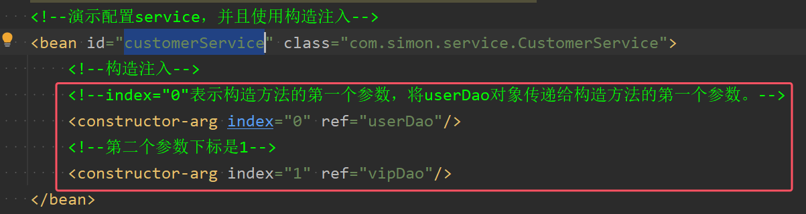
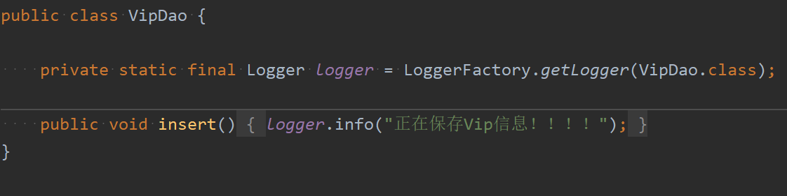
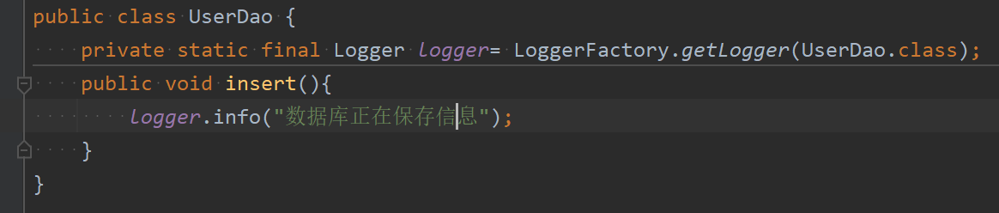
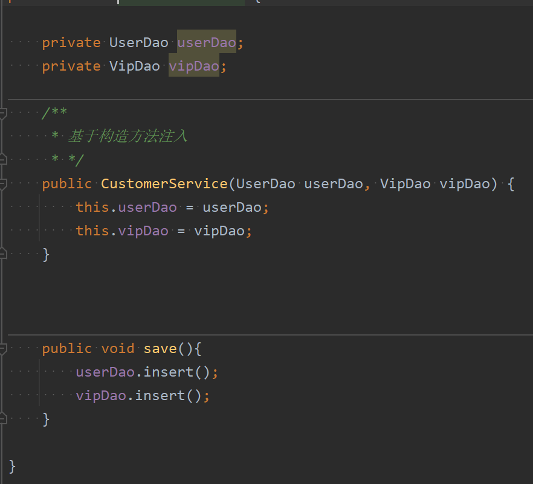
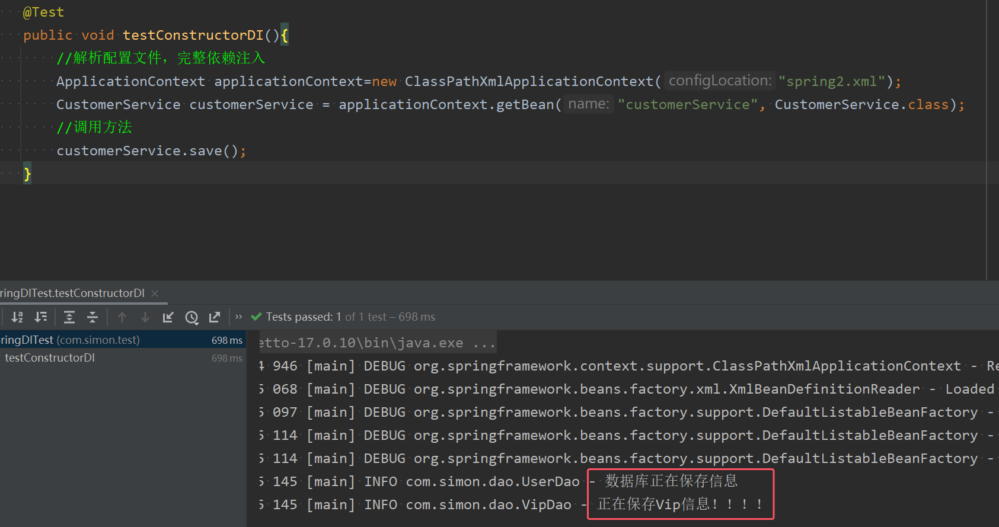

**构造注入就是调用构造方法来给属性进行赋值**

**构造注入于set注入区别：set注入是在对象实例化出来之后在调用set()进行赋值；而构造注入是在对象实例化的过程当中进行注入的。**
### 构造注入方式一：index+ref

* **使用constructor-arg标签进行构造注入，其中index属性代表构造方法的参数下标，从0开始，以此类推**
* **ref属性代表指定传入构造方法的参数。也就是要注入的bean对象的id**

测试代码和结果如下图所示  






### 构造注入方式二：构造方法参数name+ref
不使用参数下标，使用参数的名字可以吗？答：可以
```xml
<bean id="orderDaoBean" class="com.powernode.spring6.dao.OrderDao"/>

<bean id="orderServiceBean" class="com.powernode.spring6.service.OrderService">
  <!--这里使用了构造方法上参数的名字-->
  <constructor-arg name="orderDao" ref="orderDaoBean"/>
  <constructor-arg name="userDao" ref="userDaoBean"/>
</bean>

<bean id="userDaoBean" class="com.powernode.spring6.dao.UserDao"/>
```
执行测试程序：

* **在set注入当中name指的是set方法的方法名（不完全相同），但在构造注入中的name属性指的是构造方法的参数名称**

### 构造注入方式三：不指定下标，不指定参数名字，只是用ref
不指定参数下标，不指定参数名字，可以吗？**
```xml
<bean id="orderDaoBean" class="com.powernode.spring6.dao.OrderDao"/>
<bean id="orderServiceBean" class="com.powernode.spring6.service.OrderService">
  <!--没有指定下标，也没有指定参数名字-->
  <constructor-arg ref="orderDaoBean"/>
  <constructor-arg ref="userDaoBean"/>
</bean>

<bean id="userDaoBean" class="com.powernode.spring6.dao.UserDao"/>
```
执行测试程序：

**配置文件中构造方法参数的类型顺序和构造方法参数的类型顺序不一致呢？**
```xml
<bean id="orderDaoBean" class="com.powernode.spring6.dao.OrderDao"/>

<bean id="orderServiceBean" class="com.powernode.spring6.service.OrderService">
  <!--顺序已经和构造方法的参数顺序不同了-->
  <constructor-arg ref="userDaoBean"/>
  <constructor-arg ref="orderDaoBean"/>
</bean>

<bean id="userDaoBean" class="com.powernode.spring6.dao.UserDao"/>
```
执行测试程序：

通过测试


==通过测试得知，通过构造方法注入的时候：==
- ==可以通过下标==
- ==可以通过参数名==
- ==也可以不指定下标和参数名，spring可以自动根据类型推断把ref注入给哪个参数。==

Spring在装配方面做的还是比较健壮的。

注意：**为了程序的可读性，在开发中不会让spring自动推断，而是使用下标或者参数名来进行注入**