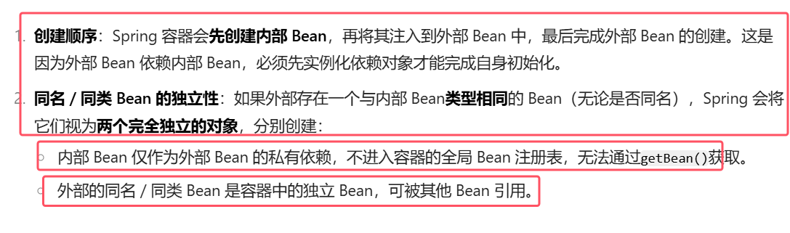
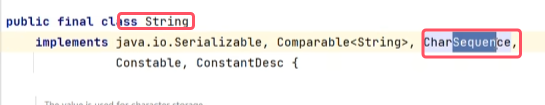
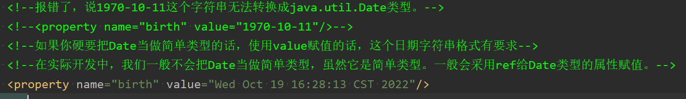
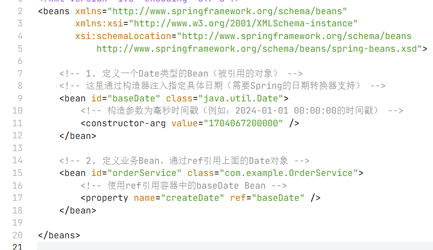
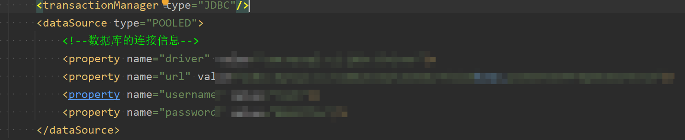
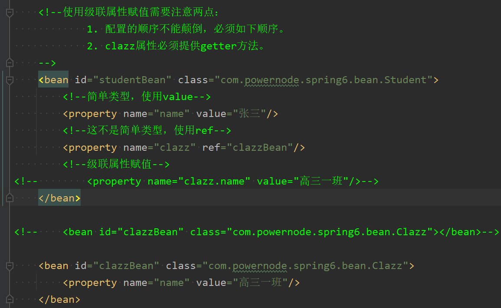
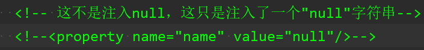
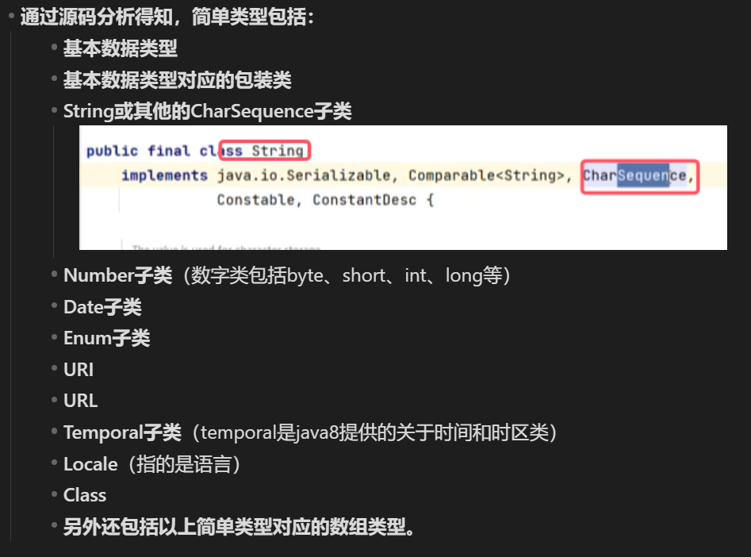
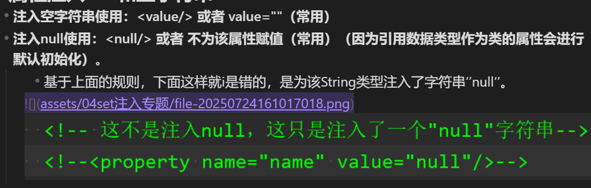

注：set注入在实际使用中，用到的较多。所以set注入作为一个专题来学习。**set注入可以实现的功能，构造注入同样可以使用，只不过使用的标签不同罢了**

有基础的建议直接看总结

### 1.注入内部Bean和外部Bean

#### 1.1注入外部Bean

**注入外部Bean：Bean定义在外面，在property标签中使用ref属性来注入该Bean。==通常这种方式是常用**==
```xml
<?xml version="1.0" encoding="UTF-8"?>
<beans xmlns="http://www.springframework.org/schema/beans"
       xmlns:xsi="http://www.w3.org/2001/XMLSchema-instance"
       xsi:schemaLocation="http://www.springframework.org/schema/beans http://www.springframework.org/schema/beans/spring-beans.xsd">

   <!--声明/定义全局Bean-->  
	<bean id="orderDaoBean" class="com.powernode.spring6.dao.OrderDao"></bean>  
	  
	<bean id="orderServiceBean" class="com.powernode.spring6.service.OrderService">  
		<!--使用ref属性来引入。这就是注入外部Bean-->  
		<property name="orderDao" ref="orderDaoBean"/>  
	</bean>

</beans>
```

#### 1.2注入内部Bean

**注入外部Bean：在bean标签中嵌套bean标签。**
```xml
<?xml version="1.0" encoding="UTF-8"?>
<beans xmlns="http://www.springframework.org/schema/beans"
       xmlns:xsi="http://www.w3.org/2001/XMLSchema-instance"
       xsi:schemaLocation="http://www.springframework.org/schema/beans http://www.springframework.org/schema/beans/spring-beans.xsd">

    <bean id="userServiceBean" class="com.powernode.spring6.service.UserService">
        <property name="userDao">
	        <!--在property标签中使用嵌套的bean标签，这就是内部Bean-->
            <bean class="com.powernode.spring6.dao.UserDao"/>
        </property>
    </bean>

</beans>
```


此种方式作为了解，不经常用


### 2.注入简单类型属性
##### 2.1注入简单类型的方法
我们之前在进行注入的时候，对象的属性是另一个对象。
```java
public class UserService{
    
    private UserDao userDao;
    
    public void setUserDao(UserDao userDao){
        this.userDao = userDao;
    }
    
}
```
那如果对象的属性是int类型呢？可以通过set注入的方式给该属性赋值吗？

- 当然可以。因为只要能够调用set方法就可以给属性赋值。

**编写程序给一个User对象的age属性赋值20：**  
第一步：定义User类，提供age属性，提供age属性的setter方法。
```java
package com.powernode.spring6.beans;

/**
 * @author 动力节点
 * @version 1.0
 * @className User
 * @since 1.0
 **/
public class User {
    private int age;

    public void setAge(int age) {
        this.age = age;
    }
    
    @Override
    public String toString() {
        return "User{" +
                "age=" + age +
                '}';
    }
}

```
第二步：编写spring配置文件：spring-simple-type.xml
```xml
<?xml version="1.0" encoding="UTF-8"?>
<beans xmlns="http://www.springframework.org/schema/beans"
       xmlns:xsi="http://www.w3.org/2001/XMLSchema-instance"
       xsi:schemaLocation="http://www.springframework.org/schema/beans http://www.springframework.org/schema/beans/spring-beans.xsd">
    <bean id="userBean" class="com.powernode.spring6.beans.User">
        <!--如果像这种int类型的属性，我们称为简单类型，这种简单类型在注入的时候要使用value属性，不能使用ref-->
        <property name="age" value="20"/>
    </bean>
</beans>
```
**需要特别注意：如果给简单类型赋值，使用value属性或value标签。而不是ref。**

第三步：编写测试程序
```java
@Test
public void testSimpleType(){
    ApplicationContext applicationContext = new ClassPathXmlApplicationContext("spring-simple-type.xml");
    User user = applicationContext.getBean("userBean", User.class);
    System.out.println(user);
}
```
第四步：运行测试程序  


总结：**如果给简单类型赋值，使用value属性或value标签。而不是ref。这样可以直接就给简单类型赋上指定的值**


##### 2.2简单类型有哪些

注意：  
1. **简单类型并不指的就是基本数据类型，spring框架中有规定的简单类型**
2. **spring框架中有一个工具类——BeanUtils类，指定了简单类型包括什么**

可以通过Spring的源码来分析一下：
```java
public class BeanUtils{
    
    //.......
    
    /**
	 * Check if the given type represents a "simple" property: a simple value
	 * type or an array of simple value types.
	 * <p>See {@link #isSimpleValueType(Class)} for the definition of <em>simple
	 * value type</em>.
	 * <p>Used to determine properties to check for a "simple" dependency-check.
	 * @param type the type to check
	 * @return whether the given type represents a "simple" property
	 * @see org.springframework.beans.factory.support.RootBeanDefinition#DEPENDENCY_CHECK_SIMPLE
	 * @see org.springframework.beans.factory.support.AbstractAutowireCapableBeanFactory#checkDependencies
	 * @see #isSimpleValueType(Class)
	 */
	public static boolean isSimpleProperty(Class<?> type) {
		Assert.notNull(type, "'type' must not be null");
		return isSimpleValueType(type) || (type.isArray() && isSimpleValueType(type.getComponentType()));
	}

	/**
	 * Check if the given type represents a "simple" value type: a primitive or
	 * primitive wrapper, an enum, a String or other CharSequence, a Number, a
	 * Date, a Temporal, a URI, a URL, a Locale, or a Class.
	 * <p>{@code Void} and {@code void} are not considered simple value types.
	 * @param type the type to check
	 * @return whether the given type represents a "simple" value type
	 * @see #isSimpleProperty(Class)
	 */
	public static boolean isSimpleValueType(Class<?> type) {
		return (Void.class != type && void.class != type &&
				(ClassUtils.isPrimitiveOrWrapper(type) ||
				Enum.class.isAssignableFrom(type) ||
				CharSequence.class.isAssignableFrom(type) ||
				Number.class.isAssignableFrom(type) ||
				Date.class.isAssignableFrom(type) ||
				Temporal.class.isAssignableFrom(type) ||
				URI.class == type ||
				URL.class == type ||
				Locale.class == type ||
				Class.class == type));
	}
    
    //........
}
```
* `isSimpleValueType()`和`isSimpleProperty()`规定了有哪些类型是简单类型
* **通过源码分析得知，简单类型包括：**
	- **基本数据类型**
	- **基本数据类型对应的包装类**
	- **String或其他的CharSequence子类**  
		
	- **Number子类**（数字类包括byte、short、int、long等）
	- **Date子类**
	- **Enum子类**
	- **URI**
	- **URL**
	- **Temporal子类**（temporal是java8提供的关于时间和时区类）
	- **Locale**（指的是语言）
	- **Class**
	- **另外还包括以上简单类型对应的数组类型。**


##### 2.3 简单类型的特例——Date
编写一个类为a，其中包含所有上面指定的简单类型
```xml
<?xml version="1.0" encoding="UTF-8"?>
<beans xmlns="http://www.springframework.org/schema/beans"
       xmlns:xsi="http://www.w3.org/2001/XMLSchema-instance"
       xsi:schemaLocation="http://www.springframework.org/schema/beans http://www.springframework.org/schema/beans/spring-beans.xsd">

    <bean id="a" class="com.powernode.spring6.beans.A">
        <property name="b" value="1"/>
        <property name="s" value="1"/>
        <property name="i" value="1"/>
        <property name="l" value="1"/>
        <property name="f" value="1"/>
        <property name="d" value="1"/>
        <property name="flag" value="false"/>

        <property name="c" value="a"/>
        <property name="b1" value="2"/>
        <property name="s1" value="2"/>
        <property name="i1" value="2"/>
        <property name="l1" value="2"/>
        <property name="f1" value="2"/>
        <property name="d1" value="2"/>
        <property name="flag1" value="true"/>
        <property name="c1" value="a"/>

        <property name="str" value="zhangsan"/>
        <!--注意：value后面的日期字符串格式不能随便写，必须是Date对象toString()方法执行的结果。-->
        <!--如果想使用其他格式的日期字符串，就需要进行特殊处理了。具体怎么处理，可以看后面的课程！！！！-->
        <property name="date" value="Fri Sep 30 15:26:38 CST 2022"/>
        <property name="season" value="WINTER"/>
        <property name="uri" value="/save.do"/>
        <!--spring6之后，会自动检查url是否有效，如果无效会报错。-->
        <property name="url" value="http://www.baidu.com"/>
        <property name="localDate" value="EPOCH"/>
        <!--java.util.Locale 主要在软件的本地化时使用。它本身没有什么功能，更多的是作为一个参数辅助其他方法完成输出的本地化。-->
        <property name="locale" value="CHINESE"/>
        <property name="clazz" value="java.lang.String"/>
    </bean>
</beans>
```
* **如果把Date当做简单类型的话，日期字符串格式不能随便写。格式必须符合Date的toString()方法格式。显然这就比较鸡肋了。如果我们提供一个这样的日期字符串：2010-10-11，在这里是无法赋值给Date类型的属性的。**  
	
* **在实际开发中，我们一般不会把Date当做简单类型，虽然它是简单类型。一般会采用ref给Date类型的属性赋值**    
	
- **spring6之后，当注入的是URL，那么这个url字符串是会进行有效性检测的。如果是一个存在的url，那就没问题。如果不存在则报错。**

##### 2.4简单类型的应用案例——给数据源注入值

* 假设我们现在要自己手写一个数据源，我们都知道所有的数据源都要实现javax.sql.DataSource接口，并且数据源中应该有连接数据库的信息，例如：driver（驱动）、url、username、password等。
* 什么是数据源：能够给你提供数据库连接Connection对象的，都是数据源
```java
package com.powernode.spring6.beans;

import javax.sql.DataSource;
import java.io.PrintWriter;
import java.sql.Connection;
import java.sql.SQLException;
import java.sql.SQLFeatureNotSupportedException;
import java.util.logging.Logger;

/**
  
 * @author 动力节点
 * @version 1.0
 * @className MyDataSource
 * @since 1.0
 **/
public class MyDataSource implements DataSource {
    private String driver;
    private String url;
    private String username;
    private String password;

    public void setDriver(String driver) {
        this.driver = driver;
    }

    public void setUrl(String url) {
        this.url = url;
    }

    public void setUsername(String username) {
        this.username = username;
    }

    public void setPassword(String password) {
        this.password = password;
    }
    
    @Override
    public String toString() {
        return "MyDataSource{" +
                "driver='" + driver + '\'' +
                ", url='" + url + '\'' +
                ", username='" + username + '\'' +
                ", password='" + password + '\'' +
                '}';
    }

    @Override
    public Connection getConnection() throws SQLException {
        return null;
    }

    @Override
    public Connection getConnection(String username, String password) throws SQLException {
        return null;
    }

    @Override
    public PrintWriter getLogWriter() throws SQLException {
        return null;
    }

    @Override
    public void setLogWriter(PrintWriter out) throws SQLException {

    }

    @Override
    public void setLoginTimeout(int seconds) throws SQLException {

    }

    @Override
    public int getLoginTimeout() throws SQLException {
        return 0;
    }

    @Override
    public Logger getParentLogger() throws SQLFeatureNotSupportedException {
        return null;
    }

    @Override
    public <T> T unwrap(Class<T> iface) throws SQLException {
        return null;
    }

    @Override
    public boolean isWrapperFor(Class<?> iface) throws SQLException {
        return false;
    }
}

```
我们给driver、url、username、password四个属性分别提供了setter方法，我们可以使用spring的依赖注入完成数据源对象的创建和属性的赋值吗？看配置文件。比如这些写在properties配置文件中。
```xml
<?xml version="1.0" encoding="UTF-8"?>
<beans xmlns="http://www.springframework.org/schema/beans"
       xmlns:xsi="http://www.w3.org/2001/XMLSchema-instance"
       xsi:schemaLocation="http://www.springframework.org/schema/beans http://www.springframework.org/schema/beans/spring-beans.xsd">
	<!--让spring来管理我们的数据源-->
    <bean id="dataSource" class="com.powernode.spring6.beans.MyDataSource">
        <property name="driver" value="com.mysql.cj.jdbc.Driver"/>
        <property name="url" value="jdbc:mysql://localhost:3306/spring"/>
        <property name="username" value="root"/>
        <property name="password" value="123456"/>
    </bean>
  
</beans>
```
测试程序：
```java
@Test
public void testDataSource(){
    ApplicationContext applicationContext = new ClassPathXmlApplicationContext("spring-datasource.xml");
    MyDataSource dataSource = applicationContext.getBean("dataSource", MyDataSource.class);
    System.out.println(dataSource);
}
```
执行测试程序：  


实例：mybatis的核心配置文件注入     



### 3.级联属性赋值（了解）
介绍：分别写两个类Clazz和Stu，Stu有属性班级名称Clazz和学生名字name，Clazz有属性班级名字name

级联属性赋值：在一个Bean中，对其中一个被set注入的属性中的属性进行赋值；而不是对要注入的属性中的属性先注入好，再注入到该Bean中。

```java
package com.powernode.spring6.beans;

/**
 * @author 动力节点
 * @version 1.0
 * @className Clazz
 * @since 1.0
 **/
public class Clazz {
    private String name;

    public Clazz() {
    }

    public void setName(String name) {
        this.name = name;
    }

    @Override
    public String toString() {
        return "Clazz{" +
                "name='" + name + '\'' +
                '}';
    }
}
```

```java
package com.powernode.spring6.bean;  
  
/**  
* 表示学生  
* @author 动力节点  
* @version 1.0  
* @className Student  
* @since 1.0  
**/  
	public class Student {  
	private String name;  
	  
	// 学生属于哪个班级  
	private Clazz clazz;  
	  
	public void setClazz(Clazz clazz) {  
		this.clazz = clazz;  
	}  
	  
	// 使用级联属性赋值，这个需要这个get方法。  
	public Clazz getClazz() {  
		return clazz;  
	}  
	  
	public void setName(String name) {  
		this.name = name;  
	}  
	  
	@Override  
	public String toString() {  
		return "Student{" +  
		"name='" + name + '\'' +  
		", clazz=" + clazz +  
		'}';  
	}  
}
```

不使用级联赋值下的配置文件



使用级联复制的配置文件
```xml
<?xml version="1.0" encoding="UTF-8"?>
<beans xmlns="http://www.springframework.org/schema/beans"
       xmlns:xsi="http://www.w3.org/2001/XMLSchema-instance"
       xsi:schemaLocation="http://www.springframework.org/schema/beans http://www.springframework.org/schema/beans/spring-beans.xsd">

    <bean id="clazzBean" class="com.powernode.spring6.beans.Clazz"/>

    <!--使用级联属性赋值需要注意两点：  
		1. 配置的顺序不能颠倒，必须如下顺序。  
		2. clazz属性必须提供getter方法。  
	-->  
	<bean id="studentBean" class="com.powernode.spring6.bean.Student">  
	<!--简单类型，使用value-->  
	<property name="name" value="张三"/>  
	<!--这不是简单类型，使用ref-->  
	<property name="clazz" ref="clazzBean"/>  
	<!--级联属性赋值：必须在student类中提供getter，底层会调用gettter把clazz对象拿到才能对其赋值-->  
	<property name="clazz.name" value="高三一班"/>  
	</bean>
</beans>
```

```java
@Test
public void testCascade(){
    ApplicationContext applicationContext = new ClassPathXmlApplicationContext("spring-cascade.xml");
    Student student = applicationContext.getBean("student", Student.class);
    System.out.println(student);
}
```
运行结果：


**要点：**
* 相当于clazz对象的name不再clazz的Bean标签中赋值，而是在student对象的Bean标签中完成级联赋值
- **在spring配置文件中，顺序不能颠倒，必须先引入属性，才能设置该属性中姬莲属下的值，**
- **在spring配置文件中，在student类必须提供clazz属性的getter方法。**

==实际不会使用级联属性赋值。而是会正常赋值完后再进行注入==


### 4.注入数组属性

##### 数组中元素是简单类型时
```java
package com.powernode.spring6.beans;

import java.util.Arrays;

public class Person {
    private String[] favariteFoods;

    public void setFavariteFoods(String[] favariteFoods) {
        this.favariteFoods = favariteFoods;
    }

    @Override
    public String toString() {
        return "Person{" +
                "favariteFoods=" + Arrays.toString(favariteFoods) +
                '}';
    }
}

```

```xml
<?xml version="1.0" encoding="UTF-8"?>
<beans xmlns="http://www.springframework.org/schema/beans"
       xmlns:xsi="http://www.w3.org/2001/XMLSchema-instance"
       xsi:schemaLocation="http://www.springframework.org/schema/beans http://www.springframework.org/schema/beans/spring-beans.xsd">
	
    <bean id="person" class="com.powernode.spring6.beans.Person">
	    <!-- 这个数组属性当中的元素类型是String简单类型 -->
        <property name="favariteFoods">
            <array>
                <value>鸡排</value>
                <value>汉堡</value>
                <value>鹅肝</value>
            </array>
        </property>
    </bean>
</beans>
```

```java
@Test
public void testArraySimple(){
    ApplicationContext applicationContext = new ClassPathXmlApplicationContext("spring-array-simple.xml");
    Person person = applicationContext.getBean("person", Person.class);
    System.out.println(person);
}
```
* **当数组元素类型时简单类型时，直接使用\<array\>子标签，在其中使用value标签对数组进行赋值**


##### 当数组元素类型不是简单类型时

场景：一个订单中包含多个商品。
```java
package com.powernode.spring6.beans;

/**
 * @author 动力节点
 * @version 1.0
 * @className Goods
 * @since 1.0
 **/
public class Goods {
    private String name;

    public Goods() {
    }

    public void setName(String name) {
        this.name = name;
    }

    @Override
    public String toString() {
        return "Goods{" +
                "name='" + name + '\'' +
                '}';
    }
}
```

```java
package com.powernode.spring6.beans;

import java.util.Arrays;

/**
 * @author 动力节点
 * @version 1.0
 * @className Order
 * @since 1.0
 **/
public class Order {
    // 一个订单中有多个商品
    private Goods[] goods;

    public Order() {
    }

    public void setGoods(Goods[] goods) {
        this.goods = goods;
    }

    @Override
    public String toString() {
        return "Order{" +
                "goods=" + Arrays.toString(goods) +
                '}';
    }
}
```

```xml
<?xml version="1.0" encoding="UTF-8"?>
<beans xmlns="http://www.springframework.org/schema/beans"
       xmlns:xsi="http://www.w3.org/2001/XMLSchema-instance"
       xsi:schemaLocation="http://www.springframework.org/schema/beans http://www.springframework.org/schema/beans/spring-beans.xsd">

    <bean id="goods1" class="com.powernode.spring6.beans.Goods">
        <property name="name" value="西瓜"/>
    </bean>

    <bean id="goods2" class="com.powernode.spring6.beans.Goods">
        <property name="name" value="苹果"/>
    </bean>

    <bean id="order" class="com.powernode.spring6.beans.Order">
	    <!-- 这个数组当中的类型就不是简单类型了-->
        <property name="goods">
            <array>
                <!--这里使用ref标签，其中bean属性存放引用的对象id-->
                <ref bean="goods1"/>
                <ref bean="goods2"/>
            </array>
        </property>
    </bean>

</beans>
```
测试程序：
```java
@Test
public void testArray(){
    ApplicationContext applicationContext = new ClassPathXmlApplicationContext("spring-array.xml");
    Order order = applicationContext.getBean("order", Order.class);
    System.out.println(order);
}
```

执行结果：  


**要点：**对数组属性进行赋值，都是在\<array\>子标签中进行。  
- **如果数组中是简单类型，使用value标签。**
- **如果数组中是非简单类型，使用ref标签，其中的bean属性填入引用的Bean的id。**


### 5.注入List属性

注意：**下面以简单类型为例进行讲解，因为简单类型和非简单类型一样，只不过将value标签更换为ref标签，其中的bean属性填入引用的Bean的id**

List集合：有序可重复
```java
package com.powernode.spring6.beans;

import java.util.List;

/**
 * @author 动力节点
 * @version 1.0
 * @className People
 * @since 1.0
 **/
public class People {
    // 一个人有多个名字
    private List<String> names;

    public void setNames(List<String> names) {
        this.names = names;
    }

    @Override
    public String toString() {
        return "People{" +
                "names=" + names +
                '}';
    }
}
```

```xml
<?xml version="1.0" encoding="UTF-8"?>
<beans xmlns="http://www.springframework.org/schema/beans"
       xmlns:xsi="http://www.w3.org/2001/XMLSchema-instance"
       xsi:schemaLocation="http://www.springframework.org/schema/beans http://www.springframework.org/schema/beans/spring-beans.xsd">

    <bean id="peopleBean" class="com.powernode.spring6.beans.People">
        <property name="names">
            <list>
                <value>铁锤</value>
                <value>张三</value>
                <value>张三</value>
                <value>张三</value>
                <value>狼</value>
            </list>
        </property>
    </bean>
</beans>
```

```java
@Test
public void testCollection(){
    ApplicationContext applicationContext = new ClassPathXmlApplicationContext("spring-collection.xml");
    People peopleBean = applicationContext.getBean("peopleBean", People.class);
    System.out.println(peopleBean);
}
```

执行结果：    


**注意：注入List集合的时候使用list标签，如果List集合中是简单类型使用value标签，反之使用ref标签。**


### 6.注入Set属性
Set集合：无序不可重复
```java
package com.powernode.spring6.beans;

import java.util.List;
import java.util.Set;

/**
 * @author 动力节点
 * @version 1.0
 * @className People
 * @since 1.0
 **/
public class People {
    // 一个人有多个电话
    private Set<String> phones;

    public void setPhones(Set<String> phones) {
        this.phones = phones;
    }
    
    //......
    
    @Override
    public String toString() {
        return "People{" +
                "phones=" + phones +
                ", names=" + names +
                '}';
    }
}
```

```xml
<?xml version="1.0" encoding="UTF-8"?>
<beans xmlns="http://www.springframework.org/schema/beans"
       xmlns:xsi="http://www.w3.org/2001/XMLSchema-instance"
       xsi:schemaLocation="http://www.springframework.org/schema/beans http://www.springframework.org/schema/beans/spring-beans.xsd">

    <bean id="peopleBean" class="com.powernode.spring6.beans.People">
        <property name="phones">
            <set>
                <!--尽管这里注入了多个，但是set会自动去重，只会显示3个-->
                <value>110</value>
                <value>110</value>
                <value>120</value>
                <value>120</value>
                <value>119</value>
                <value>119</value>
            </set>
        </property>
    </bean>
</beans>
```

执行结果：  

**要点：**

- **使用\<set>标签**
*  **set集合中元素是简单类型的使用value标签，反之使用ref标签。**


### 7.注入Map属性
```java
package com.powernode.spring6.beans;

import java.util.List;
import java.util.Map;
import java.util.Set;

/**
 * @author 动力节点
 * @version 1.0
 * @className People
 * @since 1.0
 **/
public class People {
    // 一个人有多个住址
    private Map<Integer, String> addrs;

    public void setAddrs(Map<Integer, String> addrs) {
        this.addrs = addrs;
    }
    
    //......
    
    @Override
    public String toString() {
        return "People{" +
                "addrs=" + addrs +
                ", phones=" + phones +
                ", names=" + names +
                '}';
    }

}
```

```xml
<?xml version="1.0" encoding="UTF-8"?>
<beans xmlns="http://www.springframework.org/schema/beans"
       xmlns:xsi="http://www.w3.org/2001/XMLSchema-instance"
       xsi:schemaLocation="http://www.springframework.org/schema/beans http://www.springframework.org/schema/beans/spring-beans.xsd">

    <bean id="peopleBean" class="com.powernode.spring6.beans.People">
        <property name="addrs">
            <map>
                <!--如果key不是简单类型，使用 key-ref 属性-->
                <!--如果value不是简单类型，使用 value-ref 属性-->
                <entry key="1" value="北京大兴区"/>
                <entry key="2" value="上海浦东区"/>
                <entry key="3" value="深圳宝安区"/>
            </map>
        </property>
    </bean>
</beans>
```
执行结果：  

**要点：**
- **使用\<map>标签，每一个价值对使用\<entry标签>**
- **如果key是简单类型，使用 key 属性，反之使用 key-ref 属性。**
- **如果value是简单类型，使用 value 属性，反之使用 value-ref 属性。**

### 8.注入Properties属性
java.util.Properties继承java.util.Hashtable，Hashtable实现了Map接口。所以Properties也是一个Map集合。

**该类可以以键值对的形式保存数据，键值对都只能是字符串类型。主要用于xxx.properties配置文件中**

```java
package com.powernode.spring6.beans;

import java.util.List;
import java.util.Map;
import java.util.Properties;
import java.util.Set;

/**
 * @author 动力节点
 * @version 1.0
 * @className People
 * @since 1.0
 **/
public class People {

    private Properties properties;

    public void setProperties(Properties properties) {
        this.properties = properties;
    }
    
    //......

    @Override
    public String toString() {
        return "People{" +
                "properties=" + properties +
                ", addrs=" + addrs +
                ", phones=" + phones +
                ", names=" + names +
                '}';
    }
}
```

```xml
<?xml version="1.0" encoding="UTF-8"?>
<beans xmlns="http://www.springframework.org/schema/beans"
       xmlns:xsi="http://www.w3.org/2001/XMLSchema-instance"
       xsi:schemaLocation="http://www.springframework.org/schema/beans http://www.springframework.org/schema/beans/spring-beans.xsd">

    <bean id="peopleBean" class="com.powernode.spring6.beans.People">
        <property name="properties">
            <props>
                <prop key="driver">com.mysql.cj.jdbc.Driver</prop>
                <prop key="url">jdbc:mysql://localhost:3306/spring</prop>
                <prop key="username">root</prop>
                <prop key="password">123456</prop>
            </props>
        </property>
    </bean>
</beans>
```
执行测试程序：   


**要点：**
- **使用\<props>标签嵌套\<prop>标签完成。**
- **并且二者都是成对标签，key写在属性中，value写在内容体中**

### 9.属性注入null和空字符串
* **注入空字符串使用：<value/> 或者 value=""（常用）**
* **注入null使用：<null/> 或者 不为该属性赋值（常用）（因为引用数据类型作为类的属性会进行默认初始化）**。
	* 基于上面的规则，下面这样就i是错的，是为该String类型注入了字符串‘’null‘’。  
	

1. 我们先来看一下，怎么注入空字符串。
```java
package com.powernode.spring6.beans;

/**
 * @author 动力节点
 * @version 1.0
 * @className Vip
 * @since 1.0
 **/
public class Vip {
    private String email;

    public void setEmail(String email) {
        this.email = email;
    }

    @Override
    public String toString() {
        return "Vip{" +
                "email='" + email + '\'' +
                '}';
    }
}

```

```xml
<?xml version="1.0" encoding="UTF-8"?>
<beans xmlns="http://www.springframework.org/schema/beans"
       xmlns:xsi="http://www.w3.org/2001/XMLSchema-instance"
       xsi:schemaLocation="http://www.springframework.org/schema/beans http://www.springframework.org/schema/beans/spring-beans.xsd">

    <bean id="vipBean" class="com.powernode.spring6.beans.Vip">
        <!--空串的第一种方式-->
        <!--<property name="email" value=""/>-->
        <!--空串的第二种方式-->
        <property name="email">
            <value/>
        </property>
    </bean>

</beans>
```

```java
@Test
public void testNull(){
    ApplicationContext applicationContext = new ClassPathXmlApplicationContext("spring-null.xml");
    Vip vipBean = applicationContext.getBean("vipBean", Vip.class);
    System.out.println(vipBean);
}
```
执行结果：


2. 怎么注入null呢？

第一种方式：不给属性赋值
```xml
<?xml version="1.0" encoding="UTF-8"?>
<beans xmlns="http://www.springframework.org/schema/beans"
       xmlns:xsi="http://www.w3.org/2001/XMLSchema-instance"
       xsi:schemaLocation="http://www.springframework.org/schema/beans http://www.springframework.org/schema/beans/spring-beans.xsd">
	<!--不给属性注入，属性的默认值就是null-->
    <bean id="vipBean" class="com.powernode.spring6.beans.Vip" />

</beans>
```
执行结果：  


第二种方式：使用<null/>
```xml
<?xml version="1.0" encoding="UTF-8"?>
<beans xmlns="http://www.springframework.org/schema/beans"
       xmlns:xsi="http://www.w3.org/2001/XMLSchema-instance"
       xsi:schemaLocation="http://www.springframework.org/schema/beans http://www.springframework.org/schema/beans/spring-beans.xsd">

    <bean id="vipBean" class="com.powernode.spring6.beans.Vip">
        <property name="email">
            <null/>
        </property>
    </bean>

</beans>
```
执行结果：


### 10.注入的值中含有特殊符号

* **XML中有5个特殊字符，分别是：<、>、'、"、&.以上5个特殊符号在XML中会被特殊对待，会被当做XML语法的一部分进行解析，如果这些特殊符号直接出现在注入的字符串当中，会报错**。  


解决方案包括两种：
######  第一种：特殊符号使用转义字符代替。
5个特殊字符对应的转义字符分别是 **(\;不能丢)**：

| **特殊字符** | **转义字符** |
| -------- | -------- |
| >        | \&gt;    |
| <        | \&lt;    |
| '        | \&apos;  |
| "        | \&quot;  |
| &        | \&amp;   |

先使用转义字符来代替：
```java
package com.powernode.spring6.beans;

/**
 * @author 动力节点
 * @version 1.0
 * @className Math
 * @since 1.0
 **/
public class Math {
    private String result;

    public void setResult(String result) {
        this.result = result;
    }

    @Override
    public String toString() {
        return "Math{" +
                "result='" + result + '\'' +
                '}';
    }
}

```
```xml
<?xml version="1.0" encoding="UTF-8"?>
<beans xmlns="http://www.springframework.org/schema/beans"
       xmlns:xsi="http://www.w3.org/2001/XMLSchema-instance"
       xsi:schemaLocation="http://www.springframework.org/schema/beans http://www.springframework.org/schema/beans/spring-beans.xsd">
    <bean id="mathBean" class="com.powernode.spring6.beans.Math">
        <property name="result" value="2 &lt; 3"/>
    </bean>
</beans>
```
```java
@Test
public void testSpecial(){
    ApplicationContext applicationContext = new ClassPathXmlApplicationContext("spring-special.xml");
    Math mathBean = applicationContext.getBean("mathBean", Math.class);
    System.out.println(mathBean);
}
```
执行结果：  


###### 第二种：将含有特殊符号的字符串放到：<![CDATA[]]> 当中。因为放在CDATA区中的数据不会被XML文件解析器解析。CDATA区可以使用大写CD补写
**注意：使用CDATA时，不能使用value属性，只能使用value标签。**

我们再来使用CDATA方式：
```xml
<?xml version="1.0" encoding="UTF-8"?>
<beans xmlns="http://www.springframework.org/schema/beans"
       xmlns:xsi="http://www.w3.org/2001/XMLSchema-instance"
       xsi:schemaLocation="http://www.springframework.org/schema/beans http://www.springframework.org/schema/beans/spring-beans.xsd">

    <bean id="mathBean" class="com.powernode.spring6.beans.Math">
        <property name="result">
            <!--只能使用value标签-->
            <value><![CDATA[2 < 3]]></value>
        </property>
    </bean>

</beans>
```
执行结果：  


### 总结

总结以上十条依赖注入的知识点。**因为set注入使用较多，所以是以set注入来进行总结**，构造注入同理。
##### 1.注入内部Bean和外部Bean
1. **注入外部Bean：Bean定义在外面，在property标签中使用ref属性来注入该Bean。==通常这种方式是常用==
```xml
	<!--声明/定义全局Bean-->  
	<bean id="orderDaoBean" class="com.powernode.spring6.dao.OrderDao"></bean>  
	  
	<bean id="orderServiceBean" class="com.powernode.spring6.service.OrderService">  
		<!--使用ref属性来引入。这就是注入外部Bean-->  
		<property name="orderDao" ref="orderDaoBean"/>  
	</bean>
```
2. **注入外部Bean：在bean标签中嵌套bean标签，内部Bean与外部Bean是两个独立的对象。**
```xml
	<bean id="orderDaoBean" class="com.powernode.spring6.dao.OrderDao"></bean>

	<bean id="userServiceBean" class="com.powernode.spring6.service.UserService">
        <property name="userDao">
	        <!--在property标签中使用嵌套的bean标签，这就是内部Bean-->
            <bean class="com.powernode.spring6.dao.UserDao"/>
        </property>
    </bean>
```

##### 2.注入简单数据类型
1. **如果给简单类型赋值，使用value属性或value标签。而不是ref。这样可以直接就给简单类型赋上指定的值**
```xml
	<bean id="userBean" class="com.powernode.spring6.beans.User">
        <!--如果像这种int类型的属性，我们称为简单类型，这种简单类型在注入的时候要使用value属性，不能使用ref-->
        <property name="age" value="20"/>
        <!--或者使用这样的方式-->
        <property name="age">  
			<value>20</value>  
		</property>
    </bean>
```
2. 简单类型包括  

3. 虽然Date是简单类型，但是使用时一般会采用ref给Date类型的属性赋值

##### 3.级联属性赋值（很少用）

- **在spring配置文件中，顺序不能颠倒，必须先引入属性，才能设置该属性中姬莲属下的值，**
- **在spring配置文件中，在student类必须提供clazz属性的getter方法。**
```xml
    <bean id="clazzBean" class="com.powernode.spring6.beans.Clazz"/>

    <!--使用级联属性赋值需要注意两点：  
		1. 配置的顺序不能颠倒，必须如下顺序。  
		2. clazz属性必须提供getter方法。  
	-->  
	<bean id="studentBean" class="com.powernode.spring6.bean.Student">  
	<!--简单类型，使用value-->  
	<property name="name" value="张三"/>  
	<!--这不是简单类型，使用ref-->  
	<property name="clazz" ref="clazzBean"/>  
	<!--级联属性赋值：必须在student类中提供getter，底层会调用gettter把clazz对象拿到才能对其赋值-->  
	<property name="clazz.name" value="高三一班"/>  
	</bean>

```

##### 4. 注入数组属性

**要点：**对数组属性进行赋值，都是在\<array\>子标签中进行。  
- **如果数组中是简单类型，使用value标签。**
- **如果数组中是非简单类型，使用ref标签，其中的bean属性填入引用的Bean的id。**
```xml

   <bean id="person" class="com.powernode.spring6.beans.Person">
	    <!-- 这个数组属性当中的元素类型是String简单类型 -->
        <property name="favariteFoods">
            <array>
                <value>鸡排</value>
                <value>汉堡</value>
                <value>鹅肝</value>
            </array>
        </property>
    </bean>


	<bean id="order" class="com.powernode.spring6.beans.Order">
	    <!-- 这个数组当中的类型就不是简单类型了-->
        <property name="goods">
            <array>
                <!--这里使用ref标签，其中bean属性存放引用的对象id-->
                <ref bean="goods1"/>
                <ref bean="goods2"/>
            </array>
        </property>
    </bean>

```


##### 5.注入List属性

**注入List集合的时候使用list标签，如果List集合中是简单类型使用value标签；反之使用ref标签，并且里面Bean属性。**
```xml
	<bean id="peopleBean" class="com.powernode.spring6.beans.People">
        <property name="names">
            <list>
                <value>铁锤</value>
                <value>张三</value>
                <value>张三</value>
                <value>张三</value>
                <value>狼</value>
            </list>
        </property>
    </bean>
```

##### 6.注入set标签
**使用\<set>标签**，**set集合中元素是简单类型的使用value标签，反之使用ref标签。如果注入元素重复，会自动进行去重**
```xml
    <bean id="peopleBean" class="com.powernode.spring6.beans.People">
        <property name="phones">
            <set>
                <!--尽管这里注入了多个，但是set会自动去重，只会显示3个-->
                <value>110</value>
                <value>110</value>
                <value>120</value>
                <value>120</value>
                <value>119</value>
                <value>119</value>
            </set>
        </property>
    </bean>
```


##### 7.注入Map属性

- **使用\<map>标签，每一个价值对使用\<entry标签>**
- **如果key是简单类型，使用 key 属性，反之使用 key-ref 属性。**
- **如果value是简单类型，使用 value 属性，反之使用 value-ref 属性。**

```xml
    <bean id="peopleBean" class="com.powernode.spring6.beans.People">
        <property name="addrs">
            <map>
                <!--如果key不是简单类型，使用 key-ref 属性-->
                <!--如果value不是简单类型，使用 value-ref 属性-->
                <entry key="1" value="北京大兴区"/>
                <entry key="2" value="上海浦东区"/>
                <entry key="3" value="深圳宝安区"/>
            </map>
        </property>
    </bean>
```


##### 8.注入Properties属性
**使用\<props>标签嵌套\<prop>标签完成**，**并且二者都是成对标签，key写在属性中，value写在内容体中**

```xml
    <bean id="peopleBean" class="com.powernode.spring6.beans.People">
        <property name="properties">
            <props>
                <prop key="driver">com.mysql.cj.jdbc.Driver</prop>
                <prop key="url">jdbc:mysql://localhost:3306/spring</prop>
                <prop key="username">root</prop>
                <prop key="password">123456</prop>
            </props>
        </property>
    </bean>
```

##### 9.属性注入null和空字符串

##### 10.注入的值含有特殊符号
方式一：特殊符号使用转义字符代替。
方式二：：将含有特殊符号的字符串放到：<![CDATA[]]> 当中。因为放在CDATA区中的数据不会被XML文件解析器解析。CDATA区可以使用大写CD补写 。**注意：使用CDATA时，不能使用value属性，只能使用value标签
