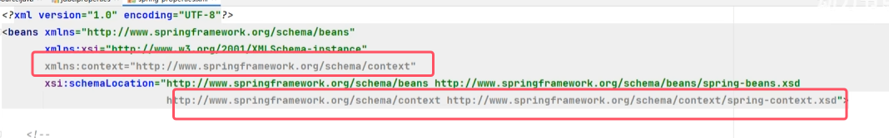
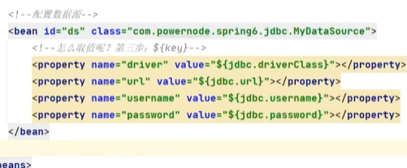

我们都知道编写数据源的时候是需要连接数据库的信息的，例如：driver url username password等信息。这些信息可以单独写到一个属性配置文件中吗，这样用户修改起来会更加的方便。当然可以。

**所以属性配置文件就指的是：xxx.properties文件，里面使用键值对来存储配置信息**


第一步：写一个数据源类，提供相关属性。
```java
package com.powernode.spring6.beans;

import javax.sql.DataSource;
import java.io.PrintWriter;
import java.sql.Connection;
import java.sql.SQLException;
import java.sql.SQLFeatureNotSupportedException;
import java.util.logging.Logger;

/**
 * @author 动力节点
 * @version 1.0
 * @className MyDataSource
 * @since 1.0
 **/
public class MyDataSource implements DataSource {
    
    private String driver;
    private String url;
    private String username;
    private String password;

    public void setDriver(String driver) {
        this.driver = driver;
    }

    public void setUrl(String url) {
        this.url = url;
    }

    public void setUsername(String username) {
        this.username = username;
    }

    public void setPassword(String password) {
        this.password = password;
    }
    
    @Override
    public String toString() {
        return "MyDataSource{" +
                "driver='" + driver + '\'' +
                ", url='" + url + '\'' +
                ", username='" + username + '\'' +
                ", password='" + password + '\'' +
                '}';
    }
    //......
}
```

第二步：在类路径下新建jdbc.properties文件，并配置信息。
```properties
driver=com.mysql.cj.jdbc.Driver
url=jdbc:mysql://localhost:3306/spring
username=root
password=root123
```
第三步：在spring配置文件中引入context命名空间。
```xml
<?xml version="1.0" encoding="UTF-8"?>
<beans xmlns="http://www.springframework.org/schema/beans"
       xmlns:xsi="http://www.w3.org/2001/XMLSchema-instance"
       xmlns:context="http://www.springframework.org/schema/context"
       xsi:schemaLocation="http://www.springframework.org/schema/beans http://www.springframework.org/schema/beans/spring-beans.xsd
                           http://www.springframework.org/schema/context http://www.springframework.org/schema/context/spring-context.xsd">

</beans>
```
第四步：在spring中配置使用jdbc.properties文件。
```xml
<?xml version="1.0" encoding="UTF-8"?>
<beans xmlns="http://www.springframework.org/schema/beans"
       xmlns:xsi="http://www.w3.org/2001/XMLSchema-instance"
       xmlns:context="http://www.springframework.org/schema/context"
       xsi:schemaLocation="http://www.springframework.org/schema/beans http://www.springframework.org/schema/beans/spring-beans.xsd
                           http://www.springframework.org/schema/context http://www.springframework.org/schema/context/spring-context.xsd">

    <context:property-placeholder location="jdbc.properties"/>
    
    <bean id="dataSource" class="com.powernode.spring6.beans.MyDataSource">
        <property name="driver" value="${driver}"/>
        <property name="url" value="${url}"/>
        <property name="username" value="${username}"/>
        <property name="password" value="${password}"/>
    </bean>
</beans>
```
测试程序：
```java
@Test
public void testProperties(){
    ApplicationContext applicationContext = new ClassPathXmlApplicationContext("spring-properties.xml");
    MyDataSource dataSource = applicationContext.getBean("dataSource", MyDataSource.class);
    System.out.println(dataSource);
}
```
执行结果：


总结：引入外部的properties文件的步骤：
1. **引入context命名空间**。   
	
2. **使用标签context:property-placeholder的location属性来指定属性配置文件的路径。  
location默认从类的根路径下开始加载资源**。  

3. **怎么取值呢？第三步：${key}。其中\${}是属性占位符**
4. **由于在spring当中使用${}去加载其中的key来得到value的时候，默认会先加载windows系统下的环境变量。所以直接写username会打印出administrator，因为这是windows系统下的环境变量的值。所以一般会对key加上他的用处作为，比如上图所示。**