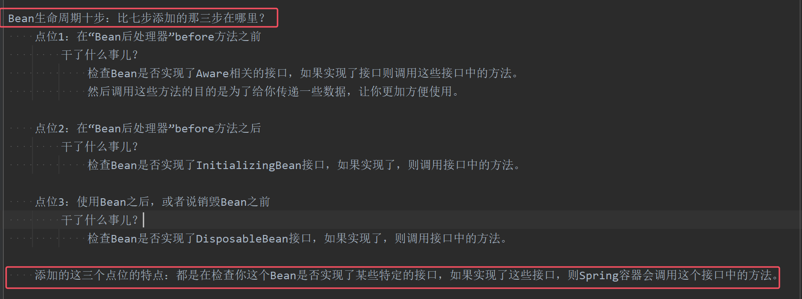

## 一、什么是Bean的生命周期
**Spring其实就是一个管理Bean对象的工厂。它负责对象的创建，对象的销毁等**。

**所谓的生命周期就是：对象从创建开始到最终销毁的整个过程。**

**为什么要知道Bean的生命周期？**    
* 其实生命周期的本质是：在哪个时间节点上调用了哪个类的哪个方法。
* 我们需要充分的了解在这个生命线上，都有哪些特殊的时间节点。
* 只有我们知道了特殊的时间节点都在哪，到时我们才可以确定代码写到哪。
* **我们可能需要在某个特殊的时间点上执行一段特定的代码，这段代码就可以放到这个节点上。当生命线走到这里的时候，自然会被调用。**

Bean生命周期的管理，可以参考Spring的源码：AbstractAutowireCapableBeanFactory类的doCreateBean()方法。
## 二、Bean的生命周期之5步

Bean生命周期可以粗略的划分为五大步：
- **第一步：实例化Bean(调无参构造方法)**
- **第二步：Bean属性赋值（set注入）**
- **第三步：初始化Bean（会调用Bean的init方法。注意：这个init方法需要自己写，自己配。方法名随意）**
- **第四步：使用Bean**
- **第五步：销毁Bean（会调用Bean的destroy方法。注意：这个destroy方法需要自己写，自己配。方法名随意）**

注意：**需要手动指定初始化方法，和销毁方法。init-method属性指定初始化方法，destroy-method属性指定销毁方法，填入对应的方法名。**


编写测试程序：
定义一个Bean
```java
package com.powernode.spring6.bean;

/**
 * @author 动力节点
 * @version 1.0
 * @className User
 * @since 1.0
 **/
public class User {
    private String name;

    public User() {
        System.out.println("1.实例化Bean");
    }

    public void setName(String name) {
        this.name = name;
        System.out.println("2.Bean属性赋值");
    }
	// 这个方法需要自己写，自己配。方法名随意。
    public void initBean(){
        System.out.println("3.初始化Bean");
    }
	// 这个方法需要自己写，自己配。方法名随意。
    public void destroyBean(){
        System.out.println("5.销毁Bean");
    }

}
```

```xml
<?xml version="1.0" encoding="UTF-8"?>
<beans xmlns="http://www.springframework.org/schema/beans"
       xmlns:xsi="http://www.w3.org/2001/XMLSchema-instance"
       xsi:schemaLocation="http://www.springframework.org/schema/beans http://www.springframework.org/schema/beans/spring-beans.xsd">

    <!--
    需要手动指定初始化方法，和销毁方法。
    init-method属性指定初始化方法。
    destroy-method属性指定销毁方法，填入对应的方法名。
    -->
    <bean id="userBean" class="com.powernode.spring6.bean.User" init-method="initBean" destroy-method="destroyBean">
        <property name="name" value="zhangsan"/>
    </bean>

</beans>
```

```java
package com.powernode.spring6.test;

import com.powernode.spring6.bean.User;
import org.junit.Test;
import org.springframework.context.ApplicationContext;
import org.springframework.context.support.ClassPathXmlApplicationContext;

/**
 * @author 动力节点
 * @version 1.0
 * @className BeanLifecycleTest
 * @since 1.0
 **/
public class BeanLifecycleTest {
    @Test
    public void testLifecycle(){
        ApplicationContext applicationContext = new ClassPathXmlApplicationContext("spring.xml");
        User userBean = applicationContext.getBean("userBean", User.class);
        System.out.println("4.使用Bean");
        // 只有正常关闭spring容器才会执行销毁方法
        ClassPathXmlApplicationContext context = (ClassPathXmlApplicationContext) applicationContext;
        context.close();
    }
}

```
执行结果：  


需要注意的：
- 第一：**只有正常关闭spring容器，bean的销毁方法才会被自动调用。具体措施是调用close()**。
- 第二：**ClassPathXmlApplicationContext类才有close()方法，所以必须要对ApplicationContext类的对象先向下转型**。
- **第三：配置文件中的init-method指定初始化方法。destroy-method指定销毁方法，值填入对应的方法名**。


## 三、Bean生命周期之7步

* 在以上的5步中，**第3步是初始化Bean，如果你还想在初始化前和初始化后添加代码，可以加入“Bean后处理器”。**
* **加入Bean后处理器做法：需要该类实现BeanPostProcessor接口，即Bean后处理器接口；并实现postProcessBeforeInitialization()和postProcessAfterInitialization，即一个before方法和一个after方法。那么将会在初始化Bean前后分别执行这两个方法**
* **这两个方法中，第一个参数：刚创建的bean对象；第二个参数：bean的名字，通常情况下Bean的id**。
*  **一定要注意：在spring.xml文件中配置的Bean后处理器将作用于当前配置文件中所有的Bean,即当前配置文件中所有的Bean的生命周期都会有这两步**


注：**当执行完`ApplicationContext applicationContext = new ClassPathXmlApplicationContext("spring.xml");`的时候，他就已经完成了使用Bean之前的所有生命周期。**

编写一个类实现BeanPostProcessor类，并且重写before和after方法：
```java
package com.powernode.spring6.bean;

import org.springframework.beans.BeansException;
import org.springframework.beans.factory.config.BeanPostProcessor;

/**
 * @author 动力节点
 * @version 1.0
 * @className LogBeanPostProcessor
 * @since 1.0
 **/
public class LogBeanPostProcessor implements BeanPostProcessor {
    @Override
    public Object postProcessBeforeInitialization(Object bean, String beanName) throws BeansException {
        System.out.println("Bean后处理器的before方法执行，即将开始初始化");
        return bean;
    }

    @Override
    public Object postProcessAfterInitialization(Object bean, String beanName) throws BeansException {
        System.out.println("Bean后处理器的after方法执行，已完成初始化");
        return bean;
    }
}

```
在spring.xml文件中配置“Bean后处理器”：
```xml
<!--配置Bean后处理器。这个后处理器将作用于当前配置文件中所有的bean。-->
<bean class="com.powernode.spring6.bean.LogBeanPostProcessor"/>
```
**一定要注意：在spring.xml文件中配置的Bean后处理器将作用于当前配置文件中所有的Bean。**

执行测试程序：      


如果加上Bean后处理器的话，Bean的生命周期就是7步了：    


## 四、Bean生命周期之10步
如果根据源码跟踪，可以划分更细粒度的步骤，10步：  


上图中检查Bean是否实现了Aware的相关接口是什么意思？  
答：Aware相关的接口包括：BeanNameAware、BeanClassLoaderAware、BeanFactoryAware
- 当Bean实现了BeanNameAware，Spring会将Bean的名字传递给Bean。
- 当Bean实现了BeanClassLoaderAware，Spring会将加载该Bean的类加载器传递给Bean。
- 当Bean实现了BeanFactoryAware，Spring会将Bean工厂对象传递给Bean。
- **添加的这三个点位的特点：都是在检查你这个Bean是否实现了某些特定的接口，如果实现了这些接口，则Spring容器会调用这个接口中的方法**


测试以上10步，可以让User类实现5个接口，并实现所有方法：  
- BeanNameAware
- BeanClassLoaderAware
- BeanFactoryAware
- InitializingBean
- DisposableBean

代码如下：
```java
package com.powernode.spring6.bean;

import org.springframework.beans.BeansException;
import org.springframework.beans.factory.*;

/**
 * @author 动力节点
 * @version 1.0
 * @className User
 * @since 1.0
 **/
public class User implements BeanNameAware, BeanClassLoaderAware, BeanFactoryAware, InitializingBean, DisposableBean {
    private String name;

    public User() {
        System.out.println("1.实例化Bean");
    }

    public void setName(String name) {
        this.name = name;
        System.out.println("2.Bean属性赋值");
    }

    public void initBean(){
        System.out.println("6.初始化Bean");
    }

    public void destroyBean(){
        System.out.println("10.销毁Bean");
    }
	//BeanClassLoaderAware的方法
    @Override
    public void setBeanClassLoader(ClassLoader classLoader) {
        System.out.println("3.类加载器：" + classLoader);
    }
	//BeanFactoryAware的方法
    @Override
    public void setBeanFactory(BeanFactory beanFactory) throws BeansException {
        System.out.println("3.Bean工厂：" + beanFactory);
    }
	//BeanNameAware的方法
    @Override
    public void setBeanName(String name) {
        System.out.println("3.bean名字：" + name);
    }
	//DisposableBean的方法
    @Override
    public void destroy() throws Exception {
        System.out.println("9.DisposableBean destroy");
    }
	//InitializingBean的方法
    @Override
    public void afterPropertiesSet() throws Exception {
        System.out.println("5.afterPropertiesSet执行");
    }
}
```

```java
package com.powernode.spring6.bean;

import org.springframework.beans.BeansException;
import org.springframework.beans.factory.config.BeanPostProcessor;

/**
 * @author 动力节点
 * @version 1.0
 * @className LogBeanPostProcessor
 * @since 1.0
 **/
public class LogBeanPostProcessor implements BeanPostProcessor {
    @Override
    public Object postProcessBeforeInitialization(Object bean, String beanName) throws BeansException {
        System.out.println("4.Bean后处理器的before方法执行，即将开始初始化");
        return bean;
    }

    @Override
    public Object postProcessAfterInitialization(Object bean, String beanName) throws BeansException {
        System.out.println("7.Bean后处理器的after方法执行，已完成初始化");
        return bean;
    }
}

```
执行结果：


**通过测试可以看出来：**  
- **InitializingBean的方法早于init-method的执行。**
- **DisposableBean的方法早于destroy-method的执行。**

对于SpringBean的生命周期，掌握之前的7步即可。够用。


注：方便记忆



## 五、Bean的作用域不同，管理方式不同
Spring 根据Bean的作用域来选择管理方式。

- 对于singleton作用域的Bean，Spring 能够精确地知道该Bean何时被创建，何时初始化完成，以及何时被销毁；**即spring只对singleton的Bean进行完整的生命周期管理**
- **如果是prototype作用域的Bean，Spring容器只负责将该Bean初始化完毕。等客户端程序一旦获取到该Bean之后，Spring容器就不再管理该对象的生命周期了**。

我们把之前User类的spring.xml文件中的配置scope设置为prototype：
```xml
<?xml version="1.0" encoding="UTF-8"?>
<beans xmlns="http://www.springframework.org/schema/beans"
       xmlns:xsi="http://www.w3.org/2001/XMLSchema-instance"
       xsi:schemaLocation="http://www.springframework.org/schema/beans http://www.springframework.org/schema/beans/spring-beans.xsd">

    <!--
    init-method属性指定初始化方法。
    destroy-method属性指定销毁方法。
    -->
    <bean id="userBean" class="com.powernode.spring6.bean.User" init-method="initBean" destroy-method="destroyBean" scope="prototype">
        <property name="name" value="zhangsan"/>
    </bean>

    <!--配置Bean后处理器。这个后处理器将作用于当前配置文件中所有的bean。-->
    <bean class="com.powernode.spring6.bean.LogBeanPostProcessor"/>

</beans>
```
执行测试程序：  

通过测试一目了然。只执行了前8步，第9和10都没有执行。


## 六、自己new的对象如何让Spring管理

有些时候可能会遇到这样的需求，某个java对象是我们自己new的，然后我们希望这个对象被Spring容器管理，怎么实现？
```java
package com.powernode.spring6.bean;

/**
 * @author 动力节点
 * @version 1.0
 * @className User
 * @since 1.0
 **/
public class User {
}

```

```java
package com.powernode.spring6.test;

import com.powernode.spring6.bean.User;
import org.junit.Test;
import org.springframework.beans.factory.support.DefaultListableBeanFactory;

/**
 * @author 动力节点
 * @version 1.0
 * @className RegisterBeanTest
 * @since 1.0
 **/
public class RegisterBeanTest {

    @Test
    public void testBeanRegister(){
        // 自己new的对象
        User user = new User();
        System.out.println(user);

        // 创建 默认可列表BeanFactory 对象
        DefaultListableBeanFactory factory = new DefaultListableBeanFactory();
        // 注册Bean
        factory.registerSingleton("userBean", user);
        // 从spring容器中获取bean
        User userBean = factory.getBean("userBean", User.class);
        System.out.println(userBean);
    }
}

```
执行结果：    

* **通过使用DefaultListableBeanFactory对象的registerSingleton("beanName", bean)将对象交给spring容器进行管理。**
* **通过DefaultListableBeanFactory对象的getBean(beanName,Bean,class)来获取**