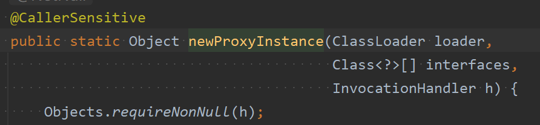

### 1.动态代理概述
**在程序运行阶段，在内存中动态生成代理类，被称为动态代理，目的是为了减少代理类的数量；解决代码复用的问题。**

在内存当中动态生成类的技术常见的包括：  
- **JDK动态代理技术：JDK内置了一套API，只能代理有一个接口和一个实现类的情况，即代理接口**。
- **CGLIB动态代理技术**：CGLIB(Code Generation Library)是一个开源项目。是一个强大的，高性能，高质量的Code生成类库，它可以在运行期扩展Java类与实现Java接口。**它既可以代理接口，又可以代理类，底层是通过继承的方式生成一个目标类的子类来作为代理类。性能比JDK动态代理要好。（底层有一个小而快的字节码处理框架ASM。）**
- **Javassist动态代理技术**：Javassist是一个开源的分析、编辑和创建Java字节码的类库。是由东京工业大学的数学和计算机科学系的 Shigeru Chiba （千叶 滋）所创建的。它已加入了开放源代码JBoss 应用服务器项目，通过使用Javassist对字节码操作为JBoss实现动态"AOP"框架。(不重要，用的不多，此处不做讲解)


### 2.JDK动态代理

我们还是使用静态代理中的例子：一个接口和一个实现类。
```java
package com.powernode.mall.service;

/**
 * 订单接口
 * @author 动力节点
 * @version 1.0
 * @className OrderService
 * @since 1.0
 **/
public interface OrderService {
    /**
     * 生成订单
     */
    void generate();

    /**
     * 查看订单详情
     */
    void detail();

    /**
     * 修改订单
     */
    void modify();
}
```
```java
package com.powernode.mall.service.impl;

import com.powernode.mall.service.OrderService;

/**
 * @author 动力节点
 * @version 1.0
 * @className OrderServiceImpl
 * @since 1.0
 **/
public class OrderServiceImpl implements OrderService {
    @Override
    public void generate() {
        try {
            Thread.sleep(1234);
        } catch (InterruptedException e) {
            e.printStackTrace();
        }
        System.out.println("订单已生成");
    }

    @Override
    public void detail() {
        try {
            Thread.sleep(2541);
        } catch (InterruptedException e) {
            e.printStackTrace();
        }
        System.out.println("订单信息如下：******");
    }

    @Override
    public void modify() {
        try {
            Thread.sleep(1010);
        } catch (InterruptedException e) {
            e.printStackTrace();
        }
        System.out.println("订单已修改");
    }
}

```
我们在静态代理的时候，除了以上一个接口和一个实现类之外，是不是要写一个代理类UserServiceProxy呀！**在动态代理中UserServiceProxy代理类是可以动态生成的。这个类不需要写。我们直接写客户端程序即可：**
```java
package com.powernode.mall;

import com.powernode.mall.service.OrderService;
import com.powernode.mall.service.impl.OrderServiceImpl;

import java.lang.reflect.Proxy;

/**
 * @author 动力节点
 * @version 1.0
 * @className Client
 * @since 1.0
 **/
public class Client {
    public static void main(String[] args) {
        // 第一步：创建目标对象
        OrderService target = new OrderServiceImpl();
        // 第二步：创建代理对象
        OrderService orderServiceProxy =(OrderService) Proxy.newProxyInstance(target.getClass().getClassLoader(), target.getClass().getInterfaces(), 调用处理器对象);
        // 第三步：调用代理对象的代理方法
        orderServiceProxy.detail();
        orderServiceProxy.modify();
        orderServiceProxy.generate();
    }
}
```
以上第二步创建代理对象是需要大家理解的：  
``OrderService orderServiceProxy = Proxy.newProxyInstance(target.getClass().getClassLoader(), target.getClass().getInterfaces(), 调用处理器对象);``

1. **Proxy类全名：java.lang.reflect.Proxy。这是JDK提供的一个类（所以称为JDK动态代理）。主要是通过这个类在内存中生成代理类的字节码。**
2. **newProxyInstance()用于新建代理对象** 。也就是说，通过调用这个方法可以创建代理对象。**本质上，这个Proxy.newProxyInstance()方法的执行，做了两件事**
	- **第一件事：在内存中生成了代理类的字节码**
	- **第二件事：通过内存中生成的代理类这个代码，创建代理对象**
3. 注意：该方法返回的是一个Object类型的代理对象，但是**代理对象和目标对象实现的接口一样，所以可以向下转型。**    
	
4. **其中newProxyInstance()方法有三个参数**：  
	- **第一个参数：类加载器**。在内存当中生成的字节码也是class文件，要执行也得先加载到内存当中。加载类就需要类加载器。所以这里需要指定类加载器。**并且JDK要求，目标类的类加载器必须和代理类的类加载器使用同一个。可以通过Class对象来获取目标类的类加载器**
	- **第二个参数：接口类型。代理类和目标类实现相同的接口，所以要通过这个参数告诉JDK动态代理生成的类要实现哪些接口。可以通过Class对象来获取目标类的实现的接口**。
	- **第三个参数：InvocationHandler，即调用处理器。 这是一个JDK动态代理规定的接口**，接口全名：java.lang.reflect.InvocationHandler。**在调用处理器接口中编写的就是：增强代码。既然是接口，就要写接口的实现类。** 显然这是一个回调接口，也就是说调用这个接口中方法的程序已经写好了，就差这个接口的实现类了。

所以接下来我们要写一下java.lang.reflect.InvocationHandler接口的实现类，并且实现接口中的方法，代码如下：
```java
package com.powernode.mall.service;

import java.lang.reflect.InvocationHandler;
import java.lang.reflect.Method;

/**
 * @author 动力节点
 * @version 1.0
 * @className TimerInvocationHandler
 * @since 1.0
 **/
public class TimerInvocationHandler implements InvocationHandler {
    @Override
    public Object invoke(Object proxy, Method method, Object[] args) throws Throwable {
		//编写增强代码
        return null;
    }
}
```
5. 为什么强行要求你必须实现InvocationHandler接口？  因为一个类实现接口就必须实现接口中的方法。上面的例子中该方法是invoke()，**因为JDK在底层调用invoke()方法的程序已经提前写好了。  注意：invoke方法不是我们程序员负责调用的，是JDK负责调用的**。
6. **invoke方法被调用的时机： 当代理对象调用代理方法的时候，注册在InvocationHandler调用处理器当中的invoke()方法被调用(因为invoke()方法当中写的就是增强功能的代码)。**
7. **InvocationHandler接口中invoke方法是JDK负责调用的，所以JDK调用这个方法的时候会自动给我们传过来这三个参数。我们可以在invoke方法的大括号中直接使用。该方法有三个参数**：
	- **第一个参数：Object proxy。代理对象的引用**。设计这个参数只是为了后期的方便，如果想在invoke方法中使用代理对象的话，尽管通过这个参数来使用。
	- **第二个参数：Method method 目标对象上的目标方法**。
	- **第三个参数：Object[] args。目标方法调用时要传的参数。**
8. **注意invoke方法的返回值，如果代理对象调用代理方法之后，需要返回结果的话，invoke方法必须将目标对象的目标方法执行结果继续返回。这样客户端才能正确拿到结果**
9. **我们将来肯定是要调用“目标方法”的，但要调用目标方法的话，使用method来调用目标对象的目标方法。并且需要“目标对象”的存在，“目标对象”从哪儿来呢？我们可以给TimerInvocationHandler提供一个构造方法，可以通过这个构造方法传过来“目标对象”**，代码如下面所示：


注：自己还要动手写调用处理器接口的实现类，这不会类爆炸吗？不会。 **因为如果系统中业务接口很多，但是都需要排查计算哪一段时间比较耗时的话，增强代码添加的都是一样的，静态代理由于一个接口对应一个代理类，就会写很多个。而动态代理，只需要将这种调用处理器写一次就好，都是通过反射机制动态获取方法，并且执行方法的，到时候直接作为参数传递给创建动态代理对象的方法即可。**
```java
package com.powernode.mall.service;

import java.lang.reflect.InvocationHandler;
import java.lang.reflect.Method;

/**
 * @author 动力节点
 * @version 1.0
 * @className TimerInvocationHandler
 * @since 1.0
 **/
public class TimerInvocationHandler implements InvocationHandler {
    // 目标对象
    private Object target;

    // 通过构造方法来传目标对象
    public TimerInvocationHandler(Object target) {
        this.target = target;
    }

    @Override
    public Object invoke(Object proxy, Method method, Object[] args) throws Throwable {
		//编写增强代码
        return null;
    }
}

```
有了目标对象我们就可以在invoke()方法中调用目标方法了。代码如下：
```java
package com.powernode.mall.service;

import java.lang.reflect.InvocationHandler;
import java.lang.reflect.Method;

/**
 * @author 动力节点
 * @version 1.0
 * @className TimerInvocationHandler
 * @since 1.0
 **/
public class TimerInvocationHandler implements InvocationHandler {
    // 目标对象
    private Object target;

    // 通过构造方法来传目标对象
    public TimerInvocationHandler(Object target) {
        this.target = target;
    }

    @Override
    public Object invoke(Object proxy, Method method, Object[] args) throws Throwable {
        // 目标执行之前增强。
        long begin = System.currentTimeMillis();
        // 调用目标对象的目标方法，哪个对象，哪个方法，传什么参数，返回什么值。
        Object retValue = method.invoke(target, args);
        // 目标执行之后增强。
        long end = System.currentTimeMillis();
        System.out.println("耗时"+(end - begin)+"毫秒");
        // 一定要记得返回哦。
        return retValue;
    }
}

```
到此为止，调用处理器就完成了。接下来，应该继续完善Client程序：
```java
package com.powernode.mall;

import com.powernode.mall.service.OrderService;
import com.powernode.mall.service.TimerInvocationHandler;
import com.powernode.mall.service.impl.OrderServiceImpl;

import java.lang.reflect.Proxy;

/**
 * @author 动力节点
 * @version 1.0
 * @className Client
 * @since 1.0
 **/
public class Client {
    public static void main(String[] args) {
        // 创建目标对象
        OrderService target = new OrderServiceImpl();
        // 创建代理对象
        OrderService orderServiceProxy = (OrderService) Proxy.newProxyInstance(target.getClass().getClassLoader(),
                                                                                target.getClass().getInterfaces(),
                                                                                new TimerInvocationHandler(target));
        // 调用代理对象的代理方法
        orderServiceProxy.detail();
        orderServiceProxy.modify();
        orderServiceProxy.generate();
    }
}

```
执行结果：    


学到这里可能会感觉有点懵，折腾半天，到最后这不是还得写一个接口的实现类吗？没省劲儿呀？
你要这样想就错了!!!! 我们可以看到，不管你有多少个Service接口，多少个业务类，这个TimerInvocationHandler接口是不是只需要写一次就行了，代码是不是得到复用了！！！！
而且最重要的是，以后程序员只需要关注核心业务的编写了，像这种统计时间的代码根本不需要关注。因为这种统计时间的代码只需要在调用处理器中编写一次即可。

##### 动态代理工具类封装

不过我们看以下这个代码确实有点繁琐，对于客户端来说，用起来不方便：  


我们可以提供一个工具类：ProxyUtil，封装一个方法：
```java
package com.powernode.mall.util;

import com.powernode.mall.service.TimerInvocationHandler;

import java.lang.reflect.Proxy;

/**
 * @author 动力节点
 * @version 1.0
 * @className ProxyUtil
 * @since 1.0
 **/
public class ProxyUtil {
	/**  
	* 封装一个工具方法，可以通过这个方法获取代理对象。  
	* @param target  
	* @return  
	*/
    public static Object newProxyInstance(Object target) {
	    // 底层是调用的还是JDK的动态代理。
        return Proxy.newProxyInstance(target.getClass().getClassLoader(), 
                target.getClass().getInterfaces(), 
                new TimerInvocationHandler(target));
    }
}
```
这样客户端代码就不需要写那么繁琐了：
```java
package com.powernode.mall;

import com.powernode.mall.service.OrderService;
import com.powernode.mall.service.TimerInvocationHandler;
import com.powernode.mall.service.impl.OrderServiceImpl;
import com.powernode.mall.util.ProxyUtil;

import java.lang.reflect.Proxy;

/**
 * @author 动力节点
 * @version 1.0
 * @className Client
 * @since 1.0
 **/
public class Client {
    public static void main(String[] args) {
        // 创建目标对象
        OrderService target = new OrderServiceImpl();
        // 创建代理对象
        OrderService orderServiceProxy = (OrderService) ProxyUtil.newProxyInstance(target);
        // 调用代理对象的代理方法
        orderServiceProxy.detail();
        orderServiceProxy.modify();
        orderServiceProxy.generate();
    }
}

```
执行结果：  


### 3.CGLIB动态代理
* **CGLIB既可以代理接口，又可以代理类。底层采用继承的方式实现。所以被代理的目标类不能使用final修饰。**

使用CGLIB，需要引入它的依赖：
 ```xml
<dependency>
  <groupId>cglib</groupId>
  <artifactId>cglib</artifactId>
  <version>3.3.0</version>
</dependency>
```
我们准备一个没有实现接口的类，如下：
```java
package com.powernode.mall.service;

/**目标类
 * @author 动力节点
 * @version 1.0
 * @className UserService
 * @since 1.0
 **/
public class UserService {
	//目标方法
    public void login(){
        System.out.println("用户正在登录系统....");
    }
	//目标方法
    public void logout(){
        System.out.println("用户正在退出系统....");
    }
}
```
使用CGLIB在内存中为UserService类生成代理类，并创建对象：
```java
package com.powernode.mall;

import com.powernode.mall.service.UserService;
import net.sf.cglib.proxy.Enhancer;

/**
 * @author 动力节点
 * @version 1.0
 * @className Client
 * @since 1.0
 **/
public class Client {
    public static void main(String[] args) {
        // 创建字节码增强器
        Enhancer enhancer = new Enhancer();
        // 告诉cglib要继承哪个类
        enhancer.setSuperclass(UserService.class);
        // 设置回调接口
        enhancer.setCallback(方法拦截器对象);
        // 生成源码，编译class，加载到JVM，并创建代理对象
        UserService userServiceProxy = (UserService)enhancer.create();

        userServiceProxy.login();
        userServiceProxy.logout();

    }
}
```
1. **客户端第一步是要创建字节码增强器对象Enhancer。这个对象是CGLIB库当中的核心对象，就是依靠它来生成代理类**。
2. **第二步使用`enhancer.setSuperclass(父类.class)`告诉CGLIB父类是谁，即告诉CGLIB目标类是谁。**
3. **使用`enhancer.setCallback()`设置回调(等同于JDK动态代理当中的调用处理器。InvocationHandler) 。在CGLIB当中不是InvocationHandler接口，是方法拦截器接口：MethodInterceptor，它和JDK动态代理原理差不多，在CGLIB中需要提供的不是InvocationHandler，而是：net.sf.cglib.proxy.MethodInterceptor。用于写增强代码**
4. **使用`enhancer.create()`创建代理对象。这一步会做两件事**：  
	* **第一件事：在内存中生成UserService类的子类，其实就是代理类的字节码。**  
	* **第二件事：创建代理对象**。

编写MethodInterceptor接口实现类：
```java
package com.powernode.mall.service;

import net.sf.cglib.proxy.MethodInterceptor;
import net.sf.cglib.proxy.MethodProxy;

import java.lang.reflect.Method;

/**
 * @author 动力节点
 * @version 1.0
 * @className TimerMethodInterceptor
 * @since 1.0
 **/
public class TimerMethodInterceptor implements MethodInterceptor {
    @Override
    public Object intercept(Object target, Method method, Object[] objects, MethodProxy methodProxy) throws Throwable {
        return null;
    }
}
```
* **MethodInterceptor接口中有一个方法intercept()，该方法有4个参数**：
	1. **第一个参数：目标对象**
	2. **第二个参数：目标方法**
	3. **第三个参数：目标方法调用时的实参**
	4. **第四个参数：代理方法**
* **需要使用代理方法的invokeSuper()来调用目标方法，参数设置和反射执行方法的设置方法一样**
* 在MethodInterceptor的intercept()方法中调用目标以及添加增强代码的具体代码如下图所示：
```java
package com.powernode.mall.service;

import net.sf.cglib.proxy.MethodInterceptor;
import net.sf.cglib.proxy.MethodProxy;

import java.lang.reflect.Method;

/**
 * @author 动力节点
 * @version 1.0
 * @className TimerMethodInterceptor
 * @since 1.0
 **/
public class TimerMethodInterceptor implements MethodInterceptor {
    @Override
    public Object intercept(Object target, Method method, Object[] objects, MethodProxy methodProxy) throws Throwable {
        // 前增强
        long begin = System.currentTimeMillis();
        // 调用目标
        Object retValue = methodProxy.invokeSuper(target, objects);
        // 后增强
        long end = System.currentTimeMillis();
        System.out.println("耗时" + (end - begin) + "毫秒");
        // 一定要返回
        return retValue;
    }
}

```
回调已经写完了，可以修改客户端程序了：
```java
package com.powernode.mall;

import com.powernode.mall.service.TimerMethodInterceptor;
import com.powernode.mall.service.UserService;
import net.sf.cglib.proxy.Enhancer;

/**
 * @author 动力节点
 * @version 1.0
 * @className Client
 * @since 1.0
 **/
public class Client {
    public static void main(String[] args) {
        // 创建字节码增强器
        Enhancer enhancer = new Enhancer();
        // 告诉cglib要继承哪个类
        enhancer.setSuperclass(UserService.class);
        // 设置回调接口
        enhancer.setCallback(new TimerMethodInterceptor());
        // 生成源码，编译class，加载到JVM，并创建代理对象
        UserService userServiceProxy = (UserService)enhancer.create();

        userServiceProxy.login();
        userServiceProxy.logout();

    }
}
```
对于高版本的JDK(本本高于8的)，如果使用CGLIB，需要在启动项中添加两个启动参数：      


- --add-opens java.base/java.lang=ALL-UNNAMED
- --add-opens java.base/sun.net.util=ALL-UNNAMED

执行结果：  

