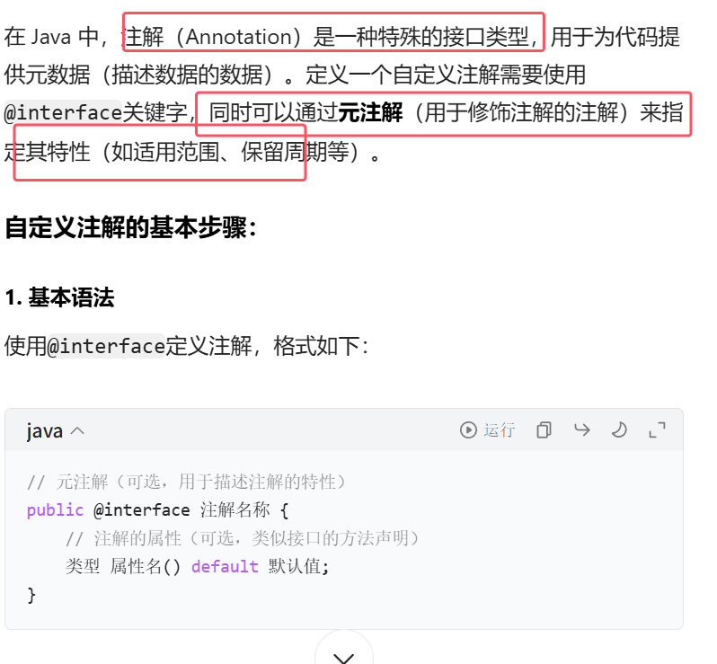
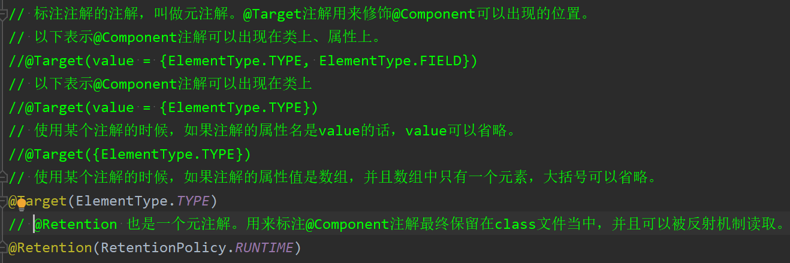
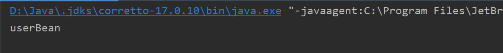

### 1.注解的使用

**注解的存在主要是为了简化XML的配置。Spring6倡导全注解开发**。

我们来回顾一下：  
- 第一：注解怎么定义，注解中的属性怎么定义？
- 第二：注解怎么使用？
- 第三：通过反射机制怎么读取注解？

1. **注解怎么定义，注解中的属性怎么定义？**
```java
package com.powernode.annotation;

import java.lang.annotation.ElementType;
import java.lang.annotation.Retention;
import java.lang.annotation.RetentionPolicy;
import java.lang.annotation.Target;

@Target(value = {ElementType.TYPE})
@Retention(value = RetentionPolicy.RUNTIME)
public @interface Component {
	// 定义注解的属性  
	// String是属性类型  
	// value是属性名
    String value();
}
```
* **以上是自定义了一个注解：Component**。其基本语法如下图所示。  
	
* **标注注解的注解，叫做元注解。图中注解上面标注的元注解包括：Target注解和Retention注解，这两个注解被称为元注解。Target注解用来设置Component注解可以出现的位置**，以上代表表示Component注解只能用在类和接口上。**Retention注解用来设置Component注解的保持性策略**，以上代表Component注解最终保留在class文件当中，可以被反射机制读取。  
	
* **属性的定义格式：``类型 属性名() default 默认值``属性后面要加()，default后面是该属性的默认值**


2. String value(); 是Component注解中的一个属性。该属性类型String，属性名是value。**注解怎么使用？**
```java
package com.powernode.bean;

import com.powernode.annotation.Component;

@Component(value = "userBean")
public class User {
}

```
* **用法简单，语法格式：@注解类型名(属性名=属性值, 属性名=属性值, 属性名=属性值......)，相当于给属性赋值**
* userBean为什么使用双引号括起来，因为value属性是String类型，字符串。**另外如果属性名是value，则在使用的时候可以省略属性名**，例如：
```java
package com.powernode.bean;

import com.powernode.annotation.Component;

//@Component(value = "userBean")
@Component("userBean")
public class User {
}

```


### 2.通过反射机制读取注解

接下来，我们来写一段程序，当Bean类上有Component注解时，则实例化Bean对象，如果没有，则不实例化对象。

我们准备两个Bean，一个上面有注解，一个上面没有注解。
```java
package com.powernode.bean;

import com.powernode.annotation.Component;

@Component("userBean")
public class User {
}
```
```java
package com.powernode.bean;

public class Vip {
}
```
 测试程序如下
```java
ppackage com.powernode.client;  
  
import com.powernode.annotation.Component;  
  
/**  
* @author 动力节点  
* @version 1.0  
* @className ReflectAnnotationTest1  
* @since 1.0  
**/  
public class ReflectAnnotationTest1 {  
	public static void main(String[] args) throws Exception{  
		// 通过反射机制怎么读取注解  
		// 获取类  
		Class<?> aClass = Class.forName("com.powernode.bean.User");  
		// 判断类上面有没有这个注解  
		if (aClass.isAnnotationPresent(Component.class)) {  
		// 获取类上的注解  
		Component annotation = aClass.getAnnotation(Component.class);  
		// 访问注解属性  
		System.out.println(annotation.value());  
		}  
	}  
}
```
执行结果：    



### 3.组件扫描原理

**假设我们现在只知道包名：com.powernode.bean，需要写一段程序，扫描包下所有的类，只要类上面有component注解的，就把对象造出来，放到Map集合里面**。至于这个包下有多少个Bean我们不知道。哪些Bean上有注解，哪些Bean上没有注解，这些我们都不知道，如何通过程序全自动化判断。
```java
package com.powernode.test;

import com.powernode.annotation.Component;

import java.io.File;
import java.net.URL;
import java.util.Arrays;
import java.util.Enumeration;
import java.util.HashMap;
import java.util.Map;

/**
 * @author 动力节点
 * @version 1.0
 * @className Test
 * @since 1.0
 **/
public class Test {
    public static void main(String[] args) throws Exception {
        // 存放Bean的Map集合。key存储beanId。value存储Bean。
        Map<String,Object> beanMap = new HashMap<>();

        String packageName = "com.powernode.bean";
        //开始写扫描程序。首先将包名变成路径  
		// . 这个正则表达式代表任意字符。这里的"."必须是一个普通的"."字符。不能是正则表达式中的"."  
		// 在正则表达式当中怎么表示一个普通的"."字符呢？使用 \. 正则表达式代表一个普通的 . 字符。
        String path = packageName.replaceAll("\\.", "/");
        // com是在类的根路径下的一个目录。系统类加载器自动从类的根路径开始加载资源
        //返回了一个统一资源定位符，也就是url，可以看作路径
        URL url = ClassLoader.getSystemClassLoader().getResource(path);
        //url.getPath()获取绝对路径
        File file = new File(url.getPath());
        // 获取一个绝对路径下的所有文件
        File[] files = file.listFiles();
        //将数组转为流，利用 Stream API 提供的丰富操作来处理数组中的元素。
        Arrays.stream(files).forEach(f -> {
	        //f代表的是该路径下的每一个文件
	        //得到每个类的全限定类名
            String className = packageName + "." + f.getName().split("\\.")[0];
            try {
                // 通过反射机制解析注解  
				Class<?> aClass = Class.forName(className);  
				// 判断类上是否有这个注解  
				if (aClass.isAnnotationPresent(Component.class)) {  
				// 获取注解  
				Component annotation = aClass.getAnnotation(Component.class);  
				String id = annotation.value();  
				// 有这个注解的都要创建对象  
				Object obj = aClass.newInstance();  
				beanMap.put(id, obj);
            } catch (Exception e) {
                e.printStackTrace();
            }
        });

        System.out.println(beanMap);
    }
}
```
执行结果：    

