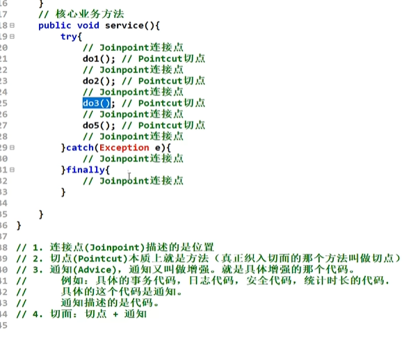

* IoC使软件组件松耦合。AOP让你能够捕捉系统中经常使用的功能，把它转化成组件。
* **AOP（Aspect Oriented Programming）：面向切面编程，面向方面编程。（AOP是一种编程技术）。切面就是程序中和业务逻辑没有关系的通用代码**。 AOP是对OOP的补充延伸。
* **AOP底层使用的就是动态代理来实现的。**
* **==Spring的AOP使用的动态代理是：JDK动态代理 + CGLIB动态代理技术。Spring在这两种动态代理中灵活切换，如果是代理接口，会默认使用JDK动态代理；如果要代理某个类，这个类没有实现接口，就会切换使用CGLIB==**。
* **当然，你也可以强制通过一些配置让Spring只使用CGLIB**。

## 一、AOP理解
**一般一个系统当中都会有一些系统服务，例如：日志、事务管理、安全等。这些系统服务被称为：交叉业务**

这些**交叉业务**几乎是通用的，不管你是做银行账户转账，还是删除用户数据。日志、事务管理、安全，这些都是需要做的。

如果在每一个业务处理过程当中，都掺杂这些交叉业务代码进去的话，存在两方面问题：  
- 第一：交叉业务代码在多个业务流程中反复出现，显然这个**交叉业务代码没有得到复用**。并且修改这些交叉业务代码的话，需要修改多处。
- 第二：程序员无法专注核心业务代码的编写，**在编写核心业务代码的同时还需要处理这些交叉业务**。

使用AOP可以很轻松的解决以上问题。

请看下图，可以帮助你快速理解AOP的思想：  


* **用一句话总结AOP：将与核心业务无关的通用代码独立的抽取出来，形成一个独立的组件，然后以横向交叉的方式应用到业务流程当中的过程被称为AOP。**
* **AOP的优点：**  
	- **第一：代码复用性增强。**
	- **第二：代码易维护。**
	- **第三：使开发者更关注业务逻辑。**


## 二、AOP的七大术语
```java
public class UserService{
    public void do1(){
        System.out.println("do 1");
    }
    public void do2(){
        System.out.println("do 2");
    }
    public void do3(){
        System.out.println("do 3");
    }
    public void do4(){
        System.out.println("do 4");
    }
    public void do5(){
        System.out.println("do 5");
    }
    // 核心业务方法
    public void service(){
        do1();
        do2();
        do3();
        do5();
    }
}  
```
- **连接点 Joinpoint**
   - 在程序的整个执行流程中，**可以织入切面的位置。方法的执行前后，异常抛出之后等位置**。    
- **切点 Pointcut**
   - 在程序执行流程中，**真正织入切面的方法。（一个切点对应多个连接点）**
- **通知 Advice**
   - **通知又叫增强，就是具体你要织入的增强代码**。
   - 通知包括：
      - **前置通知**
      - **后置通知**
      - **环绕通知**
      - **异常通知(catch块)**
      - **最终通知(finally块)**
- **切面 Aspect**
   - **切点 + 通知就是切面。**
- **织入 Weaving**
   - **通知应用到目标对象上的过程。**
- 代理对象 Proxy
   - 一个目标对象被织入通知后产生的新对象。
- 目标对象 Target
   - 被织入通知的对象。

对于这七个属于的理解如下图所示    



## 三、切点表达式
**切点表达式用来定义通知（Advice）往哪些方法上切入。**

**切入点表达式语法格式：**
```
execution([访问控制权限修饰符] 返回值类型 [全限定类名].方法名(形式参数列表) [异常])
```
1. 访问控制权限修饰符：  
	- 可选项。
	- **没写，就是4个权限都包括**。
	- **写public就表示只包括公开的方法**。
2. 返回值类型：  
	- 必填项。
	- **\* 表示返回值类型任意**。
3. 全限定类名：  
	- 可选项。
	- **两个点“..”代表当前包以及子包下的所有类**。
	- **省略时表示所有的类**。
4. 方法名：  
	- 必填项。
	- **\*表示所有方法**。
	- **set\*表示所有的set方法**。
5. 形式参数列表：    
	- 必填项
	- **() 表示没有参数的方法**
	- **(..) 参数类型和个数随意的方法**
	- **(\*) 只有一个参数的方法**
	- **(\*, String) 第一个参数类型随意，第二个参数是String的**。
6. 异常：  
	- 可选项。
	- **省略时表示任意异常类型**。

理解以下的切点表达式：    
```java
//通知切入的方法为：公开的、返回值类型任意的、com.powernode.mall.service包下所有的类但不包括子包的所有类、以delete开始的、参数随意的方法
execution(public * com.powernode.mall.service.*.delete*(..))
//通知切入的方法为：访问修饰符随意、返回值类型随意、mall包下的所有的类以及子包下的所有类所有的方法
execution(* com.powernode.mall..*(..))
//所有类的所有方法
execution(* *(..))
```

