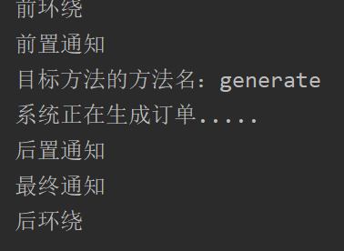
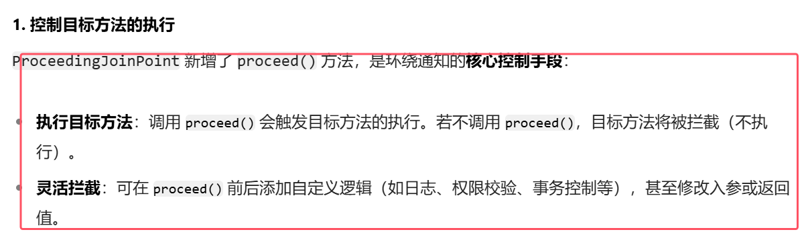

## 一、使用Spring的AOP

* **Spring对AOP的实现包括以下3种方式**：
	- **第一种方式：Spring框架结合AspectJ框架实现的AOP，基于注解方式（使用最多）。**
	- **第二种方式：Spring框架结合AspectJ框架实现的AOP，基于XML方式。**
	- 第三种方式：Spring框架自己实现的AOP，基于XML配置方式。(用的很少，不用看)
* **实际开发中，都是Spring+AspectJ来实现AOP。所以我们重点学习第一种和第二种方式。**
* 什么是AspectJ？（**Eclipse组织的一个支持AOP的框架**。AspectJ框架是独立于Spring框架之外的一个框架，Spring框架用了AspectJ）。AspectJ项目起源于帕洛阿尔托（Palo Alto）研究中心（缩写为PARC）。该中心由Xerox集团资助，Gregor Kiczales领导，从1997年开始致力于AspectJ的开发，1998年第一次发布给外部用户，2001年发布1.0 release。为了推动AspectJ技术和社团的发展，PARC在2003年3月正式将AspectJ项目移交给了Eclipse组织，因为AspectJ的发展和受关注程度大大超出了PARC的预期，他们已经无力继续维持它的发展。


### 1.准备工作
使用Spring+AspectJ的AOP需要引入的依赖如下：
```xml
<!--spring context依赖-->
<dependency>
  <groupId>org.springframework</groupId>
  <artifactId>spring-context</artifactId>
  <version>6.0.0-M2</version>
</dependency>
<!--spring aop依赖-->
<dependency>
  <groupId>org.springframework</groupId>
  <artifactId>spring-aop</artifactId>
  <version>6.0.0-M2</version>
</dependency>
<!--spring aspects依赖,即AspactJ框架的依赖-->
<dependency>
  <groupId>org.springframework</groupId>
  <artifactId>spring-aspects</artifactId>
  <version>6.0.0-M2</version>
</dependency>
```
Spring配置文件中添加context命名空间和aop命名空间
```xml
<?xml version="1.0" encoding="UTF-8"?>
<beans xmlns="http://www.springframework.org/schema/beans"
       xmlns:xsi="http://www.w3.org/2001/XMLSchema-instance"
       xmlns:context="http://www.springframework.org/schema/context"
       xmlns:aop="http://www.springframework.org/schema/aop"
       xsi:schemaLocation="http://www.springframework.org/schema/beans http://www.springframework.org/schema/beans/spring-beans.xsd
                           http://www.springframework.org/schema/context http://www.springframework.org/schema/context/spring-context.xsd
                           http://www.springframework.org/schema/aop http://www.springframework.org/schema/aop/spring-aop.xsd">

</beans>
```


### 2.基于AspectJ的AOP注解式开发
#### 实现步骤
1. **定义目标类以及目标方法**
```java
package com.powernode.spring6.service;

// 目标类
public class OrderService {
    // 目标方法
    public void generate(){
        System.out.println("订单已生成！");
    }
}
```
2. **定义切面类**
```java
package com.powernode.spring6.service;

import org.aspectj.lang.annotation.Aspect;

// 切面类
@Aspect
public class MyAspect {
}
```
3. 第三步：**目标类和切面类都纳入spring bean管理**：在目标类OrderService上添加@Component**注解。在切面类MyAspect类上添加**@Component**注解。

4. **在spring配置文件中添加组建扫描**
```xml
<?xml version="1.0" encoding="UTF-8"?>
<beans xmlns="http://www.springframework.org/schema/beans"
       xmlns:xsi="http://www.w3.org/2001/XMLSchema-instance"
       xmlns:context="http://www.springframework.org/schema/context"
       xmlns:aop="http://www.springframework.org/schema/aop"
       xsi:schemaLocation="http://www.springframework.org/schema/beans http://www.springframework.org/schema/beans/spring-beans.xsd
                           http://www.springframework.org/schema/context http://www.springframework.org/schema/context/spring-context.xsd
                           http://www.springframework.org/schema/aop http://www.springframework.org/schema/aop/spring-aop.xsd">
    <!--开启组件扫描-->
    <context:component-scan base-package="com.powernode.spring6.service"/>
</beans>
```
5. **在切面类中添加通知**
```java
package com.powernode.spring6.service;

import org.springframework.stereotype.Component;
import org.aspectj.lang.annotation.Aspect;

// 切面类
@Aspect
@Component
public class MyAspect {
    // 这就是需要增强的代码（通知）
    public void advice(){
        System.out.println("我是一个通知");
    }
}
```
6. **在通知上添加切点表达式**
```java
package com.powernode.spring6.service;

import org.aspectj.lang.annotation.Before;
import org.springframework.stereotype.Component;
import org.aspectj.lang.annotation.Aspect;

// 切面类
@Aspect
@Component
public class MyAspect {
    // 切面 = 通知 + 切点
    // 切点表达式
    @Before("execution(* com.powernode.spring6.service.OrderService.*(..))")
    // 这就是需要增强的代码（通知）
    public void advice(){
        System.out.println("我是一个通知");
    }
}
```
* **@Aspect注解用于说明该类是一个切面类**
* **注解@Before标注的方法表示该方法为前置通知。其中填入的值为切点表达式，来表示切点。即通知往哪些切点上切入**
* **注意通知是就是增强的代码。它在切面类中是一个方法，其中的方法体就是增强的代码，方法名随意写**

7. **在spring配置文件中启用自动代理**
```xml
<?xml version="1.0" encoding="UTF-8"?>
<beans xmlns="http://www.springframework.org/schema/beans"
       xmlns:xsi="http://www.w3.org/2001/XMLSchema-instance"
       xmlns:context="http://www.springframework.org/schema/context"
       xmlns:aop="http://www.springframework.org/schema/aop"
       xsi:schemaLocation="http://www.springframework.org/schema/beans http://www.springframework.org/schema/beans/spring-beans.xsd
                           http://www.springframework.org/schema/context http://www.springframework.org/schema/context/spring-context.xsd
                           http://www.springframework.org/schema/aop http://www.springframework.org/schema/aop/spring-aop.xsd">
    <!--开启组件扫描-->
    <context:component-scan base-package="com.powernode.spring6.service"/>
    <!--开启aspectj的自动代理-->
    <aop:aspectj-autoproxy proxy-target-class="true"/>
</beans>
```
* **<aop:aspectj-autoproxy  proxy-target-class="true"/> 表示开启自动代理。spring容器在扫描类的时候，扫描到带有`@Aspect` 的类时，会将其识别为切面类。并解析其中的切点表达式。对匹配切点的目标对象，Spring 会为目标对象创建代理对象，并将切面的通知逻辑织入目标方法的执行流程**。  
* **proxy-target-class="true" 表示强制使用CGLIB动态代理。
* **proxy-target-class="false" 是默认值。表示采用jdk动态代理。即使写成false，当没有接口的时候，也会自动选择cglib生成代理类。**

测试程序：
```java
package com.powernode.spring6.test;

import com.powernode.spring6.service.OrderService;
import org.junit.Test;
import org.springframework.context.ApplicationContext;
import org.springframework.context.support.ClassPathXmlApplicationContext;

public class AOPTest {
    @Test
    public void testAOP(){
        ApplicationContext applicationContext = new ClassPathXmlApplicationContext("spring-aspectj-aop-annotation.xml");
        OrderService orderService = applicationContext.getBean("orderService", OrderService.class);
        orderService.generate();
    }
}

```
运行结果：  


#### 通知类型
1. 通知类型包括：    
	- **前置通知：@Before 目标方法执行之前的通知**
	- **后置通知：@AfterReturning 目标方法执行之后的通知**
	- **环绕通知：@Around 目标方法之前添加通知，同时目标方法执行之后添加通知。(环绕是最大的通知，在前置通知之前，在后置通知之后。**)
	- **异常通知：@AfterThrowing 发生异常之后执行的通知(在catch块中执行的增强代码)**
	- **最终通知：@After 放在finally语句块中的通知**
2. 这五个通知的具体切入顺序如下图所示  
	
3. **除了环绕通知之外，其他通知所对应的方法都可以传入一个`JoinPoint joinPoint`参数,该参数会在Spring容器调用这个方法的时候自动传过来。可以通过该joinPoint参数获取目标方法的具体信息。比如：`getSignature()方法`：获取方法签名（如方法名、返回类型）**
4. **对于环绕通知，可以传入一个`ProceedingJoinPoint joinPoint`参数，该参数传入是一个连接点，专门用于环绕通知（`@Around`），其核心作用是控制目标方法的执行流程并获取连接点的上下文信息**    
	

接下来，编写程序来测试这几个通知的执行顺序：
```java
package com.powernode.spring6.service;

import org.aspectj.lang.ProceedingJoinPoint;
import org.aspectj.lang.annotation.*;
import org.springframework.stereotype.Component;

// 切面类
@Component
@Aspect
public class MyAspect {

    @Around("execution(* com.powernode.spring6.service.OrderService.*(..))")
    public void aroundAdvice(ProceedingJoinPoint proceedingJoinPoint) throws Throwable {
        System.out.println("环绕通知开始");
        // 执行目标方法。
        proceedingJoinPoint.proceed();
        System.out.println("环绕通知结束");
    }

    // 前置通知  
	@Before("通用切点()")  
	public void beforeAdvice(JoinPoint joinPoint){  
	System.out.println("前置通知");  
	// 这个JoinPoint joinPoint，在Spring容器调用这个方法的时候自动传过来.  
	// 我们可以直接用。用这个JoinPoint joinPoint干啥？  
	// Signature signature = joinPoint.getSignature(); 获取目标方法的签名。  
	// 通过方法的签名可以获取到一个方法的具体信息。  
	// 获取目标方法的方法名。  
	System.out.println("目标方法的方法名：" + joinPoint.getSignature().getName());  
	}

    @AfterReturning("execution(* com.powernode.spring6.service.OrderService.*(..))")
    public void afterReturningAdvice(){
        System.out.println("后置通知");
    }

    @AfterThrowing("execution(* com.powernode.spring6.service.OrderService.*(..))")
    public void afterThrowingAdvice(){
        System.out.println("异常通知");
    }

    @After("execution(* com.powernode.spring6.service.OrderService.*(..))")
    public void afterAdvice(){
        System.out.println("最终通知");
    }
}
```
```java
package com.powernode.spring6.service;

import org.springframework.stereotype.Component;

// 目标类
@Component
public class OrderService {
    // 目标方法
    public void generate(){
        System.out.println("订单已生成！");
    }
}

```
```java
package com.powernode.spring6.test;

import com.powernode.spring6.service.OrderService;
import org.junit.Test;
import org.springframework.context.ApplicationContext;
import org.springframework.context.support.ClassPathXmlApplicationContext;

public class AOPTest {
    @Test
    public void testAOP(){
        ApplicationContext applicationContext = new ClassPathXmlApplicationContext("spring-aspectj-aop-annotation.xml");
        OrderService orderService = applicationContext.getBean("orderService", OrderService.class);
        orderService.generate();
    }
}
```
执行结果：  


通过上面的执行结果就可以判断他们的执行顺序了，这里不再赘述。

结果中没有异常通知，这是因为目标程序执行过程中没有发生异常。我们尝试让目标方法发生异常：
```java
package com.powernode.spring6.service;

import org.springframework.stereotype.Component;

// 目标类
@Component
public class OrderService {
    // 目标方法
    public void generate(){
        System.out.println("订单已生成！");
        if (1 == 1) {
            throw new RuntimeException("模拟异常发生");
        }
    }
}
```
再次执行测试程序，结果如下：    

通过测试得知，当发生异常之后，最终通知也会执行，因为最终通知@After会出现在finally语句块中。

出现异常之后，**后置通知**和**环绕通知的结束部分**不会执行。


#### 切面的先后顺序
我们知道，业务流程当中不一定只有一个切面，可能有的切面控制事务，有的记录日志，有的进行安全控制，**同一个连接点，如果有多个切面的话，顺序如何控制：可以使用==@Order注解来标识切面类==，为@Order注解的value指定一个整数型的数字，数字越小，优先级越高**。

再定义一个切面类，如下：
```java
package com.powernode.spring6.service;

import org.aspectj.lang.ProceedingJoinPoint;
import org.aspectj.lang.annotation.*;
import org.springframework.core.annotation.Order;
import org.springframework.stereotype.Component;

@Aspect
@Component
@Order(1) //设置优先级
public class YourAspect {

    @Around("execution(* com.powernode.spring6.service.OrderService.*(..))")
    public void aroundAdvice(ProceedingJoinPoint proceedingJoinPoint) throws Throwable {
        System.out.println("YourAspect环绕通知开始");
        // 执行目标方法。
        proceedingJoinPoint.proceed();
        System.out.println("YourAspect环绕通知结束");
    }

    @Before("execution(* com.powernode.spring6.service.OrderService.*(..))")
    public void beforeAdvice(){
        System.out.println("YourAspect前置通知");
    }

    @AfterReturning("execution(* com.powernode.spring6.service.OrderService.*(..))")
    public void afterReturningAdvice(){
        System.out.println("YourAspect后置通知");
    }

    @AfterThrowing("execution(* com.powernode.spring6.service.OrderService.*(..))")
    public void afterThrowingAdvice(){
        System.out.println("YourAspect异常通知");
    }

    @After("execution(* com.powernode.spring6.service.OrderService.*(..))")
    public void afterAdvice(){
        System.out.println("YourAspect最终通知");
    }
}
```

```java
package com.powernode.spring6.service;

import org.aspectj.lang.ProceedingJoinPoint;
import org.aspectj.lang.annotation.*;
import org.springframework.core.annotation.Order;
import org.springframework.stereotype.Component;

// 切面类
@Component
@Aspect
@Order(2) //设置优先级
public class MyAspect {

    @Around("execution(* com.powernode.spring6.service.OrderService.*(..))")
    public void aroundAdvice(ProceedingJoinPoint proceedingJoinPoint) throws Throwable {
        System.out.println("环绕通知开始");
        // 执行目标方法。
        proceedingJoinPoint.proceed();
        System.out.println("环绕通知结束");
    }

    @Before("execution(* com.powernode.spring6.service.OrderService.*(..))")
    public void beforeAdvice(){
        System.out.println("前置通知");
    }

    @AfterReturning("execution(* com.powernode.spring6.service.OrderService.*(..))")
    public void afterReturningAdvice(){
        System.out.println("后置通知");
    }

    @AfterThrowing("execution(* com.powernode.spring6.service.OrderService.*(..))")
    public void afterThrowingAdvice(){
        System.out.println("异常通知");
    }

    @After("execution(* com.powernode.spring6.service.OrderService.*(..))")
    public void afterAdvice(){
        System.out.println("最终通知");
    }

}
```
执行测试程序：    

通过修改@Order注解的整数值来切换顺序，执行测试程序：


#### 优化使用切点表达式（通用切点）
观看以下代码中的切点表达式：
```java
package com.powernode.spring6.service;

import org.aspectj.lang.ProceedingJoinPoint;
import org.aspectj.lang.annotation.*;
import org.springframework.core.annotation.Order;
import org.springframework.stereotype.Component;

// 切面类
@Component
@Aspect
@Order(2)
public class MyAspect {

    @Around("execution(* com.powernode.spring6.service.OrderService.*(..))")
    public void aroundAdvice(ProceedingJoinPoint proceedingJoinPoint) throws Throwable {
        System.out.println("环绕通知开始");
        // 执行目标方法。
        proceedingJoinPoint.proceed();
        System.out.println("环绕通知结束");
    }

    @Before("execution(* com.powernode.spring6.service.OrderService.*(..))")
    public void beforeAdvice(){
        System.out.println("前置通知");
    }

    @AfterReturning("execution(* com.powernode.spring6.service.OrderService.*(..))")
    public void afterReturningAdvice(){
        System.out.println("后置通知");
    }

    @AfterThrowing("execution(* com.powernode.spring6.service.OrderService.*(..))")
    public void afterThrowingAdvice(){
        System.out.println("异常通知");
    }

    @After("execution(* com.powernode.spring6.service.OrderService.*(..))")
    public void afterAdvice(){
        System.out.println("最终通知");
    }

}

```
缺点是：  
- 第一：切点表达式重复写了多次，没有得到复用。
- 第二：如果要修改切点表达式，需要修改多处，难维护。

可以这样做：将切点表达式单独的定义出来，在需要的位置引入即可。如下：
```java
package com.powernode.spring6.service;

import org.aspectj.lang.ProceedingJoinPoint;
import org.aspectj.lang.annotation.*;
import org.springframework.core.annotation.Order;
import org.springframework.stereotype.Component;

// 切面类
@Component
@Aspect
@Order(2)
public class MyAspect {
    
    @Pointcut("execution(* com.powernode.spring6.service.OrderService.*(..))")
    public void pointcut(){}

    @Around("pointcut()")
    public void aroundAdvice(ProceedingJoinPoint proceedingJoinPoint) throws Throwable {
        System.out.println("环绕通知开始");
        // 执行目标方法。
        proceedingJoinPoint.proceed();
        System.out.println("环绕通知结束");
    }

    @Before("pointcut()")
    public void beforeAdvice(){
        System.out.println("前置通知");
    }

    @AfterReturning("pointcut()")
    public void afterReturningAdvice(){
        System.out.println("后置通知");
    }

    @AfterThrowing("pointcut()")
    public void afterThrowingAdvice(){
        System.out.println("异常通知");
    }

    @After("pointcut()")
    public void afterAdvice(){
        System.out.println("最终通知");
    }

}

```
* **使用@Pointcut注解来定义独立的切点表达式。该注解下面的方法只是一个标记，方法名随意，方法体中也不需要写任何代码。**
* **其他注解复用该注解时，只需要对是通知的属性赋值该方法的名字即可**


执行测试程序：


#### 全注解式开发AOP
* **就是编写一个类，在这个类上面使用大量注解来代替spring的配置文件，spring配置文件消失了。**
* **使用@Configuration注解写在类上代表该类是一个配置类；使用@ComponentScan注解来声明扫描的包名；@EnableAspectJAutoProxy表示启用aspectj的自动代理机制(里面的参数指定是否强制使用cglib代理)**
* **使用该配置文件时，就不再用`ClassPathXmlApplicationContext`去读取xml文件了，而是使用`AnnotationConfigApplicationContext(配置类.class)`去进行进行配置的加载和Bean创建等工作**

```java
package com.powernode.spring6.service;

import org.springframework.context.annotation.ComponentScan;
import org.springframework.context.annotation.Configuration;
import org.springframework.context.annotation.EnableAspectJAutoProxy;

@Configuration
@ComponentScan("com.powernode.spring6.service")
@EnableAspectJAutoProxy(proxyTargetClass = true)
public class Spring6Configuration {
}
```
测试程序也变化了：
```java
@Test
public void testAOPWithAllAnnotation(){
    ApplicationContext applicationContext = new AnnotationConfigApplicationContext(Spring6Configuration.class);
    OrderService orderService = applicationContext.getBean("orderService", OrderService.class);
    orderService.generate();
}
```
执行结果如下：  


### 3.基于XML配置方式的AOP（了解）
第一步：编写目标类
```java
package com.powernode.spring6.service;

// 目标类
public class VipService {
    public void add(){
        System.out.println("保存vip信息。");
    }
}
```
第二步：编写切面类，并且编写通知
```java
package com.powernode.spring6.service;

import org.aspectj.lang.ProceedingJoinPoint;

// 负责计时的切面类
public class TimerAspect {
	//通知
    public void time(ProceedingJoinPoint proceedingJoinPoint) throws Throwable {
        long begin = System.currentTimeMillis();
        //执行目标方法
        proceedingJoinPoint.proceed();
        long end = System.currentTimeMillis();
        System.out.println("耗时"+(end - begin)+"毫秒");
    }
}

```
第三步：编写spring配置文件
```xml
<?xml version="1.0" encoding="UTF-8"?>
<beans xmlns="http://www.springframework.org/schema/beans"
       xmlns:xsi="http://www.w3.org/2001/XMLSchema-instance"
       xmlns:context="http://www.springframework.org/schema/context"
       xmlns:aop="http://www.springframework.org/schema/aop"
       xsi:schemaLocation="http://www.springframework.org/schema/beans http://www.springframework.org/schema/beans/spring-beans.xsd
                           http://www.springframework.org/schema/context http://www.springframework.org/schema/context/spring-context.xsd
                           http://www.springframework.org/schema/aop http://www.springframework.org/schema/aop/spring-aop.xsd">

    <!--纳入spring bean管理-->
    <bean id="vipService" class="com.powernode.spring6.service.VipService"/>
    <bean id="timerAspect" class="com.powernode.spring6.service.TimerAspect"/>

    <!--aop配置-->
    <aop:config>
        <!--切点表达式-->
        <aop:pointcut id="p" expression="execution(* com.powernode.spring6.service.VipService.*(..))"/>
        <!--切面-->
        <aop:aspect ref="timerAspect">
            <!--切面=通知 + 切点-->
            <aop:around method="time" pointcut-ref="p"/>
        </aop:aspect>
    </aop:config>
</beans>
```
测试程序：
```java
package com.powernode.spring6.test;

import com.powernode.spring6.service.VipService;
import org.junit.Test;
import org.springframework.context.ApplicationContext;
import org.springframework.context.support.ClassPathXmlApplicationContext;

public class AOPTest3 {

    @Test
    public void testAOPXml(){
        ApplicationContext applicationContext = new ClassPathXmlApplicationContext("spring-aop-xml.xml");
        VipService vipService = applicationContext.getBean("vipService", VipService.class);
        vipService.add();
    }
}

```
执行结果：  


