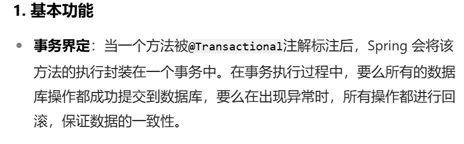

### 1.Spring实现事务的两种方式

- 编程式事务
   - 通过编写代码的方式来实现事务的管理。
- **声明式事务**
   - **基于注解方式（使用最多）**
   - **基于XML配置方式**
### 2.Spring事务管理API
**Spring对事务的管理底层实现方式是基于AOP实现的。采用AOP的方式进行了封装。所以Spring专门针对事务开发了一套API**，API的核心接口如下：


**PlatformTransactionManager接口：spring事务管理器的核心接口。在Spring6中它有两个实现：**
- **DataSourceTransactionManager：支持JdbcTemplate、MyBatis、Hibernate等事务管理**。
- **JtaTransactionManager：支持分布式事务管理**。
- **Spring内置写好了DataSourceTransactionManager事务管理器，可以直接用**。

如果要在Spring6中使用JdbcTemplate，就要使用DataSourceTransactionManager来管理事务。


### 3.声明式事务之注解实现方式

1. 在spring配置文件中配置事务管理器。
```xml
<bean id="transactionManager" class="org.springframework.jdbc.datasource.DataSourceTransactionManager">
  <property name="dataSource" ref="dataSource"/>
</bean>
```
* 事务管理器就是管理连接对象不会自动去提交，而是手动提交事务，即`conn.setAutoCommit(false);`所以需要注入数据源连接对象。**需要向事务管理器中注入数据源**

2. 在spring配置文件中引入tx命名空间。
```xml
<?xml version="1.0" encoding="UTF-8"?>
<beans xmlns="http://www.springframework.org/schema/beans"
       xmlns:xsi="http://www.w3.org/2001/XMLSchema-instance"
       xmlns:context="http://www.springframework.org/schema/context"
       xmlns:tx="http://www.springframework.org/schema/tx"
       xsi:schemaLocation="http://www.springframework.org/schema/beans http://www.springframework.org/schema/beans/spring-beans.xsd
                           http://www.springframework.org/schema/context http://www.springframework.org/schema/context/spring-context.xsd
                           http://www.springframework.org/schema/tx http://www.springframework.org/schema/tx/spring-tx.xsd">
```

3. 在spring配置文件中配置“事务注解驱动器”，开始注解的方式控制事务。
```xml
<tx:annotation-driven transaction-manager="transactionManager"/>
```
* **`<tx:annotation-driven>`标签用于开启事务注解驱动器，开启事务注解。即告诉Spring框架，采用注解的方式去控制事务。其中transaction-manager用于指定事务管理器**

4. 在service类上或方法上添加@Transactional注解

* **@Transactional注解的用法：在类上添加该注解，该类中所有的方法都有事务。在某个方法上添加该注解，表示只有这个方法使用事务。**使用事务的意思如下图所示  
	
```java
package com.powernode.bank.service.impl;

import com.powernode.bank.dao.AccountDao;
import com.powernode.bank.pojo.Account;
import com.powernode.bank.service.AccountService;
import jakarta.annotation.Resource;
import org.springframework.stereotype.Service;
import org.springframework.transaction.annotation.Transactional;

/**
 * @author 动力节点
 * @version 1.0
 * @className AccountServiceImpl
 * @since 1.0
 **/
@Service("accountService")
@Transactional
public class AccountServiceImpl implements AccountService {

    @Resource(name = "accountDao")
    private AccountDao accountDao;

    @Override
    public void transfer(String fromActno, String toActno, double money) {
        // 查询账户余额是否充足
        Account fromAct = accountDao.selectByActno(fromActno);
        if (fromAct.getBalance() < money) {
            throw new RuntimeException("账户余额不足");
        }
        // 余额充足，开始转账
        Account toAct = accountDao.selectByActno(toActno);
        fromAct.setBalance(fromAct.getBalance() - money);
        toAct.setBalance(toAct.getBalance() + money);
        int count = accountDao.update(fromAct);

        // 模拟异常
        String s = null;
        s.toString();

        count += accountDao.update(toAct);
        if (count != 2) {
            throw new RuntimeException("转账失败，请联系银行");
        }
    }
}

```
当前数据库表中的数据：  

执行测试程序：  

虽然出现异常了，再次查看数据库表中数据：  

通过测试，发现数据没有变化，事务起作用了。


### 4.@Transactional注解属性
##### 事务属性包括哪些


事务中的重点属性：  
- **事务传播行为propagation**
- **事务隔离级别isolation**
- **事务超时timeout，默认为-1永不超时**
- **只读事务readOnly，默认为false，即不是只读事务**
- **设置出现哪些异常回滚事务rollbackFor()**
- **设置出现哪些异常不回滚事务noRollbackFor()**


#### 事务传播行为
什么是**事务的传播行为？**

在service类中有a()方法和b()方法，a()方法上有事务，b()方法上也有事务，当a()方法执行过程中调用了b()方法，事务是如何传递的？合并到一个事务里？还是开启一个新的事务？这就是事务传播行为。

定义：**当一个事务方法被另一个事务方法调用时，如何处理两个方法之间的事务关系**

事务传播行为在spring框架中被定义为枚举类型：  


1. 一共有七种传播行为：
	- **REQUIRED（默认值）：支持当前事务，如果存在就是用原先的事务；如果不存在就新建一个事务【没有就新建，有就加入】**
	- SUPPORTS：支持当前事务，如果存在就使用原先的事务；如果当前没有事务，就以非事务方式执行 **【有就加入，没有就不管了】**
	- MANDATORY：必须运行在一个事务中，如果当前没有事务正在发生，将抛出一个异常 **【有就加入，没有就抛异常】**
	- **REQUIRES_NEW：开启一个新的事务，如果一个事务已经存在，则将这个存在的事务挂起【不管有没有，直接开启一个新事务，开启的新事务和之前的事务不存在嵌套关系，之前事务被挂起】**
	- NOT_SUPPORTED：以非事务方式运行，如果有事务存在，挂起当前事务 **【不支持事务，存在就挂起】**
	- NEVER：以非事务方式运行，如果有事务存在，抛出异常 **【不支持事务，存在就抛异常】**
	- **NESTED：如果当前正有一个事务在进行中，则该方法应当运行在一个嵌套式事务中。被嵌套的事务可以独立于外层事务进行提交或回滚。如果外层事务不存在，行为就像REQUIRED一样。【有事务的话，就在这个事务里再嵌套一个完全独立的事务，嵌套的事务可以独立的提交和回滚。没有事务就和REQUIRED一样，即新建一个事务。】**
2. **用的比较多的是REQUIRED（默认值）和REQUIRES_NEW，记忆这两个足够**

在代码中设置事务的传播行为：
```java
@Transactional(propagation = Propagation.REQUIRED)
```
可以编写程序测试一下传播行为：
```java
@Transactional(propagation = Propagation.REQUIRED)
public void save(Account act) {

    // 这里调用dao的insert方法。
    accountDao.insert(act); // 保存act-003账户

    // 创建账户对象
    Account act2 = new Account("act-004", 1000.0);
    try {
        accountService.save(act2); // 保存act-004账户
    } catch (Exception e) {

    }
    // 继续往后进行我当前1号事务自己的事儿。
}
```
```java
@Override
//@Transactional(propagation = Propagation.REQUIRED)
@Transactional(propagation = Propagation.REQUIRES_NEW)
public void save(Account act) {
    accountDao.insert(act);
    // 模拟异常
    String s = null;
    s.toString();

    // 事儿没有处理完，这个大括号当中的后续也许还有其他的DML语句。
}
```
**一定要集成Log4j2日志框架，在日志信息中可以看到更加详细的信息。**
#### 事务隔离级别
事务隔离级别类似于教室A和教室B之间的那道墙，隔离级别越高表示墙体越厚。隔音效果越好。
数据库中读取数据存在的三大问题：（三大读问题）

- **脏读：读取到没有提交到数据库的数据，叫做脏读。**
- **不可重复读：在同一个事务当中，第一次和第二次读取的数据不一样。**
- **幻读：读到的数据是假的。**

事务隔离级别包括四个级别：

- 读未提交：READ_UNCOMMITTED
   - 这种隔离级别，存在脏读问题，所谓的脏读(dirty read)表示能够读取到其它事务未提交的数据。
- 读提交：READ_COMMITTED
   - 解决了脏读问题，其它事务提交之后才能读到，但存在不可重复读问题。
- 可重复读：REPEATABLE_READ
   - 解决了不可重复读，可以达到可重复读效果，只要当前事务不结束，读取到的数据一直都是一样的。但存在幻读问题。
- 序列化：SERIALIZABLE
   - 解决了幻读问题，事务排队执行。不支持并发。

大家可以通过一个表格来记忆：

| **隔离级别** | **脏读** | **不可重复读** | **幻读** |
| --- | --- | --- | --- |
| 读未提交 | **有** | **有** | **有** |
| 读提交 | 无 | **有** | **有** |
| 可重复读 | 无 | 无 | **有** |
| 序列化 | 无 | 无 | 无 |

在Spring代码中如何设置隔离级别？  

* **通过@Transactional直接中的isolation属性设置隔离级别。隔离级别在spring中以枚举类型存在：**      

```java
@Transactional(isolation = Isolation.READ_COMMITTED)
```
测试事务隔离级别：READ_UNCOMMITTED 和 READ_COMMITTED

怎么测试：一个service负责插入，一个service负责查询。负责插入的service要模拟延迟。
```java
package com.powernode.bank.service.impl;

import com.powernode.bank.dao.AccountDao;
import com.powernode.bank.pojo.Account;
import jakarta.annotation.Resource;
import org.springframework.stereotype.Service;
import org.springframework.transaction.annotation.Isolation;
import org.springframework.transaction.annotation.Transactional;

/**
 * @author 动力节点
 * @version 1.0
 * @className IsolationService1
 * @since 1.0
 **/
@Service("i1")
public class IsolationService1 {

    @Resource(name = "accountDao")
    private AccountDao accountDao;

    // 1号
    // 负责查询
    // 当前事务可以读取到别的事务没有提交的数据。
    //@Transactional(isolation = Isolation.READ_UNCOMMITTED)
    // 对方事务提交之后的数据我才能读取到。
    @Transactional(isolation = Isolation.READ_COMMITTED)
    public void getByActno(String actno) {
        Account account = accountDao.selectByActno(actno);
        System.out.println("查询到的账户信息：" + account);
    }

}

```
```java
package com.powernode.bank.service.impl;

import com.powernode.bank.dao.AccountDao;
import com.powernode.bank.pojo.Account;
import jakarta.annotation.Resource;
import org.springframework.stereotype.Service;
import org.springframework.transaction.annotation.Transactional;

/**
 * @author 动力节点
 * @version 1.0
 * @className IsolationService2
 * @since 1.0
 **/
@Service("i2")
public class IsolationService2 {

    @Resource(name = "accountDao")
    private AccountDao accountDao;

    // 2号
    // 负责insert
    @Transactional
    public void save(Account act) {
        accountDao.insert(act);
        // 睡眠一会
        try {
            Thread.sleep(1000 * 20);
        } catch (InterruptedException e) {
            e.printStackTrace();
        }
    }

}

```
测试程序
```java
@Test
public void testIsolation1(){
    ApplicationContext applicationContext = new ClassPathXmlApplicationContext("spring.xml");
    IsolationService1 i1 = applicationContext.getBean("i1", IsolationService1.class);
    i1.getByActno("act-004");
}

@Test
public void testIsolation2(){
    ApplicationContext applicationContext = new ClassPathXmlApplicationContext("spring.xml");
    IsolationService2 i2 = applicationContext.getBean("i2", IsolationService2.class);
    Account act = new Account("act-004", 1000.0);
    i2.save(act);
}
```
通过执行结果可以清晰的看出隔离级别不同，执行效果不同。


#### 事务超时
代码如下：
```java
@Transactional(timeout = 10)
```
以上代码表示设置事务的超时时间为10秒。  
1. **表示超过10秒如果该事务中所有的DML语句还没有执行完毕的话，最终结果会选择回滚。**
2. 默认值-1，表示没有时间限制。

**这里有个坑，事务的超时时间指的是哪段时间？**

**在当前事务当中，==最后一条DML语句执行之前的时间==。如果最后一条DML语句后面很有很多业务逻辑，这些业务代码执行的时间不被计入超时时间。**
```java
@Transactional(timeout = 10) // 设置事务超时时间为10秒。
public void save(Account act) {
    accountDao.insert(act);
    // 睡眠一会
    try {
        Thread.sleep(1000 * 15);
    } catch (InterruptedException e) {
        e.printStackTrace();
    }
}
```
```java
@Transactional(timeout = 10) // 设置事务超时时间为10秒。
public void save(Account act) {
    // 睡眠一会
    try {
        Thread.sleep(1000 * 15);
    } catch (InterruptedException e) {
        e.printStackTrace();
    }
    accountDao.insert(act);
}
```
* 上面代码中第一个事务并不会超时，而第二个代码会超时
* **当然，如果想让整个方法的所有代码都计入超时时间的话，可以在方法最后一行添加一行无关紧要的DML语句。**


#### 只读事务
代码如下：
```java
@Transactional(readOnly = true)
```
* **将当前事务设置为只读事务，在该事务执行过程中只允许select语句执行，delete insert update均不可执行。**
* **该特性的作用是：启动spring的优化策略。提高select语句执行效率。** 如果该事务中确实没有增删改操作，建议设置为只读事务。


#### 设置哪些异常回滚事务
 * **如果不设置这两个选项，那么默认遇到任何异常都会回滚**

代码如下：
```java
@Transactional(rollbackFor = RuntimeException.class)
```
**表示只有发生RuntimeException异常或该异常的子类异常才回滚。**
#### 设置哪些异常不回滚事务
代码如下：
```java
@Transactional(noRollbackFor = NullPointerException.class)
```
**表示发生NullPointerException或该异常的子类异常不回滚，其他异常则回滚。**


### 5.事务的全注解式开发
编写一个类来代替配置文件，代码如下：
```java
package com.powernode.bank;

import com.alibaba.druid.pool.DruidDataSource;
import org.springframework.context.annotation.Bean;
import org.springframework.context.annotation.ComponentScan;
import org.springframework.context.annotation.Configuration;
import org.springframework.jdbc.core.JdbcTemplate;
import org.springframework.jdbc.datasource.DataSourceTransactionManager;
import org.springframework.transaction.annotation.EnableTransactionManagement;

import javax.sql.DataSource;

/**
 * @author 动力节点
 * @version 1.0
 * @className Spring6Config
 * @since 1.0
 **/
@Configuration
@ComponentScan("com.powernode.bank")
@EnableTransactionManagement
public class Spring6Config {

    @Bean
    public DataSource getDataSource(){
        DruidDataSource dataSource = new DruidDataSource();
        dataSource.setDriverClassName("com.mysql.cj.jdbc.Driver");
        dataSource.setUrl("jdbc:mysql://localhost:3306/spring6");
        dataSource.setUsername("root");
        dataSource.setPassword("root");
        return dataSource;
    }

    @Bean(name = "jdbcTemplate")
    public JdbcTemplate getJdbcTemplate(DataSource dataSource){
        JdbcTemplate jdbcTemplate = new JdbcTemplate();
        jdbcTemplate.setDataSource(dataSource);
        return jdbcTemplate;
    }

    @Bean
    public DataSourceTransactionManager getDataSourceTransactionManager(DataSource dataSource){
        DataSourceTransactionManager dataSourceTransactionManager = new DataSourceTransactionManager();
        dataSourceTransactionManager.setDataSource(dataSource);
        return dataSourceTransactionManager;
    }

}

```
* **@Configuration是编写一个类，在这个类上面使用大量注解来代替spring的配置文件，spring配置文件消失了。**
* **使用@Configuration注解写在类上代表该类是一个配置类；使用@ComponentScan注解来声明扫描的包名；@EnableAspectJAutoProxy表示启用aspectj的自动代理机制(里面的参数指定是否强制使用cglib代理)**
* **使用该配置文件时，就不再用`ClassPathXmlApplicationContext`去读取xml文件了，而是使用`AnnotationConfigApplicationContext(配置类.class)`去进行进行配置的加载和Bean创建等工作**

这是直接AOP会所有用到的注解。下面写Spring事务开发时会用到得注解

1. **@EnableTransactionManagement用于启动事务注解驱动器，即告诉Spring框架，采用注解的方式去控制事务**
2. **配置文件中的Bean的注解配置可以通过在类中使用Bean注解来标注get方法来达到目的。具体做法如下**：
	* **@Bean有属性name或者value，用于标识方法中返回的java对象名字，相当于xml文件中配置Bean的id。属性未指定时，Spring 会将定义该 Bean 的方法名作为 Bean 的默认名称。**
	* **用@Bean注解去修饰一个方法。并且该方法的属性中如果有非简单类型，那么就需要传入一个该类型参数。这样的话Spring在调用这个方法的时候会自动给我们传递过来一个dataSource对象。**
	* **返回值就是该Bean的对象，这个java对象会自动纳入IoC容器管理。 即返回的对象就是Spring容器当中的一个Bean了 **
	* **方法体中写的内容就是将对象new出来，之后给属性赋值。如果是简单类型，直接调用setter来设置属性的值；如果是非简单类型，虽然也是调用setter，但是设置的值是方法的形参。之后返回该java对象**
	* **Spring框架，看到这个@Bean注解后，会执行这个被标注的方法，然后将返回的java对象纳入IOC容器管理**


测试程序如下：  
```java
@Test
public void testNoXml(){
    ApplicationContext applicationContext = new AnnotationConfigApplicationContext(Spring6Config.class);
    AccountService accountService = applicationContext.getBean("accountService", AccountService.class);
    try {
        accountService.transfer("act-001", "act-002", 10000);
        System.out.println("转账成功");
    } catch (Exception e) {
        e.printStackTrace();
    }
}
```
执行结果：    

数据库表中数据：  


