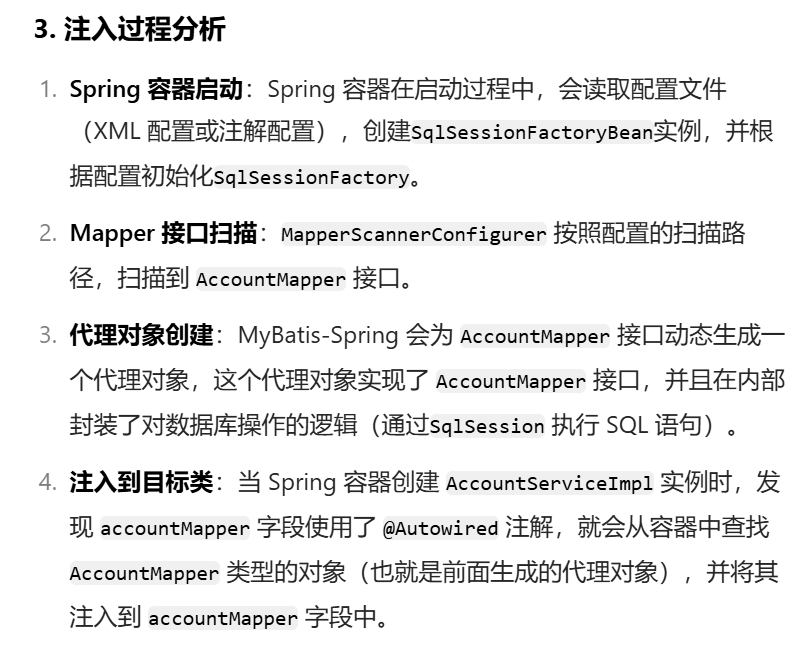
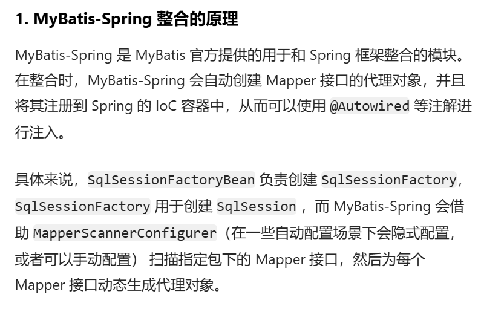

## 1.实现步骤

- 第一步：准备数据库表
   - 使用t_act表（账户表）
- 第二步：IDEA中创建一个模块，并引入依赖
   - spring-context
   - spring-jdbc
   - mysql驱动
   - mybatis
   - **mybatis-spring：mybatis提供的与spring框架集成的依赖**
   - 德鲁伊连接池
   - junit
- 第三步：基于三层架构实现，所以提前创建好所有的包
   - com.powernode.bank.mapper
   - com.powernode.bank.service
   - com.powernode.bank.service.impl
   - com.powernode.bank.pojo
- 第四步：编写pojo
   - Account，属性私有化，提供公开的setter getter和toString。
- 第五步：编写mapper接口
   - AccountMapper接口，定义方法
- 第六步：编写mapper配置文件
   - 在配置文件中配置命名空间，以及每一个方法对应的sql。
- 第七步：编写service接口和service接口实现类
   - AccountService
   - AccountServiceImpl
- 第八步：编写jdbc.properties配置文件
   - 数据库连接池相关信息
- 第九步：编写mybatis-config.xml配置文件
   - 该文件可以没有，大部分的配置可以转移到spring配置文件中。
   - 如果遇到mybatis相关的系统级配置，还是需要这个文件。
- 第十步：编写spring.xml配置文件
   - 组件扫描
   - 引入外部的属性文件
   - 数据源
   - **SqlSessionFactoryBean配置**
      - 注入mybatis核心配置文件路径
      - 指定别名包
      - 注入数据源
   - Mapper扫描配置器
      - 指定扫描的包
   - 事务管理器DataSourceTransactionManager
      - 注入数据源
   - 启用事务注解
      - 注入事务管理器
- 第十一步：编写测试程序，并添加事务，进行测试



## 2.具体实现

- 第一步：准备数据库表

连接数据库的工具有很多，除了之前我们使用的navicat for mysql之外，也可以使用IDEA工具自带的DataBase插件。可以根据下图提示自行配置：


- 第二步：IDEA中创建一个模块，并引入依赖
```xml
<?xml version="1.0" encoding="UTF-8"?>
<project xmlns="http://maven.apache.org/POM/4.0.0"
         xmlns:xsi="http://www.w3.org/2001/XMLSchema-instance"
         xsi:schemaLocation="http://maven.apache.org/POM/4.0.0 http://maven.apache.org/xsd/maven-4.0.0.xsd">
    <modelVersion>4.0.0</modelVersion>

    <groupId>com.powernode</groupId>
    <artifactId>spring6-016-sm</artifactId>
    <version>1.0-SNAPSHOT</version>
    <packaging>jar</packaging>

    <!--仓库-->
    <repositories>
        <!--spring里程碑版本的仓库-->
        <repository>
            <id>repository.spring.milestone</id>
            <name>Spring Milestone Repository</name>
            <url>https://repo.spring.io/milestone</url>
        </repository>
    </repositories>

    <dependencies>
        <dependency>
            <groupId>org.springframework</groupId>
            <artifactId>spring-context</artifactId>
            <version>6.0.0-M2</version>
        </dependency>
        <dependency>
            <groupId>org.springframework</groupId>
            <artifactId>spring-jdbc</artifactId>
            <version>6.0.0-M2</version>
        </dependency>
        <dependency>
            <groupId>mysql</groupId>
            <artifactId>mysql-connector-java</artifactId>
            <version>8.0.30</version>
        </dependency>
        <dependency>
            <groupId>org.mybatis</groupId>
            <artifactId>mybatis</artifactId>
            <version>3.5.11</version>
        </dependency>
        <dependency>
            <groupId>org.mybatis</groupId>
            <artifactId>mybatis-spring</artifactId>
            <version>2.0.7</version>
        </dependency>
        <dependency>
            <groupId>com.alibaba</groupId>
            <artifactId>druid</artifactId>
            <version>1.2.13</version>
        </dependency>
        <dependency>
            <groupId>junit</groupId>
            <artifactId>junit</artifactId>
            <version>4.13.2</version>
            <scope>test</scope>
        </dependency>
    </dependencies>

    <properties>
        <maven.compiler.source>17</maven.compiler.source>
        <maven.compiler.target>17</maven.compiler.target>
    </properties>

</project>
```

- 第三步：基于三层架构实现，所以提前创建好所有的包


- 第四步：编写pojo
```java
package com.powernode.bank.pojo;

/**
 * @author 动力节点
 * @version 1.0
 * @className Account
 * @since 1.0
 **/
public class Account {
    private String actno;
    private Double balance;

    @Override
    public String toString() {
        return "Account{" +
                "actno='" + actno + '\'' +
                ", balance=" + balance +
                '}';
    }

    public Account() {
    }

    public Account(String actno, Double balance) {
        this.actno = actno;
        this.balance = balance;
    }

    public String getActno() {
        return actno;
    }

    public void setActno(String actno) {
        this.actno = actno;
    }

    public Double getBalance() {
        return balance;
    }

    public void setBalance(Double balance) {
        this.balance = balance;
    }
}

```

- 第五步：编写mapper接口
```java
package com.powernode.bank.mapper;

import com.powernode.bank.pojo.Account;

import java.util.List;

/**
 * @author 动力节点
 * @version 1.0
 * @className AccountMapper
 * @since 1.0
 **/
public interface AccountMapper {

    /**
     * 保存账户
     * @param account
     * @return
     */
    int insert(Account account);

    /**
     * 根据账号删除账户
     * @param actno
     * @return
     */
    int deleteByActno(String actno);

    /**
     * 修改账户
     * @param account
     * @return
     */
    int update(Account account);

    /**
     * 根据账号查询账户
     * @param actno
     * @return
     */
    Account selectByActno(String actno);

    /**
     * 获取所有账户
     * @return
     */
    List<Account> selectAll();
}

```

- 第六步：编写mapper配置文件

一定要注意，按照下图提示创建这个目录。注意是斜杠不是点儿。在resources目录下新建。并且要和Mapper接口包对应上。

如果接口叫做AccountMapper，配置文件必须是AccountMapper.xml
```xml
<?xml version="1.0" encoding="UTF-8" ?>
<!DOCTYPE mapper
        PUBLIC "-//mybatis.org//DTD Mapper 3.0//EN"
        "http://mybatis.org/dtd/mybatis-3-mapper.dtd">
<mapper namespace="com.powernode.bank.mapper.AccountMapper">
    <insert id="insert">
        insert into t_act values(#{actno}, #{balance})
    </insert>
    <delete id="deleteByActno">
        delete from t_act where actno = #{actno}
    </delete>
    <update id="update">
        update t_act set balance = #{balance} where actno = #{actno}
    </update>
    <select id="selectByActno" resultType="Account">
        select * from t_act where actno = #{actno}
    </select>
    <select id="selectAll" resultType="Account">
        select * from t_act
    </select>
</mapper>
```

- 第七步：编写service接口和service接口实现类

注意编写的service实现类纳入IoC容器管理：
```java
package com.powernode.bank.service;

import com.powernode.bank.pojo.Account;

import java.util.List;

/**
 * @author 动力节点
 * @version 1.0
 * @className AccountService
 * @since 1.0
 **/
public interface AccountService {
    /**
     * 开户
     * @param act
     * @return
     */
    int save(Account act);

    /**
     * 根据账号销户
     * @param actno
     * @return
     */
    int deleteByActno(String actno);

    /**
     * 修改账户
     * @param act
     * @return
     */
    int update(Account act);

    /**
     * 根据账号获取账户
     * @param actno
     * @return
     */
    Account getByActno(String actno);

    /**
     * 获取所有账户
     * @return
     */
    List<Account> getAll();

    /**
     * 转账
     * @param fromActno
     * @param toActno
     * @param money
     */
    void transfer(String fromActno, String toActno, double money);
}

```
```java
package com.powernode.bank.service.impl;

import com.powernode.bank.mapper.AccountMapper;
import com.powernode.bank.pojo.Account;
import com.powernode.bank.service.AccountService;
import org.springframework.beans.factory.annotation.Autowired;
import org.springframework.stereotype.Service;

import java.util.List;

/**
 * @author 动力节点
 * @version 1.0
 * @className AccountServiceImpl
 * @since 1.0
 **/
@Transactional
@Service("accountService")
public class AccountServiceImpl implements AccountService {

    @Autowired
    private AccountMapper accountMapper;

    @Override
    public int save(Account act) {
        return accountMapper.insert(act);
    }

    @Override
    public int deleteByActno(String actno) {
        return accountMapper.deleteByActno(actno);
    }

    @Override
    public int update(Account act) {
        return accountMapper.update(act);
    }

    @Override
    public Account getByActno(String actno) {
        return accountMapper.selectByActno(actno);
    }

    @Override
    public List<Account> getAll() {
        return accountMapper.selectAll();
    }

    @Override
    public void transfer(String fromActno, String toActno, double money) {
        Account fromAct = accountMapper.selectByActno(fromActno);
        if (fromAct.getBalance() < money) {
            throw new RuntimeException("余额不足");
        }
        Account toAct = accountMapper.selectByActno(toActno);
        fromAct.setBalance(fromAct.getBalance() - money);
        toAct.setBalance(toAct.getBalance() + money);
        int count = accountMapper.update(fromAct);
        count += accountMapper.update(toAct);
        if (count != 2) {
            throw new RuntimeException("转账失败");
        }
    }
}

```

- 第八步：编写jdbc.properties配置文件

放在类的根路径下
```properties
jdbc.driver=com.mysql.cj.jdbc.Driver
jdbc.url=jdbc:mysql://localhost:3306/spring6
jdbc.username=root
jdbc.password=root
```

- 第九步：编写mybatis-config.xml配置文件

放在类的根路径下，只开启日志，其他配置到spring.xml中。
```xml
<?xml version="1.0" encoding="UTF-8" ?>
<!DOCTYPE configuration
        PUBLIC "-//mybatis.org//DTD Config 3.0//EN"
        "http://mybatis.org/dtd/mybatis-3-config.dtd">
<configuration>
    <settings>
        <setting name="logImpl" value="STDOUT_LOGGING"/>
    </settings>
</configuration>
```

- 第十步：编写spring.xml配置文件

**注意：当你在spring.xml文件中直接写标签内容时，IDEA会自动给你添加命名空间**
```xml
<?xml version="1.0" encoding="UTF-8"?>
<beans xmlns="http://www.springframework.org/schema/beans"
       xmlns:xsi="http://www.w3.org/2001/XMLSchema-instance"
       xmlns:context="http://www.springframework.org/schema/context" xmlns:tx="http://www.springframework.org/schema/tx"
       xsi:schemaLocation="http://www.springframework.org/schema/beans http://www.springframework.org/schema/beans/spring-beans.xsd http://www.springframework.org/schema/context https://www.springframework.org/schema/context/spring-context.xsd http://www.springframework.org/schema/tx http://www.springframework.org/schema/tx/spring-tx.xsd">
  
    <!--组件扫描-->
    <context:component-scan base-package="com.powernode.bank"/>
  
    <!--外部属性配置文件-->
    <context:property-placeholder location="jdbc.properties"/>

    <!--数据源-->
    <bean id="dataSource" class="com.alibaba.druid.pool.DruidDataSource">
        <property name="driverClassName" value="${jdbc.driver}"/>
        <property name="url" value="${jdbc.url}"/>
        <property name="username" value="${jdbc.username}"/>
        <property name="password" value="${jdbc.password}"/>
    </bean>

    <!--SqlSessionFactoryBean-->
    <bean class="org.mybatis.spring.SqlSessionFactoryBean">
        <!--mybatis核心配置文件路径-->
        <property name="configLocation" value="mybatis-config.xml"/>
        <!--注入数据源-->
        <property name="dataSource" ref="dataSource"/>
        <!--起别名-->
        <property name="typeAliasesPackage" value="com.powernode.bank.pojo"/>
    </bean>

    <!--Mapper扫描器-->
    <bean class="org.mybatis.spring.mapper.MapperScannerConfigurer">
        <property name="basePackage" value="com.powernode.bank.mapper"/>
    </bean>

    <!--事务管理器-->
    <bean id="txManager" class="org.springframework.jdbc.datasource.DataSourceTransactionManager">
        <property name="dataSource" ref="dataSource"/>
    </bean>

    <!--开启事务注解-->
    <tx:annotation-driven transaction-manager="txManager"/>

</beans>
```

- 第十一步：编写测试程序，并添加事务，进行测试
```java
package com.powernode.spring6.test;

import com.powernode.bank.service.AccountService;
import org.junit.Test;
import org.springframework.context.ApplicationContext;
import org.springframework.context.support.ClassPathXmlApplicationContext;

/**
 * @author 动力节点
 * @version 1.0
 * @className SMTest
 * @since 1.0
 **/
public class SMTest {

    @Test
    public void testSM(){
        ApplicationContext applicationContext = new ClassPathXmlApplicationContext("spring.xml");
        AccountService accountService = applicationContext.getBean("accountService", AccountService.class);
        try {
            accountService.transfer("act-001", "act-002", 10000.0);
            System.out.println("转账成功");
        } catch (Exception e) {
            e.printStackTrace();
            System.out.println("转账失败");
        }
    }

}
```
**最后大家别忘了测试事务！！！！**


## 18.3 Spring配置文件的import
spring配置文件有多个，并且可以在spring的核心配置文件中使用import进行引入，我们可以将组件扫描单独定义到一个配置文件中，如下：
```xml
<?xml version="1.0" encoding="UTF-8"?>
<beans xmlns="http://www.springframework.org/schema/beans"
       xmlns:xsi="http://www.w3.org/2001/XMLSchema-instance"
       xmlns:context="http://www.springframework.org/schema/context"
       xsi:schemaLocation="http://www.springframework.org/schema/beans http://www.springframework.org/schema/beans/spring-beans.xsd http://www.springframework.org/schema/context https://www.springframework.org/schema/context/spring-context.xsd">

    <!--组件扫描-->
    <context:component-scan base-package="com.powernode.bank"/>

</beans>
```
然后在核心配置文件中引入：
```xml
<?xml version="1.0" encoding="UTF-8"?>
<beans xmlns="http://www.springframework.org/schema/beans"
       xmlns:xsi="http://www.w3.org/2001/XMLSchema-instance"
       xmlns:context="http://www.springframework.org/schema/context" xmlns:tx="http://www.springframework.org/schema/tx"
       xsi:schemaLocation="http://www.springframework.org/schema/beans http://www.springframework.org/schema/beans/spring-beans.xsd http://www.springframework.org/schema/context https://www.springframework.org/schema/context/spring-context.xsd http://www.springframework.org/schema/tx http://www.springframework.org/schema/tx/spring-tx.xsd">

    <!--引入其他的spring配置文件-->
    <import resource="common.xml"/>

</beans>
```

==**注意：在实际开发中，service单独配置到一个文件中，dao单独配置到一个文件中，然后在核心配置文件中引入，养成好习惯。**==


