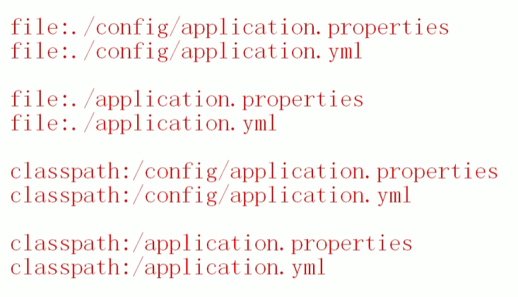

## 一、什么是外部化配置
* **外部化配置是指：将`配置信息`存储在`应用程序代码`之外的地方。这样`配置信息`可以独立于代码进行管理**。
* 这样方便了配置的修改，并且修改后不需要重新编译代码，也不需要重新部署项目。

### 外部化配置的方式
SpringBoot支持多种外部化配置方式，包括但不限于：

+ **properties文件**
+ **YAML文件**
+ 系统环境变量
+ 命令行参数
+ ......

### 外部化配置的优势
1. **灵活性**：配置文件可以独立于应用程序部署，这使得可以根据运行环境的不同来调整配置，而无需修改代码。
2. **易于维护**：配置变更不需要重新构建和部署应用程序，降低了维护成本。
3. **安全性**：敏感信息如数据库密码、API密钥等可以存储在外部，并且可以限制谁有权限访问这些配置信息。
4. **共享性**：多实例或多服务可以共享相同的配置信息，减少重复配置的工作量。
5. **版本控制**：配置文件可以存放在版本控制系统中，便于跟踪历史版本和回滚配置。

总之，外部化配置使得配置更加灵活、安全、易于管理和共享，是现代云原生应用中非常推荐的做法


### 外部化配置对比传统配置
在传统的SSM三大框架中，如果修改XML的配置后，需要对应用重新打包，重新部署。

使用SpringBoot框架的`外部化配置`后，修改配置后，不需要对应用重新打包，也不需要重新部署，最多重启一下服务即可。

## 二、application.properties

* **`application.properties`配置文件是SpringBoot框架默认的配置文件。`application.properties`不是必须的，SpringBoot对于应用程序来说，都提供了一套默认配置（就是我们所说的自动配置）**。
* **如果你要改变这些默认的行为，可以在`application.properties`文件中进行配置。`application.properties`可以放在类路径当中，也可以放在项目之外。因此称为外部化配置**。
* Spring Boot 框架在启动时按照以下顺序和位置加载 `application.properties` 配置文件：
	1. **file:./config/**：首先在Spring Boot 当前工作目录下的 `config` 文件夹中查找。
	    * **注意：如果没有找到application.properties，会继续找application.yml，如果这两个都没有找到，才会进入以下位置查找，以此类推。**
	2. **file:./**：如果在当前工作目录下`config`目录中找不到时，再从当前工作目录中查找。
	3. **classpath:/config/**：如果从工作目录中找不到，会从类路径中找，先从类路径的 `/config/` 目录下寻找配置文件。
	4. **classpath:/**：如果在 `/config/` 下没有找到，它会在类路径的根目录下查找。    
	
* 如果你想要指定其他的配置文件位置或者改变默认的行为，可以通过 `--spring.config.location=` 后跟路径的方式来指定配置文件的具体位置。例如 ：
```plain
java -jar sb3-01-first-web-1.0-SNAPSHOT.jar --spring.config.location=file:///E:\a\b\application.properties
```
这样，Spring Boot 将会首先从 `E:\a\b\` 这个路径加载配置文件。注意，这种方式可以用来覆盖默认的配置文件位置，并且可以结合以上提到的位置一起使用

注意：以上的`--spring.config.location=file:///E:\a\b\application.properties`就属于命令行参数，它将来会被传递到main方法的(String[] args)参数上。


## 三、使用@Value注解
* **@Value注解可以将`application.properties`/`application.yml`文件中的配置信息注入/绑定到java对象的属性上。 <font style="color:#DF2A3F;">语法格式：@Value("${key}")</font>**
* **注：如果给该类使用@Configuration标注也是可以的。因为这样也可以纳入IoC容器的管理。并且还有另一个作用，就是表示以下的类是一个配置类。**
* **使用@Value注解时也可以指定默认值，当指定默认值时，如果配置文件中没有指定配置值，则采用默认值。**<font style="color:#DF2A3F;">语法格式：@Value("${key:defalut}")</font>**


使用脚手架创建SpringBoot项目，不添加任何启动器：


在`resources/application.properties`文件中进行如下配置：

```properties
myapp.username=jack
myapp.email=jack@123.com
myapp.age=30
```

编写service类：

```java
@Service("userService")
public class UserService {
    
    @Value("${myapp.username}")
    private String username;
    
    @Value("${myapp.email}")
    private String email;
    
    @Value("${myapp.age}")
    private Integer age;
    
    public void printInfo(){
        String str = String.join(",", username, email, String.valueOf(age));
        System.out.println(str);
    }
}
```


编写单元测试：

```java
@SpringBootTest
class Sb307ExternalConfigApplicationTests {
    @Autowired
    private UserService userService;
    @Test
    void test01() {
        userService.printInfo();
    }
}
```

运行结果：


```java
@Service("userService")
public class UserService {

    @Value("${myapp.username}")
    private String username;

    @Value("${myapp.email}")
    private String email;

    @Value("${myapp.age}")
    private Integer age;
    
    @Value("${myapp.password:123456}")
    private String password;

    public void printInfo(){
        String str = String.join(",", username, email, String.valueOf(age), password);
        System.out.println(str);
    }
}
```

执行结果：


当然，如果配置文件进行了相关的配置，则不会采用默认值，修改配置文件`application.properties`：

```properties
myapp.username=jack
myapp.email=jack@123.com
myapp.age=30
myapp.password=888888
```

执行结果：


我们再来测试一下，如果在`resources`目录下新建`config`目录，在`config`目录下新建`application.properties`，配置信息如下：

```properties
myapp.username=lucy
myapp.email=lucy@123.com
myapp.age=20
myapp.password=666666
```

执行结果如下：


通过这个测试也验证了我们之前所说：SpringBoot会优先加载**classpath:/config/**目录下的`application.properties`。


## 四、YAML
### 1.YAML概述
* SpringBoot采用集中式配置管理，所有的配置都编写到一个配置文件中：`application.properties`。**如果配置非常多，层级不够分明，因此SpringBoot为了提高配置文件可读性，也支持YAML格式的配置文件：`application.yml`**
* Y**AML（YAML Ain't Markup Language）是一种存储或传输数据的方式**。YAML的设计目标是易于阅读和编写，同时保持足够的表达能力来表示复杂的数据结构。
* **YAML文件的扩展名可以是.yaml或.yml

### 2.常见的数据存储和交换格式
**`properties`、`XML`、`JSON`、`YAML`这几种格式确实是用来存储和交换数据的常见方式**，但它们各有特点和适用场景：

1. **Properties**  
	+ **这种格式主要用于Java应用程序中的配置文件。它是键值对的形式**，每一行是一个键值对，使用等号或冒号分隔键和值。
	+ 特点是简单易懂，但在处理复杂结构的数据时显得力不从心。
2. **XML (eXtensible Markup Language)**
	+ XML是一种标记语言，用来描述数据的格式。**它支持复杂的数据结构，包括嵌套和属性**。
	+ XML文档具有良好的结构化特性，适合传输和存储结构化的数据。但是，X**ML文档通常体积较大，解析起来也比较耗资源。**
3. **JSON (JavaScript Object Notation)**
	+ JSON是一种轻量级的数据交换格式，易于人阅读和编写，同时也易于机器解析和生成。它基于JavaScript的一个子集，支持多种数据类型，如数字、字符串、布尔值、数组和对象。
	+ **JSON因为简洁和高效而广泛应用于Web应用程序之间进行数据交换**。
4. **YAML (YAML Ain't Markup Language)**
	+ **YAML设计的目标之一就是让人类更容易阅读。它支持类似JSON的数据序列化，但提供了更多的灵活性，例如缩进来表示数据结构**。
	+ **YAML非常适合用来编写配置文件，因为它允许以一种自然的方式组织数据**，并且可以包含注释和其他人类可读的元素。

总结来说，这四种格式都可以用来存储和交换数据，但它们的设计初衷和最佳使用场景有所不同。选择哪种格式取决于具体的应用需求、数据复杂度、性能要求等因素。


### 3.YAML的语法规则
YAML的语法规则如下：
1. 数据结构：YAML支持多种数据类型，包括：
    1. 字符串、数字、布尔值
    2. 数组、list集合
    3. map键值对   等。
2. **YAML使用`一个空格`来分隔`属性名`和`属性值`**，例如：
    1. `properties`文件中这样的配置：name=jack
    2. `yaml`文件中需要这样配置：**name: jack**
3. **YAML用`换行+空格`来表示层级关系。注意不能使用tab，必须是空格，空格数量无要求，大部分建议2个或4个空格**。例如：
    1. `properties`文件中这样的配置：myapp.name=mall
    2. `yaml`文件中就需要这样配置：

```yaml
myapp:
  name: mall
```

4. **同级元素左对齐**。例如：
    1. `properties`文件中有这样的配置：

```properties
myapp.name=mall
myapp.count=10
```

    2. `yaml`文件中就应该这样配置：

```yaml
myapp:
  name: mall
  count: 10
```

5. **键必须是唯一的：在一个映射中，键必须是唯一的**。
6. **注释：使用`#`进行注释**。
7. 大小写敏感

### 4.YAML的使用小细节
1. 普通文本也可以使用单引号或双引号括起来：（当然普通文本也可以不使用单引号和双引号括起来。）
	+ 单引号括起来：**单引号内所有的内容都被当做普通文本，不转义**（例如字符串中有\n，则\n被当做普通的字符串）
	+ 双引号括起来：**双引号中有 \n 则会被转义为换行符**
2. **保留文本格式： | 将文本写到这个符号的下层，会自动保留格式**。
3. **文档切割：--- 这个符号下面的配置可以认为是一个独立的yaml文件。便于庞大文件的阅读**。

## 五、配置文件合并
**一个项目中所有的配置全部编写到`application.properties`文件中，会导致配置臃肿，不易维护，有时我们会将配置编写到不同的文件中**，例如：`application-mysql.properties`专门配置mysql的信息，`application-redis.properties`专门配置redis的信息，最终将两个配置文件合并到一个配置文件中。

### 1. properties文件合并
`application-mysql.properties`
```properties
spring.datasource.username=root
spring.datasource.password=123456
```
`application-redis.properties`
```properties
spring.data.redis.host=localhost
spring.data.redis.port=6379
```
`application.properties`
```properties
spring.config.import=classpath:application-mysql.properties,classpath:application-redis.properties
```
* **对于properties属性配置文件来说使用spring.config.import，数组元素采用逗号隔开**。

编写service测试，看看能否拿到配置信息：
```java
package com.powernode.sb307externalconfig.service;

import org.springframework.beans.factory.annotation.Value;
import org.springframework.stereotype.Service;

@Service("userServiceMulti")
public class UserServiceMulti {
    @Value("${spring.datasource.username}")
    private String username;
    @Value("${spring.datasource.password}")
    private String password;
    @Value("${spring.data.redis.host}")
    private String host;
    @Value("${spring.data.redis.port}")
    private String port;
    
    public void printInfo(){
        String str = String.join(",", username, password, host, port);
        System.out.println(str);
    }
}
```

运行测试：


### 2.yaml文件合并
`application-mysql.yml`
```yaml
spring:
  datasource:
    username: root
    password: 789789
```
`application-redis.yml`

```yaml
spring:
  data:
    redis:
      host: localhost
      port: 6379
```

`application.yml`

```yaml
spring:
  config:
    import:
      - classpath:application-mysql.yml
      - classpath:application-redis.yml
//或
spring:
  config:
    import: [classpath:/config/application-mysql.yml, classpath:/config/application-redis.yml]
```
* **同样使用spring.config.import，存放的是数组元素，两种方式如上面所示**

运行测试：


## 六、多环境切换
在Spring Boot中，**多环境切换是指在一个应用程序中支持多种运行环境配置的能力。这通常用于区分开发（development）、测试（testing）、预生产（staging）和生产（production）等不同阶段的环境。**

这种功能使得开发者能够在不同的环境中使用不同的配置，比如数据库连接信息、服务器端口、环境变量等，而不需要更改代码。这对于维护一个可移植且易于管理的应用程序非常重要。

1. **开发环境的配置文件名一般叫做：`application-dev.properties`**

```properties
spring.datasource.username=dev
spring.datasource.password=dev123
spring.datasource.url=jdbc:mysql://localhost:3306/dev
```

2. **测试环境的配置文件名一般叫做：`application-test.properties`**

```properties
spring.datasource.username=test
spring.datasource.password=test123
spring.datasource.url=jdbc:mysql://localhost:3306/test
```

3. **预生产环境的配置文件名一般叫做：`application-preprod.properties`**

```properties
spring.datasource.username=preprod
spring.datasource.password=preprod123
spring.datasource.url=jdbc:mysql://localhost:3306/preprod
```

4. **生产环境的配置文件名一般叫做：`application-prod.properties`**

```properties
spring.datasource.username=prod
spring.datasource.password=prod123
spring.datasource.url=jdbc:mysql://localhost:3306/prod
```

如果你希望该项目使用生产环境的配置，你可以这样做：
+ **第一种方式：在`application.properties`文件中添加这个配置：**spring.profiles.active=prod****
+ 第二种方式：在命令行参数上添加：**--spring.profiles.active=prod**

****


