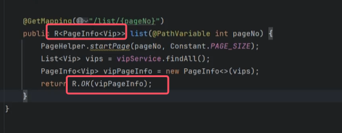
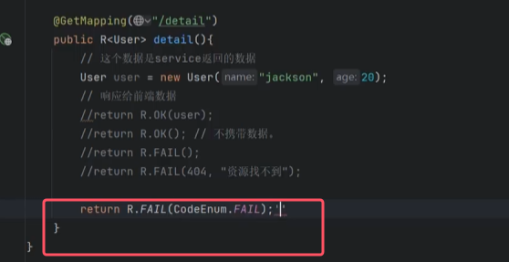

对于前后端分离的系统来说，**为了降低沟通成本，我们有必要给前端系统开发人员返回统一格式的JSON数据。多数开发团队一般都会封装一个`R`对象来解决统一响应格式的问题。**

## 1.封装R对象
```java
@NoArgsConstructor
@AllArgsConstructor
@Data
@Builder
public class R<T> {

    private int code; // 响应的状态码：200，404
    private String msg; // 响应的消息：成功，失败
    private T data; // 响应的数据体，任意类型的对象

    //为了方便返回数据，这里的方法都是静态方法
    // 用于构建成功的响应，不携带数据
    public static <T> R<T> OK() {
        return R.<T>builder()
                .code(200)
                .msg("成功")
                .build();
    }

    // 用于构建成功的响应，携带数据
    public static <T> R<T> OK(T data) {
        return R.<T>builder()
                .code(200)
                .msg("成功")
                .data(data)
                .build();
    }

    // 用于构建成功的响应，自定义消息，不携带数据
    public static <T> R<T> OK(String msg) {
        return R.<T>builder()
                .code(200)
                .msg(msg)
                .build();
    }

    // 用于构建成功的响应，自定义消息，携带数据
    public static <T> R<T> OK(String msg, T data) {
        return R.<T>builder()
                .code(200)
                .msg(msg)
                .data(data)
                .build();
    }

    // 用于构建失败的响应，不带任何参数，默认状态码为400，消息为"失败"
    public static <T> R<T> FAIL() {
        return R.<T>builder()
                .code(400)
                .msg("失败")
                .build();
    }

    // 用于构建失败的响应，自定义状态码和消息
    public static <T> R<T> FAIL(int code, String msg) {
        return R.<T>builder()
                .code(code)
                .msg(msg)
                .build();
    }
}

```

R对象的使用如下图所示  




## 2.改进R对象
以上`R`对象存在的问题是，难以维护，项目中可能会出现很多这样的代码：R.FAIL(400, "修改失败")。


引入枚举类型进行改进：

```java
//专门维护code+msg的一个枚举类
@NoArgsConstructor
@AllArgsConstructor
public enum CodeEnum {

    OK(200, "成功"),
    FAIL(400, "失败"),
    BAD_REQUEST(400, "请求错误"),
    NOT_FOUND(404, "未找到资源"),
    INTERNAL_ERROR(500, "内部服务器错误"),
    MODIFICATION_FAILED(400, "修改失败"),
    DELETION_FAILED(400, "删除失败"),
    CREATION_FAILED(400, "创建失败");

    @Getter
    @Setter
    private int code;
    @Getter
    @Setter
    private String msg;

}
```


改进R：

```java
@NoArgsConstructor
@AllArgsConstructor
@Data
@Builder
public class R<T> {

    private int code; // 响应的状态码
    private String msg; // 响应的消息
    private T data; // 响应的数据体

    // 用于构建成功的响应，不携带数据
    public static <T> R<T> OK() {
        return R.<T>builder()
                .code(CodeEnum.OK.getCode())
                .msg(CodeEnum.OK.getMsg())
                .build();
    }

    // 用于构建成功的响应，携带数据
    public static <T> R<T> OK(T data) {
        return R.<T>builder()
                .code(CodeEnum.OK.getCode())
                .msg(CodeEnum.OK.getMsg())
                .data(data)
                .build();
    }

    // 用于构建失败的响应，不带任何参数，默认状态码为400，消息为"失败"
    public static <T> R<T> FAIL() {
        return R.<T>builder()
                .code(CodeEnum.FAIL.getCode())
                .msg(CodeEnum.FAIL.getMsg())
                .build();
    }

    // 用于构建失败的响应，自定义状态码和消息
    public static <T> R<T> FAIL(CodeEnum codeEnum) {
        return R.<T>builder()
                .code(codeEnum.getCode())
                .msg(codeEnum.getMsg())
                .build();
    }
}

```


