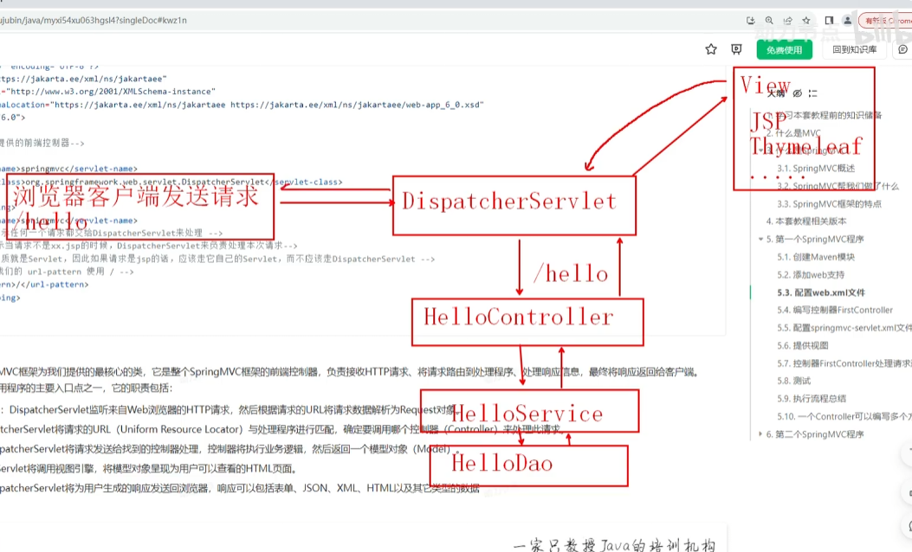
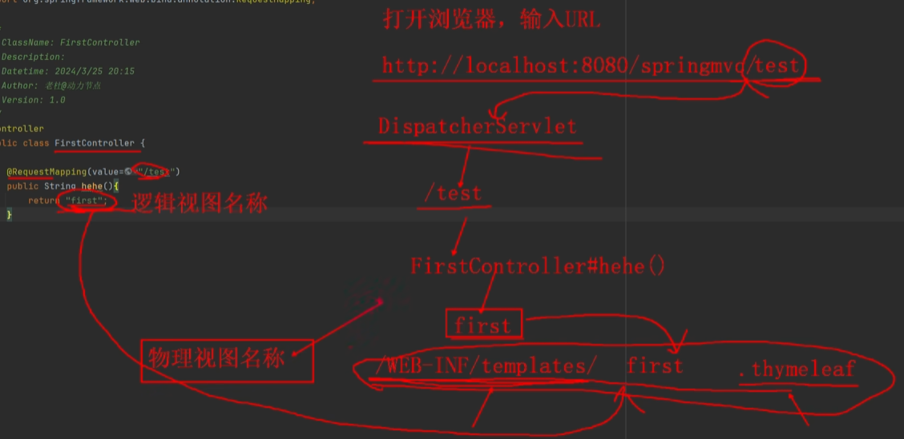

## 1.创建Maven模块
第一步：创建Empty Project，起名：springmvc。    

第二步：设置springmvc工程的JDK版本：Java21。    

第三步：设置maven。    

第四步：创建Maven模块    


第五步：将pom.xml文件中的打包方式修改为war
```xml
<groupId>com.powernode.springmvc</groupId>
<artifactId>springmvc-001</artifactId>
<version>1.0-SNAPSHOT</version>
<!-- 打包方式设置为war方式 -->
<packaging>war</packaging>
```
第六步：添加以下依赖
```xml
<dependencies>
    <!-- Spring MVC依赖 -->
    <dependency>
        <groupId>org.springframework</groupId>
        <artifactId>spring-webmvc</artifactId>
        <version>6.1.4</version>
    </dependency>
    <!--日志框架Logback依赖-->
    <dependency>
        <groupId>ch.qos.logback</groupId>
        <artifactId>logback-classic</artifactId>
        <version>1.5.3</version>
    </dependency>
    <!--Servlet依赖-->
    <dependency>
        <groupId>jakarta.servlet</groupId>
        <artifactId>jakarta.servlet-api</artifactId>
        <version>6.0.0</version>
        <scope>provided</scope>
    </dependency>
    <!--Spring6和Thymeleaf整合依赖-->
    <dependency>
        <groupId>org.thymeleaf</groupId>
        <artifactId>thymeleaf-spring6</artifactId>
        <version>3.1.2.RELEASE</version>
    </dependency>
</dependencies>
```


## 2.添加web支持 
第一步：在main目录下创建一个webapp目录  

第二步：添加web.xml配置文件  

注意 web.xml 文件的位置。

注意版本选择：6.0  

添加web支持后的目录结构：  


## 3.配置web.xml文件
Spring MVC是一个web框架，在javaweb中谁来负责接收请求，处理请求，以及响应呢？当然是Servlet。在**SpringMVC框架中已经为我们写好了一个Servlet，它的名字叫做：DispatcherServlet，我们称其为前端控制器。作为一个入口控制器。所有的Web请求都需要经过DispatcherServlet**。既然是Servlet，那么它就需要在web.xml文件中进行配置：
```xml
<?xml version="1.0" encoding="UTF-8"?>
<web-app xmlns="https://jakarta.ee/xml/ns/jakartaee"
         xmlns:xsi="http://www.w3.org/2001/XMLSchema-instance"
         xsi:schemaLocation="https://jakarta.ee/xml/ns/jakartaee https://jakarta.ee/xml/ns/jakartaee/web-app_6_0.xsd"
         version="6.0">

    <!--SpringMVC提供的前端控制器-->
    <servlet>
        <servlet-name>springmvc</servlet-name>
        <servlet-class>org.springframework.web.servlet.DispatcherServlet</servlet-class>
    </servlet>
    <servlet-mapping>
        <servlet-name>springmvc</servlet-name>
        <!-- /* 表示任何一个请求都交给DispatcherServlet来处理 -->
        <!-- / 表示当请求不是xx.jsp的时候，DispatcherServlet来负责处理本次请求-->
        <!-- jsp本质就是Servlet，因此如果请求是jsp的话，应该走它自己的Servlet，而不应该走DispatcherServlet -->
        <!-- 因此我们的 url-pattern 使用 / -->
        <url-pattern>/</url-pattern>
    </servlet-mapping>

</web-app>
```
* **`<url-pattern>/</url-pattern>`一定要配置成/而不是/\***。/\* 表示任何一个请求都交给DispatcherServlet来处理；/ 表示当请求不是xx.jsp的时候，DispatcherServlet来负责处理本次请求。jsp本质就是Servlet，因此如果请求是jsp的话，应该走它自己的Servlet，而不应该走DispatcherServlet。因此我们的 url-pattern 使用 /。
* **DispatcherServlet是SpringMVC框架为我们提供的最核心的类，它是整个SpringMVC框架的前端控制器，负责接收HTTP请求、将请求路由到处理程序、处理响应信息，最终将响应返回给客户端**。DispatcherServlet是Web应用程序的主要入口点之一，它的职责包括：  
	1.  **接收客户端的HTTP请求**：DispatcherServlet监听来自Web浏览器的HTTP请求，然后根据请求的URL将请求数据解析为Request对象。 
	2.  **处理请求的URL**：DispatcherServlet将请求的URL（Uniform Resource Locator）与处理程序进行匹配，确定要调用哪个控制器（Controller）来处理此请求。 
	3.  **调用相应的控制器**：DispatcherServlet将请求发送给找到的控制器处理，控制器将执行业务逻辑，然后返回一个模型对象（Model）。 
	4. **渲染视图**：DispatcherServlet将调用视图引擎，将模型对象呈现为用户可以查看的HTML页面。 
	5. **返回响应给客户端**：DispatcherServlet将为用户生成的响应发送回浏览器，响应可以包括表单、JSON、XML、HTML以及其它类型的数据



## 4.编写控制器FirstController

DispatcherServlet接收到请求之后，会根据请求路径分发到对应的Controller，Controller来负责处理请求的核心业务。**在SpringMVC框架中Controller是一个普通的Java类，需要注意的是：该类需要纳入IoC容器来管理，因此要使用注解标注**：
```java
package com.powernode.springmvc.controller;

import org.springframework.stereotype.Controller;

/**
 * ClassName: FirstController
 * Description:
 * Datetime: 2024/3/13 11:56
 * Author: 老杜@动力节点
 * Version: 1.0
 */
@Controller
public class FirstController {
}

```


## 5.配置springmvc-servlet.xml文件
* **SpringMVC框架有它自己的配置文件，该配置文件的名字默认为：\<servlet-name>-servlet.xml。\<servlet-name>就是在web.xml配置中的DispatcherServlet的名字，用于唯一标识该Servlet**
* **默认存放的位置是WEB-INF 目录下**：
```xml
<?xml version="1.0" encoding="UTF-8"?>
<beans xmlns="http://www.springframework.org/schema/beans"
       xmlns:xsi="http://www.w3.org/2001/XMLSchema-instance"
       xmlns:context="http://www.springframework.org/schema/context"
       xsi:schemaLocation="http://www.springframework.org/schema/beans http://www.springframework.org/schema/beans/spring-beans.xsd http://www.springframework.org/schema/context https://www.springframework.org/schema/context/spring-context.xsd">
    <!--组件扫描-->
    <context:component-scan base-package="com.powernode.springmvc.controller"/>
    <!--视图解析器-->
    <bean id="thymeleafViewResolver" class="org.thymeleaf.spring6.view.ThymeleafViewResolver">
        <!--作用于视图渲染的过程中，可以设置视图渲染后输出时采用的编码字符集-->
        <property name="characterEncoding" value="UTF-8"/>
        <!--如果配置多个视图解析器，它来决定优先使用哪个视图解析器，它的值越小优先级越高-->
        <property name="order" value="1"/>
        <!--当 ThymeleafViewResolver 渲染模板时，会使用该模板引擎来解析、编译和渲染模板-->
        <property name="templateEngine">
            <bean class="org.thymeleaf.spring6.SpringTemplateEngine">
                <!--用于指定 Thymeleaf 模板引擎使用的模板解析器。模板解析器负责根据模板位置、模板资源名称、文件编码等信息，加载模板并对其进行解析-->
                <property name="templateResolver">
                    <bean class="org.thymeleaf.spring6.templateresolver.SpringResourceTemplateResolver">
                        <!--设置模板文件存放的位置（前缀）-->
                        <property name="prefix" value="/WEB-INF/templates/"/>
                        <!--设置模板文件后缀（后缀），Thymeleaf文件扩展名不一定是html，也可以是其他，例如txt，大部分都是html-->
                        <property name="suffix" value=".html"/>
                        <!--设置模板类型，例如：HTML,TEXT,JAVASCRIPT,CSS等-->
                        <property name="templateMode" value="HTML"/>
                        <!--用于模板文件在读取和解析过程中采用的编码字符集-->
                        <property name="characterEncoding" value="UTF-8"/>
                    </bean>
                </property>
            </bean>
        </property>
    </bean>
</beans>
```
* 在WEB-INF目录下新建springmvc-servlet.xml文件，并且提供以上配置信息。    
	
* **以上配置主要两项：**    
	- **第一项：组件扫描。spring扫描这个包中的类，将这个包中的类实例化并纳入IoC容器的管理。**
	- **第二项：视图解析器。视图解析器（View Resolver）的作用主要是将Controller方法返回的逻辑视图名称解析成实际的视图对象。视图解析器将解析出的视图对象返回给DispatcherServlet，并最终由DispatcherServlet将该视图对象转化为响应结果，呈现给用户。**
* 注意：如果采用了其它视图，请配置对应的视图解析器，例如：
	- JSP的视图解析器：InternalResourceViewResolver
	- FreeMarker视图解析器：FreeMarkerViewResolver
	- Velocity视图解析器：VelocityViewResolver


## 6.提供视图
在WEB-INF目录下新建templates目录，在templates目录中新建html文件，例如：first.html，并提供以下代码：
```html
<!DOCTYPE html>
<!--指定 th 命名空间，让 Thymeleaf 标准表达式可以被解析和执行-->
<!--th不是固定的，可以指定其它的命名空间，只不过大部分情况下用th-->
<!--表示程序中出现的 th 开头的后面代码都是 Thymeleaf语法，需要被 Thymeleaf识别-->
<html lang="en" xmlns:th="http://www.thymeleaf.org">
<head>
    <meta charset="UTF-8">
    <title>first springmvc</title>
</head>
<body>
<h1>我的第一个Spring MVC程序</h1>
</body>
</html>
```
**对于每一个Thymeleaf文件来说 xmlns:th="[http://www.thymeleaf.org"](http://www.thymeleaf.org") 是必须要写的，为了方便后续开发，可以将其添加到html模板文件中：**     


## 7.控制器FirstController处理请求返回逻辑视图名称
```java
package com.powernode.springmvc.controller;

import org.springframework.stereotype.Controller;
import org.springframework.web.bind.annotation.RequestMapping;

/**
 * ClassName: FirstController
 * Description:
 * Datetime: 2024/3/13 11:56
 * Author: 老杜@动力节点
 * Version: 1.0
 */
@Controller
public class FirstController {
	/*  
	该注解是请求映射的意思，相当于将来只要访问http://localhost:8080/springmvc/test，就会执行该方法,其中springmvc是web应用的根目录，可以配置
	方法是一个实例方法，返回一个字符串，返回值代表一个逻辑视图名称  
	*/
    @RequestMapping(value="/haha")
    public String 名字随意(){
        System.out.println("正在处理请求....");
        // 返回逻辑视图名称（决定跳转到哪个页面）
        return "first";
    }
}
```
原理如下图所示。    



## 8.测试
第一步：配置Tomcat服务器    

第二步：部署web模块到Tomcat服务器    

第三步：启动Tomcat服务器。如果在控制台输出的信息有中文乱码，请修改tomcat服务器配置文件：apache-tomcat-10.1.19\conf\logging.properties     

第四步：打开浏览器，在浏览器地址栏上输入地址：http://localhost:8080/springmvc/haha  

后端控制台输出：    


## 9.执行流程总结

1. 浏览器发送请求：http://localhost:8080/springmvc/haha
2. SpringMVC的前端控制器DispatcherServlet接收到请求
3. DispatcherServlet根据请求路径 /haha 映射到 FirstController#名字随意()，调用该方法
4. FirstController#名字随意() 处理请求
5. FirstController#名字随意() 返回逻辑视图名称 first 给视图解析器
6. 视图解析器找到 /WEB-INF/templates/first.html 文件，并进行解析，生成视图解析对象返回给前端控制器DispatcherServlet
7. 前端控制器DispatcherServlet响应结果到浏览器。


## 10.一个Controller可以编写多个方法
一个Controller可以提供多个方法，每个方法通常是处理对应的请求，例如：
```java
@Controller
public class FirstController {
    @RequestMapping(value="/haha")
    public String 名字随意(){
        System.out.println("正在处理请求....");
        // 返回逻辑视图名称（决定跳转到哪个页面）
        return "first";
    }
    
    @RequestMapping("/other")
    public String other(){
        System.out.println("正在处理其它请求...");
        return "other";
    }
}
```
提供 other.html 文件
```html
<!DOCTYPE html>
<html lang="en" xmlns:th="http://www.thymeleaf.org">
<head>
    <meta charset="UTF-8">
    <title>other</title>
</head>
<body>
<h1>other ...</h1>
</body>
</html>
```
在 first.html 文件中，添加超链接，用超链接发送 /other 请求：
```html
<!DOCTYPE html>
<!--指定 th 命名空间，让 Thymeleaf 标准表达式可以被解析和执行-->
<!--th不是固定的，可以指定其它的命名空间，只不过大部分情况下用th-->
<!--表示程序中出现的 th 开头的后面代码都是 Thymeleaf语法，需要被 Thymeleaf识别-->
<html lang="en" xmlns:th="http://www.thymeleaf.org">
<head>
    <meta charset="UTF-8">
    <title>first springmvc</title>
</head>
<body>
<h1>我的第一个Spring MVC程序</h1>
<!-- th: 表示后面的代码可以编写Thymeleaf语法，可以被Thymeleaf语法解析 -->
<!-- Thymeleaf检测到以 / 开始，表示绝对路径，自动会将webapp的上下文路径加上去 -->
<!-- 最终的效果是：href="/springmvc/other" -->
<a th:href="@{/other}">other请求</a>
</body>
</html>
```
* **Thymeleaf检测到以 / 开始，表示绝对路径，自动会将webapp的上下文路径加上去。最终的效果是：href="/springmvc/other**

启动Tomcat，打开浏览器，输入请求路径：http://localhost:8080/springmvc/haha  


点击超链接：other请求  


