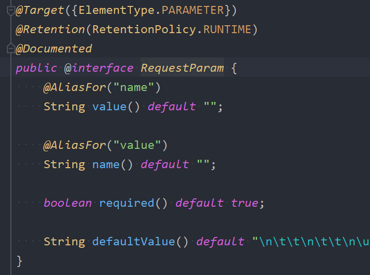

## 1.RequestParam注解的基本使用
该注解的源码如下图所示  

* **==RequestParam注解作用：将`请求参数`与方法上的`形参`映射==**。
* **该注解只能用在方法的参数中，并且name和value其实是一样的，只是取了个别名。**
* **value属性填入的是表中提交的参数的名字。也就是前端input框中name的属性值**
```java
@PostMapping(value = "/register")
public String register(
        @RequestParam(value="username")
        String a,
        @RequestParam(value="password")
        String b,
        @RequestParam(value="sex")
        String c,
        @RequestParam(value="hobby")
        String[] d,
        @RequestParam(name="intro")
        String e) {
    System.out.println(a);
    System.out.println(b);
    System.out.println(c);
    System.out.println(Arrays.toString(d));
    System.out.println(e);
    return "success";
}
```

**注意：对于@RequestParam注解来说，属性有value和name，这两个属性的作用相同，都是用来指定提交数据的name。  **  


例如：发送请求时提交的数据是：name1=value1&name2=value2，则这个注解应该这样写：@RequestParam(value="name1")、@RequestParam(value="name2")


启动服务器测试：  


一定要注意： @RequestParam(value="name2") 中value一定不要写错，写错就会出现以下问题：  


测试结果：    


## 2.RequestParam注解的required属性

* **required属性用来设置该方法参数是否为必须的**。
* **默认情况下，这个参数为 `true`，表示方法参数是必需的。如果请求中缺少对应的参数，则会抛出异常。**
* **可以将其设置为`false`，false表示不是必须的。如果请求中缺少对应的参数，则方法的参数为null，并且不会由异常；如果请求参数中提供了对应，则该形参为真实提交的数据**。

测试，修改register方法，如下：  


添加了一个 age 形参，**没有指定 required 属性时，默认是true，表示必需的，但前端表单中没有年龄age，我们来看报错信息**：  


错误信息告诉我们：参数age是必需的。没有提供这个请求参数，HTTP状态码 400

如果将 required 属性设置为 false。则该参数则不是必须的，如果请求参数仍然未提供时，我们来看结果：  


通过测试得知，如果一个参数被设置为`不是必需的`，当没有提交对应的请求参数时，形参默认值null。

当然，如果请求参数中提供了age，则age为真实提交的数据：  


## 3.RequestParam注解的defaultValue属性
* **defaultValue属性用来设置形参的默认值，当`没有提供对应的请求参数`或者`请求参数的值是空字符串""`的时候，方法的形参会采用默认值。如果有则采用请求参数的值**


当前端页面没有提交email的时候：    


当前端页面提交的email是空字符串的时候：


当前端提交的email不是空字符串的时候：    


