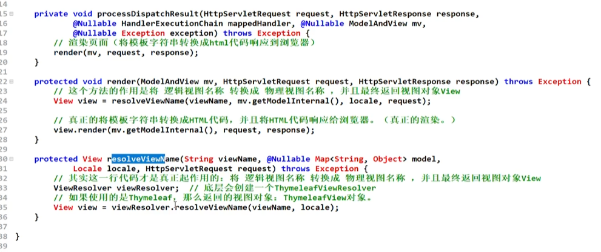
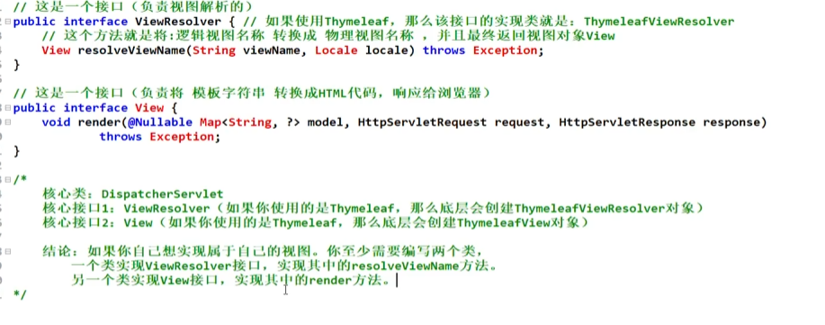
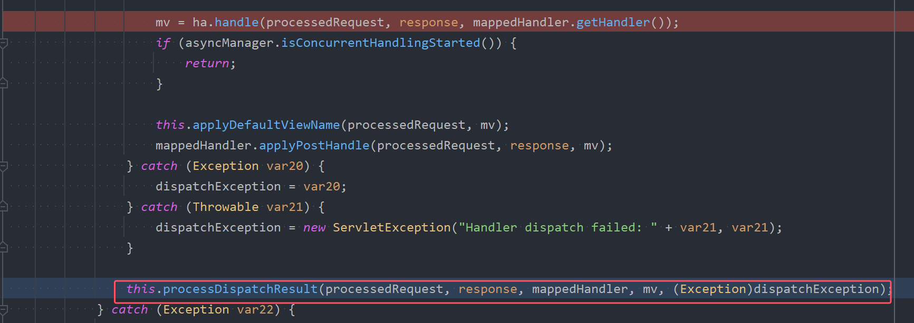
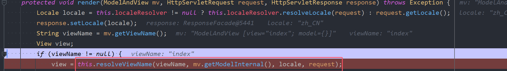
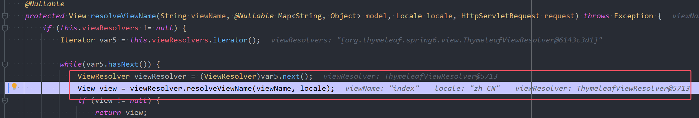
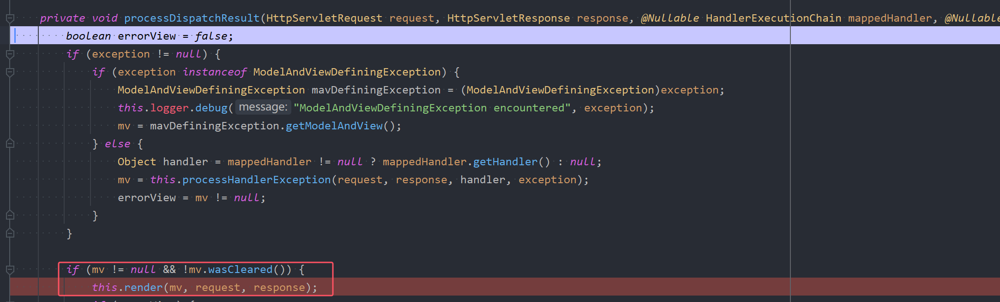
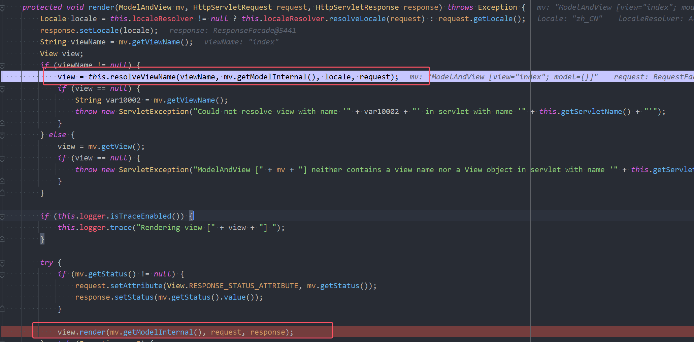

## 1.Spring MVC视图支持可配置
在Spring MVC中，视图View是支持定制的，例如我们之前在 springmvc.xml 文件中进行了如下的配置：
```xml
<!--视图解析器-->
<bean id="thymeleafViewResolver" class="org.thymeleaf.spring6.view.ThymeleafViewResolver">
    <!--作用于视图渲染的过程中，可以设置视图渲染后输出时采用的编码字符集-->
    <property name="characterEncoding" value="UTF-8"/>
    <!--如果配置多个视图解析器，它来决定优先使用哪个视图解析器，它的值越小优先级越高-->
    <property name="order" value="1"/>
    <!--当 ThymeleafViewResolver 渲染模板时，会使用该模板引擎来解析、编译和渲染模板-->
    <property name="templateEngine">
        <bean class="org.thymeleaf.spring6.SpringTemplateEngine">
            <!--用于指定 Thymeleaf 模板引擎使用的模板解析器。模板解析器负责根据模板位置、模板资源名称、文件编码等信息，加载模板并对其进行解析-->
            <property name="templateResolver">
                <bean class="org.thymeleaf.spring6.templateresolver.SpringResourceTemplateResolver">
                    <!--设置模板文件的位置（前缀）-->
                    <property name="prefix" value="/WEB-INF/templates/"/>
                    <!--设置模板文件后缀（后缀），Thymeleaf文件扩展名不一定是html，也可以是其他，例如txt，大部分都是html-->
                    <property name="suffix" value=".html"/>
                    <!--设置模板类型，例如：HTML,TEXT,JAVASCRIPT,CSS等-->
                    <property name="templateMode" value="HTML"/>
                    <!--用于模板文件在读取和解析过程中采用的编码字符集-->
                    <property name="characterEncoding" value="UTF-8"/>
                </bean>
            </property>
        </bean>
    </property>
</bean>
```
* 以上的配置表明当前SpringMVC框架使用的视图View是Thymeleaf的。
* 如**果你需要换成其他的视图View，修改以上的配置即可。这样就可以非常轻松的完成视图View的扩展。这种设计是完全符合OCP开闭原则的。视图View和框架是解耦合的，耦合度低扩展能力强。视图View可以通过配置文件进行灵活切换**。


## 2.Spring MVC支持的常见视图
Spring MVC支持的常见视图包括：  
1. **InternalResourceView：内部资源视图（Spring MVC框架内置的，专门为`JSP模板语法`准备的，而且也是为请求转发功能准备的）**
2. **RedirectView：重定向视图（Spring MVC框架内置的，用来完成重定向效果）**
3. **ThymeleafView：Thymeleaf视图（第三方的，为`Thymeleaf模板语法`准备的）**
4. FreeMarkerView：FreeMarker视图（第三方的，为`FreeMarker模板语法`准备的）
5. VelocityView：Velocity视图（第三方的，为`Velocity模板语法`准备的）
6. PDFView：PDF视图（第三方的，专门用来生成pdf文件视图）
7. ExcelView：Excel视图（第三方的，专门用来生成excel文件视图）
8. ......

## 3.实现视图机制的核心接口  

总的流程如下图所示：  




**实现视图的核心类与接口包括：**
1. **DispatcherServlet类（前端控制器）：**
   *  **职责：在整个Spring MVC执行流程中，负责接收前端的请求 （/login），根据请求路径找到对应的处理器方法，执行处理器方法，并且最终返回ModelAndView对象到DispatcherServlet类。DispatcherServlet 接收到 `ModelAndView` 后，并不会直接处理视图，而是委托给视图解析器（ViewResolver）进行处理**。
   * **核心方法doDispatch：处理请求、返回视图、渲染视图，都是在该方法中做的。具体如下图所示**      




2. **ViewResolver接口（视图解析器，ThymeleafViewResolver实现了ViewResolver接口、InternalResourceViewResolver也是实现了ViewResolver接口）**：  
   * **职责：负责将`逻辑视图名`转换为`物理视图名`，最终创建View接口的实现类，即视图实现类对象。**
   * **核心方法：resolveViewName**     




3. **View接口（视图，ThymeleafView实现了View接口、InternalResourceView也实现了View接口）**:  
   * **职责：负责将模型数据Model渲染为视图格式（HTML代码），并最终将生成的视图（HTML代码）输出到客户端。（它负责将模板语言转换成HTML代码）**
   * **核心方法：render**  




4. **ViewResolverRegistry（视图解析器注册器）：**
   * **负责在web容器（Tomcat）启动的时候，完成视图解析器的注册。如果有多个视图解析器，会将视图解析器对象按照order的配置放入List集合。**

**总结：**
- **实现视图的核心类和接口包括：ViewResolverRegistry、DispatcherServlet、ViewResolver、View**
- **如果你想定制自己的视图组件：**
   - **编写类实现ViewResolver接口，实现resolveViewName方法，在该方法中完成**`**逻辑视图名**`**转换为**`**物理视图名**`**，并返回View对象。**
   - **编写类实现View接口，实现render方法，在该方法中将模板语言转换成HTML代码，并将HTML代码响应到浏览器。**
- **如果Spring MVC框架中使用Thymeleaf作为视图技术。那么相关的类包括：**
   - **ThymeleafView**
   - **ThymeleafViewResolver**


## 4.实现视图机制的原理描述
==假设我们SpringMVC中使用了Thymeleaf作为视图。   
第一步：浏览器发送请求给web服务器  
第二步：Spring MVC中的DispatcherServlet接收到请求    
第三步：DispatcherServlet根据请求路径分发到对应的Controller    
第四步：DispatcherServlet调用Controller的方法  
第五步：Controller的方法处理业务并返回一个ModelAndView对象给DispatcherServlet    
第六步：DispatcherServlet调用ThymeleafViewResolver的resolveViewName方法，将`逻辑视图名`转换为`物理视图名`，并创建ThymeleafView对象返回给DispatcherServlet     
第七步：DispatcherServlet再调用ThymeleafView的render方法，render方法将模板语言转换为HTML代码，响应给浏览器，完成最终的渲染。  ==


假设我们SpringMVC中使用了JSP作为视图。
第一步：浏览器发送请求给web服务器
第二步：Spring MVC中的DispatcherServlet接收到请求
第三步：DispatcherServlet根据请求路径分发到对应的Controller
第四步：DispatcherServlet调用Controller的方法
第五步：Controller的方法处理业务并返回一个`逻辑视图名`给DispatcherServlet
第六步：DispatcherServlet调用`InternalResourceViewResolver`的`resolveViewName`方法，将`逻辑视图名`转换为`物理视图名`，并创建`InternalResourceView`对象返回给DispatcherServlet
第七步：DispatcherServlet再调用`InternalResourceView`的`render`方法，render方法将模板语言转换为HTML代码，响应给浏览器，完成最终的渲染。


## 5.逻辑视图名到物理视图名的转换

**逻辑视图名最终转换的物理视图名是什么，取决再springmvc.xml文件中视图解析器的配置：**
假如视图解析器配置的是ThymeleafViewResolver，如下：
```xml
<bean id="thymeleafViewResolver" class="org.thymeleaf.spring6.view.ThymeleafViewResolver">
    <property name="characterEncoding" value="UTF-8"/>
    <property name="order" value="1"/>
    <property name="templateEngine">
        <bean class="org.thymeleaf.spring6.SpringTemplateEngine">
            <property name="templateResolver">
                <bean class="org.thymeleaf.spring6.templateresolver.SpringResourceTemplateResolver">
	                <!--前缀-->
                    <property name="prefix" value="/WEB-INF/templates/"/>
                    <!--后缀-->
                    <property name="suffix" value=".html"/>
                    <property name="templateMode" value="HTML"/>
                    <property name="characterEncoding" value="UTF-8"/>
                </bean>
            </property>
        </bean>
    </property>
</bean>
```
以下程序返回逻辑视图名：index
```java
@RequestMapping("/index")
public String toIndex(){
    return "index";
}
```
**最终逻辑视图名"index" 转换为物理视图名：/WEB-INF/templates/index.html**

假如视图解析器配置的是InternalResourceViewResolver，如下：
```xml
<bean id="viewResolver" class="org.springframework.web.servlet.view.InternalResourceViewResolver">
  <property name="prefix" value="/WEB-INF/templates/"/>
  <property name="suffix" value=".jsp"/>
</bean>
```
以下程序返回逻辑视图名：index
```java
@RequestMapping("/index")
public String toIndex(){
    return "index";
}
```
最终逻辑视图名"index" 转换为物理视图名：/WEB-INF/templates/index.jsp

