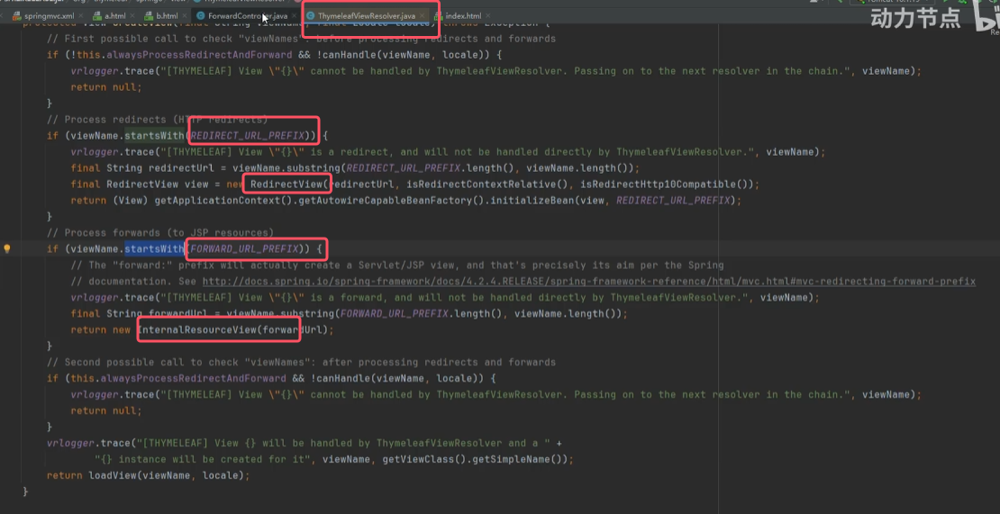
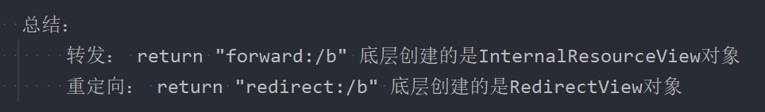

## 1.回顾转发和重定向区别

1. 转发是一次请求。因此浏览器地址栏上的地址不会发生变化；重定向是两次请求。因此浏览器地址栏上的地址会发生变化。
2. 转发的代码实现：request.getRequestDispatcher("/index").forward(request, response);  重定向的代码实现：response.sendRedirect("/webapproot/index");
3. 转发是服务器内部资源跳转，由服务器来控制。不可实现跨域访问。重定向可以完成内部资源的跳转，也可以完成跨域跳转。
4. 转发的方式可以访问WEB-INF目录下受保护的资源。重定向相当于浏览器重新发送了一次请求，在浏览器直接发送的请求是无法访问WEB-INF目录下受保护的资源的。

转发原理：  
   1. 假设发送了 /a 请求，执行了 AServlet
   2. 在AServlet 中通过`request.getRequestDispatcher("/b").forward(request,response);`转发到BServlet
   3. 从AServlet跳转到BServlet是服务器内部来控制的。对于浏览器而言，浏览器只发送了一个 /a 请求。
   
重定向原理：  
   4. 假设发送了 /a 请求，执行了 AServlet
   5. 在AServlet 中通过`response.sendRedirect("/webapproot/b")`重定向到BServlet
   6. 此时服务器会将请求路径`/webapproot/b`响应给浏览器
   7. 浏览器会自发的再次发送`/webapproot/b`请求来访问BServlet
   8. 因此对于重定向来说，发送了两次请求，一次是 `/webapproot/a`，另一次是`/webapproot/b`。

以上所描述的是使用原生Servlet API来完成转发和重定向。在Spring MVC中是如何转发和重定向的呢？


## 2.Spring MVC实现请求转发
* **在Spring MVC中默认就是转发的方式，我们之前所写的程序，都是转发的方式。只不过都是转发到Thymeleaf的模板文件xxx.html上。底层会直接创建 Thymeleaf 专属的视图对象。
* **在Spring MVC中如何转发到另一个Controller上呢？可以使用Spring MVC的`return "forward:下一个资源的路径"`**

代码实现如下：
```java
package com.powernode.springmvc.controller;

import org.springframework.stereotype.Controller;
import org.springframework.web.bind.annotation.RequestMapping;

@Controller
public class IndexController {

    @RequestMapping("/a")
    public String toA(){
	    //这个就不是逻辑视图名称了
        return "forward:/b";
    }

    @RequestMapping("/b")
    public String toB(){
        return "b";
    }
}
```
视图页面：
```html
<!DOCTYPE html>
<html lang="en" xmlns:th="http://www.thymeleaf.org">
<head>
    <meta charset="UTF-8">
    <title>b</title>
</head>
<body>
<h1>Page B!!!</h1>
</body>
</html>
```
启动服务器，浏览器地址栏上输入：http://localhost:8080/springmvc/a  


通过测试，可以顺利的完成转发，转发是一次请求，可以看到地址栏上的地址没有发生改变。

我们来跟踪一下源码，看看以上程序执行过程中，创建了几个视图对象，分别是什么？    


* 通过源码的跟踪得知：整个请求处理过程中，一共创建了两个视图对象
	- InternalResourceView
	- ThymeleafView

这说明转发底层创建的视图对象是：InternalResourceView。
**思考：既然会创建InternalResourceView，应该会对应一个视图解析器呀（InternalResourceViewResolver）？但是我在springmvc.xml文件中只配置了ThymeleafViewResolver，并没有配置InternalResourceViewResolver呀？这是为什么？**
**这是因为**`**forward:**`** 后面的不是**`**逻辑视图名**`**，而是一个**`**请求路径**`**。因此转发是不需要视图解析器的。**
**另外，转发使用的是InternalResourceView，也说明了转发是内部资源的跳转。（Internal是内部的意思，Resource是资源的意思。）**


## 3.Spring MVC实现重定向
* r**edirect是专门完成重定向效果的。和forward语法类似，只需要将之前的 `return "forward:/b"`修改为 `return "redirect:/b"`即可**。
* **相较于请求转发，重定向使用较多**
```java
package com.powernode.springmvc.controller;

import org.springframework.stereotype.Controller;
import org.springframework.web.bind.annotation.RequestMapping;

@Controller
public class IndexController {

    @RequestMapping("/a")
    public String toA(){
        return "redirect:/b";
    }

    @RequestMapping("/b")
    public String toB(){
        return "b";
    }
}

```
视图页面：
```html
<!DOCTYPE html>
<html lang="en" xmlns:th="http://www.thymeleaf.org">
<head>
    <meta charset="UTF-8">
    <title>b</title>
</head>
<body>
<h1>Page B!!!</h1>
</body>
</html>
```
启动服务器，浏览器地址栏上输入：http://localhost:8080/springmvc/a  


可见，重定向是两次请求，地址栏上的地址发生了改变。

可以看一下源码，在重定向的时候，Spring MVC创建哪个视图对象？  


* 通过断点调试可以看出，**当重定向的时候，SpringMVC会创建一个重定向视图对象：**RedirectView**。这个视图对象也是SpringMVC框架内置的**。
* 另外可以看出重定向之后的第二次请求创建的视图对象就是ThymeleafView了。


注意：从springmvc应用重定向到springmvc2应用（跨域），语法是：
```java
@RequestMapping("/a")
public String a(){
    return "redirect:http://localhost:8080/springmvc2/b";
}
```
可以自行测试一下！！！


注：转发和重定向的底层源码如下图所示    

