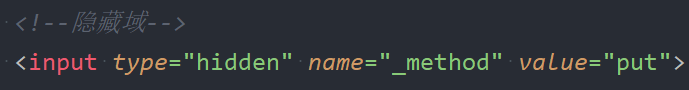
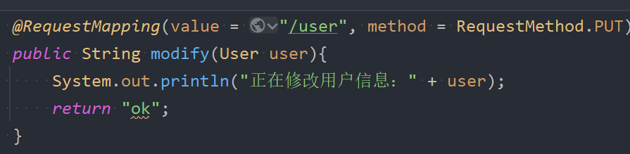
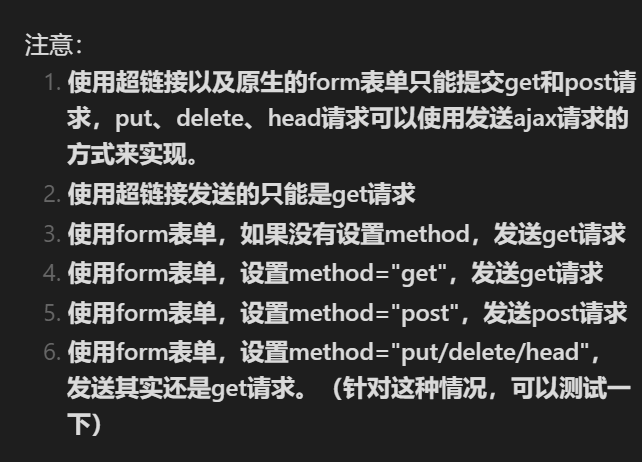

## 一、RESTFul方式演示查询

**RESTFul规范中规定，如果要查询数据，需要发送GET请求**。
### 1.根据id查询(GET /api/user/1)
```xml
<?xml version="1.0" encoding="UTF-8"?>
<beans xmlns="http://www.springframework.org/schema/beans"
       xmlns:xsi="http://www.w3.org/2001/XMLSchema-instance"
       xmlns:context="http://www.springframework.org/schema/context"
       xmlns:mvc="http://www.springframework.org/schema/mvc"
       xsi:schemaLocation="http://www.springframework.org/schema/beans http://www.springframework.org/schema/beans/spring-beans.xsd http://www.springframework.org/schema/context https://www.springframework.org/schema/context/spring-context.xsd http://www.springframework.org/schema/mvc https://www.springframework.org/schema/mvc/spring-mvc.xsd">

    <!--组件扫描-->
    <context:component-scan base-package="com.powernode.springmvc.controller"/>

    <!--视图解析器-->
    <bean id="thymeleafViewResolver" class="org.thymeleaf.spring6.view.ThymeleafViewResolver">
        <property name="characterEncoding" value="UTF-8"/>
        <property name="order" value="1"/>
        <property name="templateEngine">
            <bean class="org.thymeleaf.spring6.SpringTemplateEngine">
                <property name="templateResolver">
                    <bean class="org.thymeleaf.spring6.templateresolver.SpringResourceTemplateResolver">
                        <property name="prefix" value="/WEB-INF/thymeleaf/"/>
                        <property name="suffix" value=".html"/>
                        <property name="templateMode" value="HTML"/>
                        <property name="characterEncoding" value="UTF-8"/>
                    </bean>
                </property>
            </bean>
        </property>
    </bean>

    <!--启用注解-->
    <mvc:annotation-driven/>

    <!--视图控制器映射-->
    <mvc:view-controller path="/" view-name="index"/>
</beans>
```

首页index.html
```html
<!DOCTYPE html>
<html lang="en" xmlns:th="http://www.thymeleaf.org">
<head>
    <meta charset="UTF-8">
    <title>index</title>
</head>
<body>
<h1>index page</h1>
<hr>
<!--根据id查询：GET /api/user/1 -->
<a th:href="@{/api/user/1}">根据id查询用户信息</a><br>

</body>
</html>
```

控制器Controller：
```java
package com.powernode.springmvc.controller;

import org.springframework.stereotype.Controller;
import org.springframework.web.bind.annotation.PathVariable;
import org.springframework.web.bind.annotation.RequestMapping;
import org.springframework.web.bind.annotation.RequestMethod;

@Controller
public class UserController {

    @RequestMapping(value = "/api/user/{id}", method = RequestMethod.GET)
    public String getById(@PathVariable("id") Integer id){
        System.out.println("根据用户id查询用户信息，用户id是" + id);
        return "ok";
    }

}

```

视图页面：
```html
<!DOCTYPE html>
<html lang="en" xmlns:th="http://www.thymeleaf.org">
<head>
    <meta charset="UTF-8">
    <title>ok</title>
</head>
<body>
<h1>ok</h1>
</body>
</html>
```

启动服务器，测试：http://localhost:8080/springmvc  


### 2.查询所有(GET /api/user)
```html
<!--查询所有-->
<a th:href="@{/api/user}">查询所有</a><br>
```
```java
@RequestMapping(value = "/api/user", method = RequestMethod.GET)
public String getAll(){
    System.out.println("查询所有用户信息");
    return "ok";
}
```
启动服务器测试：  


## 二、RESTFul方式演示增加(POST /api/user)
**RESTFul规范中规定，如果要进行保存操作，需要发送POST请求。**
```html
<!--保存用户-->
<form th:action="@{/user}" method="post">  
	用户名：<input type="text" name="username"><br>  
	密码：<input type="password" name="password"><br>  
	年龄：<input type="text" name="age"><br>  
	<input type="submit" value="保存">  
</form>
```

```java
@RequestMapping(value = "/user", method = RequestMethod.POST)  
	public String save(User user) {  
	System.out.println("正在保存用户信息...");  
	System.out.println(user);  
	return "ok";  
}
```

启动服务器测试：    


## 三、RESTFul方式演示修改和删除
* **RESTFul规范中规定，如果要进行保存操作，需要发送PUT请求**。
* **如何发送PUT请求？**  
1. **首先你必须是一个POST请求。**
2. **第二步：在发送POST请求的时候，提交这样的数据：**`**_method=PUT/put**`   
	
3. **第三步：在web.xml文件配置SpringMVC提供的过滤器：HiddenHttpMethodFilter。这个过滤器是springmvc提前写好的，直接用就行了，这个过滤器可以帮助你将请求POST转换成PUT请求/DELETE请求**  
4. **在Controller中设置请求方法方式为put或者是delete**    
	

注：正常情况下的请求方式如下：  


实践一下：
```html
<!--修改用户-->
<hr>
<form th:action="@{/api/user}" method="post">
    <!--隐藏域的方式提交 _method=put -->
    <input type="hidden" name="_method" value="put">
    用户名：<input type="text" name="username"><br>
    <input type="submit" th:value="修改">
</form>
```
```xml
<!--隐藏的HTTP请求方式过滤器-->
<filter>
    <filter-name>hiddenHttpMethodFilter</filter-name>
    <filter-class>org.springframework.web.filter.HiddenHttpMethodFilter</filter-class>
</filter>
<filter-mapping>
    <filter-name>hiddenHttpMethodFilter</filter-name>
    <url-pattern>/*</url-pattern>
</filter-mapping>
```
```java
@RequestMapping(value = "/api/user", method = RequestMethod.PUT)
public String update(String username){
    System.out.println("修改用户信息，用户名：" + username);
    return "ok";
}
```


注意pom.xml文件中添加如下配置：
```xml
<build>
    <plugins>
        <plugin>
            <groupId>org.apache.maven.plugins</groupId>
            <artifactId>maven-compiler-plugin</artifactId>
            <version>3.12.1</version>
            <configuration>
                <source>21</source>
                <target>21</target>
                <compilerArgs>
                    <arg>-parameters</arg>
                </compilerArgs>
            </configuration>
        </plugin>
    </plugins>
</build>
```
**一定要重新build一下：**


测试结果：


