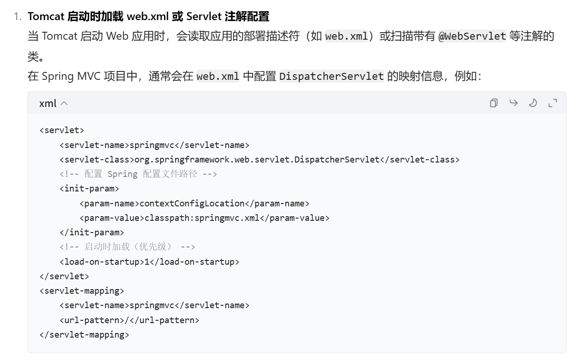
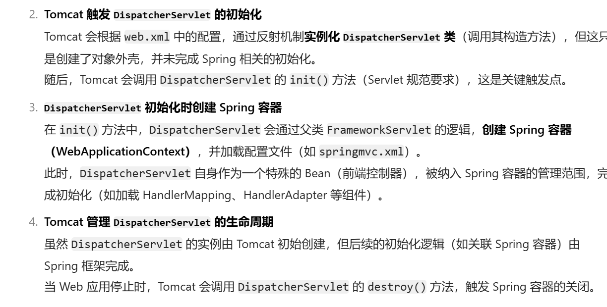

* 先搞明白核心类的继承关系：**DispatcherServlet extends FrameworkServlet extends HttpServletBean extends HttpServlet extends GenericServlet implements Servlet**

注意tomcat与DispatchServlet的关系：

**服务器启动阶段完成了：**
1. **初始化Spring上下文，也就是创建所有的bean，让IoC容器将其管理起来**。
2. **初始化SpringMVC相关的对象：处理器映射器，处理器适配器等**。

