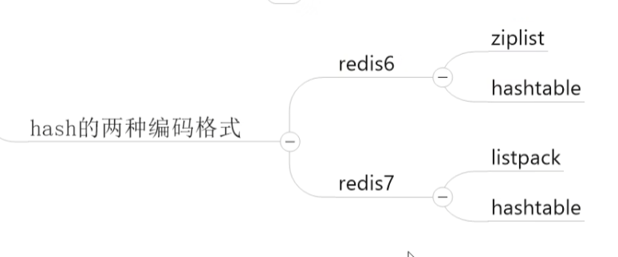
## 1.redis6的数据结构——hashtable+ziplist压缩列表

###### 总体机制

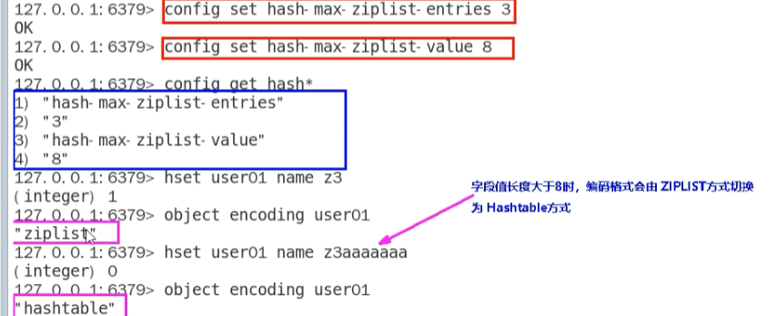
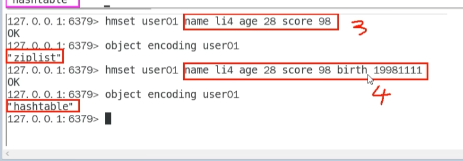
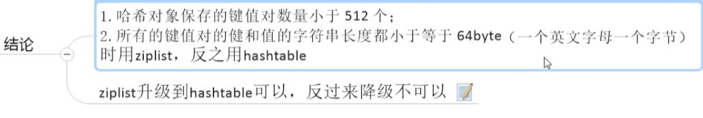
######  redis中Hashtable结构
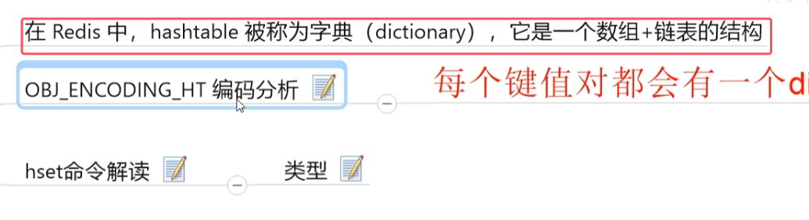
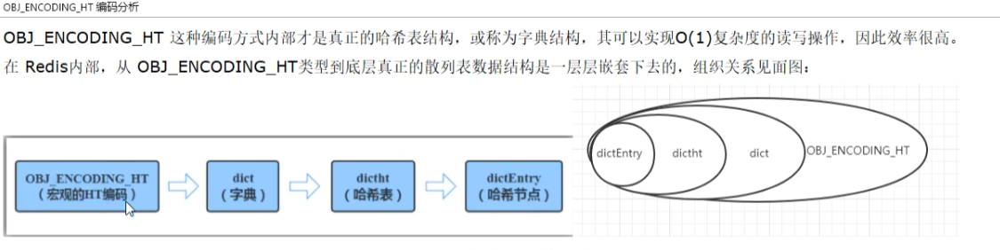

###### ziplist结构
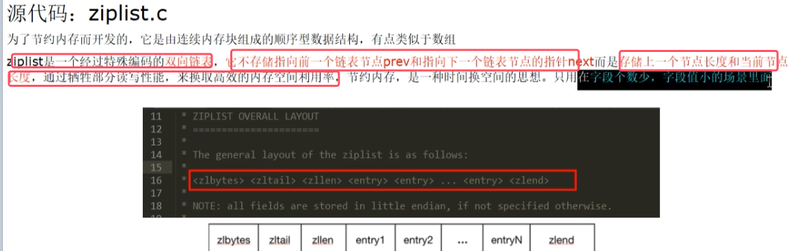
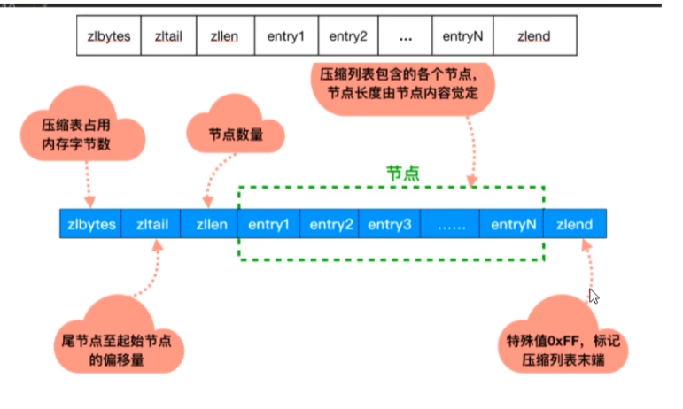
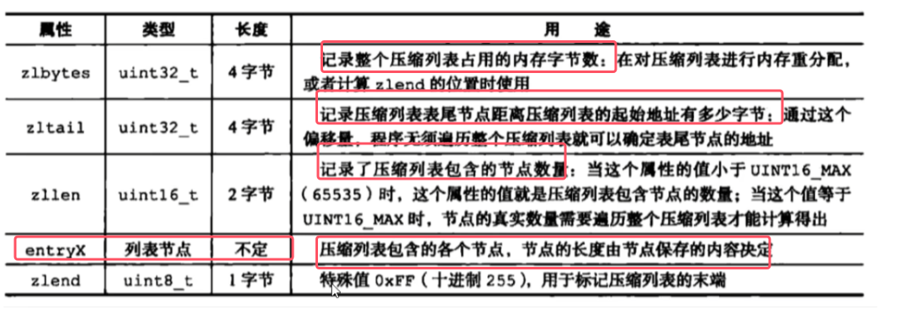
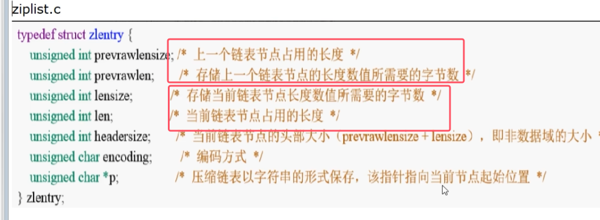
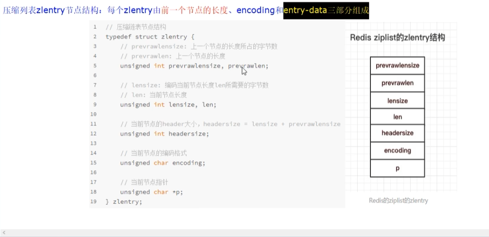
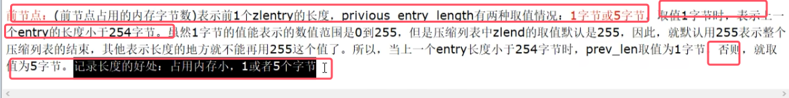
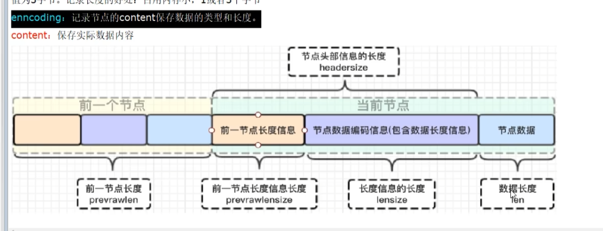
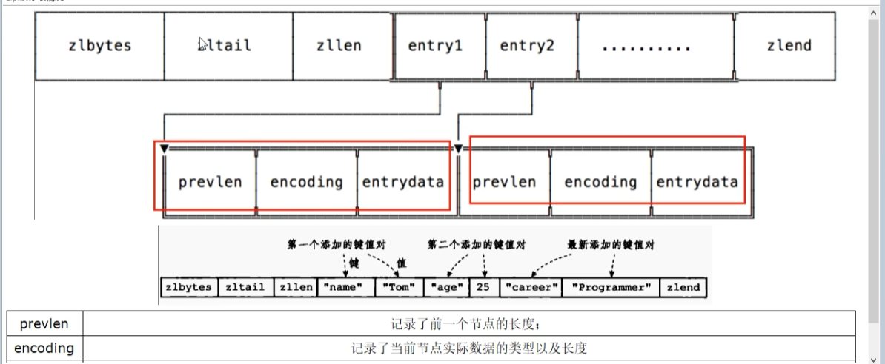
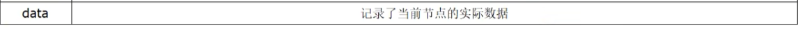

这样设计的好处：  
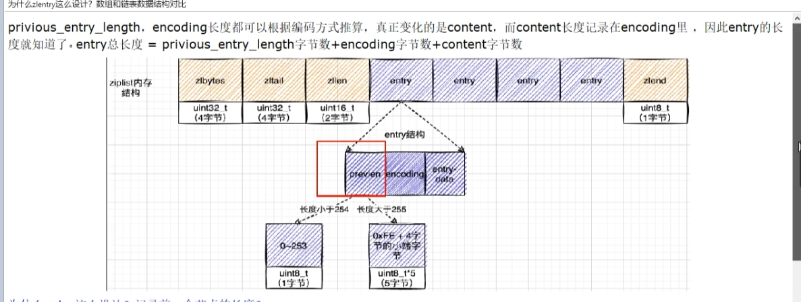
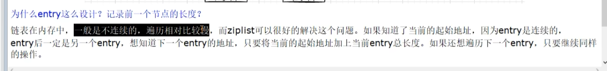

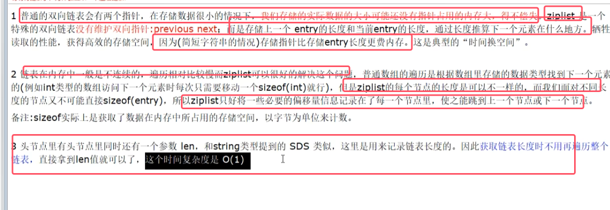

###### ziplist的总结
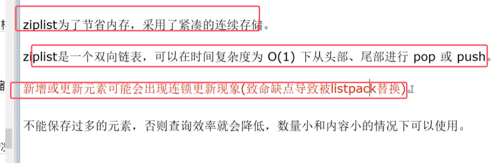

## 2.redis7的数据结构——hashtable+listpack紧凑列表
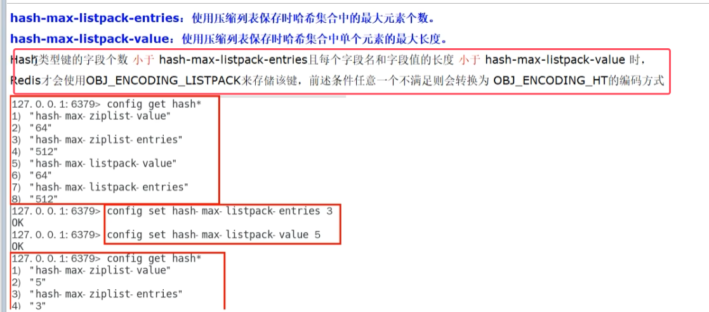
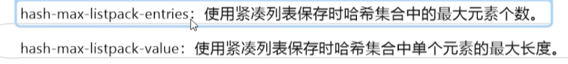
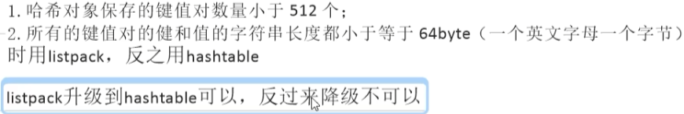
* 默认值与redis6相同，在符合相同情况下使用列表；不符合人任一条件的底层结构就为hashtable

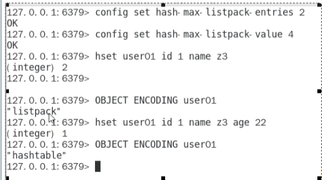

###### 有了ziplist为什么要用listpack替代ziplist
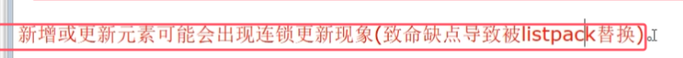
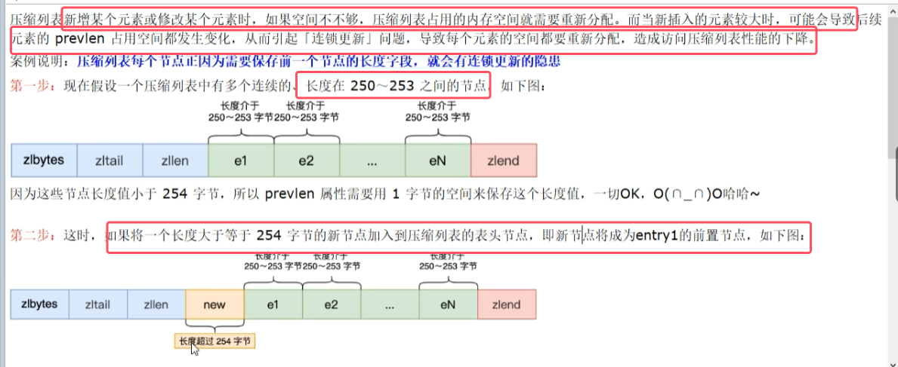
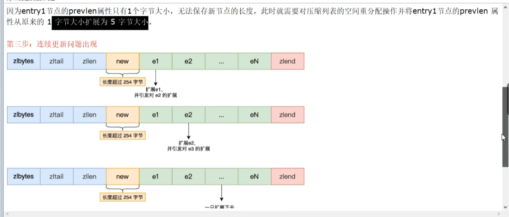
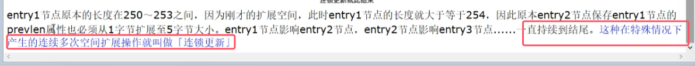
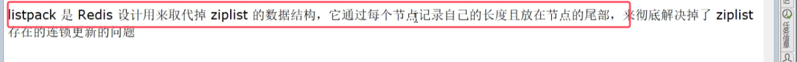

###### 紧凑列表listpack的结构

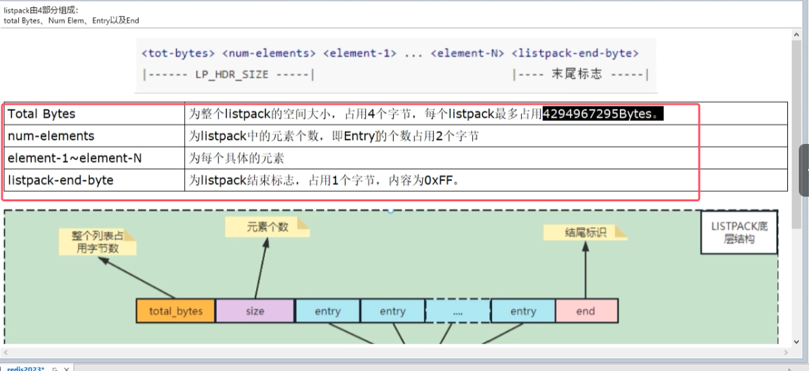
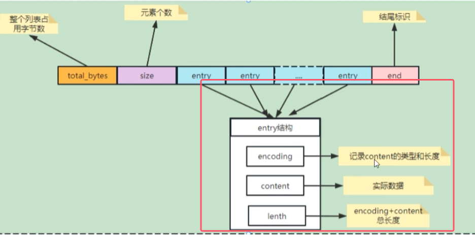

###### 二者结构对比
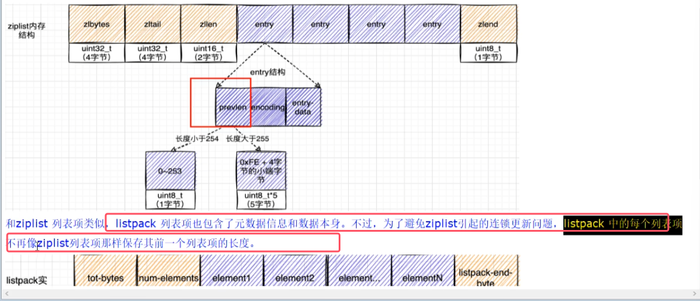
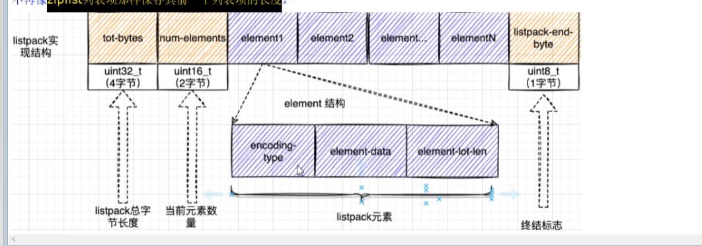