**redis6list底层的数据结构为quicklist（是`linkedlist`和`ziplist`的结合）；而redis7的底层结构就是quicklist（是`linkedlist`和`listpack`的结合）**。quicklist粗粗的看就是一种双向链表

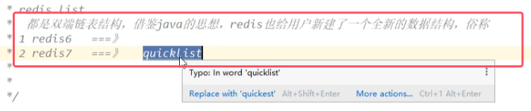

### 1.redis6底层结构quicklist

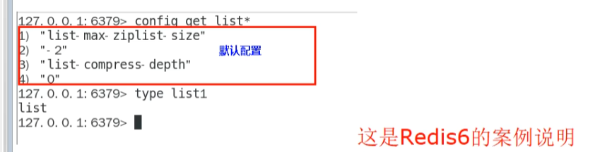
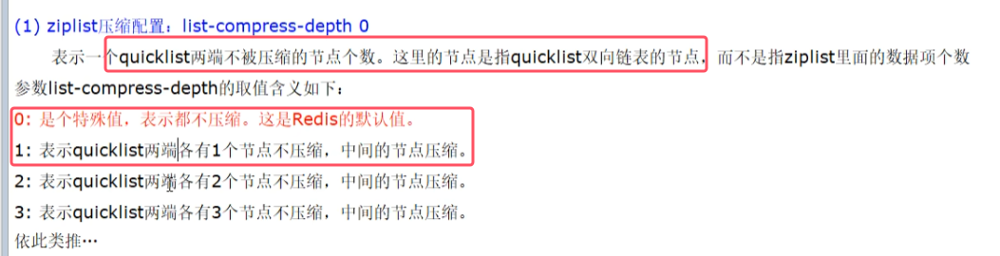
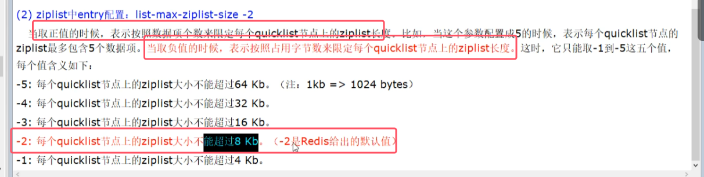
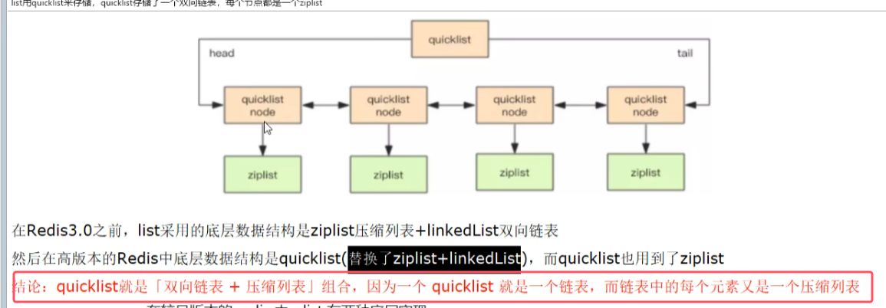
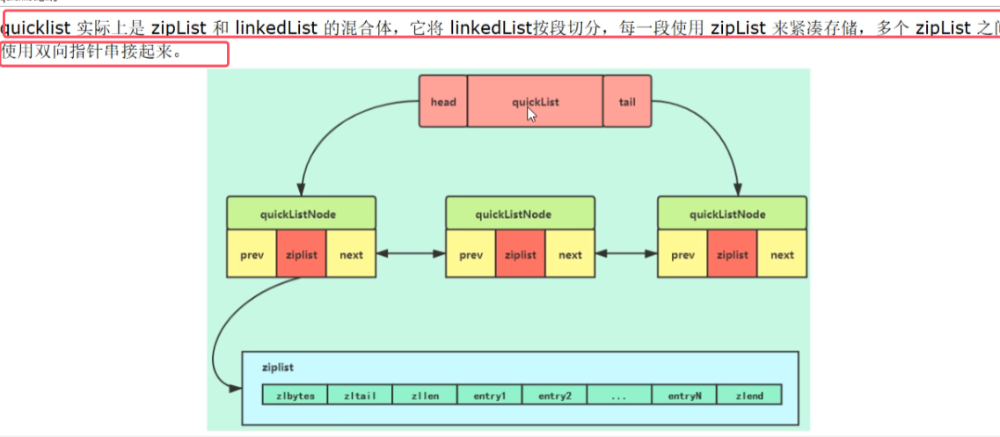

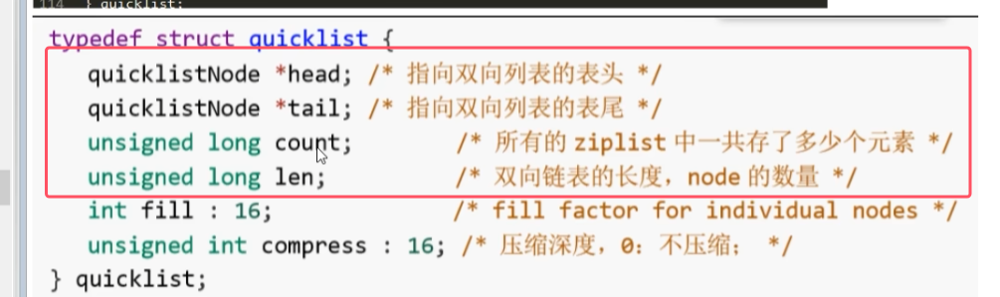
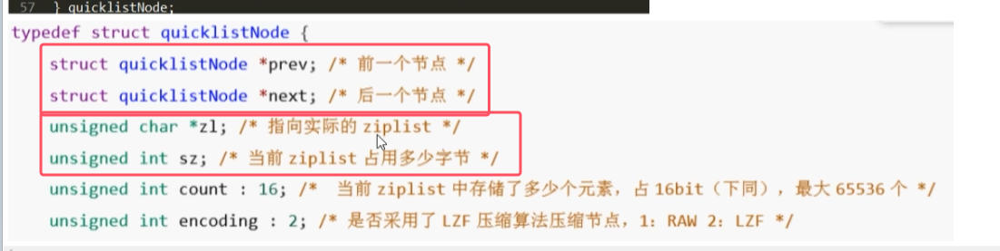
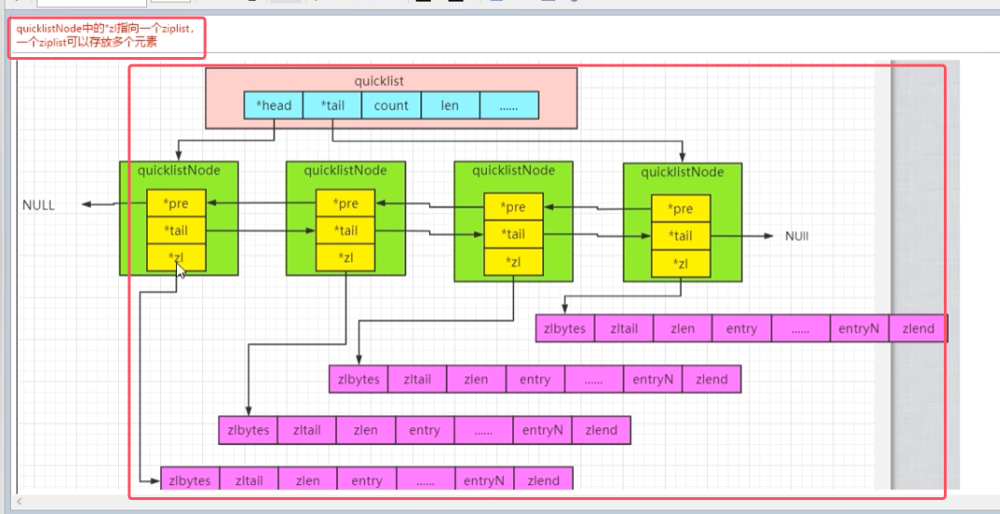

##### redis7的底层结构quicklist
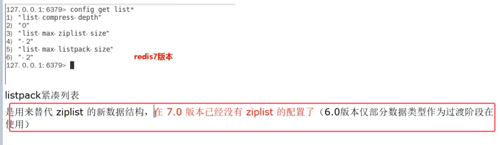
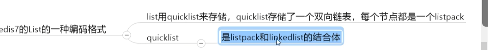
