### 1.自己实现的分布式锁会有的问题
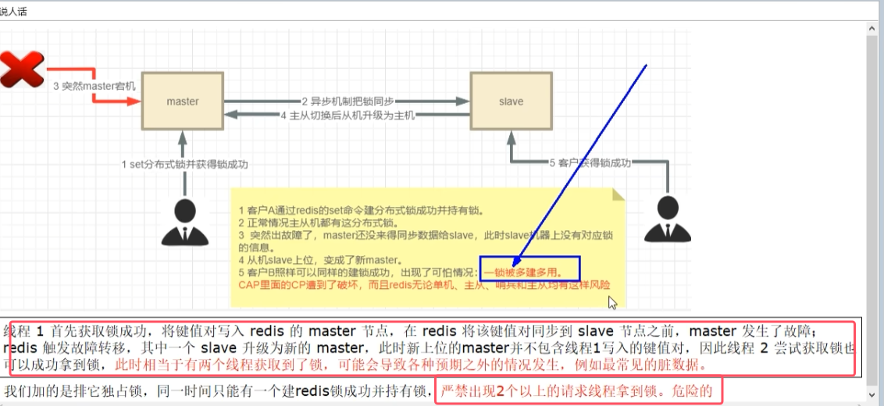
* 解决方案：redis之父写的RedLock算法

### 2.Redisson源码解析——redis客户端分布式锁及redlock算法的实现

其基本原理与手写的分布式锁原理几乎相同，下面只讲一部分要点

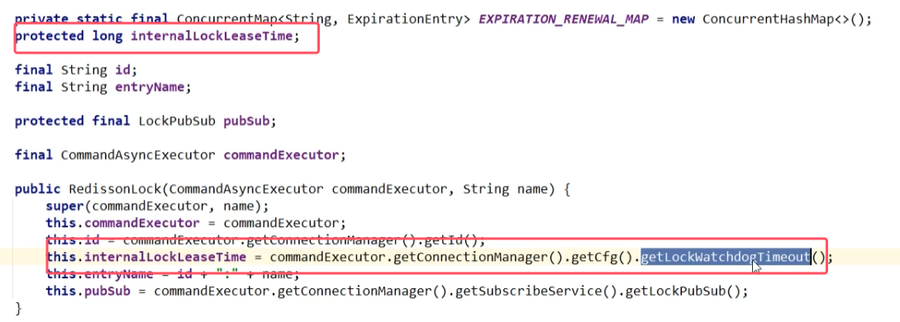
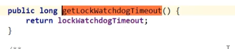
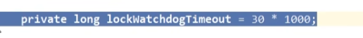

###### 加锁流程 
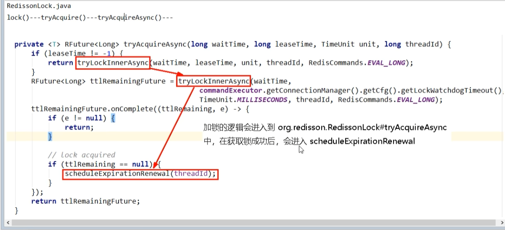
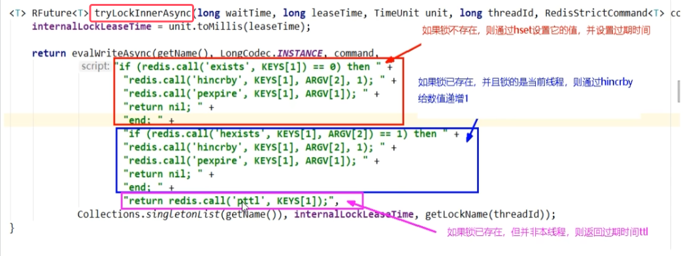

###### 定时续期源码
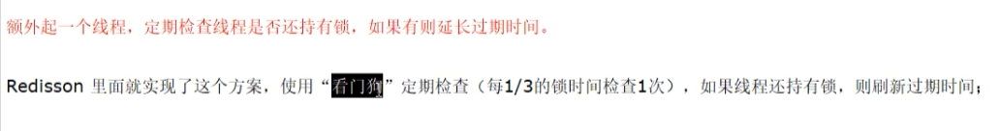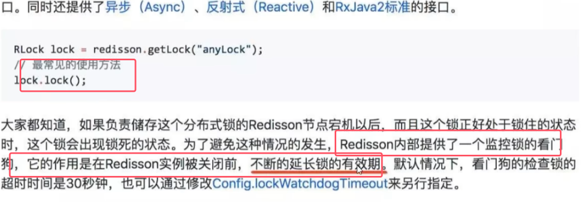
* 使用redisson的分布式锁后，底层会自动加上“看门狗”自动续期机制

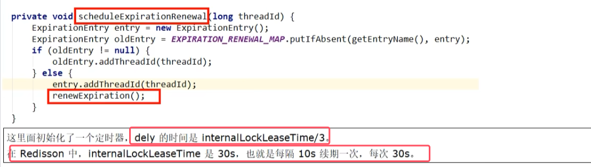
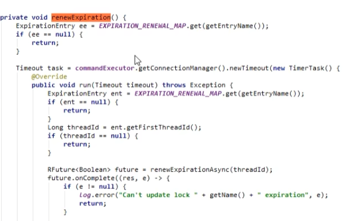
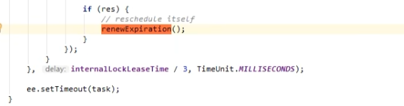
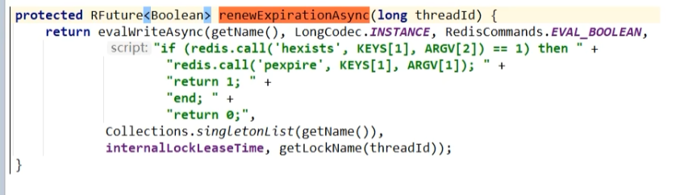

###### 解锁流程

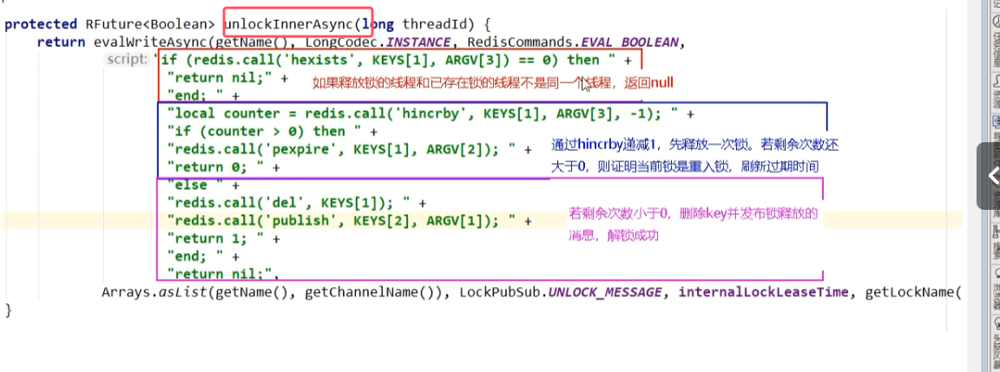

### 3.Redisson多机思想及案例
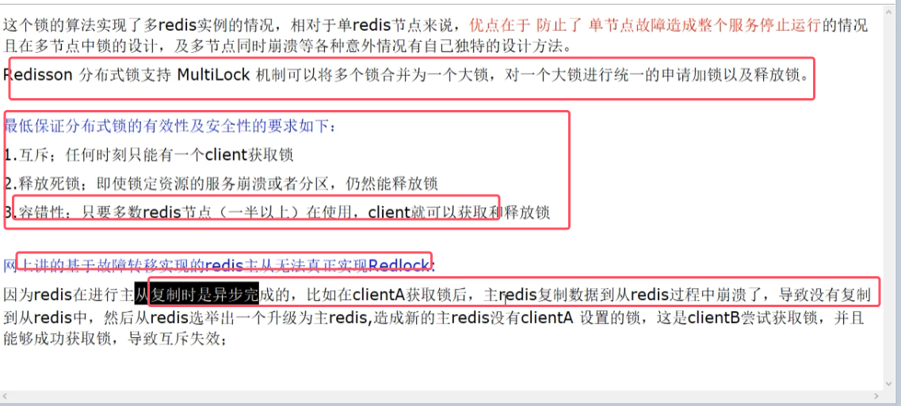

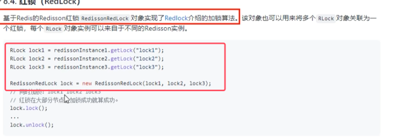
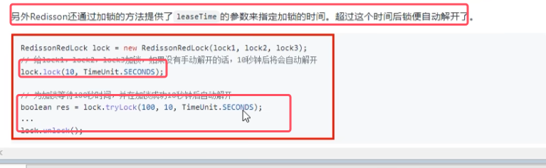
* 上面创建redlock锁是已经被弃用，其他的api还照旧再用。新的api如下

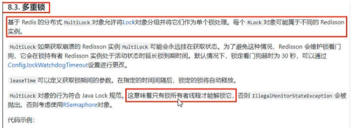
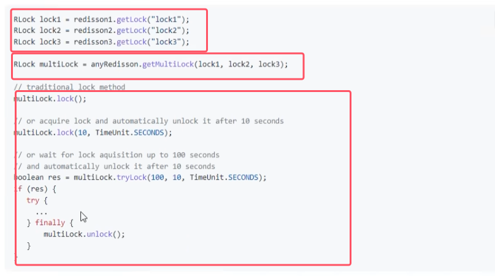